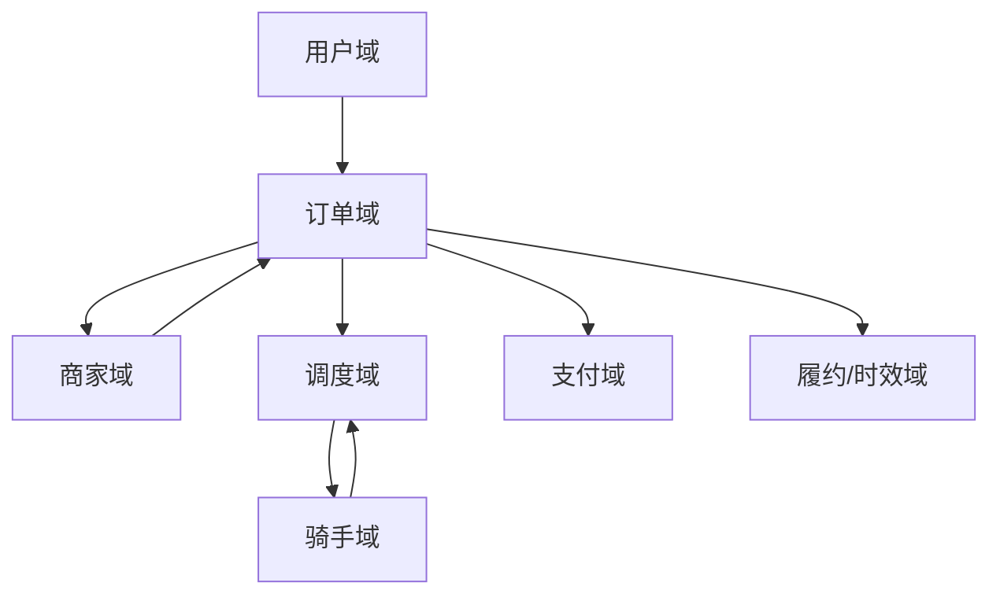
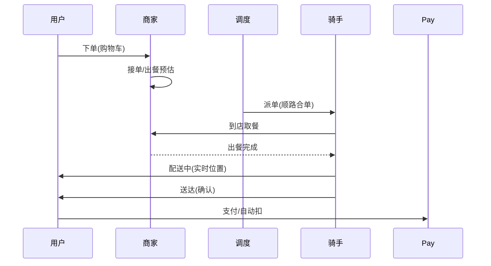

# 本地生活 / 外卖业务模型（深扒）

> 外卖 = 「**线上交易 + 实时调度 + 履约时效**」三者的强耦合：既要像电商一样下单支付，又要像出行一样实时派单，还要卡死「30 分钟送达」的时效。
>
> 配套总览见「[业务模型总览](业务模型总览.md)」；调度/峰值见「[出行打车](出行打车业务模型.md)」「[架构](../架构)」。

---

## 一、业务全景与领域划分

外卖本质是「**用户 — 商家 — 骑手**」三角实时协同。按限界上下文拆为七大域：

| 域 | 核心职责 | 关键实体 |
|----|----------|----------|
| 用户域 | 地址、偏好、会员 | 用户、地址 |
| 商家域 | 商品、库存、出餐时长 | 门店、菜品、营业状态 |
| 订单域 | 购物车、下单、状态机 | 订单、订单项 |
| 调度域 | 派单、路径、合单 | 调度任务、骑手候选 |
| 骑手域 | 位置、状态、容量 | 骑手、载具、容量 |
| 支付域 | 收银、对账 | 支付单 |
| 履约域 | 出餐、取餐、送达、时效 | 履约单、时效指标 |

---

## 二、核心系统架构

### 2.1 商家与出餐
- **出餐时长预估**：商家历史出餐速度 + 当前排队单量，决定「何时派骑手去取」。
- **高峰限流**：爆单时商家接单能力有限，需**排队/延迟发单**防雪崩。

### 2.2 智能调度（派单 + 路径 + 合单）
- **派单**：综合骑手位置、载量、方向、商家出餐进度，选最优骑手。
- **合单（顺路单）**：把同一方向、时间窗相近的 2~3 单合并给一个骑手，提人效。
- **路径规划**：多取多送的**带时间窗的车辆路径问题（VRPTW）**，近似算法求解。

### 2.3 履约时效
- 全链路时效拆解：**下单 → 接单 → 出餐 → 取餐 → 配送 → 送达**，每段有 SLA。
- 超时预警：某段超阈值自动触发改派/补偿，保障体验。

---

## 三、关键链路：一单外卖

---

## 四、峰值与实时场景

| 场景 | 挑战 | 方案 |
|------|------|------|
| 午晚高峰 | 订单集中、运力紧张 | 运力预测 + 提前调度 + 商家限流 |
| 恶劣天气 | 需求暴涨供给降 | 动态溢价 + 时效放宽 + 预案 |
| 爆单 | 商家出餐崩 | 排队发单、延迟接单 |
| 骑手位置风暴 | 高频上报 | 长连接 + 批量 + 轨迹抽稀 |
| 合单冲突 | 时间窗打架 | VRPTW 求解 + 改派兜底 |

---

## 五、技术栈详表

| 技术 | 用途 | 备注 |
|------|------|------|
| Redis GEO | 骑手/商家附近检索 | 同出行 |
| Kafka | 订单/调度事件 | 削峰解耦 |
| Flink | 实时运力、时效监控 | 流式 |
| 路径规划引擎 | VRPTW 求解 | 自研近似 |
| WebSocket | 骑手实时位置推送 | 长连接 |
| MySQL（分片） | 订单/履约主存 | 按城市 |

---

## 六、外卖特有坑

- **出餐慢拖垮时效**：商家出餐进度不可见 → 必须采集出餐事件驱动调度。
- **合单翻车**：为提效强合单导致某单严重超时 → 时间窗约束 + 超时改派。
- **运力预测失准**：高峰期骑手不够 → 需历史 + 天气 + 活动多维预测并提前激励。
- **商家超卖/沽清**：菜品售罄未及时同步 → 库存与商品联动。
- **隐私与交通安全**：实时位置合规 + 骑手超速风险 → 脱敏 + 安全提醒。

> 口诀：**"外卖三角：用户等、商家出、骑手送；调度算合单，时效卡 SLA，出餐要先知，运力靠预测。"**
