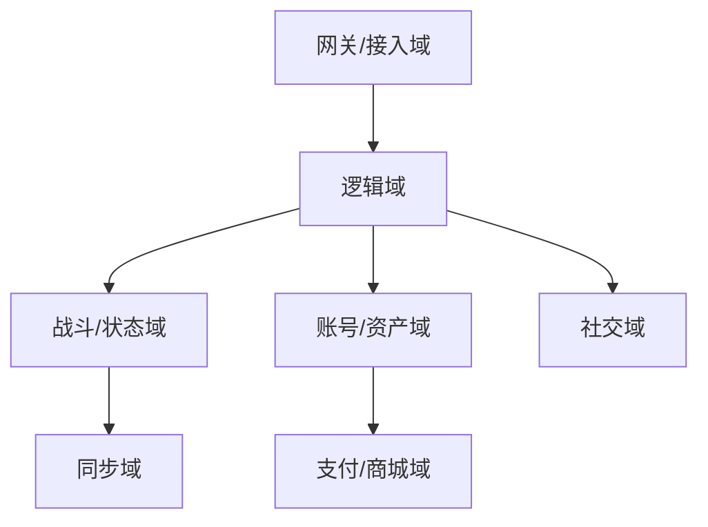
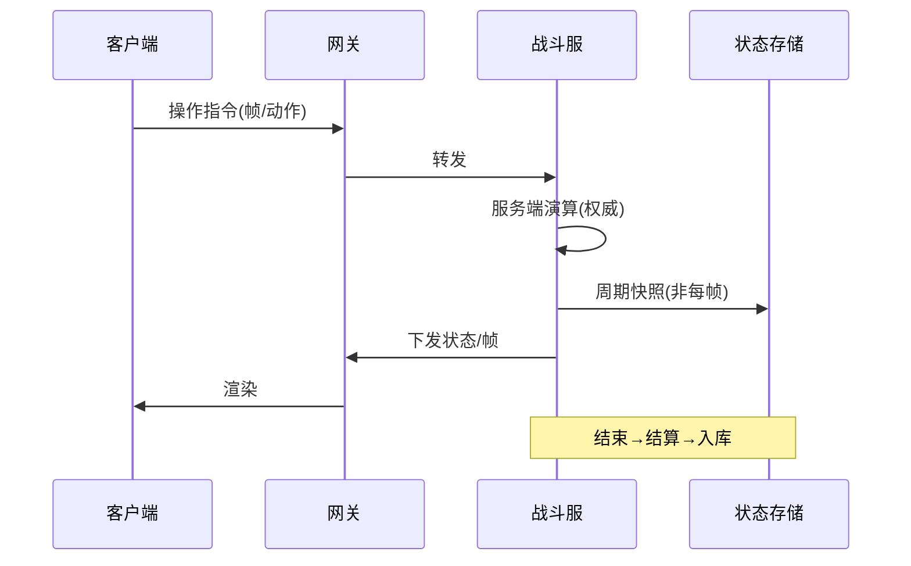

# 游戏业务模型（深扒）

> 游戏（尤其多人/竞技）的技术核心是「**实时状态同步 + 低延迟 + 公平反作弊**」。后端在这里更像「状态仲裁者」而非「业务处理器」，和 CRUD 业务思路完全不同。
>
> 配套总览见「[业务模型总览](业务模型总览.md)」；实时/一致性见「[架构](../架构)」「[社交IM](社交IM业务模型.md)」（好友/公会复用 IM）。

---

## 一、业务全景与领域划分

| 域 | 核心职责 | 关键实体 |
|----|----------|----------|
| 接入域 | 登录、连接、加密 | 会话、连接 |
| 逻辑域 | 玩法、房间、匹配 | 房间、匹配队列 |
| 战斗域 | 帧/状态计算、判定 | 战斗、实体状态 |
| 资产域 | 角色、背包、货币 | 角色、道具、钻石 |
| 社交域 | 好友、公会、聊天 | 好友、公会 |
| 支付域 | 充值、订单、对账 | 订单、流水 |

---

## 二、核心系统架构

### 2.1 状态同步（两种范式）
- **状态同步（CS 权威）**：客户端发操作，服务端算结果并下发现状 → 防作弊强、带宽小，MMO/MOBA 主流。
- **帧同步（Lockstep）**：所有客户端跑同一逻辑，只传「输入指令 + 帧号」→ 带宽极小、确定性要求高，常见于早期 RTS/格斗，断线需补帧。

### 2.2 战斗与逻辑服
- **无状态逻辑服 + 状态存储**：战斗计算不落库，结束才结算，降低 DB 压力。
- **房间/进程隔离**：一局一房间，崩溃不影响其他局。

### 2.3 匹配（Matchmaking）
- 基于 ELO/MMR 分把水平相近玩家匹配，兼顾等待时长（过长则放宽）。

### 2.4 反作弊（重中之重）
- 服务端权威校验：移动速度、伤害、坐标是否合法，异常即踢。
- 客户端加固：加壳、检测修改器、行为模型识别外挂。

---

## 三、关键链路：一局对战

---

## 四、峰值与实时场景

| 场景 | 挑战 | 方案 |
|------|------|------|
| 开服/新版本 | 瞬时登录洪峰 | 排队 + 分服 + 限流 |
| 战斗低延迟 | RTT < 50ms 期望 | 就近接入 + UDP + 预测回滚 |
| 弱网卡顿 | 丢包抖动 | 冗余帧 + 客户端预测/插值 |
| 外挂 | 公平破坏 | 服务端校验 + 行为识别 |
| 滚服数据 | 合服迁移 | 账号统一 + 资产合并 |

---

## 五、技术栈详表

| 技术 | 用途 | 备注 |
|------|------|------|
| 自研/Netty 网关 | 长连接、帧传输 | UDP/TCP |
| 状态同步引擎 | 战斗演算 | 确定性强 |
| Redis | 在线、房间、排行榜 | 内存 |
| Kafka | 日志、结算事件 | 解耦 |
| 对象存储 | 资源、回放 | 直传 |
| 支付对账 | 充值 | 防漏单 |

---

## 六、游戏特有坑

- **信任客户端**：把伤害/坐标交客户端算 → 必被外挂攻破，必须服务端权威。
- **帧同步不确定性**：浮点/随机不一致导致不同步 → 固定步长 + 确定性随机 + 断线补帧。
- **存档丢失**：战斗只存内存不落库 → 周期快照 + 结束结算双写。
- **充值漏单/刷钻**：支付回调未校验 → 订单幂等 + 对账。
- **匹配体验差**：只按分匹配等待久 → 分 + 等待时长动态放宽。

> 口诀：**"游戏三铁律：服务端权威、同步低延迟、反作弊当头；状态不同步靠帧补，资产入库要对账，匹配按分也按等。"**
