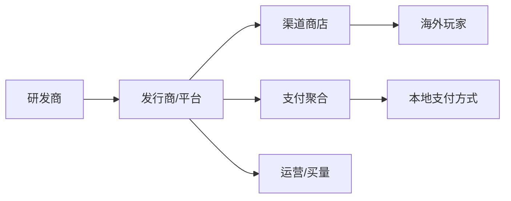
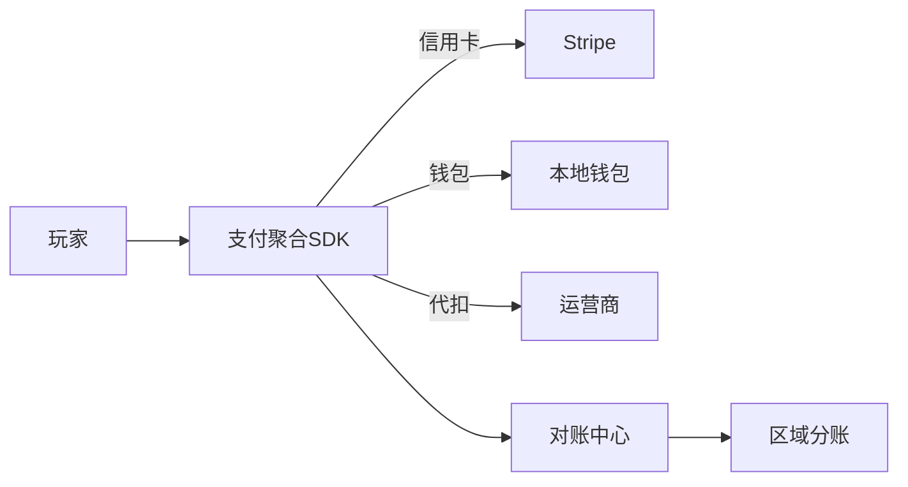

# 游戏出海业务模型

> 游戏出海是将国产游戏发行到海外市场的业务，涉及多区域运营、多币种结算、本地化、合规与反作弊。本文梳理其商业模式与技术架构要点。

## 1. 业务结构

| 角色 | 职责 |
| --- | --- |
| 研发商 | 游戏开发、版本更新 |
| 发行商 | 区域运营、买量、客服 |
| 渠道 | App Store / Google Play / 第三方商店 |
| 支付 | 信用卡、本地钱包、运营商代扣 |
| 玩家 | 付费/免费参与 |

## 2. 盈利模式

| 模式 | 说明 |
| --- | --- |
| IAP 内购 | 皮肤、道具、月卡，主力收入 |
| 广告变现 | 免费玩家看广告获奖励 |
| 订阅 | 季票/会员特权 |
| 授权联运 | 与本地厂商联合运营分润 |

## 3. 区域与本地化

- **多语言/多币种**：文案、配音、UI 适配，汇率结算。
- **合规差异**：
  - 数据本地化（如部分地区要求数据驻留）。
  - 未成年人保护（防沉迷时长/消费限制）。
  - 内容审查（宗教、暴力、政治敏感）。
- **买量 ROI**：分区域投放，LTV（生命周期价值）> CPA（获客成本）才可持续。

## 4. 支付与结算

- 聚合支付适配多区域，提升转化率。
- 对账与反欺诈：识别盗刷、退款欺诈（chargeback）。
- 税务与分成：渠道抽成（通常 15%~30%）+ 税费。

## 5. 技术挑战

- **全球低延迟**：多区域部署、CDN、就近接入。
- **账号体系**：支持游客、邮箱、第三方（Google/Apple/Facebook）登录，统一账号。
- **反外挂/反作弊**：客户端校验 + 服务端权威 + 行为检测。
- **运营后台**：分服、活动配置、数据看板、AB 实验。
- **数据合规**：跨境数据流动合规（GDPR 等）。

## 6. 常见坑

| 坑 | 风险 | 对策 |
| --- | --- | --- |
| 汇率结算错 | 财务损失 | 统一基准币种+对账 |
| 合规踩雷 | 下架/罚款 | 区域合规清单 |
| 买量亏损 | 烧钱无回 | ROI 实时监控 |
| 外挂泛滥 | 玩家流失 | 服务端权威+检测 |
| 数据跨境 | 违规 | 本地化部署 |

## 7. 面试题（业务侧）

1. 游戏出海的主要收入来源？
2. 不同区域合规差异体现在哪？
3. 如何衡量买量是否划算？
4. 出海支付为何要聚合？

## 8. 小结

游戏出海 = 研发 + 区域运营 + 多币种支付 + 本地化合规 + 全球技术底座。核心是区域化运营能力与合规适配，买量 ROI 决定商业可持续性。
