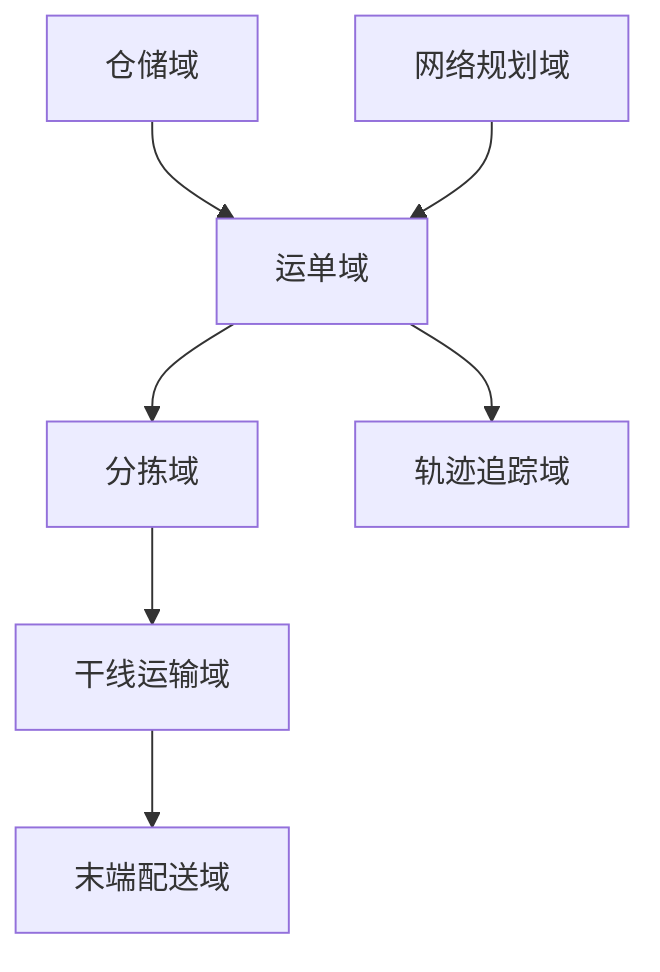
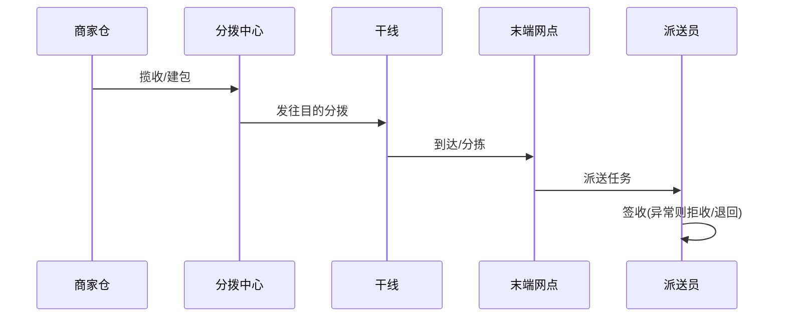

# 物流 / 供应链业务模型（深扒）

> 物流的核心是「**仓（仓储）— 干（干线路由）— 配（末端配送）**」的实物网络与信息流同步。它和出行/外卖同源（都调度），但更重**计划性、网络拓扑与全链路追踪**。
>
> 配套总览见「[业务模型总览](业务模型总览.md)」；网络/追踪见「[架构](../架构)」「[场景设计](../场景设计)」。

---

## 一、业务全景与领域划分

物流本质是把「**货（SKU/包裹）— 网（仓/线/站点）— 单（运单/订单）**」在全网最优流转。按限界上下文拆为六大域：

| 域 | 核心职责 | 关键实体 |
|----|----------|----------|
| 仓储域 | 入库、上架、拣货、打包、库存 | 仓库、库位、库存、拣货单 |
| 网络规划 | 仓网布局、路由、时效 | 仓网、路由规则、时效矩阵 |
| 运单域 | 下单、面单、状态机 | 运单、面单、状态 |
| 分拣域 | 中心分拣、集包 | 分拣任务、集包 |
| 干线域 | 跨城运输、车辆调度 | 车次、车辆、在途 |
| 末端域 | 网点、派送、签收 | 派送员、派送任务 |

---

## 二、核心系统架构

### 2.1 仓储（WMS）
- **拣货策略**：按单拣 / 批量拣 / 边拣边播，配合**货位优化**（热销前置）提效。
- **库存**：可用/锁定/在途，与上层电商库存联动（见「[电商](电商业务模型.md)」）。

### 2.2 网络路由（核心算法）
- 路由 = 选「仓 → 中转 → 网点」最优路径，目标：成本最低 / 时效最短 / 负载均衡。
- **时效矩阵**：任意网点对在给定产品下的预估时效，是报价与承诺依据。
### 2.3 运单状态机
- `已揽收 → 已分拣 → 干线在途 → 到达分拨 → 派送中 → 已签收`，异常态 `丢件/破损/拒收/退回`。
- 每段有**责任主体与时效 SLA**，用于考核与理赔。

### 2.4 全链路追踪
- 节点扫码（PDA/自动分拣线）驱动状态流转，轨迹聚合展示给用户。
- 实时性要求低于出行，但**准确性与可追溯性**要求极高（对账、理赔、合规）。

---

## 三、关键链路：一个包裹的旅程

---

## 四、峰值与计划场景

| 场景 | 挑战 | 方案 |
|------|------|------|
| 大促（双11） | 单量十倍、仓爆 | 预售前置下沉（提前布货到前置仓） |
| 路由拥堵 | 某线爆仓 | 动态改路由 + 运力调剂 |
| 末端爆仓 | 网点积压 | 临时网点 + 众包配送 |
| 逆向物流 | 退货回流 | 逆向路由 + 质检入库 |

---

## 五、技术栈详表

| 技术 | 用途 | 备注 |
|------|------|------|
| 路径/路由引擎 | 网络最优 | 运筹优化 |
| Kafka | 节点扫描事件流 | 轨迹 |
| 时序/大数据 | 时效、时效达成率分析 | 离线+实时 |
| RFID/扫码 PDA | 节点采集 | 物联网 |
| MySQL（分片） | 运单/库存主存 | 按区域 |
| GIS | 网点/路线可视化 | 地图 |

---

## 六、物流特有坑

- **路由僵化**：固定线路遇爆仓不调整 → 需动态路由 + 运力池。
- **库存不同步**：仓内与上层系统账实不符 → 实时回传 + 周期盘点。
- **末端丢件/破损**：责任不清理赔难 → 节点扫码留痕 + 保价。
- **大促前置不足**：临时布货来不及 → 预售数据驱动前置下沉。
- **逆向物流轻视**：退货体验差 → 独立逆向链路 + 快速退款。

> 口诀：**"物流一张网：仓里拣得快，路上路由优，末端送得到；节点要扫码，账实要同步，大促靠前置。"**
