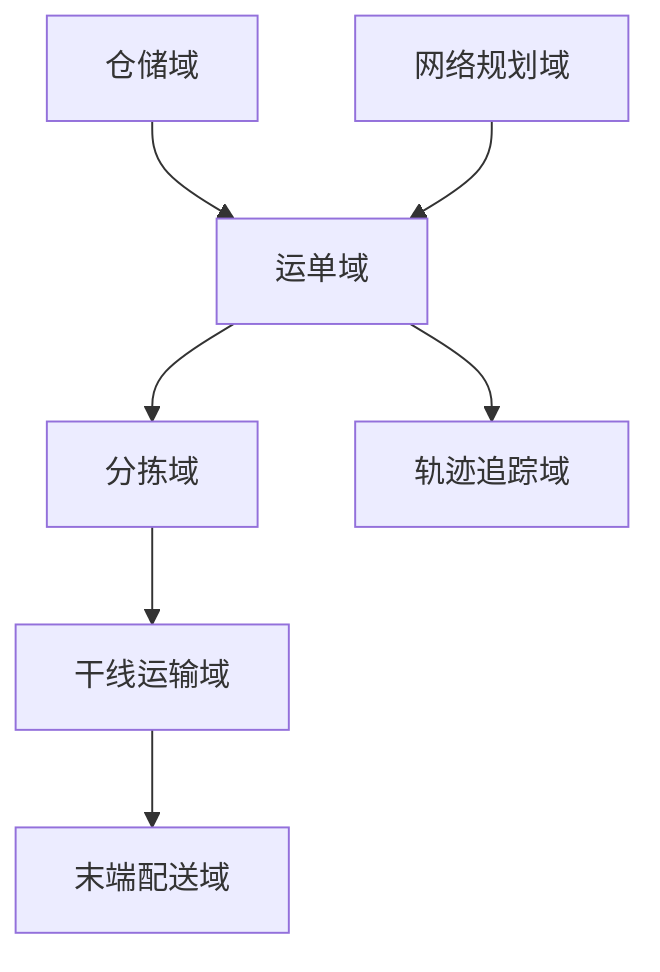
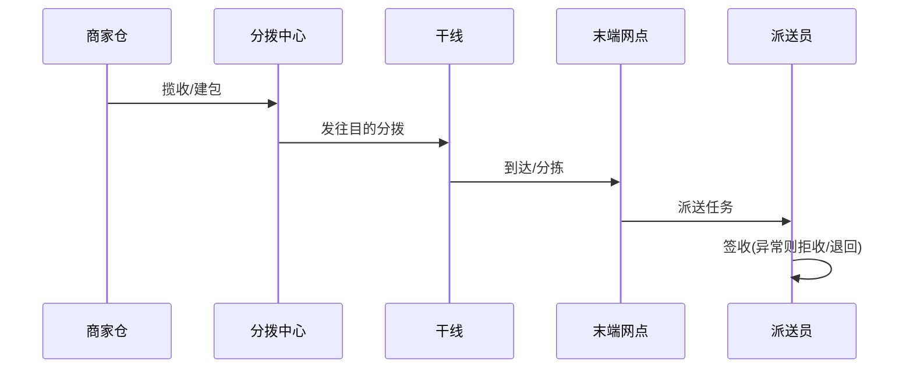

# 物流 / 供应链业务模型（深扒）

> 物流的核心是「**仓（仓储）— 干（干线路由）— 配（末端配送）**」的实物网络与信息流同步。它和出行/外卖同源（都调度），但更重**计划性、网络拓扑与全链路追踪**。
>
> 配套总览见「[业务模型总览](业务模型总览.md)」；网络/追踪见「[架构](../架构)」「[场景设计](../场景设计)」。

---

## 一、业务全景与领域划分

物流本质是把「**货（SKU/包裹）— 网（仓/线/站点）— 单（运单/订单）**」在全网最优流转。按限界上下文拆为六大域：



| 域 | 核心职责 | 关键实体 |
|----|----------|----------|
| 仓储域 | 入库、上架、拣货、打包、库存 | 仓库、库位、库存、拣货单 |
| 网络规划 | 仓网布局、路由、时效 | 仓网、路由规则、时效矩阵 |
| 运单域 | 下单、面单、状态机 | 运单、面单、状态 |
| 分拣域 | 中心分拣、集包 | 分拣任务、集包 |
| 干线域 | 跨城运输、车辆调度 | 车次、车辆、在途 |
| 末端域 | 网点、派送、签收 | 派送员、派送任务 |

---

## 二、核心系统架构

### 2.1 仓储（WMS）
- **拣货策略**：按单拣 / 批量拣 / 边拣边播，配合**货位优化**（热销前置）提效。
- **库存**：可用/锁定/在途，与上层电商库存联动（见「[电商](电商业务模型.md)」）。

### 2.2 网络路由（核心算法）
- 路由 = 选「仓 → 中转 → 网点」最优路径，目标：成本最低 / 时效最短 / 负载均衡。
- **时效矩阵**：任意网点对在给定产品下的预估时效，是报价与承诺依据。
### 2.3 运单状态机
- `已揽收 → 已分拣 → 干线在途 → 到达分拨 → 派送中 → 已签收`，异常态 `丢件/破损/拒收/退回`。
- 每段有**责任主体与时效 SLA**，用于考核与理赔。

### 2.4 全链路追踪
- 节点扫码（PDA/自动分拣线）驱动状态流转，轨迹聚合展示给用户。
- 实时性要求低于出行，但**准确性与可追溯性**要求极高（对账、理赔、合规）。

---

## 三、关键链路：一个包裹的旅程



---

## 四、峰值与计划场景

| 场景 | 挑战 | 方案 |
|------|------|------|
| 大促（双11） | 单量十倍、仓爆 | 预售前置下沉（提前布货到前置仓） |
| 路由拥堵 | 某线爆仓 | 动态改路由 + 运力调剂 |
| 末端爆仓 | 网点积压 | 临时网点 + 众包配送 |
| 逆向物流 | 退货回流 | 逆向路由 + 质检入库 |

---

## 五、技术栈详表

| 技术 | 用途 | 备注 |
|------|------|------|
| 路径/路由引擎 | 网络最优 | 运筹优化 |
| Kafka | 节点扫描事件流 | 轨迹 |
| 时序/大数据 | 时效、时效达成率分析 | 离线+实时 |
| RFID/扫码 PDA | 节点采集 | 物联网 |
| MySQL（分片） | 运单/库存主存 | 按区域 |
| GIS | 网点/路线可视化 | 地图 |

---

## 六、深挖：核心业务机制

### 6.1 仓储拣货策略（WMS 效率核心）

| 策略 | 适用 | 效率 |
|------|------|------|
| 按单拣（摘果式） | 单小单少 | 简单，路径长 |
| 批量拣（汇总后播种） | 多单同 SKU | 合并行走，效率高 |
| 边拣边播（波次） | 波次多单 | 一次行走完成多单 |

- **货位优化**：热销 SKU 前置（出库频次 × 库位距离加权排序）、ABC 分类；
- 拣货路径优化：S 形/鼠形路径，配合 PTL（电子标签）或语音拣选；
- 协同：拣货结果 → 打包复核 → 出库，扫码串起全流程。

### 6.2 网络路由（路由规则引擎）

```
路由 = 选择 发货仓 → 中转 → 目的网点 的路径
约束: 时效承诺（时效矩阵）× 成本（干线价格）× 负载（爆仓绕行）
```

- 定时批量重算 + 异常（爆仓/线路停运）触发增量重路由；
- **时效矩阵**是承诺基础：`(发货地, 目的地, 产品类型) → 预估时效`，路由与报价共用；
- 大促预案：预售数据 → 前置备货到离用户最近的仓（前置仓下沉）。

### 6.3 逆向物流（退货链路独立设计）

```
用户退货 → 逆向单 → 上门取/驿站 → 质检(可分/可修/报废) → 入库/退款
```

- 逆向与正向**独立流程**但共享库存与账务：退货入库需质检状态流转（待检→可售/报废）；
- 退款与收货脱钩：收到货才退款 vs 信任退款（先退后收）——用风控分级。

### 6.4 IoT 资产追踪（IoT 在物流的核心落点）

```
包裹/车辆/托盘 挂载 IoT 标识 → 节点扫描/传感器上报 → 轨迹与状态实时汇聚 → 异常即告警
```

| 技术 | 用在哪 | 特点 |
|------|--------|------|
| 条码/PDA 扫码 | 分拣/出入库节点 | 成本低，需人工/自动线触发 |
| RFID | 托盘/周转箱批量识别 | 非接触批量读（托盘整读），穿透性弱于条码场景 |
| GPS/北斗 | 干线车辆在途定位 | 秒~分级上报，覆盖全国 |
| 温湿度/振动传感器 | 冷链/高值易碎品 | 全程环境留痕，异常报警 |
| 蓝牙/UWB | 仓内精确找货（例：定位叉车） | 室内定位 |

- **链路设计**：传感器数据走 MQTT 弱网适配上传（见「[MQTT](../基础知识/中间件/MQTT与消息broker.md)」），节点事件走 Kafka 流（轨迹聚合、时效计算）；
- **追踪≠仅轨迹**：要把「位置」与「业务状态」绑定（在途/到达/签收），异常（偏离路线/超时未达/温度超标）自动触发告警与理赔证据留存。

### 6.5 冷链与温控（高价值 IoT 场景）

```
生鲜/医药运输 → 全程温度区间校验(-18℃ / 2~8℃) → 超温即告警 → 超温记录存档(合规凭证)
```

- **冷链接管点**：揽收装车、干线运输、末端派送三个环节都可能有温度断档——需要「全程段连续」而非仅车上；
- 数据应用：超温商品是否报废的判断依据（时长 × 温度曲线），涉及赔付纠纷，**原始数据不可篡改（签名）+ 留存周期长**；
- 工程要点：传感器上报频率（1~5min）、断网补传、低电量告警，避免「最后一公里没数据」。

---

## 七、核心指标与数据驱动

| 维度 | 指标 | 说明 |
|------|------|------|
| 时效 | 全链路时效达成率、次日达占比 | 北极星 |
| 成本 | 单票成本、干线装载率 | 盈利 |
| 效率 | 分拣时效（件/小时）、库存周转天数 | 运营 |
| 质量 | 破损率、丢件率、错发率 | 口碑 |
| 逆向 | 退货时长、质检通过率 | 体验 |
| 技术 | 节点上报完整率、路由重算时延 | 数据链 |

---

## 八、面试与系统设计视角

1. 设计一个快递运单全链路追踪系统：节点扫码事件 → Kafka → 轨迹聚合 → 用户查询。
2. 路由怎么选：成本/时效/负载多目标，规则引擎 + 定时重算。
3. 大促怎么扛：预售前置下沉 + 分拨扩容 + 临时网点。
4. 账实不符怎么对：节点上报 + 周期盘点 + 差异分析。
5. 逆向链路怎么设计：独立流程 + 质检状态机 + 风控退款。
6. 冷链温控链路怎么做：全程段连续采集 + 超温告警 + 不可篡改原始数据留存（合规凭证）。
7. IoT 设备数据量怎么评估：包裹×传感器×频率 → 时序库选型 + 边缘聚合降采样。

---

## 九、物流特有坑

- **路由僵化**：固定线路遇爆仓不调整 → 需动态路由 + 运力池。
- **库存不同步**：仓内与上层系统账实不符 → 实时回传 + 周期盘点。
- **末端丢件/破损**：责任不清理赔难 → 节点扫码留痕 + 保价。
- **大促前置不足**：临时布货来不及 → 预售数据驱动前置下沉。
- **逆向物流轻视**：退货体验差 → 独立逆向链路 + 快速退款。
- **IoT 数据断档**：运输途中传感器断电/弱网丢数据 → 冷链接管点兜底（本地缓存补传 + 低电量告警）。
- **超温无证据**：温度异常没有留痕记录 → 赔付纠纷；必须不可篡改 + 全段连续。

> 口诀：**"物流一张网：仓里拣得快，路上路由优，末端送得到；节点要扫码，账实要同步，大促靠前置。"**
