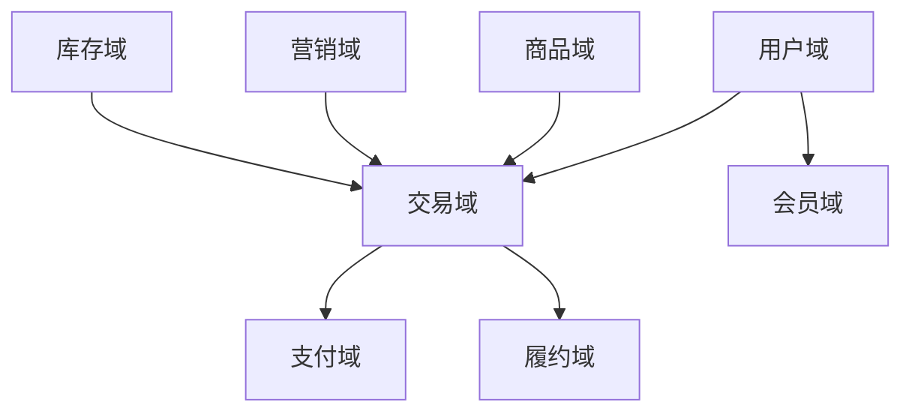
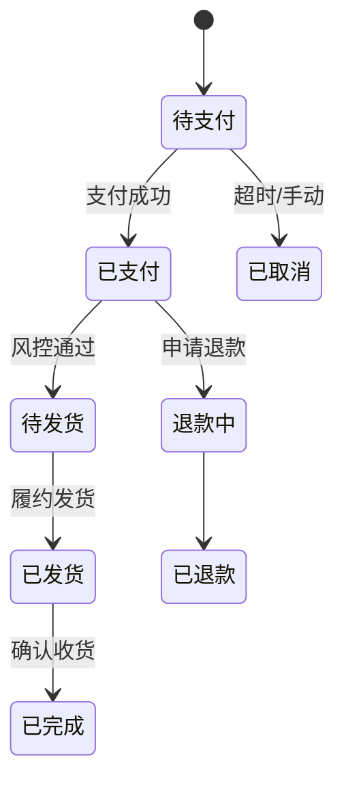
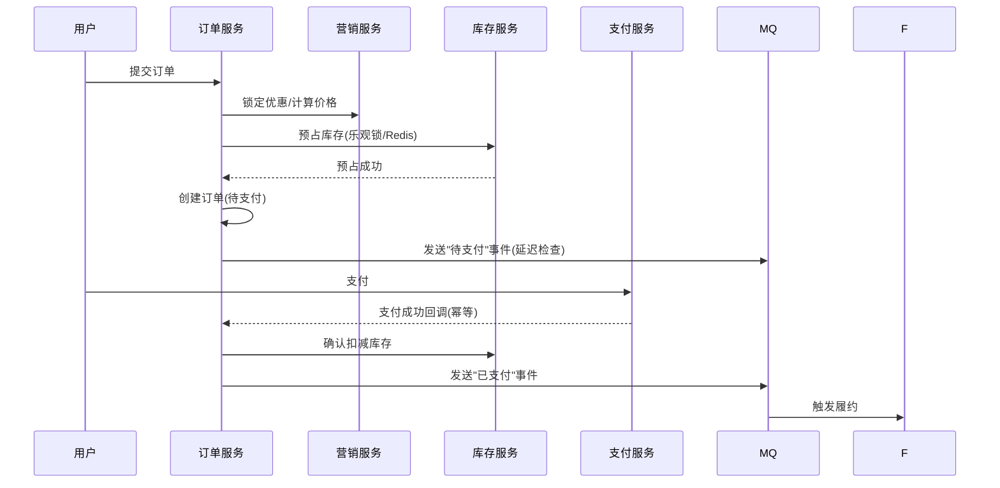
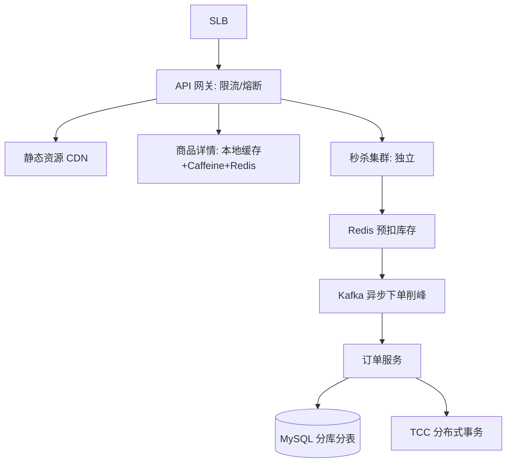

# 电商业务模型（深扒）

> 电商是后端架构的"试金石"：高并发、长事务链路、强一致性（钱/库存）、大促峰值。把电商吃透，其他交易类业务（外卖、票务、本地生活）都能套。
>
> 配套总览见「[业务模型总览](业务模型总览.md)」；高并发设计见「[场景设计](../场景设计)」「[架构](../架构)」。

---

## 一、业务全景与领域划分

电商本质是把「**人（用户/商家）— 货（商品）— 场（交易/营销/履约）**」在线化。按 DDD 限界上下文，拆为七大域：

| 域 | 核心职责 | 关键实体 |
|----|----------|----------|
| 商品域 | SPU/SKU、类目、属性、价格、上下架 | SPU、SKU、类目、品牌 |
| 用户域 | 账号、地址、登录 | 用户、地址薄 |
| 交易域 | 购物车、订单、拆单、状态机 | 购物车、订单、订单项 |
| 营销域 | 优惠券、满减、秒杀、拼团、会员价 | 活动、券、权益 |
| 库存域 | 库存查询、扣减、预占、回滚 | 库存、占用记录 |
| 支付域 | 收银台、渠道、对账 | 支付单、渠道流水 |
| 履约域 | 发货、物流、退货、售后 | 发货单、物流轨迹、退款单 |
| 会员域 | 等级、积分、权益 | 会员、积分流水 |

---

## 二、核心系统架构

### 2.1 商品中心

- **SPU vs SKU**：SPU（标准化产品单元，如"iPhone 15"）描述共性；SKU（最小库存单位，如"iPhone 15 256G 黑"）对应可售/可库存单元。
- **读多写少**：商品详情页 QPS 极高，靠**多级缓存**（本地 Caffeine + Redis + 静态化 CDN）。
- **搜索**：商品检索走 Elasticsearch（见「[基础知识/ES体系](../基础知识/ES体系.md)」），类目筛选、分词、聚合。

### 2.2 交易（订单）中心

订单是**状态机**，核心状态：`待支付 → 已支付 → 待发货 → 已发货 → 已完成`，以及 `已取消 / 退款中 / 已退款`。

- **拆单**：按店铺/仓库/品类拆成多个子订单（物流与结算独立）。
- **幂等**：下单、支付回调必须幂等（见「[场景设计/幂等设计](../场景设计/幂等设计.md)」），防重复订单/重复扣款。

### 2.3 营销中心（最复杂规则）

- 优惠叠加顺序：优惠券 → 满减 → 会员折扣 → 平台补贴，需可配置、可回滚。
- **价格计算**须与订单、库存联动：下单时锁定优惠，取消时回退。
- 秒杀/拼团是极端场景：瞬时流量百倍，靠**独立秒杀集群 + 库存预热 + MQ 异步下单**。

### 2.4 库存中心（一致性核心）

- **超卖是头号问题**：`SELECT stock FROM ... WHERE id=?` 再 `UPDATE` 在高并发下必超卖。
- 方案：**数据库乐观锁 / 行级锁 / Redis 预扣 + 异步落库 / 库存分桶**。
- 库存分**可用库存 / 预占库存 / 在途库存**，下单预占、支付后扣减、取消回滚预占。

---

## 三、关键链路：下单全流程

**分布式事务**：下单跨「订单+库存+营销+支付」多个服务，一致性用：
- **TCC**（Try 预占 / Confirm 确认 / Cancel 回滚）——强一致，适合资金/库存。
- **本地消息表 / 事务消息（RocketMQ）**——最终一致，适合通知类。
- 详见「[场景设计/分布式锁](../场景设计/分布式锁.md)」「[架构](../架构)」。

---

## 四、大促峰值架构（双11 级）

| 手段 | 解决 |
|------|------|
| 静态化 + CDN | 商品页扛流量 |
| 本地缓存 + Redis | 详情读扛 QPS |
| 库存预热 + Redis 预扣 | 防超卖、降 DB 压力 |
| MQ 削峰 | 异步下单，平滑写峰值 |
| 限流/熔断/降级 | 保护核心、非核心可降 |
| 分库分表 | 订单/交易数据水平扩展 |
| 热点账户分散 | 大促红包账户拆分 |

---

## 五、技术栈详表

| 技术 | 用途 | 备注 |
|------|------|------|
| Spring Cloud / Dubbo | 微服务 | 域内 RPC |
| Redis | 缓存、购物车、库存预扣 | 多级缓存一级 |
| Caffeine | 本地缓存 | JVM 级，抗热点 |
| MySQL（分库分表） | 订单/商品主存 | ShardingSphere |
| Elasticsearch | 商品搜索 | 近实时 |
| Kafka / RocketMQ | 异步、削峰、事务消息 | 解耦各域 |
| Seata（TCC/AT） | 分布式事务 | 下单链路 |
| OSS / CDN | 图片、静态资源 | 带宽成本优化 |
| Nacos / Sentinel | 注册发现、限流熔断 | 稳定性 |
| 对象存储 | 商品图、详情图 | — |

---

## 六、电商特有坑

- **超卖**：必须库存扣减原子化（乐观锁/Redis Lua）。
- **重复下单/重复支付**：全链路幂等（唯一索引 + token）。
- **优惠计算错误**：营销规则配置错误导致资损，需规则引擎 + 灰度 + 对账。
- **大促缓存击穿/雪崩**：热点商品过期瞬间打爆 DB（见「[场景设计/缓存经典三问](../场景设计/缓存经典三问与一致性.md)」）。
- **数据不一致**：下单后库存/订单/营销状态靠最终一致补齐，需对账兜底。

> 口诀：**"电商三座山：超卖、幂等、大促峰；库存原子扣，下单全幂等，峰值靠缓存+MQ+限流。"**
