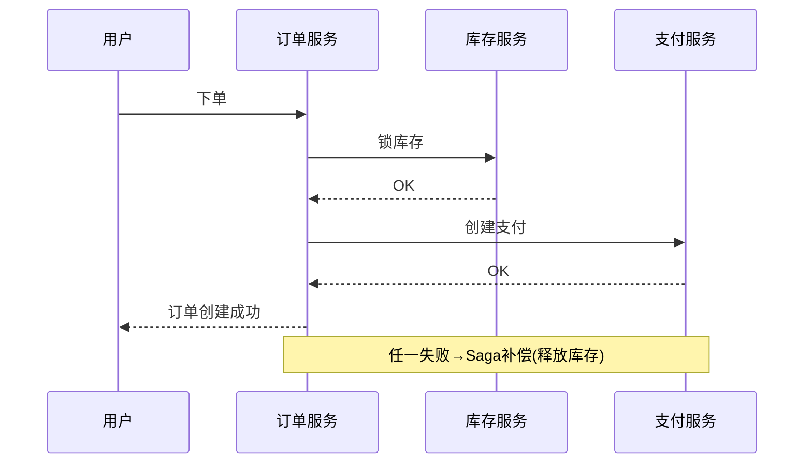

# 电商交易业务模型

> 板块：业务模型 　|　 返回：[README](README.md)
> 关联：[支付系统核心设计](../场景设计/支付系统核心设计.md)、[秒杀系统设计与高并发扣减](../场景设计/秒杀系统设计与高并发扣减.md)、[支付清结算与账务模型](支付清结算与账务模型.md)

电商是互联网最成熟的业务模型之一，其复杂度在于"交易"与"履约"两条主线的协同，以及价格、库存、优惠、支付、售后多域耦合。本文从核心域、实体关系、价格/库存/订单/支付/履约模型到一致性挑战系统梳理。

## 一、电商核心域

| 域 | 职责 | 关键实体 |
|----|------|---------|
| 商品域 | 商品信息、上下架 | SPU、SKU、类目、品牌、属性 |
| 交易域 | 下单、购物车、优惠、支付 | 购物车、订单、订单项、优惠 |
| 库存域 | 库存管理 | 可售/锁定/在途库存、仓库 |
| 用户域 | 账号、地址、会员 | 用户、地址、会员等级、积分 |
| 营销域 | 促销、发券 | 优惠券、满减、秒杀、拼团 |
| 履约域 | 仓储物流 | 发货单、物流、退货 |
| 支付域 | 收付款 | 支付单、渠道交易、账务 |

> 域之间边界清晰、通过事件/API 协作，是电商中台化的基础。

## 二、关键实体与关系

```
用户 1─* 订单 *─* SKU
订单 1─* 订单项（SKU, 数量, 单价, 分摊优惠）
SKU *─1 库存（按仓库维度）
订单 1─1 支付单 1─* 渠道交易
订单 1─* 发货单 1─* 物流单
```

### 2.1 SPU vs SKU（最易混淆）

- **SPU**（Standard Product Unit）：商品（如 iPhone 15），描述"是什么"。
- **SKU**（Stock Keeping Unit）：具体规格（256G 黑），描述"哪个具体可卖单元"。
- **交易/库存到 SKU 维度**：价格是 SKU 属性，库存按 SKU 计，下单选的是 SKU。
- 一个 SPU 下多个 SKU（不同颜色/容量），各自独立库存与价格。

### 2.2 订单状态机

```
待支付 ──支付成功──▶ 已支付 ──推仓──▶ 已发货 ──签收──▶ 已收货 ──确认──▶ 已完成
  │                      │                         │
  └──超时/取消──▶ 已关闭   └──退款──▶ 退款中 ──完成──▶ 已退款
                                └──部分退款──▶ 部分退款
```

- 状态变更需幂等（支付回调可能重发）、可审计（状态流转日志）。
- 用状态机统一管理，禁止散落 if/else 改状态。

## 三、价格与优惠模型

### 3.1 价格层次

| 概念 | 说明 |
|------|------|
| 裸价/吊牌价 | SKU 标价 |
| 会员价 | 按会员等级 |
| 促销价 | 活动价、秒杀价 |
| 最终价 | 裸价 → 适用促销 → 用券 → 实付 |

### 3.2 优惠计算

- **计算顺序敏感**：先满减再用券 vs 先用券再满减，结果不同，需规则明确。
- **规则引擎**：促销/优惠用规则引擎或明确优先级链，避免硬编码。
- **可解释**：用户能看到明细（每件多少钱、优惠多少、券减多少）。
- **优惠分摊**：多 SKU 订单的优惠按金额比例分摊到每项，便于退款核算与对账。

```text
订单原价 1000
  - 满999减100 (促销) = 900
  - 优惠券 50        = 850 (实付)
分摊: SKU-A(600)摊 600/1000*150=90, 实付 510; SKU-B(400)摊 60, 实付 340
```

## 四、库存模型

| 库存类型 | 含义 | 变化 |
|---------|------|------|
| 可售库存 | 当前可卖 | 扣减/回滚 |
| 锁定库存 | 已下单预占未支付 | 下单增、支付转扣减、取消减 |
| 在途库存 | 采购/调拨中 | 入库转可售 |
| 预占/扣减 | 下单锁、支付扣 | 状态流转 |

- **扣减时机**：下单锁库存（预扣），支付成功转扣减，取消/超时回滚。
- **防超卖**：Redis 预扣 + DB 兜底（见 [秒杀系统设计与高并发扣减](../场景设计/秒杀系统设计与高并发扣减.md)）。
- **多仓**：库存按仓库维度，下单选最近有货仓；超卖/缺货走调拨或预售。
- **库存与订单一致性**：扣减失败需回滚订单（Saga 补偿）。

## 五、订单拆分

- **多商家** → 拆成子订单（分别发货、开票、结算）。
- **不同仓** → 拆发货单（各自拣货）。
- **拆单影响**：优惠分摊与售后需设计好（拆单后优惠如何归属、退款如何按比例退）。
- **不拆单**：单商家单仓的简单订单直接整单处理。

## 六、支付与对账

- 见 [支付系统核心设计](../场景设计/支付系统核心设计.md)。
- 订单与支付单解耦，异步回调更新状态，**幂等关键**（回调可能重发，用 outTradeNo）。
- **对账**：每日与支付渠道核对交易与流水，差异（长短款）告警 + 人工处理。
- 账务模型见 [支付清结算与账务模型](支付清结算与账务模型.md)。

## 七、履约与物流

```
下单 → 拆单 → 推仓(WMS) → 拣货 → 复核 → 打包 → 发货 → 物流跟踪 → 签收
                                                          │
                                                  异常: 拒收/丢件 → 逆向
```

- 物流用第三方（快递 100/菜鸟/顺丰），状态异步回传。
- 超时未发货告警；妥投异常（拒收/丢件）走逆向流程。
- 预售/定制等特殊履约需单独状态处理。

## 八、售后与退款

- **退款需原路退回、优惠回退、库存回滚**。
- **部分退款**按分摊金额退，避免多退/少退。
- 退款与支付同样幂等（防重复退款资损，用 refundNo 唯一）。
- **换货**：退旧发新，涉及两次履约。
- **售后状态机**：申请 → 审核 → 退货/换货/退款 → 完成。

## 九、数据一致性挑战

- 下单同时扣库存、算优惠、创建支付 → 跨服务，用 **Saga / TCC / 事务消息**保证最终一致。
- 典型 Saga：下单 → 锁库存 → 创建支付 →（失败则逆序补偿：释放库存）。
- 见 [分布式事务与最终一致性实战](../场景设计/分布式事务与最终一致性实战.md)。



## 十、金额与精度

- **金额用整数分（或最小货币单位）存储计算**，避免浮点误差（0.1+0.2≠0.3）。
- 展示时再转元，且明确币种与精度。
- 优惠/分摊可能产生分以下的尾数，用"最大余数法"分摊，保证 Σ 分摊 = 总额。

```java
// 金额用 long 分存储
long priceInCents = 19900;  // 199.00 元
long total = priceInCents * qty;
```

## 十一、常见建模坑

1. **库存只存总数不拆仓** → 无法就近发货、无法并行履约。
2. **优惠不记录快照** → 事后纠纷无依据（下单应快照商品/价格/优惠）。
3. **退款不回退优惠** → 资损。
4. **订单状态用散落字段** → 应状态机统一管理。
5. **SKU 维度不清晰** → 库存/价格混乱。
6. **金额用浮点** → 计算误差，对账不平。
7. **拆单后优惠归属不清** → 退款核算错乱。
8. **不幂等处理支付回调** → 重复发货/重复退款。

## 十二、建模要点总结

- 一切以 **SKU** 为交易核心。
- 价格/优惠**下单快照**（不可变，纠纷可溯）。
- 库存**预扣 + 回滚**（防超卖）。
- **状态机**驱动订单生命周期（幂等、可审计）。
- 跨域用**最终一致**（Saga/TCC/事务消息）。
- 金额**整数分**存储（避免浮点误差）。

## 十三、与其他业务模型对比

- **本地生活/外卖**（[本地生活外卖业务模型](本地生活外卖业务模型.md)）：核心是"履约时效 + 地理位置"，电商是"交易 + 物流"。
- **内容社区**（[内容社区与UGC业务模型](内容社区与UGC业务模型.md)）：社区是种草/信任层，电商是转化层。
- **金融/支付**（[支付清结算与账务模型](支付清结算与账务模型.md)）：支付是电商的下游，强合规与对账。

## 十四、延伸阅读

- [支付系统核心设计](../场景设计/支付系统核心设计.md)
- [支付清结算与账务模型](支付清结算与账务模型.md)
- [秒杀系统设计与高并发扣减](../场景设计/秒杀系统设计与高并发扣减.md)
- [分布式事务与最终一致性实战](../场景设计/分布式事务与最终一致性实战.md)
- [金融业务模型](金融业务模型.md)
- [DDD/README](../DDD/README.md)
