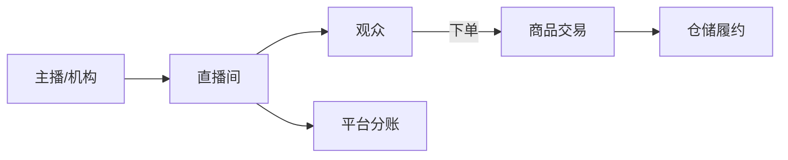

# 直播电商业务模型

> 直播电商把"内容直播"与"即时交易"融合，用户在观看过程中下单。其难点在于高并发抢购、实时库存、主播分账与内容合规。

## 1. 业务结构

| 角色 | 职责 |
| --- | --- |
| 主播/MCN | 带货、讲解、控场 |
| 平台 | 流量、交易、合规 |
| 观众 | 观看、互动、下单 |
| 商家/供应链 | 货品、发货 |

## 2. 核心流程

### 2.1 直播带货下单
1. 主播讲解商品，观众点击小黄车进入商品页。
2. 瞬时流量下用户下单，库存快速扣减。
3. 订单进入履约，发货配送。

### 2.2 实时互动
- 弹幕、点赞、抽奖提升停留与转化。
- 实时在线人数、销量滚动制造稀缺感（合规范围内）。

## 3. 盈利模式

| 模式 | 说明 |
| --- | --- |
| 佣金 | 按 GMV 抽成 |
| 坑位费 | 主播固定出场费 |
| 广告 | 直播间植入 |
| 打赏/会员 | 内容付费 |

## 4. 技术挑战

- **秒级高并发**：主播喊"上链接"瞬间万级 QPS，库存与下单需极致优化（预扣、队列削峰）。
- **实时库存**：多直播间共享库存，超卖零容忍。
- **低延迟推流**：CDN + 边缘节点保证观看流畅。
- **分账复杂**：平台/主播/商家/机构多方分账，规则多样。
- **内容审核**：直播实时审核（AI + 人工），违规即时断流。

## 5. 履约与售后

- 订单聚合发货，直播专属物流跟踪。
- 高退换货率需顺滑售后，影响复购。
- 质检与假货防控是信任基石。

## 6. 常见坑

| 坑 | 风险 | 对策 |
| --- | --- | --- |
| 库存超卖 | 客诉 | 预扣+原子 |
| 虚假宣传 | 合规 | 实时审核 |
| 分账纠纷 | 矛盾 | 规则透明+对账 |
| 数据造假 | 信任崩 | 反刷量 |

## 7. 面试题（业务侧）

1. 直播电商瞬时高并发如何支撑？
2. 多方分账如何设计？
3. 直播内容合规怎么做？
4. 直播与普通电商的区别？

## 8. 小结

直播电商 = 内容 + 交易 + 实时履约。技术峰值在"上链接"瞬间，业务核心是库存零超卖、分账清晰与内容合规。
