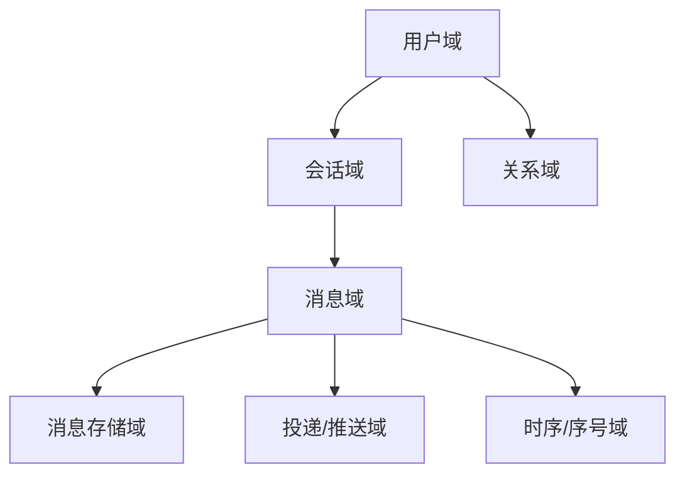
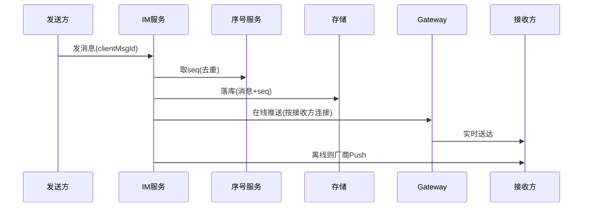

# 社交 / IM 业务模型（深扒）

> IM 的核心是「**长连接 + 消息可靠投递 + 时序一致**」。看似简单一个聊天，实则踩满：在线/离线、多端同步、消息不丢不重不乱序、已读回执、群聊扩散。
>
> 配套总览见「[业务模型总览](业务模型总览.md)」；长连接/一致性见「[架构](../架构)」「[场景设计](../场景设计)」「[内容短视频直播](内容短视频直播业务模型.md)」（直播互动复用 IM）。

---

## 一、业务全景与领域划分



| 域 | 核心职责 | 关键实体 |
|----|----------|----------|
| 用户域 | 账号、多端、在线状态 | 用户、设备、连接 |
| 会话域 | 单聊/群聊、会话列表 | 会话、成员 |
| 消息域 | 发送、类型（文本/图片/语音） | 消息、消息体 |
| 存储域 | 落库、历史、漫游 | 消息记录 |
| 投递域 | 在线推送、离线 Push | 投递任务 |
| 时序域 | 序号、去重、顺序 | 序号、去重表 |

---

## 二、核心系统架构

### 2.1 长连接网关
- 客户端与 **Gateway（长连接层）** 保持 TCP/WebSocket 连接，连接与业务逻辑解耦。
- 连接管理：连接 ID ↔ 用户 ↔ 设备 映射存 Redis；连接断开触发离线状态。

### 2.2 消息时序（最关键）
- 全局**递增序号（seq）**：用发号器（Snowflake/号段）保证同一会话内消息严格递增。
- **去重**：消息带 `clientMsgId`，服务端判重防重试重复（见「[幂等](../场景设计/幂等设计.md)」）。

### 2.3 投递与多端同步
- 在线：经 Gateway 实时推；多端（手机/PC/Web）各自同步，互不漏。
- 离线：APNs/厂商 Push 唤醒；拉取时按 seq 增量同步。

### 2.4 群聊扩散
- **写扩散**：发一条群消息，给每个成员写一份收件箱 → 读快、写重（大群爆炸）。
- **读扩散**：只存一份群消息，成员读时聚合 → 写轻、读重。
- **折中**：中小群写扩散，大群（万人大群）读扩散 + 拉取。

---

## 三、关键链路：一条消息的旅程



---

## 四、峰值与实时场景

| 场景 | 挑战 | 方案 |
|------|------|------|
| 海量长连接 | 单机连接数有限 | Gateway 集群 + 连接迁移 |
| 万人大群 | 写扩散爆炸 | 大群转读扩散 |
| 弱网重发 | 消息重复/乱序 | clientMsgId 去重 + seq 排序 |
| 多端互踢/同步 | 状态不一致 | 在线状态中央化 |
| 消息漫游 | 历史存储大 | 冷热分离 + 对象存储 |

---

## 五、技术栈详表

| 技术 | 用途 | 备注 |
|------|------|------|
| Netty / WebSocket | 长连接网关 | 高并发 |
| Redis | 连接映射、在线状态 | 内存 |
| 发号器（号段/Snowflake） | 消息 seq | 严格递增 |
| Kafka | 消息异步落库/推送 | 削峰 |
| 厂商 Push（APNs/个推） | 离线唤醒 | 补充 |
| 对象存储 | 图片/语音/文件 | 直传 |

---

## 六、深挖：核心业务机制

### 6.1 消息序号（seq）与去重

```
发送方生成 clientMsgId（UUID/时间戳+随机）→ 服务端按会话分配递增 seq
去重: 会话内 (clientMsgId 唯一索引) → 重试不产生第二条
排序: 客户端按 seq 排（服务端序号为准，不用本地时钟）
```

| 机制 | 解决 | 实现 |
|------|------|------|
| clientMsgId 幂等 | 网络重发产生重复 | 唯一索引 + 返回原消息 |
| 服务端 seq | 乱序（本地时钟漂移） | 发号器：号段（DB）/ Snowflake |
| 会话级 seq | 多端增量同步 | 客户端记 lastSeq，拉取 >lastSeq |
| 已读回执 | 多端已读同步 | 已读 seq 上报，同步到各端 |

> seq 是全 IM 的**时间真相**：乱序、同步、已读全依赖它（呼应 [幂等设计](../场景设计/幂等设计.md)）。

### 6.2 群聊扩散策略选择

| 群规模 | 策略 | 说明 |
|--------|------|------|
| 小群（<500） | 写扩散 | 每成员收件箱一条，读快 |
| 中群（500~5000） | 写扩散 + 分片 | 批量写入，控制失败率 |
| 大群（万人+） | 读扩散 | 群消息一份，成员拉取聚合 |

- 写扩散批量：同群多条消息合批落库、合批推送；
- 读扩散优化：群消息分页缓存 + 序号游标，避免全量聚合；
- 动态切换：群规模变化触发策略迁移（冷迁移 + 双写过渡）。

### 6.3 在线状态与多端

```
在线状态 = 至少一端有长连接（连接ID × 设备 × 用户 映射在 Redis）
- 上线/下线/换机: 状态变更事件广播给好友/群
- 多端: 每端独立拉取 seq，已读按端同步
```

- 连接层与业务层解耦：Gateway 只管连接，业务订阅状态事件；
- 连接雪崩防护：指数退避重连 + 分批踢重连 + 连接池预估（见 [长连接](../场景设计/长连接.md)）。

---

## 七、核心指标与数据驱动

| 维度 | 指标 | 说明 |
|------|------|------|
| 增长 | DAU、人均消息数 | 北极星 |
| 体验 | 消息送达时延（P50/P95）、端到端时延 | 核心 |
| 质量 | 消息丢失率、重复率、乱序率 | 可靠性 |
| 运营 | 在线率、群活跃率 | 粘性 |
| 技术 | 长连接数、Gateway 吞吐、推送成功率 | 后端 |

---

## 八、面试与系统设计视角

1. 设计一个 IM 系统：长连接网关 → seq → 存储 → 投递 → 多端同步（见 [IM 消息系统设计](../场景设计/IM消息系统设计.md)）。
2. 消息不丢不重不乱序怎么保证：at-least-once + clientMsgId 去重 + seq 排序。
3. 万人大群消息怎么做：读扩散 + 分页 + 游标。
4. 多端同步怎么实现：lastSeq 增量 + 已读回执。
5. 在线状态怎么做：连接映射 + 状态事件广播。
6. 离线推送怎么兜底：厂商 Push + 静默增量拉取。

---

## 九、IM 特有坑

- **消息乱序**：客户端按本地时间排 → 必须用服务端 seq。
- **重复消息**：网络重发 → clientMsgId 全局去重。
- **大群写爆炸**：无脑写扩散 → 按群规模切策略。
- **多端不同步**：A 手机已读、PC 未更 → 已读回执走 seq 同步。
- **连接雪崩**：Gateway 重启大量重连 → 指数退避 + 分批。

> 口诀：**"IM 四保：连接长、序号严、去重稳、多端齐；群大转读扩，离线靠 Push，时序用 seq 不用钟。"**
