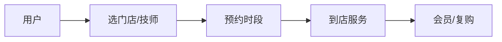

# 美业生活服务业务模型

> 美业（美发、美甲、美容、医美）是"到店服务 + 强预约 + 高复购"的本地生活业务。特点是**非标服务、技师即核心资产、时段即库存**。业务模型围绕"排班产能"与"会员复购"展开。

## 1. 业务结构

## 2. 核心模块

| 模块 | 关键 |
| --- | --- |
| 门店/技师 | 排班、技能、评价 |
| 预约 | 时段库存、防冲突 |
| 服务 | 项目标准化、套餐 |
| 会员 | 储值、等级、权益 |
| 营销 | 拼团、卡项、转介绍 |

## 3. 时段即库存

- 每个技师的时间窗是有限资源，需防超约。
- 预约占用时段，爽约释放并计入信用。
- 智能排班平衡技师负载与客流。

## 4. 复购与会员

- 储值卡锁定长期消费，提升 LTV。
- 项目套餐降低决策门槛。
- 技师绑定客户，做私域复购。

## 5. 常见坑

| 坑 | 现象 | 对策 |
| --- | --- | --- |
| 排班冲突 | 双约 | 时段锁 |
| 技师流失 | 客户走 | 平台绑定 |
| 服务非标 | 客诉 | SOP + 培训 |
| 储值风险 | 信任 | 透明 + 合规 |
| 爽约 | 浪费 | 信用 + 押金 |

## 6. 面试题

1. 美业时段如何当库存管理？
2. 技师如何绑定客户又防流失？
3. 储值会员风险？
4. 非标服务如何标准化？

## 7. 小结

美业 = 时段产能 + 技师资产 + 会员复购。核心是"把时间当库存管、把技师当资产留、把复购当生命线"。
