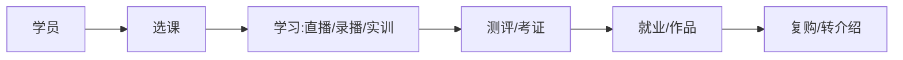

# 职业教育业务模型

> 职业教育是"内容 + 服务 + 结果"的复合业务：课程、实训、考证、就业串联。其商业本质是**学习成效驱动付费**，高客单、长周期、重交付，转介绍率高但获客贵。

## 1. 业务结构

## 2. 核心模块

| 模块 | 关键 |
| --- | --- |
| 课程 | 体系化、阶梯、项目制 |
| 交付 | 直播 + 答疑 + 作业 |
| 实训 | 云环境/真实项目 |
| 考证 | 报名、题库、模拟 |
| 就业 | 内推、作品集、辅导 |

## 3. 付费与转化

- **试听到付费**：低价引流课 → 正价体系课。
- **分期/先学后付**：降低决策门槛。
- **效果承诺**：就业保障班（合规前提下）。
- **转介绍**：学员成功案例驱动口碑。

## 4. 交付质量

- 师资标准化 + 助教跟进。
- 学习数据追踪，掉队预警。
- 项目作品集作为成果证明。

## 5. 常见坑

| 坑 | 现象 | 对策 |
| --- | --- | --- |
| 完课率低 | 退费 | 督学 + 社群 |
| 效果虚 | 投诉 | 真实案例 |
| 交付差 | 口碑崩 | 师资管控 |
| 获客贵 | 不赚钱 | 转介绍 + 私域 |
| 合规 | 承诺过度 | 合规话术 |

## 6. 面试题

1. 职业教育付费转化路径？
2. 如何提升完课率？
3. 先学后付的风险？
4. 交付质量如何保障？

## 7. 小结

职业教育 = 体系课程 + 强交付 + 效果证明 + 口碑裂变。核心是"以学习成效换付费"，交付质量决定复购与转介绍。
