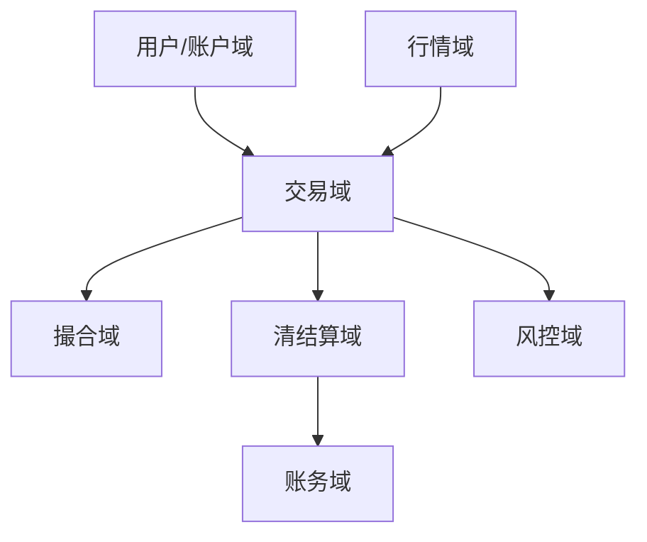
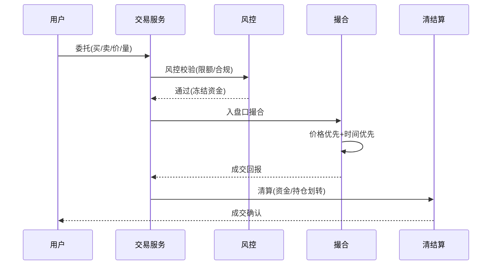

# 证券 / 基金 / 交易业务模型（深扒）

> 金融交易系统的核心铁律是「**正确性 > 性能 > 体验**」：一笔错单、一次重复扣款、一毫秒的行情延迟，都是真金白银的事故。它把一致性、幂等、审计推到极致。
>
> 配套总览见「[业务模型总览](业务模型总览.md)」；一致性/事务见「[电商](电商业务模型.md)」「[架构](../架构)」「[基础知识/分布式系统](../基础知识/分布式系统.md)」。

---

## 一、业务全景与领域划分

| 域 | 核心职责 | 关键实体 |
|----|----------|----------|
| 账户域 | 开户、资金、持仓 | 账户、资金、持仓 |
| 行情域 | 实时报价、深度、K线 | 行情、订单簿 |
| 交易域 | 委托、下单、撤单 | 委托单、状态机 |
| 撮合域 | 买卖撮合、价格优先 | 撮合引擎、成交 |
| 清结算 | 清算、交收、对账 | 清算单、交收 |
| 风控域 | 限额、合规、反洗钱 | 风控规则、预警 |

---

## 二、核心系统架构

### 2.1 撮合引擎（交易心脏）
- **价格优先 + 时间优先**：买卖盘口按价格档排序，同价按时间序。
- **内存订单簿**：全内存撮合，微秒级；成交后异步落库。
- **无锁/环形队列**：高吞吐下避免锁竞争（见「[并发编程](../基础知识/并发编程.md)」）。

### 2.2 行情（低延迟）
- 行情分发走**二进制协议 + 组播/推**，端到端延迟追求毫秒级。
- 快照 + 增量，客户端本地重建订单簿。

### 2.3 资金与持仓（强一致）
- 委托冻结资金/持仓，成交后**原子划转**，任何一步失败整体回滚。
- **T+1 / 交收**：交易与资金交收分离，日终清算对账。

### 2.4 风控与合规
- 事前：限额、持仓上限、黑名单；事中：异常交易监测；事后：反洗钱、对账审计。

---

## 三、关键链路：一笔委托

---

## 四、峰值与实时场景

| 场景 | 挑战 | 方案 |
|------|------|------|
| 开盘/收盘 | 委托瞬时洪峰 | 撮合内存化 + 队列削峰 |
| 剧烈波动 | 行情风暴 | 行情组播 + 限流 |
| 断网重连 | 状态不一致 | 重演 + 对账兜底 |
| 错单 | 资损 | 风控拦截 + 人工应急 |

---

## 五、技术栈详表

| 技术 | 用途 | 备注 |
|------|------|------|
| 内存撮合引擎（C++/Java） | 撮合 | 微秒级 |
| 二进制行情协议 | 行情推送 | 低延迟 |
| 分布式事务/TCC | 资金划转 | 强一致 |
| Kafka | 成交、清算事件 | 解耦 |
| 对账系统 | 日终清算 | 必做 |
| 审计日志 | 合规留痕 | 不可篡改 |

---

## 六、交易特有坑

- **重复委托/重复成交**：网络重发 → 委托号幂等 + 唯一约束。
- **资金非原子**：冻结与扣减不原子 → 必用事务/补偿，禁部分成功。
- **行情延迟致误判**：用本地时间比行情 → 须用交易所授时/序号。
- **清算对账缺失**：日终不核对 → 长尾资损，必须自动对账 + 差异告警。
- **风控滞后**：只事后查 → 事前事中拦截前置。

> 口诀：**"交易三优先：正确>性能>体验；撮合内存快，资金原子转，风控前置拦，日终必对账。"**
