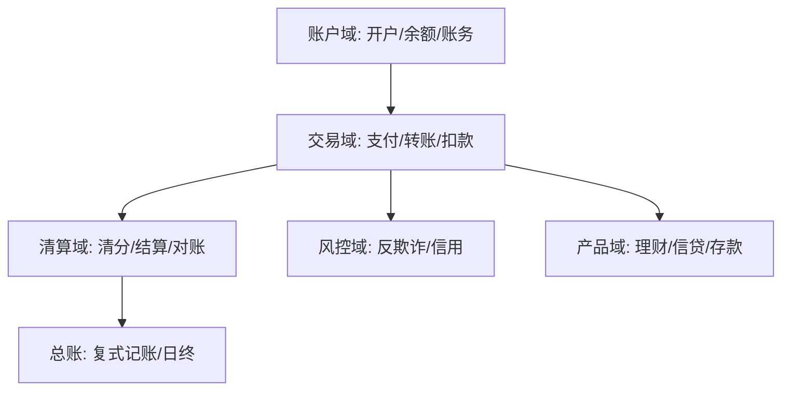
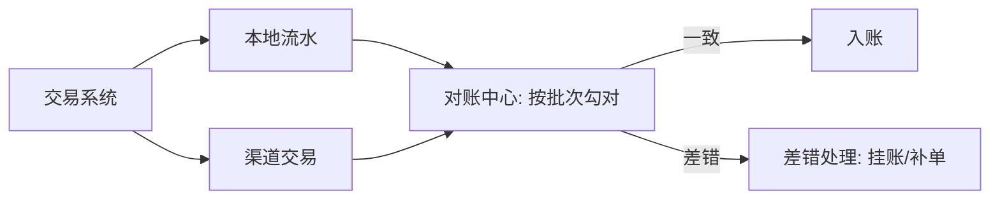
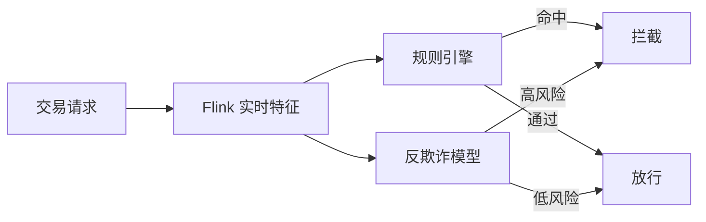
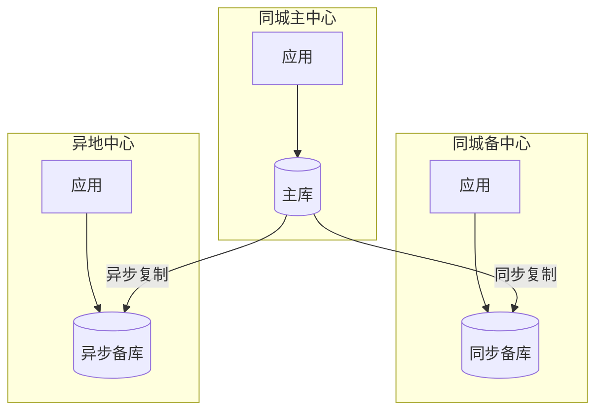

# 金融业务模型（深扒）

> 金融系统的第一性原理是**"钱不能错、不能丢、可追溯"**。它把电商的"强一致"要求推向极致：分布式事务、实时对账、两地三中心容灾，是后端一致性与高可用的最高标准范本。
>
> 配套总览见「[业务模型总览](业务模型总览.md)」；分布式事务与一致性见「[架构](../架构)」「[场景设计/分布式锁](../场景设计/分布式锁.md)」。

---

## 一、业务全景与领域划分

金融业务围绕「**账户 — 交易 — 清算 — 风控**」展开：



| 域 | 核心职责 | 关键实体 |
|----|----------|----------|
| 账户域 | 开户、余额、账务明细 | 账户、余额、流水 |
| 交易域 | 支付、转账、代收付 | 交易订单、支付指令 |
| 清算域 | 渠道清算、内部结算、对账 | 清算批次、对账文件 |
| 风控域 | 实时反欺诈、信用评分、限额 | 规则、名单、评分 |
| 产品域 | 存款、理财、信贷、基金 | 产品、持仓、合约 |
| 总账域 | 复式记账、科目、日终 | 凭证、分户账、总账 |

---

## 二、核心系统设计要点

### 2.1 账户与账务（复式记账）

- **复式记账**：每笔交易借贷必相等（`借：现金 贷：存款`），天然自校验，杜绝单边账。
- **账户分类**：客户的"余额账户"、内部的"过渡账户/待清算账户"、银行的"准备金账户"。
- **流水不可变**：交易流水**只追加不修改**，任何变更产生新流水（审计追溯）。
- **热点账户**：大促红包、平台归集账户被高频更新 → 拆分账户（按日/按商户分片）、汇总记账。

```sql
-- 复式记账：一笔转账生成两条流水，借贷平衡
INSERT INTO ledger(tx_id, account, direction, amount) VALUES
  ('T1','A', 'DEBIT', 100),   -- A 扣款
  ('T1','B', 'CREDIT', 100);  -- B 入账
-- 约束：SUM(amount * sign) = 0 校验通过才提交
```

### 2.2 支付与清算

- **支付链路**：`用户 → 收单 → 渠道(银联/网联/三方) → 清算 → 入账`。
- **清算 vs 结算**：清算是"算清楚谁该给谁多少钱"（批处理），结算是"真正资金划转"。
- **对账**：每日用渠道对账文件 vs 本地交易，**差错处理**（长款/短款/挂账）是金融系统生命线。



### 2.3 分布式事务（金融级）

金融不容忍"最终一致"的短暂不一致（钱不能少）。常用：
- **TCC**（Try/Confirm/Cancel）：强一致，适合资金转移（A 扣 B 加须同时成功）。
- **Saga**：长事务（跨多系统信贷流程），补偿式。
- **事务消息（RocketMQ）**：本地事务 + 半消息，保证"本地落库"与"消息投递"一致。
- **最大努力通知**：非核心（如通知用户），最终一致即可。

### 2.4 风控（实时反欺诈）

- **实时规则**：设备指纹、异地登录、频次、金额突变 → 规则引擎（Drools）毫秒级拦截。
- **模型**：信用评分、图计算（关系网络识别团伙欺诈）。
- **流计算**：Flink 实时计算特征（近 1 分钟交易次数/金额），训练好的模型在线打分。



---

## 三、容灾与高可用（两地三中心）

金融要求 **RPO≈0（不丢数据）、RTO 极小（快速恢复）**：



- **同步复制**（同城）：主备强一致，主挂备秒级接管，RPO=0。
- **异步复制**（异地）：防城市级灾难，RPO 秒级~分钟。
- **单元化**：把用户按地域路由到固定数据中心，故障可整单元切换。

---

## 四、技术栈详表

| 技术 | 用途 | 备注 |
|------|------|------|
| 分布式数据库（OceanBase/TiDB） | 强一致存储、水平扩展 | 金融核心替代 Oracle |
| RocketMQ（事务消息） | 异步一致、削峰 | 金融级可靠 |
| 规则引擎（Drools） | 风控/清结算规则 | 可热更新 |
| Flink | 实时风控特征、对账流 | 低延迟 |
| Seata / TCC 框架 | 分布式事务 | 资金转移 |
| 加密机 HSM / KMS | 敏感数据加密、密钥 | 合规要求 |
| 对账平台（批处理） | 日终清算、差错 | 自研批作业 |
| 多活/单元化中间件 | 容灾路由 | 如蚂蚁/微信方案 |

---

## 五、金融特有坑

- **资损零容忍**：任何代码变更需灰度 + 资金对账兜底；禁止使用"最终一致"处理核心资金（除非有明确补偿）。
- **热点账户**：平台归集账户高频更新 → 分片/汇总记账，避免行锁竞争。
- **对账缺口**：渠道延迟、网络抖动导致勾对不上 → 必须有差错处理与人工干预通道。
- **合规与审计**：所有操作留痕、流水不可变、等保/人行监管要求。
- **时钟与幂等**：支付回调乱序/重复 → 全链路幂等（唯一交易号 + 状态机）。

> 口诀：**"金融三铁律：钱不错、账可溯、灾能恢复；复式记账自校验，TCC 保一致，对账兜底防资损。"**

---

## 六、与电商的对比

| 维度 | 电商 | 金融 |
|------|------|------|
| 一致性 | 最终一致可容忍（库存短暂） | 强一致（钱不可错） |
| 事务 | TCC/消息最终一致 | TCC/同步复制为主 |
| 容灾 | 多可用区 | 两地三中心、RPO≈0 |
| 数据 | 可改可删（订单取消） | 流水只追加、不可变 |
| 风控 | 营销反刷 | 实时反欺诈、强合规 |
| 峰值 | 大促秒杀 | 清算批处理、红包峰值 |

---

## 七、延伸阅读

- [支付清结算与账务模型](支付清结算与账务模型.md)
- [金融风控与反欺诈业务模型](金融风控与反欺诈业务模型.md)
- [证券基金交易业务模型](证券基金交易业务模型.md)
- [场景设计/支付系统核心设计](../场景设计/支付系统核心设计.md)
- [架构/分布式事务实战](../架构/分布式事务实战.md)
