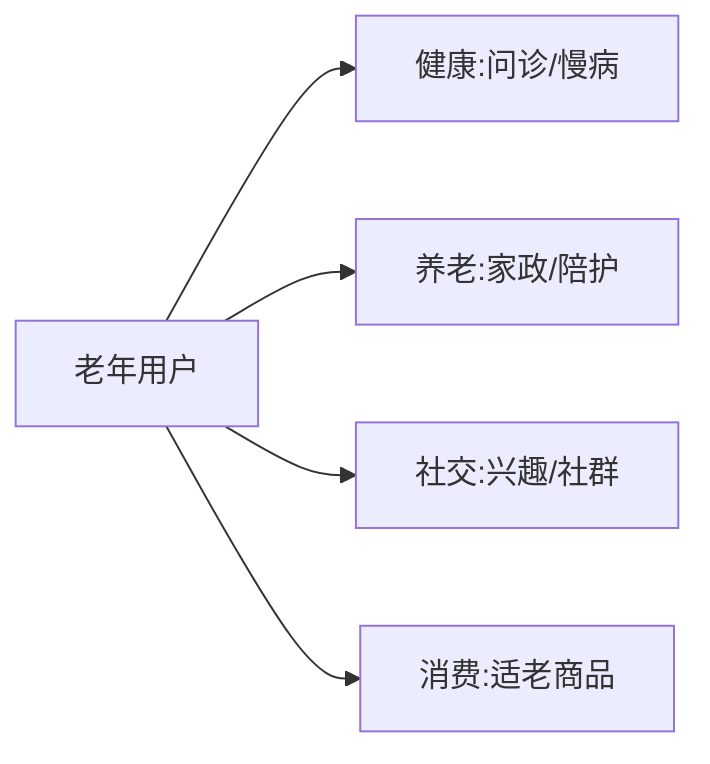

# 银发经济与适老化业务模型

> 人口老龄化带来"银发经济"结构性机会：医疗健康、养老服务、社交娱乐、适老消费。其特殊性在于**用户数字化能力弱、信任敏感、决策慢、客单价高**，产品必须"适老化"（大字号、简流程、强服务）。

## 1. 业务结构

## 2. 核心模块

| 模块 | 关键 |
| --- | --- |
| 医疗健康 | 慢病管理、在线问诊、送药 |
| 养老服务 | 居家照护、机构、助餐 |
| 社交娱乐 | 兴趣社群、短视频 |
| 适老消费 | 大字版、语音购物 |
| 子女代付 | 家庭账户、代操作 |

## 3. 适老化设计

- **交互**：大字号、强对比、少步骤、语音优先。
- **信任**：真人客服、线下触点、资质透明。
- **安全**：防诈骗提示、亲情守护、支付确认。
- **服务**：重人工兜底，不逼自助。

## 4. 商业模式

- 子女为父母付费（亲情账户）。
- 订阅制健康/照护服务。
- 高信任带来的高复购与转介绍。
- 与社区/机构合作的线下入口。

## 5. 常见坑

| 坑 | 现象 | 对策 |
| --- | --- | --- |
| 不会用 | 流失 | 适老化 + 人工 |
| 被骗 | 风险 | 防诈 + 守护 |
| 决策慢 | 转化低 | 子女协助 |
| 信任弱 | 不敢付 | 资质 + 触点 |
| 服务重 | 成本高 | 轻重结合 |

## 6. 面试题

1. 适老化设计核心原则？
2. 银发用户信任如何建立？
3. 子女代付模式价值？
4. 防诈骗如何做？
5. 银发经济商业特点？

## 7. 小结

银发经济 = 健康/养老/社交/适老消费 + 强适老化 + 亲情账户。核心是"用适老化降低门槛、用信任与服务建立长期关系"。
