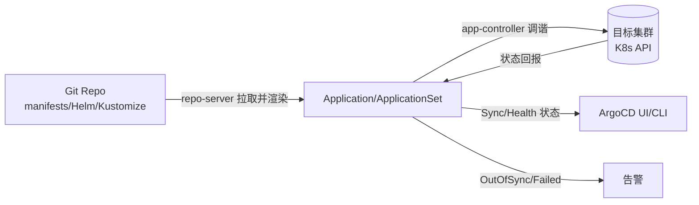

# GitOps（深入：ArgoCD/FluxCD 对比 / 多集群 / 渐进交付 / 安全 / Secret 管理）

> 把 **Git 仓库当作集群状态的唯一事实源**，Agent 持续比对 Git 期望状态与集群实际状态，不一致自动同步。本篇深入拆解：ArgoCD vs FluxCD 详细对比、多集群 GitOps、Secret 管理、渐进交付、生产最佳实践。

---

## 一、GitOps 核心原则

1. **Git 是唯一事实源**：集群想要的状态全在 Git
2. **声明式**：用 K8s YAML/Helm 描述「要什么」
3. **自动化同步（Pull）**：Agent 主动拉取并应用
4. **持续调谐**：Agent 周期性比对，发现漂移自动纠正
5. **可观测与回滚**：回滚 = git revert + 自动同步

---

## 二、Push vs Pull 模式

| 维度 | 传统 CI/CD（Push） | GitOps（Pull） |
|------|-------------------|----------------|
| 触发 | 流水线 kubectl apply 推到集群 | Agent 从 Git 拉并应用 |
| 凭证 | 集群 kubeconfig 暴露在 CI | 集群内 Agent 有权，CI 无需凭证 |
| 漂移 | 集群被手动改后无人知 | Agent 检测漂移并纠正 |
| 回滚 | 重新跑流水线 | git revert + 自动同步 |
| 审计 | 看 CI 日志 | 看 Git 历史（天然审计） |

---

## 三、ArgoCD vs FluxCD 详细对比

| 维度 | ArgoCD | FluxCD |
|------|--------|--------|
| 架构 | server + repo-server + app-controller | 多个独立 controller（source/kustomize/helm/notification） |
| UI | 丰富的 Web UI + CLI | 无 UI（纯 CLI + K8s API） |
| 多集群 | ApplicationSet 批量生成 | Kustomization 跨集群引用 |
| Helm 支持 | 原生支持 Helm Chart | HelmRelease CRD |
| Kustomize | 原生支持 | Kustomization CRD |
| 渐进交付 | Argo Rollouts 集成 | Flagger 集成 |
| RBAC | 内置 RBAC（SSO 集成） | 依赖 K8s RBAC |
| 学习曲线 | 中等（有 UI 降低门槛） | 较低（K8s 原生） |
| 社区生态 | CNCF 毕业，企业采用多 | CNCF 毕业，云原生原生 |
| 适用 | 需要 UI + 多租户 + 审计 | 需要轻量 + K8s 原生 |

### 推荐选择

```
需要可视化 + 多租户 → ArgoCD
追求轻量 + K8s 原生 → FluxCD
企业级多集群 → ArgoCD（ApplicationSet + SSO + RBAC）
```

---

## 四、多集群 GitOps

### 4.1 架构模式

```
模式一：一个 Git 仓库 + 多个 Application
  Git Repo
    ├── base/          # 公共配置
    ├── overlays/
    │   ├── dev/       # 开发环境
    │   ├── staging/   # 预发环境
    │   └── prod/      # 生产环境
  ArgoCD ApplicationSet 自动生成多集群 Application

模式二：多 Git 仓库
  不同团队/项目独立 Git 仓库
  每个仓库独立配置 ArgoCD Application
  适合：大组织多团队

模式三：Hub-Spoke
  Hub 集群管理多个 Spoke 集群
  Git 变更 → Hub 同步 → 分发到 Spoke
  适合：多区域/多云
```

### 4.2 ApplicationSet（ArgoCD）

```yaml
apiVersion: argoproj.io/v1alpha1
kind: ApplicationSet
metadata:
  name: my-app
spec:
  generators:
  - list:
      elements:
      - cluster: dev
        url: https://dev-cluster
      - cluster: staging
        url: https://staging-cluster
      - cluster: prod
        url: https://prod-cluster
  template:
    metadata:
      name: 'my-app-{{cluster}}'
    spec:
      project: default
      source:
        repoURL: https://github.com/org/repo
        path: overlays/{{cluster}}
      destination:
        server: '{{url}}'
        namespace: my-app
      syncPolicy:
        automated:
          prune: true
          selfHeal: true
```

---

## 五、Secret 管理

### 5.1 方案对比

| 方案 | 原理 | 优点 | 缺点 |
|------|------|------|------|
| Sealed Secrets | K8s 控制器解密 | 简单 | 密钥在集群中 |
| SOPS | 加密 YAML/JSON | 灵活 | 需管理加密密钥 |
| External Secrets | 从 Vault/AWS SM 同步 | 安全 | 依赖外部系统 |
| Vault Agent | Vault 注入 | 最安全 | 复杂 |

### 5.2 Sealed Secrets 示例

```bash
# 安装
kubectl apply -f https://github.com/bitnami-labs/sealed-secrets/releases/download/v0.24.0/controller.yaml

# 加密 Secret
kubectl create secret generic my-secret --from-literal=password=abc123 --dry-run=client -o yaml | kubeseal -o yaml > sealed-secret.yaml

# sealed-secret.yaml 可以安全提交到 Git
# ArgoCD 同步时 Sealed Secrets 控制器自动解密
```

---

## 六、渐进交付（Progressive Delivery）

### 6.1 Argo Rollouts

```yaml
apiVersion: argoproj.io/v1alpha1
kind: Rollout
metadata:
  name: my-app
spec:
  replicas: 10
  strategy:
    canary:
      steps:
      - setWeight: 10      # 10% 流量到新版本
      - pause: {duration: 5m}  # 观察 5 分钟
      - analysis:          # 自动分析指标
          templates:
          - templateName: success-rate
      - setWeight: 50
      - pause: {duration: 10m}
      - setWeight: 100
      canaryService: my-app-canary
      stableService: my-app-stable
      trafficRouting:
        istio:
          virtualService:
            name: my-app-vsvc
```

### 6.2 Flagger（Flux 生态）

```
Flagger = 渐进交付 K8s Operator

支持：Canary / Blue-Green / A/B 测试
指标源：Prometheus / Datadog / CloudWatch
决策：自动推进或回滚（基于指标阈值）
```

---

## 七、生产最佳实践

| 实践 | 说明 |
|------|------|
| 分支策略 | main 分支 = 生产，develop = 预发，feature 分支开发 |
| PR 评审 | 所有变更必须 PR + Review + 合并 |
| 保护分支 | prod 分支限制直接 push |
| 镜像标签 | 用 commit SHA（不可变），不用 latest |
| 同步策略 | prod 用手动同步（需审批），dev/staging 用自动同步 |
| 健康检查 | 检查 Pod Ready + Service 端点 |
| 告警 | OutOfSync / Sync 失败 / 健康检查失败 → 告警 |
| 审计 | Git 历史天然审计，定期 Review |

---

## 八、与其他板块的关系

- Kubernetes 核心见「[Kubernetes 核心](./Kubernetes核心.md)」；
- CI/CD 见「[CI-CD](../基础知识/CI-CD/README.md)」；
- 可观测性见「[OpenTelemetry](../基础知识/中间件/OpenTelemetry.md)」；
- Service Mesh 见「[ServiceMesh](./ServiceMesh.md)」。

> 一句话：**GitOps = Git 唯一事实源 + Agent Pull 同步 + 漂移自动纠正——ArgoCD 有 UI 适合企业级，FluxCD 轻量适合云原生；生产核心：PR 评审 + 保护分支 + 自动同步 + 健康检查 + git revert 回滚**。

---

## 九、ArgoCD 深度实战

### 9.1 核心资源模型

ArgoCD 把「Git 里的期望状态」与「集群里的实际状态」建模成一组 CRD：



- **Application**：单个应用 = 一个 Git 源 + 一个目标集群/namespace 的绑定。
- **AppProject**：租户隔离边界，限制 Application 能用哪些集群、namespace、Git 源、哪些 Kind。
- **ApplicationSet**：用 Generator（cluster list / Git directories / matrix / pull request / cluster decision resource）批量生成 Application，是实现多集群/多环境的关键。
- **App of Apps**：一个「父 Application」的 Git 目录里放一堆 Application YAML，启动父应用即递归同步所有子应用——适合中台/平台团队统一管理。

### 9.2 Sync 机制与三个阶段

ArgoCD 同步分三步，理解它才能排查「卡在 Syncing」：

1. **PreSync Hook**（可选）：先跑 Job/操作（如数据库迁移），成功才继续。
2. **Sync（apply）**：将 Git 渲染出的资源 `kubectl apply` 到集群（实际走 `kubectl` 的 `server-side apply` 或 `create/apply`）。默认带 `prune`（删除 Git 里已没的资源）和 `selfHeal`（把被手动改的资源改回 Git 定义）。
3. **PostSync Hook**（可选）+ **Sync Health 评估**：所有资源达到 `Healthy` 才标记 Sync Succeeded。

```yaml
apiVersion: argoproj.io/v1alpha1
kind: Application
metadata:
  name: my-app
  namespace: argocd
spec:
  project: default
  source:
    repoURL: https://github.com/org/repo
    path: manifests/overlays/prod
    targetRevision: HEAD          # 也可锁定到 tag/commit 实现不可变发布
  destination:
    server: https://kubernetes.default.svc
    namespace: my-app
  syncPolicy:
    automated:
      prune: true
      selfHeal: true
      allowEmpty: false           # 渲染结果为空时不允许同步成功
    syncOptions:
      - CreateNamespace=true      # 目标 namespace 不存在时自动建
      - ServerSideApply=true      # 大规模资源用 SSA 避免注解体积超限
      - PruneLast=true            # 先建/更新，最后再删（降低中断风险）
    retry:
      limit: 3
      backoff:
        duration: 5s
        factor: 2
        maxDuration: 3m
```

### 9.3 Sync Waves（依赖顺序）

资源间有先后依赖（如先建 ConfigMap/Secret，再建 Deployment；先建 CRD，再建依赖它的 CR）。用 `argocd.argoproj.io/sync-wave` 注解控制应用顺序，数值小的先应用：

```yaml
# 先建命名空间与 Config
metadata:
  annotations:
    argocd.argoproj.io/sync-wave: "0"
---
# 再建无状态服务
metadata:
  annotations:
    argocd.argoproj.io/sync-wave: "5"
---
# 最后做迁移 Job
metadata:
  annotations:
    argocd.argoproj.io/sync-wave: "10"
```

可用 `sync-wave` 负数表示「最先做」（如清理/备份）。配合 `Sync Hook`（annotation `argocd.argoproj.io/hook: PreSync|PostSync|Sync`）可插入一次性任务。

### 9.4 漂移检测与自愈原理

ArgoCD 的 `controller` 周期性（默认 3s 轮询 + 可配 `status.processors`/`kubectl` 缓存）执行 **diff**：

- 把 Git 渲染结果作为「期望」，把集群里 `live` 资源作为「实际」。
- 对比方式：`server-side diff`（默认，比注解/状态字段）+ `respectIgnoreDifferences`（忽略指定字段，如 `spec.clusterIP`、HPA 的 `status`）。
- 若不一致且 `selfHeal=true`：ArgoCD 主动把 live 纠正回 Git 定义（**纠正的是被人工改错的情况**，正常由控制器管理的资源不会触发误纠）。
- 若 `automated` 未开启：仅标记 `OutOfSync`，不动作，等人工点 Sync 或合并审批。

> ⚠️ 常见误用：把所有资源都开 `selfHeal`，结果 HorizontalPodAutoscaler 把副本数改了、ArgoCD 又把它改回 Git 里的固定值——**HPA 管理的副本数、临时调试改动不应被 selfHeal**。解法：对该字段配 `ignoreDifferences`，或 Git 里 replica 字段交给 HPA 不写死。

```yaml
# argocd-cm ConfigMap 里忽略 HPA 自动调出来的副本数
data:
  resource.customizations.ignoreDifferences.apps_Deployment: |
    jsonPointers:
    - /spec/replicas
```

---

## 十、Secret 管理深入（SOPS / External Secrets / Vault）

GitOps 的死穴是「密钥不能进 Git 明文」。三种生产级方案：

### 10.1 SOPS + Age / KMS（推荐轻量方案）

SOPS 加密**整文件或指定字段**，密钥留在 KMS/Age key 里，密文可安全进 Git：

```bash
# 1. 用 Age key 加密（本地/CI 持有私钥，集群里放进 sealed secret 或 age key 的 secret）
export SOPS_AGE_KEY_FILE=$HOME/age.key
sops --encrypt --age age1xxxxx manifests/secrets.yaml > manifests/secrets.enc.yaml

# 2. ArgoCD 通过插件在同步前解密：使用 helm-secrets / kustomize-sops
# argocd 侧配置 kustomize 启用 sops（需要集群内可访问 KMS 或挂 age key）
```

适合：少量密钥、希望 Git 里「只看到密文」的团队。

### 10.2 External Secrets Operator（ESO，推荐多云方案）

Git 里只放 `ExternalSecret` 这种「取数声明」，真正密钥在 Vault / AWS Secrets Manager / 阿里 KMS：

```yaml
apiVersion: external-secrets.io/v1beta1
kind: ExternalSecret
metadata:
  name: db-credentials
spec:
  refreshInterval: 1h
  secretStoreRef:
    name: vault-backend
    kind: ClusterSecretStore
  target:
    name: db-credentials          # 最终生成的 K8s Secret 名
    creationPolicy: Owner
  data:
  - secretKey: password
    remoteRef:
      key: secret/data/prod/db
      property: password
```

ArgoCD 同步 `ExternalSecret` → ESO controller 拉真实值生成 `Secret` → Pod 挂载。密钥轮换只需改 Vault，ESO 定时刷新，Git 完全不碰密钥。

### 10.3 选型

| 方案 | 密钥落点 | 适合 | 复杂度 |
|------|----------|------|--------|
| Sealed Secrets | 集群内 controller 解密 | 单集群、简单 | 低 |
| SOPS | Git 密文 + KMS/Age | 多集群、Git 即真相 | 中 |
| External Secrets | Vault/云 KMS | 已有密钥中心、合规要求 | 中 |
| Vault Agent 注入 | Vault Sidecar | 强合规、动态密钥 | 高 |

---

## 十一、GitOps 与供应链安全（Sigstore / cosign）

GitOps 把「改 Git 即改生产」，因此**谁能在 Git 上合并、合并物是否被篡改**是关键风险面：

- **PR 门禁**：所有变更必须 PR + Review + 状态检查（lint、conftest/OPA 策略校验、安全扫描）全绿才可合并。
- **镜像签名校验**：CI 用 `cosign` 对镜像签名，ArgoCD 同步前用 `verify-images` 校验签名（或借助 `kyverno`/`connaisseur` 校验）。未签名/签名不符的镜像拒绝部署。
- **策略即代码**：用 OPA/Gatekeeper/Kyverno 在集群侧强制「只能部署签名镜像、只能从白名单仓库拉、必须配 resource limit」。
- **部署签名（Sigstore/Rekor）**：把「某次发布」也签名进透明日志，实现「谁、何时、从哪个 commit 部署」可审计。

```yaml
# ArgoCD 校验镜像签名（verify-images）
spec:
  source:
   helm:
      parameters:
      - name: image.tag
        value: v1.2.3
  # 另在 argocd-image-updater 或 verify 配置里开启签名校验
```

---

## 十二、渐进交付深入（Analysis + Flagger）

Argo Rollouts 的 `AnalysisTemplate` 让「自动化指标判定」可复用：

```yaml
apiVersion: argoproj.io/v1alpha1
kind: AnalysisTemplate
metadata:
  name: success-rate
spec:
  metrics:
  - name: error-rate
    interval: 1m
    successCondition: result < 0.01           # 错误率 <1% 才推进
    failureLimit: 2
    provider:
      prometheus:
        address: http://prometheus:9090
        query: |
          sum(rate(http_requests_total{status=~"5.."}[1m]))
          /
          sum(rate(http_requests_total[1m]))
---
# Rollout 引用
spec:
  strategy:
    canary:
      steps:
      - setWeight: 20
      - analysis:
          templates:
          - templateName: success-rate
      - pause: {duration: 10m}
      - setWeight: 100
```

Flagger（Flux 生态）则把「指标→自动推进/回滚」做成 CRD `Canary`，对接 Prometheus/Datadog/CloudWatch，无需手写 Rollout 步骤：

```yaml
apiVersion: flagger.app/v1beta1
kind: Canary
metadata:
  name: my-app
spec:
  targetRef:
    apiVersion: apps/v1
    kind: Deployment
    name: my-app
  service:
    port: 8080
  analysis:
    interval: 1m
    threshold: 5
    maxWeight: 50
    stepWeight: 10
    metrics:
    - name: request-success-rate
      thresholdRange: {min: 99}
      interval: 1m
```

---

## 十三、生产落地案例：一个完整仓库结构

```
gitops-repo/
├── clusters/                      # 集群清单（hub 视角）
│   ├── dev/
│   │   └── apps.yaml             # AppProject + ApplicationSet 指向 apps/dev/*
│   ├── prod/
│   └── staging/
├── apps/                          # 各应用期望状态
│   ├── dev/
│   │   └── my-app/
│   │       ├── kustomization.yaml
│   │       ├── deployment.yaml
│   │       └── external-secret.yaml
│   └── prod/
│       └── my-app/
│           ├── kustomization.yaml
│           └── patch-replicas.yaml
├── infra/                         # 集群基础设施（CNI、CRD、监控）
│   └── monitoring/
└── policies/                      # OPA/Kyverno 策略
    └── require-limits.yaml
```

**发布流程**：开发提 PR 改 `apps/prod/my-app` 镜像 tag → CI 跑策略校验+镜像签名校验 → Review 合并 → ArgoCD 检测到 `OutOfSync` → 自动（或审批后）Sync → 新 Pod 就绪 → 健康检查通过 → 标记 `Healthy`。回滚 = `git revert` 该 commit。

---

## 十四、常见坑与排障

| 现象 | 根因 | 处理 |
|------|------|------|
| 一直 `OutOfSync` | 集群侧控制器改了字段（如 `status`、HPA 副本） | 配 `ignoreDifferences` |
| Sync 卡在 `Running` | PreSync Hook Job 未完成/失败 | 看 Hook Pod 日志，`argocd app logs` |
| 误删资源反复重建 | `prune=true` 但 Git 里漏了某资源 | 补回 Git 或加 `finalizer` 防止误删 |
| 密钥同步失败 | SOPS 没权限/age key 缺失 | 确认 ArgoCD repo server 能拿到解密 key |
| 多集群并发改同一 Git | 多个 ArgoCD 实例争用 | 用 `App of Apps` + 单一写入口，或协调 controller shard |
| 大仓库同步慢 | 全量 clone 每次渲染 | 用 `repo-server` 缓存、开启 `enableManifestValidation` 节流 |

---

## 十五、速记口诀与小结

> 口诀：**「Git 是唯一真相，Agent 会自己比对；OutOfSync 是告警，selfHeal 是纠偏；密钥别进库，SOPS/ESO 来兜底；发布靠 PR，回滚 git revert；指标 thresholds，Rollouts 做金丝雀。」**

- ArgoCD 适合要 UI + 多租户 + SSO 的企业；FluxCD 适合要轻量、K8s 原生、Git 即一切的团队。
- 生产三板斧：**分支保护 + 自动同步（dev/staging）+ 手动审批（prod）+ 健康检查 + 告警**。
- 密钥铁律：**Git 里只有声明或密文，永远没有明文**。
