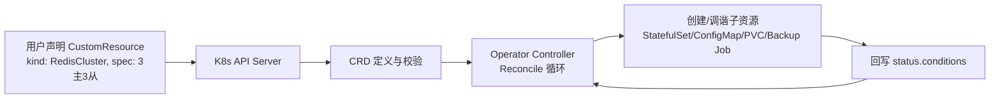

# Helm 与 Operator：云原生交付与扩展

> K8s 之上两大工程话题：**Helm**（把复杂应用打包成可重复安装的"安装包"）与 **Operator**（用自定义控制器把"运维知识代码化"）。前者解决**交付**，后者解决**有状态应用的生命周期管理**。与「[Kubernetes核心](Kubernetes核心.md)」「[GitOps](GitOps.md)」「[基础知识/CI-CD/08-云原生CI-CD与GitOps工具](../基础知识/CI-CD/08-云原生CI-CD与GitOps工具.md)」互链。

## 一、为什么需要 Helm

裸 YAML 的三大痛点：

1. **重复**：一个服务 Deployment+Service+ConfigMap+HPA 动辄 4-6 个文件，50 个服务就是 200+ 文件。
2. **环境差异**：dev/test/prod 的副本数、资源限制、镜像 tag 不同，复制粘贴会漂移。
3. **版本与回滚**：改了哪版、怎么回滚没有记录。

**Helm 的答案**：模板 + 参数 = 安装包（Chart），一次定义到处安装。

---

## 二、Helm 核心概念

| 概念 | 说明 |
|------|------|
| **Chart** | 应用打包单元：模板 + values + 元数据，目录结构 |
| **Release** | Chart 的一次安装实例（同名同 Chart 可装多份） |
| **values.yaml** | 默认参数；`-f` / `--set` 覆盖 |
| **模板** | Go template，`{{ .Values.replicas }}` |
| **仓库** | Chart 托管（OCI Registry / Helm 仓库） |

```text
mychart/
├── Chart.yaml          # 元数据（name/version/appVersion）
├── values.yaml         # 默认参数
├── templates/
│   ├── deployment.yaml # Go template 模板
│   ├── service.yaml
│   └── _helpers.tpl    # 公共命名函数
└── charts/             # 子依赖 Chart
```

```yaml
# templates/deployment.yaml（模板节选）
apiVersion: apps/v1
kind: Deployment
metadata:
  name: {{ include "mychart.fullname" . }}
spec:
  replicas: {{ .Values.replicas }}
  template:
    spec:
      containers:
        - name: app
          image: "{{ .Values.image.repository }}:{{ .Values.image.tag }}"
          resources:
            requests:
              cpu: {{ .Values.resources.requests.cpu }}
```

```bash
helm install myapp ./mychart -f values-prod.yaml   # 安装
helm upgrade myapp ./mychart --set image.tag=v2    # 升级（可回滚）
helm rollback myapp 1                               # 回滚到 rev 1
helm uninstall myapp
```

> 口诀：**"Chart 是源码，values 是配置，Release 是运行实例；upgrade 留痕，rollback 兜底。"**

---

## 三、Helm 工程实践

| 实践 | 说明 |
|------|------|
| 多环境 values | `values-dev.yaml / values-prod.yaml`，公共放默认，差异放环境文件 |
| 版本管理 | Chart.yaml `version` 与应用 `appVersion` 分开；Chart 入库（ArtifactHub/OCI） |
| 命名空间隔离 | 每个环境独立 namespace，Release 名加环境前缀 |
| 配置脱敏 | 密钥走 `values` 的 `secret` 引用或 External Secrets，**不落 Chart 仓库** |
| Hook 与校验 | `helm lint`、`helm template` 渲染检查、安装前 hook 做依赖检查 |
| CI 集成 | 流水线里 `helm package + helm push`，CD 里 `helm upgrade --install`（配合 GitOps） |

> ⚠️ 常见坑：① `helm upgrade` 默认不删旧资源，删字段要 `--set` 显式处理或用 `helm diff`；② 模板里写死环境导致 Chart 不可复用；③ 密钥明文进 values 仓库。

---

## 四、Operator：把运维逻辑代码化

### 4.1 什么是 Operator

- K8s 是**声明式**的：你声明期望状态（Spec），controller 负责调到期望状态（Status）。
- K8s 内置控制器管 Deployment/StatefulSet 等；但**有状态应用**（数据库/消息队列/缓存）的运维知识（备份、扩缩容、故障切换、升级）K8s 不知道。
- **Operator = CRD（自定义资源）+ Controller（业务控制器）**：把"人类运维专家的知识"变成代码，持续调谐。

### 4.2 核心机制



```yaml
# 用户声明（CR 实例）
apiVersion: redis.example.com/v1
kind: RedisCluster
metadata:
  name: cache-prod
spec:
  replicas: 3
  slavesPerMaster: 1
  storage: 100Gi
  backup:
    schedule: "0 2 * * *"
```

```go
// Controller 核心：Reconcile 循环（简化示意）
func (r *RedisClusterReconciler) Reconcile(ctx context.Context, req ctrl.Request) (ctrl.Result, error) {
    cr := &redisv1.RedisCluster{}
    r.Get(ctx, req.NamespacedName, cr)          // 1. 读期望状态
    // 2. 比对现状：StatefulSet 副本数对吗？PVC 存在吗？备份 Job 建了吗？
    // 3. 差异部分 Create/Update/Delete 调谐
    // 4. 回写 status：ready replicas、phase、last backup time
    return ctrl.Result{RequeueAfter: 30 * time.Second}, nil
}
```

- **Controller-runtime（operator-sdk / Kubebuilder 生成）**：脚手架 + Webhook（CRD 校验/默认值）+ 多版本 CRD。
- **调谐循环**：事件触发 + 定时 Requeue，幂等执行，保证"Spec 一致即成功"。
- **Level-Triggered（状态对齐）vs Edge-Triggered（事件流）**：Operator 是前者，掉了事件也不怕——定期重新比对。

### 4.3 Operator 能干什么（典型能力清单）

| 能力 | 例子 |
|------|------|
| 自动化运维 | 扩缩容（改 CR 副本数自动调 StatefulSet）、重启、滚动升级 |
| 备份恢复 | 定时备份 Job + 对象存储 + 一键恢复 CR |
| 故障自愈 | 检测主节点故障 → 自动选主/重建副本 → 更新 Status |
| 版本升级 | 灰度升级引擎版本（先备后主） |
| 安全加固 | 自动轮换证书/密码 |
| 资源管理 | 根据压力自动扩缩副本（与 HPA 互补） |

> 口诀：**"Helm 管安装，Operator 管运行；CR 是愿望，Reconcile 是行动。"**

---

## 五、Helm vs Operator 怎么选

| 维度 | Helm | Operator |
|------|------|----------|
| 解决什么 | 安装/升级/回滚的**打包交付** | 长期**生命周期运维**（备份/自愈/升级） |
| 状态管理 | 无状态感知，不管运行后的事 | 持续调谐期望状态 |
| 复杂度 | 低，模板即学即用 | 高，需写 Go/控制器 + CRD |
| 适用 | 无状态服务、标准中间件的部署 | 数据库/消息/缓存等**有状态关键应用** |
| 组合用法 | Operator 的安装本身常用 Helm 分发 | Helm chart 里嵌 CR 声明触发 Operator 管理 |

- **经验法则**：先 Helm 解决"能装、能升、能回滚"；当应用需要"备份/自愈/升级策略"且是有状态关键依赖时，再上 Operator。
- 成熟 Operator 生态：etcd-operator、ZooKeeper-operator（Kafka 用 Strimzi）、MySQL 用 Percona Operator / Vitess、Redis 用 redis-operator、Prometheus 用 prometheus-operator（CRD 是 Prometheus/ServiceMonitor）。

---

## 六、与相关主题的关联

- 「[Kubernetes核心](Kubernetes核心.md)」：控制器调谐循环、CRD、StatefulSet 的机制底座。
- 「[GitOps](GitOps.md)」：Helm 是 Argo CD/Flux 的常用交付载体（Chart 即代码）。
- 「[基础知识/CI-CD/08-云原生CI-CD与GitOps工具](../基础知识/CI-CD/08-云原生CI-CD与GitOps工具.md)」：Helm 在流水线中的打包与发布。
- 「[SRE与稳定性工程/05-变更管理与渐进式发布](../SRE与稳定性工程/05-变更管理与渐进式发布.md)」：Operator 化后的升级策略与发布纪律。

---

## 面试高频问题（12+ 条）

1. **Helm 是什么？解决什么问题？** K8s 应用包管理：模板+参数打包 Chart，解决 YAML 重复、环境差异、版本回滚。
2. **Chart / Release / values 的关系？** Chart 是模板定义，values 是参数，Release 是安装实例（同 Chart 可多 Release）。
3. **helm upgrade 和 helm install 区别？** install 新建 Release，upgrade 原地升级（可 `--atomic` 失败回滚）。
4. **回滚怎么做？** `helm rollback <release> <revision>`，升级历史保存在集群 secret 里。
5. **Helm 模板里怎么处理环境差异？** 多 values 文件 + 参数覆盖，公共逻辑放 `_helpers.tpl`。
6. **Operator 和 Helm 的区别？** Helm 管交付（装/升/回滚），Operator 管运行（备份/自愈/升级策略）。
7. **CRD 是什么？** Custom Resource Definition，扩展 K8s API 的自定义资源类型，带 OpenAPI 校验。
8. **Reconcile 循环是什么？** Controller 持续比对期望状态（Spec）与实际状态，差异调谐、幂等执行，定期 Requeue。
9. **为什么有状态应用需要 Operator？** 状态、备份、故障切换等运维知识内建于 K8s 之外，Operator 把它代码化、声明化。
10. **Operator 如何实现自动备份？** 定时 Requeue 检查备份计划 CR，到点创建 Backup Job（CronJob 或直接建 Job）。
11. **调谐循环丢了事件怎么办？** 没关系：RequeueAfter 定期全量比对（Level-Triggered），最终一致。
12. **Webhook 在 Operator 里干嘛？** ValidatingWebhook 校验 CR 参数、MutatingWebhook 填默认值，保证进集群的数据合规。
13. **什么时候不该用 Operator？** 无状态服务、标准 K8s 工作负载（Deployment 就够）、团队无 Go/控制器经验。
14. **prometheus-operator 是啥？** 用 CRD（Prometheus/ServiceMonitor/Alertmanager）声明监控目标，Controller 生成配置并管理实例。
15. **Helm 密钥怎么管理？** values 不存密钥，用 External Secrets/Sealed Secrets/Vault 注入，仓库保持干净。

---

---

## 七、Helm 模板高级

Helm 模板本质是 **Go text/template + Sprig 函数库**，难点在「控制流 + 命名模板复用 + 渲染上下文」。

### 7.1 流程控制

```yaml
# 条件：values 里 enabled=false 就不渲染该块
{{- if .Values.ingress.enabled }}
apiVersion: networking.k8s.io/v1
kind: Ingress
metadata:
  name: {{ .Release.Name }}-ingress
spec:
  rules:
  {{- range .Values.ingress.hosts }}
  - host: {{ .host }}
    http:
      paths:
      {{- range .paths }}
      - path: {{ . }}
        pathType: Prefix
        backend:
          service:
            name: {{ $.Release.Name }}
            port: {number: 80}
      {{- end }}
  {{- end }}
{{- end }}
```

要点：
- `{{- ... -}}` 的 `-` 用于**裁剪首尾空白**（防止渲染出空行破坏 YAML）。这是 Helm 模板最常见的「幽灵空行」来源。
- `range` 内用 `$` 引用外层上下文（如 `$.Release.Name`），`range` 内部 `.` 被重载为当前迭代项。
- `with` 可缩小 `.` 的作用域：`{{- with .Values.resources }}` 之后 `.` 指向 resources 子树。

### 7.2 命名模板与 `_helpers.tpl`

```yaml
# _helpers.tpl —— 公共函数，供所有模板 include
{{- define "mychart.labels" -}}
app.kubernetes.io/name: {{ .Chart.Name }}
app.kubernetes.io/instance: {{ .Release.Name }}
app.kubernetes.io/version: {{ .Chart.AppVersion | quote }}
helm.sh/chart: {{ .Chart.Name }}-{{ .Chart.Version }}
{{- end -}}

# 在 deployment.yaml 使用
metadata:
  labels:
    {{- include "mychart.labels" . | nindent 4 }}
```

- `include` vs `template`：`include` 可以管道处理（如 `| nindent 4` 缩进），`template` 不行；**生产一律用 `include`**。
- 命名约定：模板名加 chart 前缀（`mychart.xxx`），避免多个子 Chart 重名冲突。

### 7.3 进阶：lookup / required / 管道

```yaml
# required：缺值直接渲染失败（Fail Fast，比运行时报错友好）
image: "{{ required "image.repository is required" .Values.image.repository }}:{{ .Values.image.tag }}"

# lookup：在渲染期查集群已有资源（谨慎用，破坏幂等、且需要对应 RBAC）
{{- $cm := lookup "v1" "ConfigMap" .Release.Namespace "shared-config" }}
{{- if $cm }}
data:
  inherited: {{ $cm.data.key }}
{{- end }}
```

> ⚠️ `lookup` 在 `--dry-run` / `helm template` 本地渲染时拿不到集群数据（返回空），会造成「本地渲染正常、集群里不一致」——尽量不用，或仅作可选增强。

---

## 八、库 Chart、子 Chart 依赖与生命周期

### 8.1 子 Chart 与全局值

- `charts/` 目录下放被依赖的子 Chart，或用 `dependencies` 从 OCI/仓库拉取。
- 子 Chart **默认读不到父 Chart 的 `values.yaml`**，只能读到自己的 `values` 与父 Chart 通过 `xxx-chart.key` 显式传入的值。
- 全局值用 `global:` 键：父 Chart 设 `.Values.global.region`，所有子 Chart 都能读到。

```yaml
# 父 Chart values.yaml
global:
  imageRegistry: registry.example.com
subchart-a:
  replicaCount: 2
```

### 8.2 库 Chart（type: library）

```yaml
# Chart.yaml
type: library
```
库 Chart 不生成任何资源，只提供可被 `include` 的命名模板——适合把公司统一的 label/annotation/sidecar 注入逻辑沉淀成共享库，所有业务 Chart 依赖它。

### 8.3 生命周期钩子（Hooks）

| Hook | 触发时机 |
|------|----------|
| pre-install / post-install | 安装前后 |
| pre-upgrade / post-upgrade | 升级前后 |
| pre-delete / post-delete | 删除前后 |
| pre-rollback / post-rollback | 回滚前后 |
| test | `helm test` 时 |

```yaml
# 用 Hook 在升级前做数据库迁移
apiVersion: batch/v1
kind: Job
metadata:
  name: "{{ .Release.Name }}-migrate"
  annotations:
    "helm.sh/hook": pre-upgrade
    "helm.sh/hook-weight": "-5"        # 负数先执行
    "helm.sh/hook-delete-policy": hook-succeeded
```

---

## 九、Helm 测试与 CI 集成

| 工具 | 用途 |
|------|------|
| `helm lint` | 静态检查（Chart.yaml 结构、模板块） |
| `helm template --debug` | 渲染并检查输出 YAML 合法性 |
| `helm unittest` | 对模板写单测（断言渲染结果含某字段） |
| `chart-testing (ct)` | 校验改动 Chart 的 lint + 安装到 kind 集群验证 |
| `helm diff` | 升级前对比「将产生什么变更」，避免误删/误改 |

```bash
# CI 中典型流水线
helm dependency build ./mychart        # 拉子 Chart
helm lint ./mychart
helm template ./mychart | kubeconform -strict -o std   # 校验 K8s schema
helm unittest ./mychart                  # 模板单测
```

> 经验：把 `helm template | kubeconform` 放进 PR 检查，能在合并前挡掉 80% 的 YAML/字段错误。

---

## 十、Operator 深入：Kubebuilder 工程化

### 10.1 项目结构与关键文件

```
my-operator/
├── api/v1/
│   ├── rediscluster_types.go     # CRD Go 类型（Spec/Status）+ kubebuilder 注解生成 CRD
│   └── groupversion_info.go      # GroupVersion 注册
├── controllers/
│   └── rediscluster_controller.go# Reconcile 实现
├── config/
│   ├── crd/                      # 生成的 CRD YAML
│   ├── manager/                  # 部署 controller 的 Deployment
│   ├── rbac/                     # 自动生成的 Role/RoleBinding
│   └── webhook/                  # 校验/默认值 webhook
├── main.go                       # manager 启动入口
└── Makefile                     # make install / run / deploy
```

### 10.2 Reconcile 关键细节

```go
func (r *RedisClusterReconciler) Reconcile(ctx context.Context, req ctrl.Request) (ctrl.Result, error) {
    cr := &redisv1.RedisCluster{}
    if err := r.Get(ctx, req.NamespacedName, cr); err != nil {
        if apierrors.IsNotFound(err) {
            return ctrl.Result{}, nil // 已删除，结束
        }
        return ctrl.Result{}, err
    }

    // 删除中：处理 Finalizer（清理外部资源，如云盘/备份）
    if !cr.DeletionTimestamp.IsZero() {
        if controllerutil.ContainsFinalizer(cr, redisFinalizer) {
            if err := r.cleanupExternal(ctx, cr); err != nil {
                return ctrl.Result{}, err
            }
            controllerutil.RemoveFinalizer(cr, redisFinalizer)
            r.Update(ctx, cr)
        }
        return ctrl.Result{}, nil
    }

    // 确保 Finalizer 已挂上（保护关键资源不被误删）
    if !controllerutil.ContainsFinalizer(cr, redisFinalizer) {
        controllerutil.AddFinalizer(cr, redisFinalizer)
        r.Update(ctx, cr)
        return ctrl.Result{Requeue: true}, nil
    }

    // 调谐子资源：StatefulSet / Service / PVC / 备份 Job
    if err := r.reconcileStatefulSet(ctx, cr); err != nil {
        return ctrl.Result{}, err
    }

    // 回写 Status 子资源（需 CRD 声明 status subresource）
    cr.Status.ReadyReplicas = ready
    cr.Status.Phase = "Running"
    r.Status().Update(ctx, cr)

    // 周期重对账（兜底漏掉的事件）
    return ctrl.Result{RequeueAfter: 30 * time.Second}, nil
}
```

要点：
- **Finalizer**：保护「有外部副作用」的 CR（如创建了云盘/数据库实例）。删除时先跑清理逻辑再真正删——避免孤儿资源。
- **OwnerReference**：让 StatefulSet/PVC 自动归属 CR，CR 删除时级联删除；也能让垃圾回收正确工作。
- **Status 子资源**：`status` 与 `spec` 分开，避免状态变更触发无限 Reconcile（watch spec 变化即可）。
- **幂等**：Reconcile 可任意次重跑，结果一致——所有操作前先 Get 再 Create-or-Update。

### 10.3 多版本 CRD 与转换

- 用 `apiextensions.k8s.io/v1` 的 `versions` 声明多个版本（如 v1alpha1 → v1），配 `conversion: strategy: Webhook` 做版本间字段转换。
- 升级 Operator 时先「双版本并存」一段，验证老版本 CR 能正常被新控制器接管，再下线老版本。

---

## 十一、Operator 测试与质量

| 层级 | 工具 | 说明 |
|------|------|------|
| 单元测试 | `envtest` | 起一个仅 etcd+API Server 的迷你控制面，跑 Reconcile，无需真实 K8s |
| 集成测试 | kind / Kubebuilder 的 `test` | 在真实-ish 集群验证端到端 |
| 模糊测试 | go-fuzz | 校验 CR 字段边界 |

```go
// envtest 示例（关键：用 controller-runtime 的 envtest 包）
cfg, _ := testEnv.Start()            // 拉起临时 API Server
k8sClient, _ := client.New(cfg, ...)
mgr := ctrl.NewManager(cfg, ...)
go mgr.Start(ctx)

// 创建 CR → 断言 StatefulSet 被创建 → 断言 status 更新
```

> ⚠️ 常见坑：① 忘记给 CRD `status` 子资源导致 Status 写不进去；② RBAC 漏配（controller 起不来，日志里 `forbidden`）；③ Reconcile 里打日志过多拖慢性能；④ 没有 `RequeueAfter` 兜底，靠事件触发漏掉状态变化。

---

## 十二、Helm + Operator 组合生产范式

典型 Middleware 交付链路：
```
Helm Chart（分发 Operator 本体 + 默认 CR）
   └── 安装 operator Deployment + CRD
       └── 用户 apply 一个 CR（如 RedisCluster）
           └── Operator 持续调谐出 StatefulSet/Service/PVC/备份
               └── GitOps（ArgoCD）把 Helm Release 与 CR 一起纳入 Git 管理
```
即：**Helm 负责「装好 Operator + 给初始 CR」，Operator 负责「长期把应用运维好」，GitOps 负责「整套声明都在 Git 里可追溯」**——三层各司其职。

---

## 十三、常见坑与排障速查

| 现象 | 根因 | 处理 |
|------|------|------|
| 模板渲染报 `nil pointer` | `.Values.x.y` 未定义就取值 | 用 `default` / `required` / 先 `if` 判断 |
| 升级后旧资源没删 | `helm upgrade` 默认不删字段导致的孤儿 | 用 `helm diff` 预演 + `--history-max` 控制 |
| CRD 升级冲突 | 老 CRD 与新版本字段不兼容 | 先双版本并存，再迁移 |
| Operator 不调谐 | RBAC 缺、controller 没 watch CR | 看 controller 日志 `unable to watch` |
| 状态永远不 Ready | readinessProbe 指向错端口 | 对齐 CR 暴露端口与探针 |
| 删除 CR 卡 Terminating | Finalizer 没清掉或清理逻辑报错 | 看 controller 日志，手动清 finalizer 仅作最后手段 |

---

## 十四、速记口诀

> 口诀：**「Helm 是包、values 是参、Release 是实例；include 复用、required 兜底、hook 做迁移。Operator 是 CR+控制器，Reconcile 比对 Spec 与 Status；Finalizer 防误删、OwnerRef 管级联、envtest 测调谐。」**

[← 返回云原生索引](README.md)
