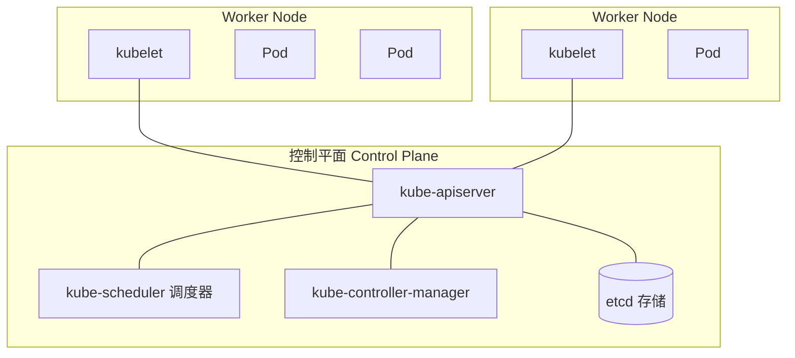
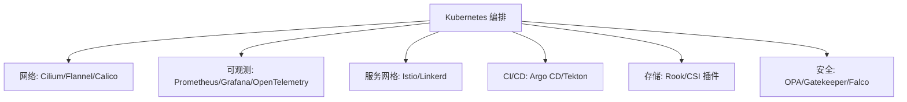
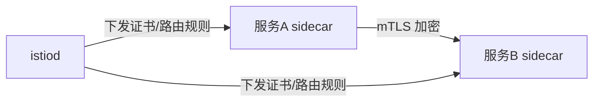
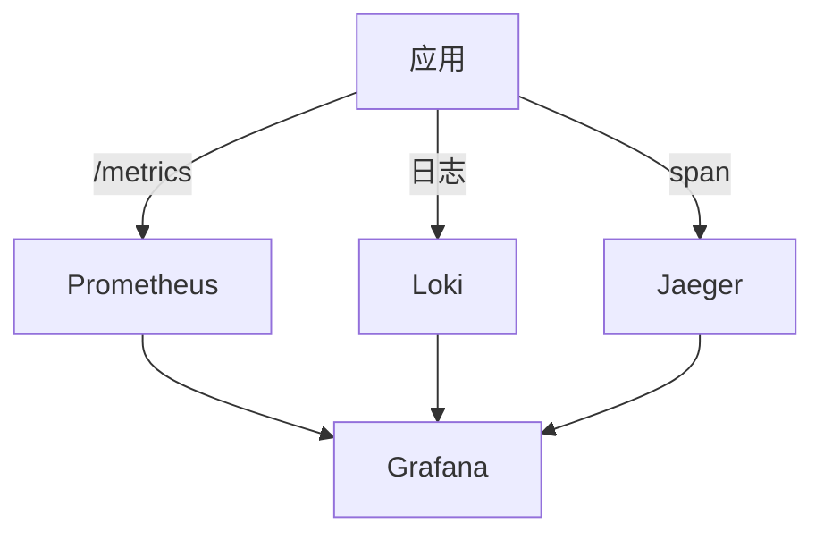
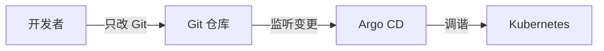
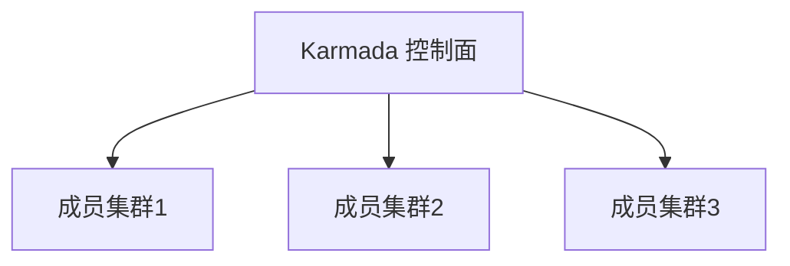
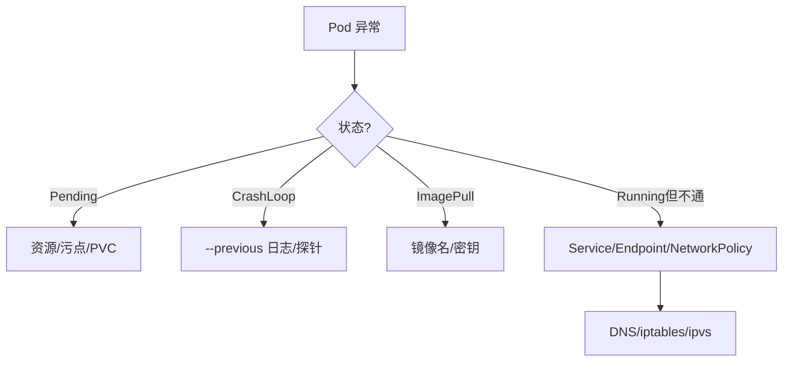

# Kubernetes 架构

> 本页以架构示意图为主（截图来自学习笔记），下方三张图分别展示 Kubernetes 的整体架构与核心组件，未对图片内容做文字转录。如需细节请直接查看原图。


## 核心架构（Master / Node / etcd）

Kubernetes 采用典型的主从（控制面 + 数据面）架构：



### 控制平面组件

| 组件 | 职责 |
|---|---|
| kube-apiserver | 集群唯一入口，所有增删改查与鉴权都经它，是 RESTful 与 etcd 之间的网关 |
| etcd | 分布式键值存储，保存集群全部状态（唯一真相源），需奇数节点保证仲裁 |
| kube-scheduler | 监听未调度 Pod，按资源、亲和性、污点等选最优 Node |
| kube-controller-manager | 运行各类控制器（ReplicaSet、Node、Endpoint 等），驱动实际状态趋近期望状态 |
| cloud-controller-manager | 对接云厂商（负载均衡、节点生命周期等） |

### 工作节点组件

| 组件 | 职责 |
|---|---|
| kubelet | 每个 Node 上的 Agent，管理 Pod 生命周期、上报状态 |
| kube-proxy | 维护节点网络规则（iptables/IPVS），实现 Service 的负载与转发 |
| 容器运行时 | containerd / CRI-O / Docker（经 CRI 接入） |

核心理念：**声明式 API + 调谐循环（Reconcile Loop）**。用户声明"期望状态"，控制器持续将"实际状态"纠正为期望状态。

## 核心对象

### Pod

最小调度单元，包含一个或多个共享网络/存储的容器。通常一个 Pod 跑一个主容器。

```yaml
apiVersion: v1
kind: Pod
metadata:
  name: nginx
  labels: { app: nginx }
spec:
  containers:
    - name: nginx
      image: nginx:1.25
      ports:
        - containerPort: 80
```

### Deployment

管理 Pod 副本与滚动更新的无状态工作负载控制器。

```yaml
apiVersion: apps/v1
kind: Deployment
metadata:
  name: nginx-deploy
spec:
  replicas: 3
  selector:
    matchLabels: { app: nginx }
  template:
    metadata:
      labels: { app: nginx }
    spec:
      containers:
        - name: nginx
          image: nginx:1.25
          resources:
            requests: { cpu: "100m", memory: "128Mi" }
            limits:   { cpu: "500m", memory: "256Mi" }
```

### Service

为一组 Pod 提供稳定虚拟 IP 与负载均衡，解决 Pod IP 易变问题。

```yaml
apiVersion: v1
kind: Service
metadata:
  name: nginx-svc
spec:
  selector: { app: nginx }
  ports:
    - port: 80
      targetPort: 80
  type: ClusterIP   # 还有 NodePort / LoadBalancer
```

### Ingress

管理外部 HTTP/HTTPS 路由到 Service，通常配合 Ingress Controller（如 nginx、Traefik）。

```yaml
apiVersion: networking.k8s.io/v1
kind: Ingress
metadata:
  name: web-ingress
spec:
  rules:
    - host: example.com
      http:
        paths:
          - path: /
            pathType: Prefix
            backend:
              service:
                name: nginx-svc
                port:
                  number: 80
```

### ConfigMap / Secret

ConfigMap 存非敏感配置，Secret 存敏感数据（base64，建议结合加密 provider）。

```yaml
apiVersion: v1
kind: ConfigMap
metadata:
  name: app-config
data:
  LOG_LEVEL: "INFO"
  app.properties: |
    server.port=8080
---
apiVersion: v1
kind: Secret
metadata:
  name: app-secret
type: Opaque
stringData:
  DB_PASSWORD: "s3cr3t"
```

在 Pod 中引用：

```yaml
env:
  - name: LOG_LEVEL
    valueFrom:
      configMapKeyRef: { name: app-config, key: LOG_LEVEL }
  - name: DB_PASSWORD
    valueFrom:
      secretKeyRef: { name: app-secret, key: DB_PASSWORD }
```

### PV 与 PVC

PersistentVolume（PV）是集群存储资源，PersistentVolumeClaim（PVC）是 Pod 对存储的请求。

```yaml
apiVersion: v1
kind: PersistentVolume
metadata:
  name: pv-nfs
spec:
  capacity: { storage: 10Gi }
  accessModes: [ReadWriteOnce]
  nfs:
    server: 10.0.0.10
    path: /exports/data
---
apiVersion: v1
kind: PersistentVolumeClaim
metadata:
  name: pvc-nfs
spec:
  accessModes: [ReadWriteOnce]
  resources:
    requests: { storage: 5Gi }
```

## 工作负载类型

| 类型 | 适用场景 | 特点 |
|---|---|---|
| Deployment | 无状态服务 | 滚动更新、回滚、副本 |
| StatefulSet | 有状态（DB、MQ） | 稳定网络标识、有序部署/扩缩 |
| DaemonSet | 每个节点都跑（日志/监控 Agent） | 节点级守护 |
| Job / CronJob | 一次性 / 定时任务 | 完成即退出 / 按调度周期 |

## 网络模型与 Service 发现

K8s 网络三约定：
1. 每个 Pod 有独立 IP，Pod 间无需 NAT 直连；
2. Node 上的 Pod 可与所有 Node 上的 Pod 通信；
3. 容器内看到的 IP 与外部访问一致（扁平网络）。

Service 发现支持：
- **环境变量**：Pod 启动时注入 `SVC_PORT_xxx` 变量（依赖启动顺序）；
- **DNS**：CoreDNS 提供 `<service>.<namespace>.svc.cluster.local`，推荐方式。

```bash
kubectl run client --rm -it --image=busybox -- nslookup nginx-svc.default.svc.cluster.local
```

kube-proxy 通过 iptables 或 IPVS 把 ClusterIP 转发到后端 Pod（endpoint 由 Endpoints 对象维护）。

## 调度与亲和性

Scheduler 经历：预选（Filter，淘汰不满足节点）→ 优选（Score，打分选最优）。

### 常见调度约束

```yaml
spec:
  affinity:
    nodeAffinity:          # 节点亲和：倾向带 gpu 标签的节点
      preferredDuringSchedulingIgnoredDuringExecution:
        - weight: 1
          preference:
            matchExpressions:
              - { key: gpu, operator: In, values: ["true"] }
    podAntiAffinity:       # Pod 反亲和：尽量不与该服务其他实例同节点
      requiredDuringSchedulingIgnoredDuringExecution:
        - labelSelector:
            matchExpressions:
              - { key: app, operator: In, values: ["nginx"] }
          topologyKey: kubernetes.io/hostname
  tolerations:             # 容忍污点：允许调度到有专用污点的节点
    - key: "dedicated"
      operator: "Equal"
      value: "high-cpu"
      effect: "NoSchedule"
```

## HPA 弹性伸缩

Horizontal Pod Autoscaler 基于 CPU/内存或自定义指标自动调整副本数（需 metrics-server）。

```yaml
apiVersion: autoscaling/v2
kind: HorizontalPodAutoscaler
metadata:
  name: nginx-hpa
spec:
  scaleTargetRef:
    apiVersion: apps/v1
    kind: Deployment
    name: nginx-deploy
  minReplicas: 2
  maxReplicas: 10
  metrics:
    - type: Resource
      resource:
        name: cpu
        target:
          type: Utilization
          averageUtilization: 70
```

## 滚动更新与回滚

Deployment 默认 `RollingUpdate`，按 maxSurge/maxUnavailable 平滑替换。

```bash
kubectl set image deployment/nginx-deploy nginx=nginx:1.26
kubectl rollout status deployment/nginx-deploy
# 出错时回滚
kubectl rollout undo deployment/nginx-deploy
kubectl rollout undo deployment/nginx-deploy --to-revision=2
kubectl rollout history deployment/nginx-deploy
```

## Helm

Helm 是 K8s 的包管理器，用 Chart（模板 + values）管理复杂应用部署。

```bash
helm repo add bitnami https://charts.bitnami.com/bitnami
helm install my-nginx bitnami/nginx -n demo --set replicaCount=3
helm upgrade my-nginx bitnami/nginx --set replicaCount=5
helm rollback my-nginx 1
helm uninstall my-nginx -n demo
```

Chart 结构：

```
mychart/
├── Chart.yaml          # 名称、版本、依赖
├── values.yaml         # 默认参数
├── templates/          # 受控的 yaml 模板
│   ├── deployment.yaml
│   └── service.yaml
└── charts/             # 子 Chart
```

模板片段示例：

```yaml
# templates/deployment.yaml
apiVersion: apps/v1
kind: Deployment
metadata:
  name: {{ .Release.Name }}-app
spec:
  replicas: {{ .Values.replicaCount }}
  template:
    spec:
      containers:
        - name: app
          image: "{{ .Values.image.repository }}:{{ .Values.image.tag }}"
```

## 运维排查命令

```bash
kubectl get pods -A                     # 查看所有命名空间 Pod
kubectl describe pod <pod>              # 查看事件/调度失败原因
kubectl logs <pod> [-c <container>]     # 查看日志
kubectl logs <pod> --previous           # 崩溃容器上一轮日志
kubectl exec -it <pod> -- sh            # 进入容器
kubectl get events --sort-by=.lastTimestamp
kubectl top nodes / top pods            # 资源使用（需 metrics-server）
kubectl port-forward svc/nginx-svc 8080:80  # 本地端口转发调试
kubectl apply -f xxx.yaml --dry-run=server  # 服务端校验
kubectl get all -n demo                 # 查看命名空间全部资源
```

常见故障定位思路：
- Pod `Pending` → 资源不足/污点/PVC 未绑定；
- `CrashLoopBackOff` → 容器启动即退出，看 `--previous` 日志；
- `ImagePullBackOff` → 镜像名错/未授权；
- Service 不通 → 查 endpoints 是否就绪、selector 是否匹配。

## 与云原生全景（CNCF）关系

Kubernetes 是 CNCF（云原生计算基金会）的**毕业级（Graduated）**核心项目，也是云原生全景图的基石。围绕它形成了庞大的生态：



CNCF 全景图分层（示意）：
- **Provisioning（供应）**：Terraform、镜像构建工具；
- **Runtime（运行时）**：containerd、CRI-O；
- **Orchestration（编排）**：Kubernetes；
- **App Definition（应用定义）**：Helm、Operator 框架；
- **Observability（可观测）**：监控、日志、追踪；
- **Platform（平台）**：托管 K8s（EKS/GKE/AKS）。

> 学习建议：先掌握本文核心对象与命令，再深入 Operator、服务网格、GitOps 等进阶主题。

## Operator 与 CRD 开发（kubebuilder 思路）

Operator = 自定义资源（CRD）+ 自定义控制器，把运维知识编码进 K8s。kubebuilder 流程：

```bash
kubebuilder init --domain shop.com
kubebuilder create api --group apps --version v1 --kind MysqlCluster
# 生成 Reconciler，实现调谐逻辑
make manifests && make install   # 安装 CRD 到集群
make run / make deploy           # 运行控制器
```

核心思想：Reconcile 循环把实际状态趋近于 CR 声明的期望状态。

```yaml
apiVersion: apps.shop.com/v1
kind: MysqlCluster
metadata:
  name: mydb
spec:
  replicas: 3
  version: "8.0"
  storage: 20Gi
```

```java
// Reconcile 伪代码（Go 实为 controller-runtime，此处用 Java 示意思想）
public Result reconcile(Request req) {
    MysqlCluster mc = client.get(req);
    if (mc == null) return done();
    StatefulSet desired = buildStatefulSet(mc);   // 由 spec 推导期望资源
    StatefulSet actual = client.getStatefulSet(req);
    if (!equals(desired, actual)) client.apply(desired); // 纠正偏差
    return requeue(30, SECONDS);
}
```

## Service Mesh（Istio 流量治理 / mTLS）

Istio 通过 sidecar（Envoy）接管服务间流量，业务零改造获得治理与加密。

```yaml
# 流量切分：将 90% 流量给 v1，10% 给 v2（金丝雀发布）
apiVersion: networking.istio.io/v1beta1
kind: VirtualService
metadata: { name: reviews }
spec:
  hosts: [reviews]
  http:
    - route:
        - destination: { host: reviews, subset: v1 }
          weight: 90
        - destination: { host: reviews, subset: v2 }
          weight: 10
```

mTLS（双向 TLS）自动加密东西向流量：

```yaml
apiVersion: security.istio.io/v1beta1
kind: PeerAuthentication
metadata: { name: default }
spec:
  mtls: { mode: STRICT }   # 全网格强制 mTLS
```



## 可观测性（Prometheus + Grafana + Loki + Jaeger 三位一体）

- **Metrics（Prometheus）**：拉取指标，PromQL 查询，Grafana 可视化；
- **Logs（Loki）**：轻量日志，按标签索引，与 Grafana 同源；
- **Traces（Jaeger）**：分布式追踪，定位跨服务慢调用。

```yaml
# ServiceMonitor 让 Prometheus 自动发现并抓取应用指标
apiVersion: monitoring.coreos.com/v1
kind: ServiceMonitor
metadata: { name: app-mon }
spec:
  selector: { matchLabels: { app: myapp } }
  endpoints:
    - port: http-metrics
      interval: 30s
```



关键：统一 `trace_id` 贯穿三者，Grafana 中可从图表下钻到日志再到调用链。

## GitOps（Argo CD / Flux）

Git 作为唯一事实源，集群状态由控制器自动与 Git 同步，告别手工 `kubectl apply`。

```yaml
# Argo CD Application：声明集群应匹配哪个 Git 仓库路径
apiVersion: argoproj.io/v1alpha1
kind: Application
metadata: { name: demo-app }
spec:
  source:
    repoURL: https://git.shop.com/manifests.git
    path: overlays/prod
  destination:
    server: https://kubernetes.default.svc
    namespace: prod
  syncPolicy:
    automated: { prune: true, selfHeal: true }  # 自动同步 + 自愈
```



优势：审计（Git 历史）、回滚（`git revert`）、多环境一致、权限收敛（集群无需给开发者写权限）。

## 网络方案（CNI：Calico / Cilium eBPF）

- **Calico**：基于 iptables/BPF 的成熟方案，支持 NetworkPolicy、BGP 路由，适合传统网络；
- **Cilium**：基于 eBPF，内核层处理网络/安全/可观测，性能高、支持 L3-L7 策略与 Hubble 可视化。

```yaml
# CiliumNetworkPolicy：按标签做 L3+L4 访问控制
apiVersion: cilium.io/v2
kind: CiliumNetworkPolicy
metadata: { name: api-allow }
spec:
  endpointSelector: { matchLabels: { app: api } }
  ingress:
    - fromEndpoints:
        - matchLabels: { app: frontend }
      toPorts:
        - ports: [{ port: "8080", protocol: TCP }]
```

## 多集群与 Karmada

单集群有规模/容灾上限，多集群用于异地容灾、就近接入、故障隔离。Karmada 提供**跨集群统一编排**：

```yaml
# PropagationPolicy：把工作负载分发到多个成员集群
apiVersion: policy.karmada.io/v1alpha1
kind: PropagationPolicy
metadata: { name: nginx-prop }
spec:
  resourceSelectors:
    - { apiVersion: apps/v1, kind: Deployment, name: nginx }
  placement:
    clusterAffinity:
      clusterNames: [member1, member2]
```



## 安全（RBAC / NetworkPolicy / 准入控制）

RBAC：将权限绑定给 ServiceAccount/用户。

```yaml
apiVersion: rbac.authorization.k8s.io/v1
kind: Role
metadata: { namespace: prod, name: pod-reader }
rules:
  - apiGroups: [""]
    resources: [pods, pods/log]
    verbs: [get, list, watch]
---
kind: RoleBinding
metadata: { namespace: prod, name: read-pods }
subjects:
  - kind: ServiceAccount
    name: deployer
    namespace: prod
roleRef: { kind: Role, name: pod-reader }
```

NetworkPolicy：限制 Pod 间流量（默认全通，需显式声明）。

```yaml
apiVersion: networking.k8s.io/v1
kind: NetworkPolicy
metadata: { name: deny-all }
spec:
  podSelector: {}
  policyTypes: [Ingress, Egress]   # 不写规则 = 拒绝所有
```

准入控制：用 OPA Gatekeeper / Kyverno 以策略拒绝不合规资源（如禁止特权容器、强制资源限制）。

## K8s 排障实战手册

通用排查顺序：**Pod → 控制器 → 网络 → 存储 → 节点**。



高频命令与含义：

```bash
kubectl describe pod <p>            # 看 Events：调度失败/拉镜像/探针
kubectl logs <p> --previous         # 上一次崩溃日志
kubectl get events --sort-by=.lastTimestamp  # 集群级近期事件
kubectl get endpoints <svc>         # 确认后端 Pod 是否就绪
kubectl exec -it <p> -- nslookup <svc>       # 验证 DNS
kubectl get networkpolicy -A        # 排查是否被网络策略拦截
kubectl describe node <n>           # 节点资源/条件/驱逐
kubectl debug node/<n> -it --image=busybox  # 节点级排障(临时 Pod)
```

几类典型故障：
- **Pod Pending**：节点资源不足、有污点未容忍、PVC 未绑定 → `describe` 看 Events；
- **CrashLoopBackOff**：启动即退出，多为配置错/依赖未就绪 → `--previous` 看上一轮；
- **服务不通但有 Endpoint**：查 NetworkPolicy、kube-proxy 模式（ipvs/iptables）、DNS；
- **节点 NotReady**：kubelet 挂、磁盘压力、资源耗尽 → `describe node` + 查 kubelet 日志。
