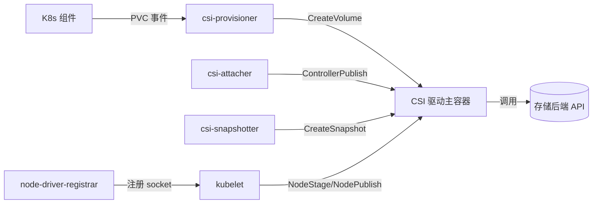

# K8s 存储深挖（CSI 开发 / StorageClass 调优 / 动态供给 / 快照恢复 / 迁移路径）

> K8s 存储 = 「**有状态应用的生命线**」。本篇深入拆解：CSI 驱动开发、StorageClass 调优参数、动态供给流程、VolumeSnapshot 恢复、存储迁移路径。

---

## 一、要解决的问题

| 痛点 | 说明 |
|------|------|
| Pod 重启丢数据 | 容器存储是临时的，重启即丢失 |
| 存储供给 | 管理员手动创建 PV 太慢，需要自动按需创建 |
| 多类型存储 | 本地盘/NFS/云盘/SSD/HDD 需要统一管理 |
| 快照与恢复 | 数据备份/恢复需要存储层能力 |
| 跨节点迁移 | Pod 调度到其他节点后存储要能跟随 |

---

## 二、存储模型

### 2.1 核心流程

```
Pod（声明 PVC）→ PVC（声明大小/类型）→ PV（实际存储资源）→ StorageClass（动态供给规则）
  → CSI 驱动（调用底层存储 API）

三种供给模式：
  手动：管理员预创建 PV → PVC 绑定
  动态：PVC 触发 StorageClass → CSI 自动创建 PV（推荐）
  静态预配置：StorageClass 指定已有存储池
```

### 2.2 Access Modes（访问模式）

| 模式 | 说明 | 适用 |
|------|------|------|
| RWO（ReadWriteOnce） | 单节点读写 | 数据库、有状态应用 |
| ROX（ReadOnlyMany） | 多节点只读 | 静态资源、配置共享 |
| RWX（ReadWriteMany） | 多节点读写 | 共享文件系统（NFS/CephFS） |
| RWOP（ReadWriteOncePod） | 单 Pod 读写 | 严格单 Pod 访问 |

### 2.3 Reclaim Policies（回收策略）

| 策略 | 说明 |
|------|------|
| Retain | PVC 删除后 PV 保留（数据安全） |
| Delete | PVC 删除后自动删除 PV 和底层存储 |
| Recycle（已废弃） | 清空数据后可重用 |

---

## 三、CSI 驱动开发

### 3.1 CSI 架构

```
CSI（Container Storage Interface）标准化了 K8s 与存储系统的对接：

  CSI Controller（中心）：处理 Create/Delete/Mount/Attach
  CSI Node（每节点）：处理 Pod 级别的 Mount/Unmount
  存储系统：NFS/云盘/Ceph/本地盘...

gRPC 接口：
  Identity Service：身份信息（GetPluginInfo/GetCapabilities）
  Controller Service：控制操作（CreateVolume/DeleteVolume/ControllerPublishVolume）
  Node Service：节点操作（NodeStageVolume/NodePublishVolume/NodeUnpublishVolume）
```

### 3.2 开发流程

```
1. 实现 gRPC 接口
   - Identity Service：返回驱动信息
   - Controller Service：实现 CreateVolume/DeleteVolume
   - Node Service：实现 NodeStageVolume/NodePublishVolume

2. 编写部署 YAML
   - CSI Driver（Deployment/StatefulSet）
   - CSIDriver（K8s 资源对象）
   - StorageClass（配置）

3. 测试
   - 创建 PVC
   - 创建 Pod 使用 PVC
   - 验证数据持久化
```

### 3.3 部署示例

```yaml
# CSIDriver
apiVersion: storage.k8s.io/v1
kind: CSIDriver
metadata:
  name: my-csi-driver
spec:
  attachRequired: false  # 无需 Attach（如 NFS）
  podInfoOnMount: true   # 挂载时传递 Pod 信息

# StorageClass
apiVersion: storage.k8s.io/v1
kind: StorageClass
metadata:
  name: my-storage-class
provisioner: my-csi-driver
parameters:
  type: ssd
  sizeGiB: "100"
reclaimPolicy: Retain
volumeBindingMode: WaitForFirstConsumer
allowVolumeExpansion: true
```

---

## 四、StorageClass 调优参数

### 4.1 云盘参数（AWS EBS）

| 参数 | 说明 | 建议 |
|------|------|------|
| type | 卷类型 | gp3（通用）/io2（高 IOPS） |
| iopsPerGB | 每 GB IOPS | 50（gp3）/100（io2） |
| throughput | 吞吐量 MB/s | 125（gp3）/250（io2） |
| encrypted | 加密 | true |
| fsType | 文件系统 | ext4（通用）/xfs（大数据） |

### 4.2 本地存储参数

```yaml
# 本地路径 provisioner
apiVersion: storage.k8s.io/v1
kind: StorageClass
metadata:
  name: local-path
provisioner: rancher.io/local-path
parameters:
  path: /mnt/disks  # 本地路径
reclaimPolicy: Retain
volumeBindingMode: WaitForFirstConsumer
```

---

## 五、VolumeSnapshot（快照恢复）

### 5.1 快照创建

```yaml
# VolumeSnapshotClass
apiVersion: snapshot.storage.k8s.io/v1
kind: VolumeSnapshotClass
metadata:
  name: my-snapshot-class
driver: ebs.csi.aws.com
deletionPolicy: Retain

# VolumeSnapshot
apiVersion: snapshot.storage.k8s.io/v1
kind: VolumeSnapshot
metadata:
  name: my-snapshot
spec:
  volumeSnapshotClassName: my-snapshot-class
  source:
    persistentVolumeClaimName: my-pvc
```

### 5.2 从快照恢复

```yaml
# 新 PVC 从快照创建
apiVersion: v1
kind: PersistentVolumeClaim
metadata:
  name: my-pvc-restored
spec:
  accessModes: [ReadWriteOnce]
  resources:
    requests:
      storage: 100Gi
  dataSource:
    name: my-snapshot
    kind: VolumeSnapshot
    apiGroup: snapshot.storage.k8s.io
```

### 5.3 快照最佳实践

| 实践 | 说明 |
|------|------|
| 定期快照 | CronJob 每小时/每天自动创建 |
| 保留策略 | Retain（数据安全）/Delete（释放空间） |
| 跨地域复制 | 快照跨地域复制（灾难恢复） |
| 验证恢复 | 定期测试从快照恢复（验证完整性） |

---

## 六、存储迁移路径

### 6.1 评估阶段

```
1. 梳理现有存储（PV/PVC 清单）
2. 评估各存储的迁移复杂度
3. 确定迁移优先级（低风险→高风险）
```

### 6.2 迁移方案

| 方案 | 适用 | 步骤 |
|------|------|------|
| Velero | 跨集群迁移 | 备份旧集群→恢复到新集群 |
| CSI 迁移 | 云盘类型切换 | 确保 CSI 支持→更新 StorageClass |
| 手动迁移 | 复杂场景 | 读数据→创建新 PVC→写数据→切换 |

### 6.3 迁移注意事项

```
备份：迁移前必须备份数据
双跑：新旧存储并行运行一段时间
验证：迁移后验证数据完整性
切换：灰度切换流量，逐步切换
清理：旧存储数据保留 N 天后清理
```

---

## 七、常见问题

| 问题 | 原因 | 解决 |
|------|------|------|
| PVC Pending | StorageClass 不存在/配额不足/zone 不匹配 | 检查 `kubectl describe pvc` |
| Pod 挂载失败 | CSI 驱动未安装/权限不足/节点存储不可用 | 检查 CSI Pod 状态 |
| 扩容失败 | 底层不支持在线扩容 | 离线扩容或重建 Pod |
| 数据丢失 | 回收策略 Delete + PVC 误删 | 生产必须 Retain + 快照备份 |
| 性能问题 | 云盘 IOPS 不足 | 选型时预估 IOPS 需求 |

---

## 八、与其他板块的关系

- Kubernetes 核心见「[Kubernetes 核心](./Kubernetes核心.md)」；
- K8s 网络见「[K8s 网络深挖](./K8s网络深挖.md)」；
- 分布式存储见「[Ceph](../基础知识/中间件/Ceph.md)」；
- 对象存储见「[MinIO/OSS](../基础知识/中间件/对象存储MinIO-OSS.md)」；
- 数据库存储见「[PostgreSQL](../基础知识/中间件/PostgreSQL深度篇.md)」「[TiDB](../基础知识/中间件/TiDB与NewSQL.md)」。

> 一句话：**K8s 存储 = PV（资源）+ PVC（声明）+ StorageClass（动态供给）+ CSI（对接底层）——生产选 Retain 回收 + WaitForFirstConsumer 绑定 + 快照备份 + 监控使用率**。

---

## 九、本地卷、拓扑与延迟感知

### 9.1 Local PV（节点本地盘）

```yaml
apiVersion: storage.k8s.io/v1
kind: StorageClass
metadata:
  name: local-storage
provisioner: kubernetes.io/no-provisioner   # 不动态供给，需管理员先建 PV
volumeBindingMode: WaitForFirstConsumer
---
apiVersion: v1
kind: PersistentVolume
metadata:
  name: local-pv-node1
spec:
  capacity: { storage: 500Gi }
  accessModes: [ReadWriteOnce]
  persistentVolumeReclaimPolicy: Retain
  storageClassName: local-storage
  local:
    path: /mnt/disks/ssd1
  nodeAffinity:                       # 绑定到特定节点
    required:
      nodeSelectorTerms:
      - matchExpressions:
        - key: kubernetes.io/hostname
          operator: In
          values: [node-1]
```

- **优点**：本地 NVMe 延迟最低，适合 Redis/数据库/ES 等对 IO 敏感负载。
- **缺点**：Pod 必须调度到该节点（nodeAffinity 隐式绑定），节点故障数据不可用——只用于**有副本/可重建**的场景，或配节点级冗余。

### 9.2 拓扑感知（Topology-Aware）

`volumeBindingMode: WaitForFirstConsumer` 让调度器在「知道 Pod 落在哪个可用区/节点」之后再绑定 PV，避免 PV 在 A 区、Pod 调度到 B 区导致跨区高延迟或无法挂载。配合 StorageClass 的 `allowedTopologies` 可限制 PV 只能在某拓扑域。

```yaml
allowedTopologies:
- matchLabelExpressions:
  - key: topology.kubernetes.io/zone
    values: [cn-hangzhou-a]
```

---

## 十、PVC 扩容、克隆与快照调度

### 10.1 在线扩容

```yaml
# 改 PVC 的 storage 即可（需 StorageClass allowVolumeExpansion: true）
spec:
  resources:
    requests:
      storage: 200Gi      # 从 100Gi 扩到 200Gi
```
- 多数 CSI 支持**文件系统在线扩容**（Pod 不重启，kubelet 在节点上 `resizefs`）；少数需卸载后扩（Pod 需重启）。
- **缩容不被支持**：K8s 不允许 PVC 缩小，只能新建更大的再迁移数据。

### 10.2 卷克隆（Volume Cloning）

```yaml
apiVersion: v1
kind: PersistentVolumeClaim
metadata:
  name: clone-of-pvc
spec:
  storageClassName: my-sc
  accessModes: [ReadWriteOnce]
  resources:
    requests: { storage: 100Gi }
  dataSource:
    kind: PersistentVolumeClaim
    name: source-pvc          # 从已有 PVC 克隆
```
适合「用生产数据副本做测试」等场景。

### 10.3 快照调度（定时备份）

用 CronJob 周期性创建 `VolumeSnapshot`，再配 `VolumeSnapshotContent` 跨区复制：

```bash
# 简化思路：CronJob 里用 kubectl 创建 VolumeSnapshot
kubectl apply -f - <<EOF
apiVersion: snapshot.storage.k8s.io/v1
kind: VolumeSnapshot
metadata:
  name: db-snap-$(date +%F)
  namespace: prod
spec:
  volumeSnapshotClassName: my-snapshot-class
  source:
    persistentVolumeClaimName: db-pvc
EOF
```

---

## 十一、CSI 深入：Sidecar 模式与辅助控制器

现代 CSI 驱动是一组容器协作（部署在一个 DaemonSet/StatefulSet 里）：

| 组件 | 模式 | 职责 |
|------|------|------|
| **csi-provisioner** | sidecar | Watch PVC → 调 CSI Controller `CreateVolume` |
| **csi-attacher** | sidecar | 调 `ControllerPublishVolume`（挂到节点） |
| **csi-resizer** | sidecar | Watch PVC 扩容 → 调 `ControllerExpandVolume` |
| **csi-snapshotter** | sidecar | Watch VolumeSnapshot → 调 `CreateSnapshot` |
| **csi-cloner** | sidecar | 处理 dataSource 克隆 |
| **node-driver-registrar** | sidecar | 在节点注册插件（kubelet 通过 unix socket 调用） |
| **真实的 CSI 驱动** | 主容器 | 实现 gRPC 接口，对接底层存储 API |



> 调试技巧：CSI 相关失败，先看对应 sidecar 日志（`kubectl logs -n kube-system -l app=csi-xxx -c csi-provisioner`），再查驱动主容器。

---

## 十二、存储性能调优

| 调优点 | 做法 | 收益 |
|--------|------|------|
| **fsGroup** | 设 `securityContext.fsGroup` 让卷归属正确（注意 `fsGroupChangePolicy`） | 避免权限错；`OnRootMismatch` 仅首次改，减少挂载耗时 |
| **mountOptions** | 如 `noatime`、`discard`、NFS 的 `nconnect` | 降低元数据开销、提升吞吐 |
| **卷类型** | RWOP 减少并发锁、Block Volume（raw block）绕过分层文件系统 | 数据库直挂块设备性能最佳 |
| **IOPS/吞吐** | StorageClass 参数选高 IOPS 类型 + 设足 request | 避免 IO 瓶颈 |
| **拓扑** | 优先同可用区、本地盘 | 降延迟 |
| **避免单 PV 热点** | 同一节点多 Pod 共用本地盘会抢 IO | 用反亲和分散 |

```yaml
# 块设备直挂（数据库性能场景）
volumeDevices:
- devicePath: /dev/block
  name: data
```

---

## 十三、生产案例：数据库 StatefulSet 持久化

```yaml
apiVersion: apps/v1
kind: StatefulSet
metadata:
  name: pg
spec:
  serviceName: pg-headless
  replicas: 3
  selector: { matchLabels: { app: pg } }
  template:
    metadata: { labels: { app: pg } }
    spec:
      containers:
      - name: pg
        image: postgres:16
        env:
        - name: PGDATA
          value: /var/lib/postgresql/data/pgdata
        volumeMounts:
        - name: data
          mountPath: /var/lib/postgresql/data
        resources:
          requests: { cpu: "1", memory: 2Gi }
          limits:   { cpu: "2", memory: 4Gi }
  volumeClaimTemplates:
  - metadata: { name: data }
    spec:
      accessModes: [ReadWriteOnce]
      storageClassName: ssd-retain
      resources: { requests: { storage: 100Gi } }
---
# 每个 Pod 有稳定网络标识 pg-0.pg-headless.default.svc，PVC 随 Pod 名绑定
```

要点：StatefulSet 的 `volumeClaimTemplates` 会**按 Pod 序号**自动生成 `data-pg-0`、`data-pg-1` 等 PVC，Pod 重建后绑定回自己的 PVC，数据不丢；配合 headless Service 让副本间用稳定域名互相发现。

---

## 十四、迁移深入：Velero 实战

Velero 是 K8s 备份/迁移的事实标准（不仅备份 PV，还备份 K8s 对象）：

```bash
# 1. 安装（含 CSI 快照插件）
velero install \
  --provider aws \
  --plugins velero/velero-plugin-for-aws,velero/velero-plugin-for-csi \
  --bucket my-backup-bucket \
  --backup-location-config region=cn-hangzhou \
  --snapshot-location-config region=cn-hangzhou

# 2. 备份某命名空间（含 PV 快照）
velero backup create prod-bak --include-namespaces prod --snapshot-volumes

# 3. 跨集群恢复
velero restore create --from-backup prod-bak --namespace-mappings prod:prod-new
```

| 迁移方案对比 | 适用 | 数据一致性 |
|--------------|------|-----------|
| Velero 备份恢复 | 跨集群/灾备 | 应用级（需应用支持一致性快照） |
| Storage 层快照复制 | 同云跨区 | 存储级（需 quiet 期或应用静默） |
| 逻辑导出（dump/export） | 异构存储迁移 | 最稳，但慢 |

---

## 十五、常见坑与排障补充

| 现象 | 根因 | 处理 |
|------|------|------|
| PVC 一直 Pending（WaitForFirstConsumer） | 没有合适节点/拓扑不匹配 | `kubectl describe pvc` 看事件 |
| 多挂载 RWO 失败 | RWO 仅单节点，第二 Pod 调度到别节点挂不上 | 改用 RWX（共享存储）或同节点调度 |
| 扩容后文件系统没变 | 底层不支持在线 resize 或 Pod 需重启 | 确认 `allowVolumeExpansion` + 重启 Pod 触发 `resizefs` |
| 本地盘 Pod 调度不上 | nodeAffinity 与节点资源冲突 | 检查节点可用资源与本地盘路径 |
| 快照恢复卡住 | snapshot class `deletionPolicy`/驱动不支持 | 查 csi-snapshotter 日志 |
| 性能差 | 默认 HDD/低 IOPS 或跨区挂载 | 选 SSD + 同区 + 调 mountOptions |

---

## 十六、速记口诀

> 口诀：**「PVC 是申请、PV 是资源、SC 管供给、CSI 接底层；动态供给 WaitForFirstConsumer 等消费者，Retain 防误删、快照保恢复。本地盘最快但有节点绑，扩容易缩容难；数据库用 StatefulSet 绑序号 PVC，Velero 做跨集群灾备。」**
