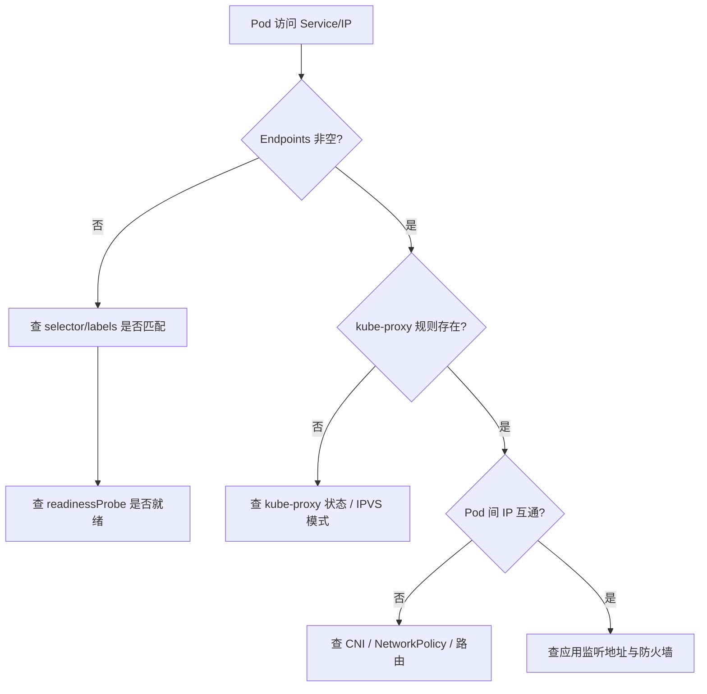
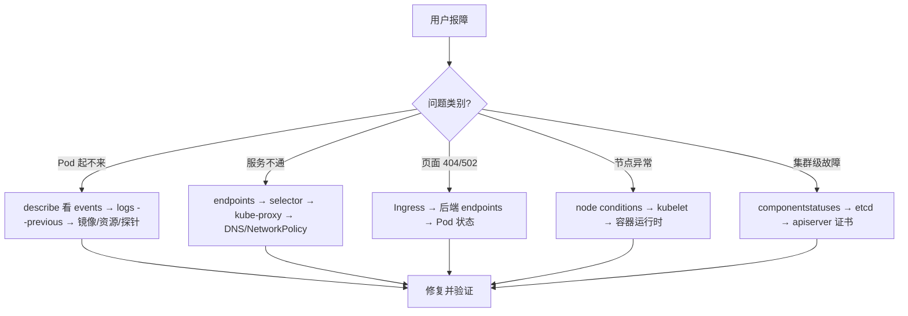

# K8s 故障排查手册（Pod / Service / Ingress 常见问题）

> K8s 排障 =「**从状态倒推原因**」。Pod 起不来、Service 不通、Ingress 404 是三大高频问题。本篇按「问题分类 → 排查命令 → 常见原因 → 解决方案」结构化拆解，可直接当运维 SOP 使用。

---

## 一、Pod 排障（最常见）

### 1.1 Pod 状态速查

| 状态 | 含义 | 排查方向 |
|------|------|----------|
| Pending | 未调度到节点 | 资源不足/亲和性/PVC 绑定 |
| ImagePullBackOff | 镜像拉取失败 | 镜像名错/仓库认证/网络 |
| CrashLoopBackOff | 启动后反复崩溃 | 应用日志/环境变量/配置 |
| Error | 运行中出错 | 应用日志/OOM/权限 |
| Terminating | 正在终止 | preStop 钩子/资源回收 |
| OOMKilled | 内存溢出被杀 | 内存 limit 太小/内存泄漏 |

### 1.2 排查命令

```bash
# 1. 查看 Pod 状态
kubectl get pods -n <ns> -o wide

# 2. 查看详细事件（排障第一步）
kubectl describe pod <pod> -n <ns>

# 3. 查看日志（当前容器）
kubectl logs <pod> -n <ns> --tail=100

# 4. 查看上一个崩溃容器日志
kubectl logs <pod> -n <ns> --previous

# 5. 进入容器排查
kubectl exec -it <pod> -n <ns> -- /bin/sh

# 6. 查看资源使用
kubectl top pod <pod> -n <ns>
```

### 1.3 常见问题速查

| 问题 | 可能原因 | 解决方案 |
|------|----------|----------|
| Pending | 节点资源不足 | 扩容节点 / 降低 requests |
| Pending | PVC Pending | 检查 StorageClass / 配额 |
| Pending | nodeSelector 不匹配 | 调整 nodeSelector / 标签 |
| ImagePullBackOff | 镜像名错误 | 检查 image 字段拼写 |
| ImagePullBackOff | 仓库需要认证 | 创建 imagePullSecret |
| CrashLoopBackOff | 应用报错 | 查 `kubectl logs --previous` |
| CrashLoopBackOff | 健康检查失败 | 调整 livenessProbe 参数 |
| OOMKilled | limit 太小 | 增加 memory limit |
| OOMKilled | 内存泄漏 | 用 Arthas/jstack 排查应用 |

---

## 二、Service 排障

### 2.1 排查流程

```bash
# 1. 检查 Service 是否存在
kubectl get svc <svc> -n <ns>

# 2. 检查 Endpoints（核心！）
kubectl get endpoints <svc> -n <ns>
# Endpoints 为空 = 没有匹配的 Pod

# 3. 检查 Pod selector 是否匹配
kubectl get pods -n <ns> -l app=<label>

# 4. 检查端口映射
kubectl describe svc <svc> -n <ns>

# 5. 从集群内测试连通性
kubectl run test --rm -it --image=busybox -- wget -qO- http://<svc>.<ns>.svc.cluster.local:<port>

# 6. 检查 kube-proxy 规则
iptables -t nat -L KUBE-SERVICES | grep <svc-ip>
```

### 2.2 常见问题

| 问题 | 原因 | 解决 |
|------|------|------|
| Endpoints 为空 | Pod selector 不匹配 | 修正 selector 标签 |
| Endpoints 为空 | Pod 未就绪 | 检查 readinessProbe |
| 端口不通 | targetPort 错误 | 确认容器实际监听端口 |
| DNS 解析失败 | CoreDNS 异常 | `kubectl get pods -n kube-system -l k8s-app=kube-dns` |
| 延迟高 | iptables 规则多 | 切换 IPVS 模式 |

---

## 三、Ingress 排障

```bash
# 1. 查看 Ingress 资源
kubectl get ingress -n <ns>

# 2. 查看 Ingress Class
kubectl get ingressclass

# 3. 查看 Ingress Controller 日志
kubectl logs -n ingress-nginx <controller-pod>

# 4. 检查后端 Service 是否正常
kubectl get endpoints <svc> -n <ns>

# 5. 本地测试（port-forward）
kubectl port-forward -n ingress-nginx <controller-pod> 8080:80
curl -H "Host: <domain>" http://localhost:8080
```

### 常见问题

| 问题 | 原因 | 解决 |
|------|------|------|
| 404 | 路径规则不匹配 | 检查 path 字段（前缀/精确） |
| 502/503 | 后端 Service 不可用 | 检查 Endpoints + Pod 状态 |
| TLS 错误 | Secret 不匹配/过期 | 检查 TLS Secret 证书 |
| 外部无法访问 | Ingress Controller 未暴露 | 检查 LB/NodePort 配置 |

---

## 四、节点排障

```bash
# 1. 节点状态
kubectl get nodes
kubectl describe node <node>

# 2. 节点资源
kubectl top node

# 3. 节点条件（ Conditions）
# Ready / MemoryPressure / DiskPressure / PIDPressure
kubectl get nodes -o custom-columns=NAME:.metadata.name,STATUS:.status.conditions[-1].type,REASON:.status.conditions[-1].reason

# 4. 排查节点进程
ssh <node>
top -c
df -h
journalctl -u kubelet --since "10 minutes ago"
```

---

## 五、通用排查工具

| 工具 | 用途 |
|------|------|
| `kubectl describe` | 查看资源详情与事件 |
| `kubectl logs` | 查看容器日志 |
| `kubectl exec` | 进入容器排查 |
| `kubectl port-forward` | 端口转发本地测试 |
| `kubectl get events --sort-by=.lastTimestamp` | 查看集群事件时间线 |
| `kubectx` / `kubens` | 快速切换 context/namespace |
| `stern` | 多 Pod 日志聚合查看 |
| `k9s` | 终端 UI 管理工具 |

---

## 七、网络与 DNS 排障

### 7.1 CoreDNS 排障

CoreDNS 是集群默认 DNS 组件。当 Pod 内 `nslookup`/`curl` 服务名失败，第一步先确认 CoreDNS 自身是否健康，再查客户端解析配置。

```bash
# 1. CoreDNS Pod 是否 Running
kubectl get pods -n kube-system -l k8s-app=kube-dns
kubectl logs -n kube-system -l k8s-app=kube-dns --tail=50

# 2. 进业务 Pod 测试解析
kubectl exec -it <pod> -n <ns> -- nslookup kubernetes.default
kubectl exec -it <pod> -n <ns> -- cat /etc/resolv.conf
# 期望看到：nameserver 10.x.x.x (kube-dns ServiceIP)，search <ns>.svc.cluster.local svc.cluster.local cluster.local
```

常见问题与对策：

| 问题 | 原因 | 解决 |
|------|------|------|
| 解析慢（几百 ms） | `ndots:5` 导致先追加多个 search domain 再递归 | 用 FQDN（带 `.svc.cluster.local`）或在 `dnsConfig` 设 `ndots:2` |
| 解析失败 NXDOMAIN | Service/namespace 拼错、跨 ns 用短名 | 用完整 `<svc>.<ns>.svc.cluster.local` |
| 偶发超时 | CoreDNS Pod 被驱逐/OOM/CPU 限流 | 检查 CoreDNS 资源 request、节点压力 |
| 集群外域名慢 | CoreDNS forward 链路长 | 优化 `Corefile` 的 forward 与 cache 插件 |

`dnsConfig` 优化示例：

```yaml
spec:
  dnsConfig:
    options:
      - name: ndots
        value: "2"
      - name: attempts
        value: "2"
      - name: timeout
        value: "1"
```

### 7.2 网络连通性排障（含决策图）



排障命令集：

```bash
# Pod 内测试对端 Service
kubectl exec -it <pod> -n <ns> -- curl -sI http://<svc>.<ns>:port
kubectl exec -it <pod> -n <ns> -- wget -qO- http://<svc>.<ns>.svc.cluster.local:port

# 抓包（需 NET_ADMIN，或用 netshoot 镜像）
kubectl run nettool --rm -it --image=nicolaka/netshoot -- /bin/bash
# 进入后：tcpdump -i eth0 -n port 8080 ; curl 对端

# 检查 NetworkPolicy 是否拦截
kubectl get networkpolicy -n <ns>
kubectl describe networkpolicy <np> -n <ns>

# 节点侧看路由与网桥
ip route | grep <pod-cidr>
bridge link
```

---

## 八、存储排障（PVC / PV / CSI）

存储排障详见「[K8s 存储深挖](./K8s存储深挖.md)」。高频问题是 PVC 长时间 `Pending` 或挂载失败。

```bash
# 1. PVC 状态与事件（关键看 Events）
kubectl get pvc -n <ns>
kubectl describe pvc <pvc> -n <ns>

# 2. StorageClass 是否存在且可动态供给
kubectl get storageclass
kubectl describe storageclass <sc>      # 看 provisioner / reclaimPolicy / allowVolumeExpansion

# 3. CSI 驱动是否就绪
kubectl get pods -n kube-system | grep -i csi
kubectl logs -n kube-system <csi-controller-pod> --tail=50

# 4. 挂载失败看 Pod 事件
kubectl describe pod <pod> -n <ns>      # FailedMount / Timeout waiting for volume
```

常见原因对照：

| 现象 | 根因 | 处置 |
|------|------|------|
| PVC 一直 Pending | StorageClass 不存在 / provisioner 异常 | 创建正确的 StorageClass；查 CSI 日志 |
| 扩容失败 | SC 未开 `allowVolumeExpansion` | 重建 SC 开启；或手动扩 PV |
| 数据随 PVC 删除 | `reclaimPolicy: Delete` | 重要数据用 `Retain` + 定期快照 |
| WaitForFirstConsumer 不绑定 | 无消费 Pod 调度 | 先部署引用 PVC 的 Pod |
| 节点挂载超时 | 节点缺 iscsi/nfs 客户端、或 kubelet 挂载目录满 | 装依赖、清 `/var/lib/kubelet` |

---

## 九、控制平面排障

### 9.1 组件健康

```bash
# 静态 Pod 形式的控制平面组件（kubeadm 安装）
kubectl -n kube-system get pods | grep -E 'kube-apiserver|kube-scheduler|kube-controller-manager|etcd'

# 节点上查 kubelet
journalctl -u kubelet --since "10 minutes ago" | tail -50

# etcd 健康（使用 etcdctl）
ETCDCTL_API=3 etcdctl \
  --endpoints=https://127.0.0.1:2379 \
  --cacert=/etc/kubernetes/pki/etcd/ca.crt \
  --cert=/etc/kubernetes/pki/etcd/server.crt \
  --key=/etc/kubernetes/pki/etcd/server.key \
  endpoint health
```

### 9.2 典型故障处置

| 故障 | 现象 | 处置 |
|------|------|------|
| etcd 磁盘满 | apiserver 写失败、集群写入卡死 | 紧急清理空间 → `etcdctl defrag` 压缩 → 扩容磁盘/开自动压缩 |
| apiserver 证书过期 | `kubectl` 报 `x509: certificate has expired` | `kubeadm certs renew all` 后重启静态 Pod |
| scheduler 异常 | 资源充足但 Pod 一直 Pending | 查 scheduler 日志与 `bind` 权限/leader 选举 |
| controller-manager 异常 | 副本数不自愈、端点不刷新 | 查日志与 leader 选举 |
| 节点 NotReady | kubelet 心跳丢失 | 查 kubelet、容器运行时、网络插件 |

---

## 十、应用层排障（JVM / 进程 / 资源）

```bash
# 容器内看进程与资源
kubectl exec -it <pod> -n <ns> -- top -b -n 1
kubectl exec -it <pod> -n <ns> -- ps aux

# Java 应用：线程栈 / 堆直方图
kubectl exec -it <pod> -n <ns> -- jstack <pid> > /tmp/thread.dump
kubectl exec -it <pod> -n <ns> -- jmap -histo <pid> | head -30
kubectl exec -it <pod> -n <ns> -- jstat -gcutil <pid> 1s

# 容器内无工具时，用临时调试容器（1.18+，不重启原容器）
kubectl debug -it <pod> -n <ns> --image=busybox:1.36 --target=<container> -- /bin/sh

# 进入节点宿主（chroot 到 /host）
kubectl debug node/<node> -it --image=busybox -- chroot /host
```

高频应用问题映射：

| 现象 | 可能根因 | 排查手段 |
|------|----------|----------|
| CPU 飙高 | 死循环 / 频繁 GC | `top` 找高 CPU 线程 → `jstack` 定位；`jstat -gc` 看 GC |
| 内存持续涨 | 堆内泄漏 / 堆外（NMT） | `jmap -histo`；开启 Native Memory Tracking |
| 线程堆积 | 连接池满 / 锁竞争 | `jstack` 看 BLOCKED/WAITING 比例 |
| 句柄泄露 | 文件/连接未关闭 | `ls /proc/<pid>/fd | wc -l` 对比上限 |
| 容器被驱逐 | 超出 limit（内存突增） | `describe pod` 看 `OOMKilled`/`exitCode 137` |

---

## 十一、排障决策树（总览）



---

## 十二、生产案例集（按现象的处置 SOP）

### 案例 1：批量 Pod OOMKilled
- **现象**：Deployment 滚动后大量 `OOMKilled`，`RESTARTS` 飙升、状态循环。
- **倒推**：① `kubectl get pods` 看 RESTARTS/STATUS；② `describe pod` 看 `Last State: Terminated, Reason: OOMKilled, Exit Code: 137`；③ 比对 `requests/limits.memory` 与实际占用（`kubectl top pod`）；④ 应用侧用 `jmap`/pprof 找内存来源。
- **处置**：先临时上调 limit 止血 → 长期做内存 profiling、加对象池/缓存上限。

### 案例 2：Service 偶发超时
- **倒推**：① endpoints 是否频繁为空（就绪探针抖动）；② kube-proxy IPVS/iptables 规则；③ 后端慢导致连接堆积；④ NetworkPolicy 误伤。
- **处置**：稳定 readinessProbe；调大连接池；上 Service Mesh 做熔断重试（见「[Service Mesh](./ServiceMesh.md)」）。

### 案例 3：节点批量 NotReady
- **倒推**：① `describe node` 看 Conditions（DiskPressure/MemoryPressure/PIDPressure）；② kubelet 日志；③ 容器运行时（containerd）是否夯死；④ 该节点 DNS/网络。
- **处置**：`cordon` 隔离 → 排查根因 → 必要时 `drain` 后重建节点。

### 案例 4：PVC 绑定不上导致 Pod Pending
- **倒推**：① `describe pvc` 看 Events 是否 `waiting for a volume to be created`；② StorageClass 的 provisioner 与 CSI 驱动；③ 是否 `WaitForFirstConsumer` 需先有消费 Pod。
- **处置**：确认 StorageClass/CSI 就绪；或改用 `Immediate` 绑定模式。

---

## 十三、排障工具箱速查（命令全集）

```bash
# 状态总览
kubectl get all -n <ns>
kubectl get events -n <ns> --sort-by=.lastTimestamp
kubectl get events -w                              # 事件流实时监控

# 资源画像
kubectl top pod -n <ns> --containers
kubectl top node
kubectl describe node <node> | sed -n '/Allocated resources/,/Events/p'

# 网络诊断专用 Pod
kubectl run nettool --rm -it --image=nicolaka/netshoot -- /bin/bash

# 调试容器（不重启原容器）
kubectl debug -it <pod> -n <ns> --image=busybox:1.36 --target=<c>

# 进入节点宿主
kubectl debug node/<node> -it --image=busybox -- chroot /host

# 批量日志聚合
stern -n <ns> "app=.*" --tail=50
```

---

## 十四、速记口诀与高频面试

**三板斧口诀**：
> 起不来查 events，连不通查 endpoints，页面错查后端，节点挂查 kubelet，集群瘫查 etcd。

**五步通用法**：看状态（`get`）→ 看事件（`describe`）→ 看日志（`logs`）→ 进容器（`exec`/`debug`）→ 抓包/查资源（`top`/`tcpdump`）。

**高频面试追问**：
1. Pod 一直 Pending 有哪些原因？ 答：节点资源不足、nodeSelector/affinity 不匹配、PVC 未绑定、污点容忍缺失、scheduler 异常。
2. CrashLoopBackOff 怎么查？ 答：`logs --previous` 看上次崩溃原因；查就绪/存活探针是否误杀；查资源配置与启动命令。
3. Service 有 IP 但访问不通？ 答：先看 endpoints 是否为空（selector 不匹配最常见）→ 再看 kube-proxy 模式与 DNS → 最后查 NetworkPolicy/应用监听。
4. 节点 NotReady 先查什么？ 答：kubelet 状态、容器运行时、网络插件、磁盘/内存压力（DiskPressure/MemoryPressure）。
5. etcd 磁盘满怎么办？ 答：紧急清理空间 → `etcdctl defrag` 压缩 → 根本是调大磁盘或开启自动压缩（`--auto-compaction-retention`）。
6. DNS 解析慢怎么优化？ 答：降低 `ndots`、使用 FQDN、优化 CoreDNS forward/cache；详见「[K8s 网络深挖](./K8s网络深挖.md)」。

---

## 十五、排障效率工具（kubectl 增强与别名）

日常排障靠 `kubectl`，但配合增强工具能大幅提速。

### 15.1 必装 CLI

| 工具 | 作用 | 示例 |
|------|------|------|
| `kubectx` / `kubens` | 秒切 context / namespace | `kubectx prod` `kubens payment` |
| `stern` | 多 Pod 日志聚合（按标签） | `stern -n prod app=payment` |
| `k9s` | 终端 UI，实时操作与日志 | `k9s -n prod` |
| `kubectl-neat` | 清理 `kubectl get -o yaml` 多余字段 | `kubectl get pod x -o neat` |
| `netshoot` | 网络排障瑞士军刀镜像 | `kubectl run net -it --rm --image=nicolaka/netshoot` |
| ` Popeye` | 集群资源健康检查（找配置问题） | `popeye -n prod` |

### 15.2 实用别名与技巧

```bash
# ~/.bashrc 或 ~/.zshrc
alias k='kubectl'
alias kg='kubectl get'
alias kd='kubectl describe'
alias kl='kubectl logs'
alias ke='kubectl exec -it'
alias kp='kubectl get pods -o wide'
# 看所有命名空间异常 Pod
alias kbad='kubectl get pods -A | grep -vE "Running|Completed"'
# 一键看事件时间线
alias kev='kubectl get events --sort-by=.lastTimestamp -A'
```

### 15.3 上下文切换与防误删

```bash
# 切换前确认当前 context（避免操作错集群）
kubectl config current-context
kubectl config get-contexts

# 危险操作加保护：先 dry-run 预览
kubectl delete pod x -n prod --dry-run=server
# 给关键命名空间加锁标签，配合 OPA 禁止误删
kubectl label ns prod policy.kubernetes.io/protected=true
```

---

## 六、与其他板块的关系

- Kubernetes 核心见「[Kubernetes 核心](./Kubernetes核心.md)」；
- K8s 网络见「[K8s 网络深挖](./K8s网络深挖.md)」；
- K8s 存储见「[K8s 存储深挖](./K8s存储深挖.md)」；
- Linux 排查见「[Linux 性能排查手册](../基础知识/Linux排查.md)」。

> 一句话：**K8s 排障三板斧：`describe` 看事件 → `logs` 看日志 → `exec` 进容器；Pod 起不来先查 events，Service 不通先查 endpoints，Ingress 404 先查后端**。
