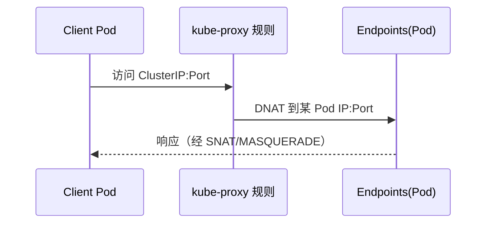
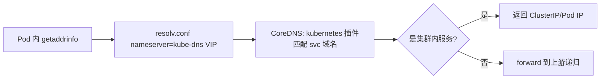
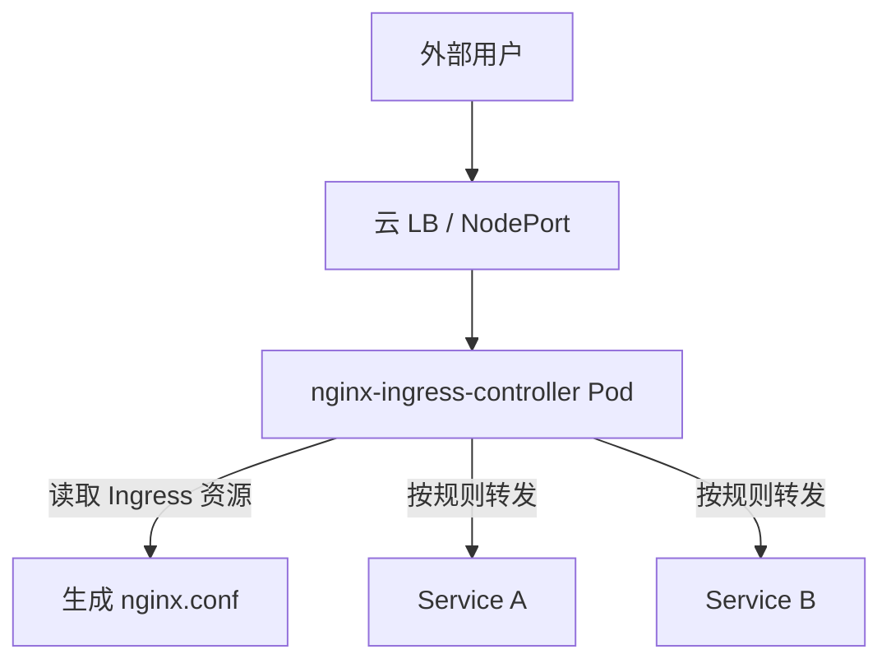
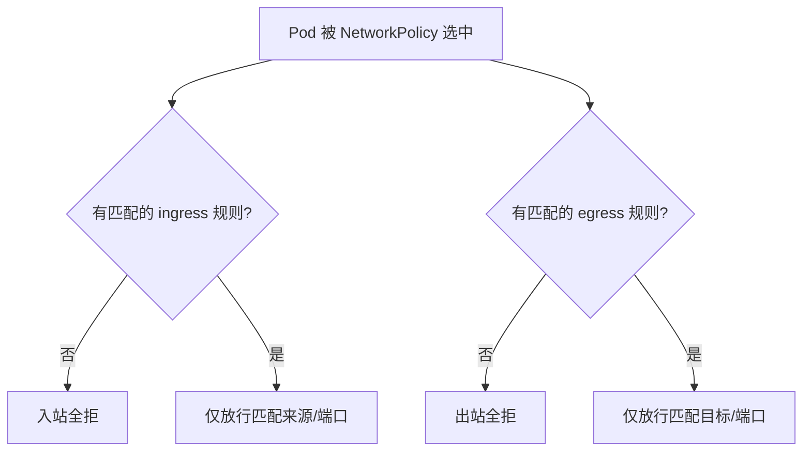
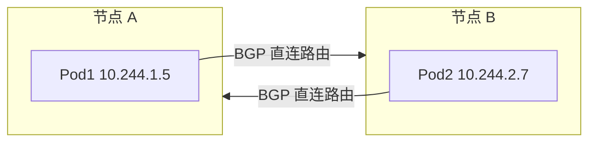

# K8s 网络深挖（CNI / Service / Ingress / NetworkPolicy）

> Kubernetes 网络是「**每个 Pod 一个 IP、无 NAT 互通**」的扁平模型。理解 K8s 网络 = 理解四层：**容器网络（CNI）→ 服务网络（Service）→ 入口流量（Ingress）→ 网络策略（NetworkPolicy）**。本篇按「解决的问题 → 原理 → 选型关注点」拆解。

---

## 一、K8s 网络四大问题

| 问题 | 说明 |
|------|------|
| 容器间通信 | 同一节点/跨节点的 Pod 间如何互通（CNI 解决） |
| 服务发现 | Pod IP 不固定，Service 提供稳定虚拟 IP + DNS |
| 入口流量 | 外部流量如何路由到集群内 Service（Ingress） |
| 网络隔离 | 哪些 Pod 可以互相访问（NetworkPolicy） |

---

## 二、CNI 容器网络

### 2.1 核心模型

```
Pod IP = 虚拟网卡 veth pair 一端在 Pod，一端在宿主机网桥
  → 同节点 Pod：通过网桥二层互通
  → 跨节点 Pod：通过 Overlay（VXLAN）或路由（BGP）互通
```

### 2.2 主流 CNI 插件对比

| 插件 | 模式 | 特点 | 适用 |
|------|------|------|------|
| Calico | BGP/VXLAN/IPIP | 网络策略最强、性能好、支持 BGP 直连路由 | 大规模集群（主流） |
| Flannel | VXLAN/host-gw | 最简单、无网络策略 | 小集群/测试 |
| Cilium | eBPF | 内核级性能、L7 策略、可观测性最强 | 高性能/安全要求高 |
| Weave | VXLAN | 自动加密、简单 | 中小集群 |
| AWS VPC CNI | 原生 VPC | Pod IP 路由到 VPC（无 Overlay） | AWS EKS |

**选型关注点**：
- 需要网络策略（Calico/Cilium）→ 生产必须
- 性能优先 → Cilium（eBPF）或 Calico BGP 直连
- 简单优先 → Flannel（无策略需求）

### 2.3 Calico 深入

```
Calico 架构：
  Felix（节点 Agent）：配置路由、网络策略
  BIRD（BGP 客户端）：节点间交换路由信息
  etcd/CRD：存储网络策略与 IPAM

BGP 模式（无 Overlay）：
  节点间通过 BGP 通告 Pod CIDR → 直接路由（性能最优）
  
VXLAN/IPIP 模式：
  封装 Pod IP 到宿主机 IP → 跨子网兼容（云环境常用）
```

### 2.4 Service 网络原理

```
Service = 稳定的虚拟 IP（ClusterIP）+ DNS（svc-name.namespace.svc.cluster.local）
  → kube-proxy 维护 iptables/IPVS 规则：ClusterIP → Pod IP
  → 后端 Pod 变化时自动更新规则

三种类型：
  ClusterIP（默认）：集群内访问
  NodePort：节点端口暴露（30000-32767）
  LoadBalancer：云厂商 LB（NLB/ALB）
```

**iptables vs IPVS 模式**：

| 模式 | 原理 | 适用 |
|------|------|------|
| iptables | 规则链匹配（O(n)） | 小规模（<1000 Service） |
| IPVS | 哈希表（O(1)） | 大规模（>1000 Service） |

### 2.5 Ingress 深入

```
Ingress = HTTP(S) 路由规则（Host/Path → Service）
  → Ingress Controller（Nginx/Traefik/Istio Gateway）实际执行路由
  → IngressClass 指定使用哪个 Controller

高级路由：
  路径重写、TLS 终止、灰度权重、限流、认证
```

**Ingress vs Gateway API**：

| 维度 | Ingress | Gateway API |
|------|---------|-------------|
| 能力 | HTTP 路由 | TCP/UDP/gRPC + HTTP + 策略 |
| 扩展性 | 注解（非标准化） | CRD + 标准化策略 |
| 推荐 | 存量系统 | 新项目首选 |

---

## 三、NetworkPolicy（网络隔离）

```yaml
apiVersion: networking.k8s.io/v1
kind: NetworkPolicy
metadata:
  name: allow-frontend
spec:
  podSelector:
    matchLabels:
      app: backend
  ingress:
  - from:
    - podSelector:
        matchLabels:
          app: frontend
    ports:
    - port: 8080
```

**效果**：只允许 `app=frontend` 的 Pod 访问 `app=backend` 的 8080 端口，其他全部拒绝。

**关键点**：NetworkPolicy 需要 CNI 插件支持（Flannel 不支持，Calico/Cilium 支持）。

---

## 四、生产实践

| 实践 | 说明 |
|------|------|
| CNI 选型 | 生产用 Calico（BGP 或 VXLAN），大规模/安全用 Cilium |
| DNS | CoreDNS 是默认 DNS，确保 ndots 配置合理（避免不必要的 DNS 查询） |
| Service | 大规模用 IPVS 模式（kube-proxy-mode: ipvs） |
| Ingress | 新项目用 Gateway API，存量用 Nginx Ingress |
| NetworkPolicy | 默认拒绝所有 + 白名单放行（零信任起点） |
| MTU | Overlay 模式注意 MTU 减小（VXLAN +50 字节），避免分片 |
| 排障 | `kubectl exec` + `nslookup` + `curl` + `tcpdump` 四步定位 |

---

## 五、常见坑

- **DNS 解析慢**：ndots=5 导致不必要的搜索域追加 → 设 ndots=2 或用 FQDN
- **Service 延迟**：iptables 模式大规模下性能下降 → 切 IPVS
- **Pod 间不通**：CNI 插件未正确配置或 NetworkPolicy 过于严格
- **NodePort 端口冲突**：端口范围有限 → 用 Ingress/LB 替代
- **云环境跨 VPC**：Pod CIDR 与 VPC CIDR 冲突 → 用云原生 CNI（VPC CNI）

---

## 七、Service 深入：从 ClusterIP 到数据面规则

### 7.1 Service 类型与语义

| 类型 | 暴露范围 | 典型用途 |
|------|----------|----------|
| ClusterIP | 仅集群内虚拟 IP | 内部服务互访（默认） |
| Headless（`clusterIP: None`） | 无 VIP，直返 Pod IP | StatefulSet 稳定域名、客户端自选负载均衡 |
| NodePort | 每个节点开 30000-32767 | 简易外部暴露、开发联调 |
| LoadBalancer | 云厂商 LB 转发到 NodePort | 公网入口（生产多由 Ingress 替代） |
| ExternalName | 返回 CNAME | 把集群外服务映射进集群 DNS |

Headless Service 示例（StatefulSet 稳定网络标识）：

```yaml
apiVersion: v1
kind: Service
metadata:
  name: mysql
spec:
  clusterIP: None          # 关键：无 VIP
  selector:
    app: mysql
  ports:
  - port: 3306
# 解析 mysql-0.mysql.<ns>.svc.cluster.local 直接得到 Pod IP
```

### 7.2 kube-proxy 的两种实现

kube-proxy 监听 Service/Endpoints 变化，把「ClusterIP:Port → Pod IP:Port」写成节点上的转发规则。

**iptables 模式**（默认，O(n) 链匹配）：

```bash
# 查看某 Service 的 NAT 规则
iptables -t nat -L KUBE-SERVICES -n | grep <cluster-ip>
iptables -t nat -L KUBE-SEP-XXXX -n       # 具体后端 Pod 的 MASQUERADE/SNAT
```

**IPVS 模式**（哈希 O(1)，大规模首选）：

```bash
# 开启（kube-proxy 配置 --proxy-mode=ipvs）
ipvsadm -Ln | grep -A3 <cluster-ip>        # 看到 rr/wrr/lc 等调度
```

| 维度 | iptables | IPVS |
|------|----------|------|
| 复杂度 | 规则链随 Service 数线性增长 | 哈希表，近常数 |
| 连接亲和 | 支持（recent 模块，慢） | 原生 `persistent` 亲和 |
| 调度算法 | 随机（概率） | rr/wrr/lc/lblc 等丰富 |
| 适用规模 | < 1000 Service | > 1000 Service |

### 7.3 Service 流量路径（mermaid）



---

## 八、DNS 深入：CoreDNS 架构与查询流程

### 8.1 架构与 Corefile

CoreDNS 以插件链方式工作，核心插件：`kubernetes`（集群内服务发现）、`forward`（转发集群外域名）、`cache`、`errors`、`health`、`ready`。

```text
# 典型 Corefile（简化）
.:53 {
    errors
    health
    kubernetes cluster.local in-addr.arpa ip6.arpa {
        pods insecure
    }
    forward . /etc/resolv.conf
    cache 30
    loop
    reload
}
```

### 8.2 解析流程



**ndots 关键点**：`resolv.conf` 默认 `options ndots:5` 表示域名中点少于 5 个时会先尝试拼接 search domain。访问外部短域名（如 `api.vendor.com` 只有 2 个点）会被先拼成 `api.vendor.com.<ns>.svc.cluster.local` 等再失败回退，造成额外查询延迟。优化见「[K8s 故障排查手册](./K8s故障排查手册.md)」§7.1。

---

## 九、Ingress 深入：Nginx Controller 与 Gateway API

### 9.1 Nginx Ingress Controller 原理



- Controller 监听 Ingress/IngressClass/Service/Endpoint 变化，动态渲染 `nginx.conf` 并 `reload`。
- `ingress-nginx` 实际接收流量的 Pod 需要以 `hostNetwork` 或 `LoadBalancer` 暴露 80/443。

### 9.2 常用注解与灰度

```yaml
apiVersion: networking.k8s.io/v1
kind: Ingress
metadata:
  name: api
  annotations:
    nginx.ingress.kubernetes.io/rewrite-target: /$2
    nginx.ingress.kubernetes.io/canary: "true"
    nginx.ingress.kubernetes.io/canary-weight: "10"   # 10% 流量到新版本
spec:
  ingressClassName: nginx
  rules:
  - host: api.example.com
    http:
      paths:
      - path: /api(/|$)(.*)
        pathType: Prefix
        backend:
          service:
            name: api-v2
            port:
              number: 80
```

### 9.3 Gateway API（新一代，推荐新项目）

相比 Ingress 用非标准注解，Gateway API 用标准 CRD 表达角色分离：`Gateway`（基础设施层）、`HTTPRoute`（路由层）、`GatewayClass`（实现类），并原生支持 TCP/UDP/gRPC、流量切分、策略。

```yaml
apiVersion: gateway.networking.k8s.io/v1
kind: HTTPRoute
metadata:
  name: api-route
spec:
  parentRefs:
  - name: external-gateway
  hostnames: ["api.example.com"]
  rules:
  - matches:
    - path:
        type: PathPrefix
        value: /api
    backendRefs:
    - name: api-v1
      port: 80
      weight: 90
    - name: api-v2
      port: 80
      weight: 10
```

---

## 十、NetworkPolicy 深入：语义与实现差异

### 10.1 规则语义

NetworkPolicy 是**白名单叠加**模型：默认情况下（无策略时）Pod 互通；一旦某 Pod 被某策略的 `podSelector` 选中，则**该 Pod 的入站/出站流量被默认拒绝，只有显式允许的才放行**。策略按「入站 ingress + 出站 egress」分别控制。



### 10.2 默认拒绝 + 白名单（零信任起点）

```yaml
# 默认拒绝某命名空间全部入站
apiVersion: networking.k8s.io/v1
kind: NetworkPolicy
metadata:
  name: default-deny-ingress
  namespace: prod
spec:
  podSelector: {}            # 选中所有 Pod
  policyTypes: ["Ingress"]
  # 不写 ingress → 全部拒绝
---
# 仅放行 frontend 到 backend:8080
apiVersion: networking.k8s.io/v1
kind: NetworkPolicy
metadata:
  name: allow-frontend
  namespace: prod
spec:
  podSelector:
    matchLabels: { app: backend }
  policyTypes: ["Ingress"]
  ingress:
  - from:
    - podSelector: { matchLabels: { app: frontend } }
    ports:
    - port: 8080
```

### 10.3 实现差异

| CNI | NetworkPolicy | L7 策略 | 备注 |
|-----|---------------|---------|------|
| Calico | 支持 | 支持（iptables/eBPF 后端） | 生产常用 |
| Cilium | 支持 | 支持（基于 eBPF，L3-L7） | 性能与可观测最佳 |
| Flannel | 不支持 | 不支持 | 需配合额外组件 |
| Weave | 支持 | 有限 | — |

> 注意：NetworkPolicy **依赖 CNI 实现**。选 Flannel 等于放弃策略能力（详见「[K8s 网络深挖](./K8s网络深挖.md)」§2.2）。

---

## 十一、CNI 深入：Calico 与 Cilium 实现细节

### 11.1 Calico（BGP 直连 vs Overlay）



- **BGP 模式**：每个节点 Felix 通过 BIRD 把本机 Pod CIDR 以 BGP 通告给对等体（其他节点或 ToR 交换机），实现无 Overlay 直接路由，性能最优，但需要底层网络可达 Pod CIDR。
- **VXLAN/IPIP 模式**：把 Pod 包封装进宿主机 IP，跨子网/云网络兼容性好，但有封装开销与 MTU 减小（VXLAN 占用 50 字节头）。

### 11.2 Cilium（eBPF）

Cilium 用 eBPF 程序挂载在内核钩子上，直接在内核完成路由、负载均衡（替代 kube-proxy）、网络策略与可观测，无需 iptables 规则链，也无需 Sidecar 即可做 L7 策略。

| 能力 | 传统（iptables+kube-proxy） | Cilium（eBPF） |
|------|------------------------------|----------------|
| 服务负载均衡 | iptables/IPVS 用户态规则 | 内核 eBPF（无 conntrack 压力） |
| 网络策略 | iptables 规则爆炸 | eBPF map，O(1) 查找 |
| 可观测 | 依赖应用埋点 | Hubble 自动网络流/系统调用可见 |
| 开销 | 规则随规模增长 | 近恒定 |

---

## 十二、双栈（IPv4/IPv6）与 Egress

- **双栈**：Service/Pod 可同时分配 `ipFamilies: [IPv4,IPv6]`，需 CNI 与 kube-proxy 均支持（`--feature-gates=IPv6DualStack=true` 旧版，新版默认开）。
- **Egress**：Pod 访问外部时源 IP 被 SNAT 为节点 IP；若需固定出口，可用 `egressIP`（Calico/Cilium）或 `EgressGateway`（如 cilium）。
- **MTU 陷阱**：Overlay（VXLAN/IPIP）会减小可用 MTU，导致大包分片甚至握手失败。排障时用 `ping -M do -s <size>` 测路径 MTU。

---

## 十三、网络排障实战

```bash
# 1. 检查 DNS 解析
kubectl exec -it <pod> -n <ns> -- nslookup <svc>.<ns>

# 2. 测 Service 连通
kubectl exec -it <pod> -n <ns> -- curl -sI http://<svc>.<ns>:port

# 3. 看 kube-proxy 规则
iptables -t nat -L KUBE-SERVICES -n | grep <svc>
ipvsadm -Ln 2>/dev/null | grep <svc-ip>

# 4. 抓包（netshoot）
kubectl run nettool --rm -it --image=nicolaka/netshoot -- /bin/bash
# 内部：tcpdump -i eth0 -n host <pod-ip>

# 5. 查 NetworkPolicy 是否拦截
kubectl get networkpolicy -n <ns>
```

**高频网络坑**：
- DNS 慢：`ndots:5` + 短域名 → 设 `ndots:2` 或用 FQDN（见 §8.2）。
- Service 延迟高：iptables 规模大 → 切 IPVS（§7.2）。
- Pod 跨节点不通：路由/CNI/安全组 → 查 BGP 邻居或 Overlay 封装（§11）。
- NodePort 冲突：端口范围有限 → 改用 Ingress/LB（§9）。
- Overlay 分片：MTU 减小导致偶发超时 → 调整 CNI MTU（§12）。

---

## 十四、速记口诀与高频面试

**网络四层口诀**：
> CNI 管 Pod 互通，Service 做服务发现，Ingress 管入口路由，NetworkPolicy 做隔离——BGP/Cilium 提性能，IPVS 抗规模，默认拒绝是零信任起点。

**高频面试追问**：
1. K8s 网络模型三大前提？ 答：每个 Pod 独立 IP；同 Pod 内容器共享网络命名空间；节点间 Pod 可直连无 NAT（常用模型）。
2. Service 为什么需要 kube-proxy？ 答：维护 ClusterIP→PodIP 的转发规则并随端点变化更新。
3. iptables 与 IPVS 怎么选？ 答：小规模 iptables，>1000 Service 用 IPVS。
4. NetworkPolicy 默认是放行还是拒绝？ 答：对「被策略选中的 Pod」默认拒绝未显式允许的流量；无策略时互通。
5. Cilium 相比 iptables 优势？ 答：eBPF 内核态，无规则爆炸、可 L7 策略、可观测强。
6. Ingress 与 Gateway API 区别？ 答：Ingress 能力窄、靠注解；Gateway API 标准 CRD、角色分离、支持多协议。

---

## 六、与其他板块的关系

- CNI 插件见「[Kubernetes 核心](./Kubernetes核心.md)」；
- Service/Ingress 见「[Kubernetes 核心](./Kubernetes核心.md)」；
- Service Mesh（Istio/Envoy）见「[Service Mesh](./ServiceMesh.md)」；
- 云网络见「[云网络与流量接入体系](../基础知识/中间件/云网络与流量接入体系.md)」；
- Nginx/OpenResty 见「[Nginx](../基础知识/中间件/Nginx.md)」「[OpenResty](../基础知识/中间件/OpenResty.md)」。

> 一句话：**K8s 网络 = CNI（Pod 互通）+ Service（服务发现）+ Ingress（入口路由）+ NetworkPolicy（网络隔离）——生产选 Calico/Cilium + IPVS + Gateway API + 默认拒绝 NetworkPolicy**。
