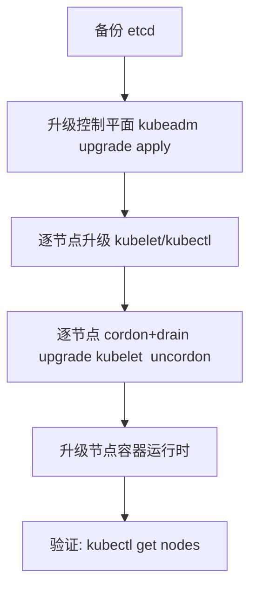

# K8s 运维实战（Helm / Operator 调试 / 日志排查）

> K8s 运维 =「**声明式配置 + 控制器自愈 + 日志排障**」。日常运维聚焦：**Helm Chart 调试、Operator 运维、日志收集、性能调优、故障恢复**。本篇按「运维场景 → 命令 → 实践」拆解，可直接当运维手册使用。

---

## 一、Helm 运维

### 1.1 常用命令

```bash
# 查看已安装 Release
helm list -A

# 查看 Release 详情
helm status <release> -n <ns>

# 查看历史版本
helm history <release> -n <ns>

# 回滚
helm rollback <release> <revision> -n <ns>

# 升级（更新 values）
helm upgrade <release> <chart> -f values.yaml -n <ns>

# 卸载
helm uninstall <release> -n <ns>

# 模板调试（不部署，只渲染 YAML）
helm template <release> <chart> -f values.yaml

# Chart 打包
helm package <chart-dir>
```

### 1.2 Chart 调试技巧

| 技巧 | 说明 |
|------|------|
| `helm template` | 渲染 YAML 检查模板语法 |
| `--dry-run` | 模拟部署（校验 API 对象） |
| `--debug` | 打印渲染后的完整 YAML |
| `helm lint` | Chart 语法检查 |
| `values.yaml` | 配置覆盖（环境差异化） |

### 1.3 常见坑

- **模板渲染错误**：Go 模板语法（`{{ .Values.xxx }}`）拼写 → `helm template` 调试
- **RBAC 不足**：Helm ServiceAccount 权限不够 → 检查 Role/ClusterRole
- **CRD 冲突**：Operator CRD 版本不兼容 → 手动删除旧 CRD 后重装
- **Hook 失败**：pre-install/pre-upgrade Hook 失败 → 检查 Hook 日志

---

## 二、Operator 运维

### 2.1 核心概念

```
Operator = CRD（自定义资源）+ Controller（调谐逻辑）

CRD 定义新资源类型（如 MySQLCluster）
Controller 持续调谐：Spec（期望状态）→ Status（实际状态）

常用 Operator：
  Prometheus Operator（监控）
  PostgreSQL Operator（数据库）
  RocketMQ Operator（消息）
  Redis Operator（缓存）
```

### 2.2 调试命令

```bash
# 查看自定义资源
kubectl get crd | grep <name>
kubectl get <crd-name> -n <ns>

# 查看 Controller 日志
kubectl logs -n <operator-ns> <operator-pod> -f

# 查看资源事件
kubectl describe <crd-name> <instance> -n <ns>

# 查看调谐状态
kubectl get <crd-name> <instance> -n <ns> -o yaml | grep -A 20 status
```

---

## 三、日志排查

### 3.1 日志收集架构

```
应用 stdout → 容器运行时（docker/containerd）→ 节点日志
  → DaemonSet 采集（Fluent Bit/Promtail）
  → 日志平台（Loki/ES/云日志）

直接查看：
  kubectl logs <pod> -n <ns>          — 当前日志
  kubectl logs <pod> --previous       — 上次崩溃日志
  kubectl logs <pod> -c <container>   — 多容器 Pod 指定容器
  kubectl logs -l app=<label> --all-containers=true  — 按标签查
```

### 3.2 日志排查技巧

| 技巧 | 说明 |
|------|------|
| `--previous` | 查看上次崩溃日志（CrashLoopBackOff 必查） |
| `--tail=100` | 只看最后 100 行 |
| `--since=1h` | 只看最近 1 小时 |
| `stern` | 多 Pod 日志聚合（`stern -n <ns> <label>`） |
| `kubectl exec` | 进容器查看应用日志文件 |

---

## 四、性能调优

### 4.1 资源配置

```yaml
resources:
  requests:
    cpu: "500m"      # 0.5 核
    memory: "512Mi"
  limits:
    cpu: "1000m"     # 1 核
    memory: "1Gi"
```

| 配置 | 说明 |
|------|------|
| requests | 调度依据（Pod 必须有这么多资源才调度） |
| limits | 运行上限（超过 limits 被 OOMKilled/CPU throttled） |
| QoS 等级 | Guaranteed（requests=limits）> Burstable > BestEffort |

### 4.2 HPA 自动扩缩

```yaml
apiVersion: autoscaling/v2
kind: HorizontalPodAutoscaler
metadata:
  name: my-app
spec:
  scaleTargetRef:
    apiVersion: apps/v1
    kind: Deployment
    name: my-app
  minReplicas: 2
  maxReplicas: 10
  metrics:
  - type: Resource
    resource:
      name: cpu
      target:
        type: Utilization
        averageUtilization: 70
```

### 4.3 性能分析

```bash
# kubectl top 查看资源使用
kubectl top pods -n <ns>
kubectl top nodes

# 节点资源分布
kubectl describe nodes | grep -A 5 "Allocated resources"

# Pod 资源使用趋势（需 Metrics Server）
kubectl top pod <pod> --containers
```

---

## 五、故障恢复

| 场景 | 恢复步骤 |
|------|----------|
| Pod CrashLoopBackOff | `kubectl logs --previous` → 修 bug → 重新部署 |
| Node NotReady | 检查节点资源 → 重启 kubelet → 检查网络/CNI |
| PVC Pending | 检查 StorageClass → 检查配额 → 检查 CSI 驱动 |
| Service 无 Endpoints | 检查 Pod selector → 检查 readinessProbe |
| Deployment 更新卡住 | `kubectl rollout status` → 检查新 Pod → 回滚 |
| etcd 磁盘满 | 清理空间 → 压缩 revision → 扩容磁盘 |

---

## 七、集群备份与恢复（etcd / Velero）

### 7.1 etcd 快照（控制平面唯一真相源）

etcd 是集群所有对象（含 Secret）的存储，**必须定期快照**。kubeadm 集群常用 `etcdctl snapshot`。

```bash
# 在线快照
ETCDCTL_API=3 etcdctl \
  --endpoints=https://127.0.0.1:2379 \
  --cacert=/etc/kubernetes/pki/etcd/ca.crt \
  --cert=/etc/kubernetes/pki/etcd/server.crt \
  --key=/etc/kubernetes/pki/etcd/server.key \
  snapshot save /backup/etcd-$(date +%F).db

# 校验快照状态
etcdctl snapshot status /backup/etcd-$(date +%F).db -w table

# 恢复（停止 apiserver/etcd 静态 Pod，清数据目录后 restore）
etcdctl snapshot restore /backup/etcd-$(date +%F).db \
  --data-dir=/var/lib/etcd-restore \
  --name=master-1 --initial-cluster=master-1=https://127.0.0.1:2380 \
  --initial-cluster-token=etcd-cluster-1
```

### 7.2 Velero（命名空间级备份/迁移）

Velero 支持按命名空间、资源类型、标签备份，并能跨集群迁移、定时备份、集成云存储与 CSI 快照。

```bash
# 安装（含 CSI 快照特性）
velero install --provider aws --bucket my-backup \
  --use-volume-snapshots=true --plugins velero/velero-plugin-for-aws

# 备份某命名空间
velero backup create b1 --include-namespaces prod

# 恢复
velero restore create --from-backup b1

# 定时备份
velero schedule create daily --schedule="0 2 * * *" --include-namespaces prod
```

> 黄金法则：**etcd 快照保命，Velero 保业务**；etcd 恢复是「回到某个全局时间点」，Velero 可精细到命名空间/资源。

---

## 八、集群升级（kubeadm 流程与版本倾斜）

### 8.1 升级顺序与约束



关键约束（**版本倾斜 skew**）：
- 控制平面可超前 kubelet **1 个小版本**（如 apiserver 1.29，kubelet 1.28/1.29）。
- apiserver 不能低于 kubelet 版本。
- 升级须**逐小版本递进**（1.27→1.28→1.29），不可跨大版本跳。

```bash
# 查看可升级版本
kubeadm upgrade plan

# 升级控制平面
kubeadm upgrade apply v1.29.0

# 逐节点升级 kubelet
kubectl cordon <node>
kubectl drain <node> --ignore-daemonsets --delete-emptydir-data
# 节点上：apt-get install kubelet=1.29.0-00 kubectl=1.29.0-00
systemctl restart kubelet
kubectl uncordon <node>
```

---

## 九、节点维护与弹性扩缩容

### 9.1 安全驱逐（drain）

```bash
# 隔离并驱逐（保留 DaemonSet，清本地卷）
kubectl cordon <node>                                   # 标记不可调度
kubectl drain <node> --ignore-daemonsets --delete-emptydir-data --grace-period=120
# 维护完成
kubectl uncordon <node>
```

`drain` 会触发 Pod 优雅终止（尊重 `terminationGracePeriodSeconds` 与 `preStop`），再删除；`--delete-emptydir-data` 才会清 emptyDir 数据。

### 9.2 Cluster Autoscaler / Karpenter

- **Cluster Autoscaler**：根据 Pending Pod 扩容节点、根据低利用节点缩容（依赖云厂商 ASG/节点池）。
- **Karpenter**（AWS 等）：更灵活，按需创建合适规格节点，无需预定义节点组。

```bash
# 查看扩缩容原因
kubectl describe node <node> | grep -i taint
kubectl get events -n kube-system | grep -i autoscaler
```

---

## 十、资源治理（ResourceQuota / LimitRange / 默认请求）

多租户/多团队集群必须做资源隔离，否则一个团队吃满资源拖垮全局。

```yaml
# 命名空间配额
apiVersion: v1
kind: ResourceQuota
metadata:
  name: quota-prod
  namespace: prod
spec:
  hard:
    requests.cpu: "20"
    requests.memory: 40Gi
    limits.cpu: "40"
    limits.memory: 80Gi
    pods: "50"
    persistentvolumeclaims: "10"
---
# 默认值与限制范围（防止忘设 request/limit）
apiVersion: v1
kind: LimitRange
metadata:
  name: limits-prod
  namespace: prod
spec:
  limits:
  - type: Container
    default:            # 不写 limit 时的默认值
      cpu: "500m"
      memory: 512Mi
    defaultRequest:     # 不写 request 时的默认值
      cpu: "100m"
      memory: 128Mi
    max:
      cpu: "2"
      memory: 2Gi
    min:
      cpu: "50m"
      memory: 64Mi
```

| 对象 | 作用 |
|------|------|
| ResourceQuota | 命名空间级总资源上限（CPU/内存/Pod 数/PVC 数） |
| LimitRange | 单容器/PV 的默认与最大最小限值 |
| PriorityClass | Pod 抢占优先级（关键业务高优先级） |

---

## 十一、准入控制与安全（PSA / OPA Gatekeeper）

### 11.1 Pod Security Admission（PSA）

K8s 内置的三档安全基线（替代已废弃的 PSP）：

| 级别 | 含义 |
|------|------|
| Privileged | 无限制（仅信任基础设施组件） |
| Baseline | 最小限制，防已知提权 |
| Restricted | 最严，要求非 root、drop 全部 capability、seccomp 等 |

```yaml
# 命名空间级别开启（标签）
apiVersion: v1
kind: Namespace
metadata:
  name: prod
  labels:
    pod-security.kubernetes.io/enforce: restricted
    pod-security.kubernetes.io/enforce-version: latest
    pod-security.kubernetes.io/audit: restricted
    pod-security.kubernetes.io/warn: restricted
```

### 11.2 OPA Gatekeeper（策略即代码）

用 Rego 写策略，以 ValidatingAdmissionPolicy 形式拦截违规资源（如禁止 `latest` 镜像、强制资源限制）。

```yaml
# 示例：禁止镜像 tag 为 latest
apiVersion: constraints.gatekeeper.sh/v1beta1
kind: K8sImageTag
metadata:
  name: no-latest-tag
spec:
  match:
    kinds: [{apiGroups: [""], kinds: ["Pod"]}]
  parameters:
    forbiddenTags: ["latest"]
```

---

## 十二、镜像仓库与供应链安全

| 环节 | 实践 |
|------|------|
| 私有仓库 | Harbor（带项目权限、复制、GC） |
| 漏洞扫描 | Trivy/Clair 接入 CI，阻断高危 CVE |
| 镜像签名 | cosign + 密钥（防篡改，配合准入校验签名） |
| 准入校验 | 仅允许来自可信仓库 + 已签名镜像运行 |
| 固定 tag | 禁止 `latest`，用不可变 digest（`image@sha256:...`） |

```bash
# cosign 签名与验证
cosign sign --key cosign.key myregistry/app:1.0
cosign verify --key cosign.pub myregistry/app:1.0

# 用 digest 锁定（不可变）
kubectl set image deploy/app app=myregistry/app@sha256:abcd...
```

---

## 十三、可观测与混沌工程（运维闭环）

- **可观测性**：Metrics（Prometheus）/Logs（Loki）/Traces（OTel）三支柱，详见「[可观测性](./可观测性.md)」。
- **混沌工程**：用 Chaos Mesh/Litmus 主动注入故障（杀 Pod、丢包、延迟），验证自愈与韧性（配合「[稳定性三板斧](../场景设计/稳定性三板斧：限流-熔断-降级.md)」）。

```bash
# 例：Chaos Mesh 杀随机 Pod
kubectl apply -f - <<'EOF'
apiVersion: chaos-mesh.org/v1alpha1
kind: PodChaos
metadata:
  name: kill-pod
  namespace: chaos-testing
spec:
  action: pod-kill
  mode: one
  selector:
    labelSelectors: { app: payment }
  scheduler:
    cron: "@every 5m"
EOF
```

---

## 十四、容量规划与成本

- **节点规划**：按业务峰值 + 30% 余量预留；混部在线/离线用优先级与 `ResourceQos`。
- **HPA/VPA**：CPU/内存型用 HPA；对无法水平扩展的有状态用 VPA（垂直扩配，需重建）。
- **Bin-packing**：调度器优先凑满节点降低碎片（配合 `topologySpreadConstraints` 避免单点）。
- **FinOps**：闲置资源用 `kubectl top` + 监控识别，缩容或调度回收；与「[Serverless 与 FaaS](./Serverless与FaaS.md)」的弹性思路互补。

---

## 十五、运维速记口诀与 Checklist

**运维三板斧口诀**：
> Helm 管交付，describe/logs 管排障，top/HPA 管性能；备份靠 etcd 快照+Velero，升级逐版本走，安全靠 PSA+准入策略。

**上线前 Checklist**：
- [ ] 资源 request/limit 已设（避免 BestEffort 被优先驱逐）
- [ ] 就绪/存活探针已配（避免流量打进未就绪 Pod）
- [ ] 关键 Deployment 配 PDB（PodDisruptionBudget）防一次性杀光
- [ ] 有状态配 PVC + 备份策略
- [ ] 网络策略默认拒绝 + 白名单
- [ ] 监控/告警/日志接入（见「[可观测性](./可观测性.md)」）
- [ ] 镜像非 latest、已扫描、已签名

**高频面试追问**：
1. etcd 备份与恢复怎么做？ 答：`etcdctl snapshot save/restore`；恢复要停静态 Pod、换数据目录。
2. kubeadm 升级顺序？ 答：备份→控制平面 apply→逐节点 cordon/drain 升 kubelet→uncordon；逐小版本。
3. drain 与 delete 区别？ 答：drain 先优雅驱逐再隔离；delete 直接删除节点对象。
4. 如何防一个团队吃满资源？ 答：ResourceQuota + LimitRange + PriorityClass。
5. PSA 三档？ 答：Privileged/Baseline/Restricted，推荐 Restricted。
6. 为什么禁止 latest 镜像？ 答：不可重现、不可回滚、易被篡改；用 digest 锁定。

---

## 六、与其他板块的关系

- K8s 核心见「[Kubernetes 核心](./Kubernetes核心.md)」；
- K8s 网络见「[K8s 网络深挖](./K8s网络深挖.md)」；
- K8s 存储见「[K8s 存储深挖](./K8s存储深挖.md)」；
- K8s 故障排查见「[K8s 故障排查手册](./K8s故障排查手册.md)」；
- Helm/Operator 详细见「[Helm 与 Operator](./Helm与Operator.md)」。

> 一句话：**K8s 运维三板斧：Helm（部署管理）+ kubectl logs/describe（排障）+ kubectl top/HPA（性能调优）——日常运维 80% 靠 kubectl，剩下 20% 靠 helm + logs**。
