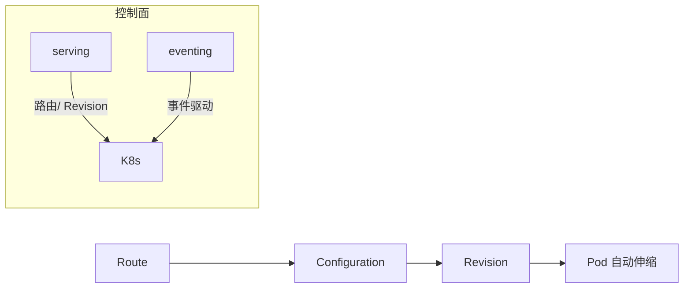
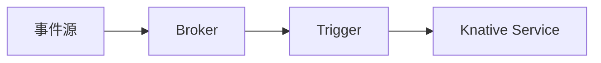

# Knative 与 Serverless 容器实战

> Serverless 容器让应用"按需运行、缩容到零、按用量计费"，特别适合流量波峰波谷明显的场景。Knative 是基于 Kubernetes 的 Serverless 平台，本文讲解其架构、自动伸缩与落地实践。

## 1. Serverless 容器解决什么

| 传统 Deployment | Serverless 容器 |
| --- | --- |
| 常驻副本，空闲也占资源 | 无流量缩容到零 |
| 手动/HPA 扩缩 | 自动基于请求数扩缩 |
| 按节点时长计费 | 按实际用量计费 |
| 启动慢 | 冷启动优化 |

核心价值：降本（闲置不花钱）+ 弹性（自动应对峰值）。

## 2. Knative 组成



- **Serving**：管理服务版本（Revision）、流量路由、自动伸缩。
- **Eventing**：事件驱动模型（Broker/Trigger/Subscription）。

## 3. 核心概念

- **Revision**：每次部署的不可变快照（类似镜像版本）。
- **Configuration**：指向当前 Revision，更新触发新 Revision。
- **Route**：把流量分配到 Revision，支持灰度（如 90% 新 / 10% 旧）。
- **Service**：Knative Service（不同于 K8s Service），整合 Configuration + Route。

## 4. 自动伸缩（KPA）

Knative 默认 KPA（Knative Pod Autoscaler）：

```yaml
apiVersion: serving.knative.dev/v1
kind: Service
metadata:
  name: hello
spec:
  template:
    metadata:
      annotations:
        autoscaling.knative.dev/minScale: "0"
        autoscaling.knative.dev/maxScale: "10"
        autoscaling.knative.dev/target: "100"  # 每Pod目标并发
    spec:
      containers:
      - image: ghcr.io/knative/helloworld
```

- `minScale: 0` → 无流量时缩容到零。
- 基于并发（concurrency）或 RPS 伸缩。
- 冷启动：从零拉起 Pod，需优化镜像与启动速度。

## 5. 流量灰度

```yaml
spec:
  traffic:
  - revisionName: hello-v1
    percent: 90
  - revisionName: hello-v2
    percent: 10
```

- 多 Revision 按比例分流，实现金丝雀。
- 也可基于请求头/标签路由（tagged route）。

## 6. Eventing 事件驱动



- Broker 接收事件，Trigger 按条件过滤分发。
- 适合"事件→处理函数"模式（如对象存储上传触发处理）。

## 7. 冷启动优化

| 手段 | 说明 |
| --- | --- |
| 小镜像 | 减少拉取时间（distroless/scratch） |
| 常驻预热 | 设 minScale >=1 保活 |
| 快速框架 | 轻量运行时（如 quarkus/go） |
| 镜像预热 | 节点预拉镜像 |

## 8. 适用场景

✅ 适合：Webhook、定时任务、异步处理、流量波动大的 API。
❌ 不适合：长连接（WebSocket 长驻）、需要常驻状态、超长任务（受超时限制）。

## 9. 与 FaaS 对比

| 维度 | Knative | 云 FaaS |
| --- | --- | --- |
| 部署 | 自管 K8s | 全托管 |
| 灵活 | 高（任意容器） | 受限运行时 |
| 运维 | 自己扛 | 厂商扛 |
| 成本 | 按用量 | 按用量 |

## 10. 常见坑

| 坑 | 现象 | 对策 |
| --- | --- | --- |
| 冷启动慢 | 首请求超时 | 预热/minScale |
| 缩容到零抖动 | 频繁启停 | 设最小副本 |
| 长连接不支持 | 断开 | 非 Serverless 部署 |
| 镜像大 | 拉取慢 | 精简镜像 |

## 11. 面试题

1. Knative Serving 的核心概念？
2. 缩容到零如何实现？
3. KPA 基于什么指标伸缩？
4. 如何做 Knative 灰度发布？
5. Serverless 适合哪些场景？
6. 冷启动如何优化？

## 12. 小结

Knative 把 Serverless 能力建在 K8s 之上：Revision 做版本管理，KPA 做自动伸缩（缩容到零），Route 做流量灰度，Eventing 做事件驱动。降本与弹性显著，但需正视冷启动与长连接限制。
