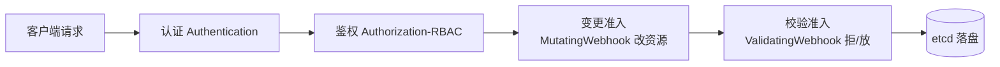
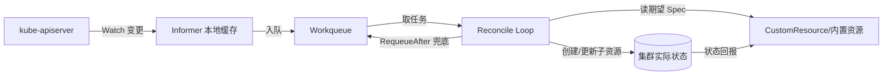
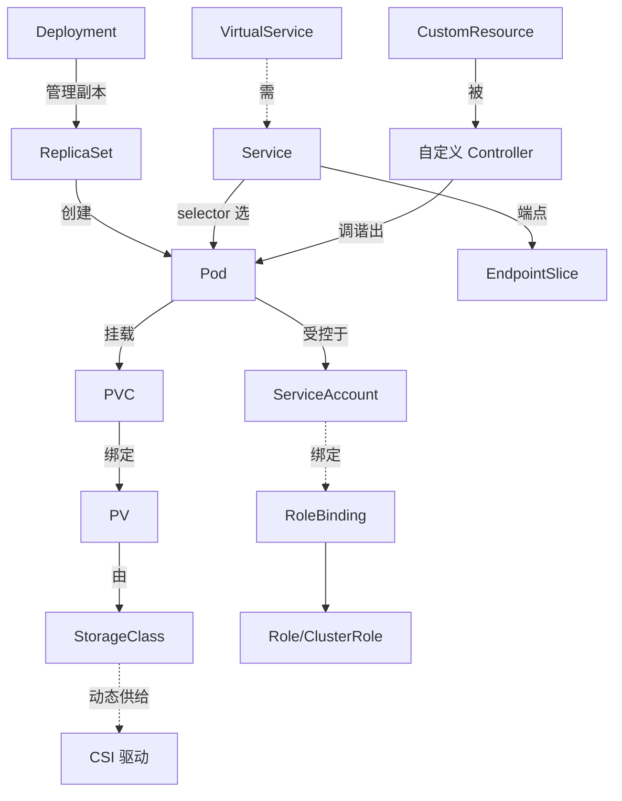

# Kubernetes 核心

## 〇、本体介绍

**Kubernetes（K8s）是什么**：容器编排的事实标准。它把「在哪些节点上跑多少个容器、怎么暴露、挂了怎么拉起、流量怎么分发」从人工运维变成**声明式**的自动调谐——你描述「期望状态（Spec）」，控制器不断把「实际状态（Status）」向 Spec 拉齐。

**解决什么痛点**：容器多了以后，谁调度、谁发现、谁负载均衡、谁自愈、谁扩缩容、谁灰度发布——纯手工或脚本不可持续。K8s 提供一套统一的编排原语。

**核心概念**：Pod（最小调度单元）、Deployment/StatefulSet/DaemonSet（工作负载）、Service（稳定入口）、Namespace（隔离）、ConfigMap/Secret（配置）、PV/PVC（存储）、CRD/Operator（扩展）。

**适用场景**：微服务、弹性 Web 服务、有状态中间件、批处理（Job/CronJob）、多环境一致交付。
**不适用场景**：单机小项目（杀鸡用牛刀）、强隔离多租户（需配合虚拟化）、对调度延迟极敏感（调度约 100 pods/s 量级）。

> 关联：本文件是 `云原生/K8S.md`（早期截图笔记）的结构化文字版，截图里看不清的图在此以文字 + 表格补完。

---

## 一、架构总览：控制平面 + 工作节点

**控制平面（Control Plane）**
- **kube-apiserver**：所有操作的唯一入口（kubectl、控制器、kubelet 都打它），负责鉴权、校验、把状态写进 etcd。可水平扩展（多实例 + LB）。
- **etcd**：集群唯一事实源，存全部状态（Pod/Service/Secret/Node…），用 **Raft** 保证一致与复制。单点风险高，必须备份 + 多副本高可用。
- **kube-scheduler**：监听「新创建、未分配节点」的 Pod，挑节点。两阶段：**Filter（过滤不可行节点）→ Score（给可行节点打分）→ Bind**。
- **kube-controller-manager**：跑一堆控制器循环（ReplicaSet 保副本数、Node 检故障、Endpoint 维护…），实现「期望 vs 实际」的调谐。

**工作节点（Node）**
- **kubelet**：节点代理，确保 PodSpec 描述的容器真正跑起来并健康，向 API Server 上报状态。
- **kube-proxy**：在节点上维护 Service 转发规则（iptables 或 IPVS 模式）。
- **容器运行时**：containerd / CRI-O（K8s 1.24 起不再内置 Docker，走 CRI 标准）。

---

## 二、声明式 API 的本质：Spec / Status / Reconcile

- 你写 YAML 描述 **Spec**（如 `replicas: 3`）；集群实时汇报 **Status**（如 `readyReplicas: 2`）。
- 控制器**无限循环**地对比 diff，直到 Status 与 Spec 一致——这就是声明式系统的心脏，区别于「下一条命令就完事」的命令式。

> 例子：Deployment 说要 3 个副本，ReplicaSet Controller 发现只有 2 个，就创建第 3 个，直到对齐。

---

## 三、Pod：最小调度单元

- **本质**：一组**共享 Network/IPC Namespace、可共享 Volume** 的容器（典型是「1 业务容器 + 1 sidecar」）。
- **Pod 内共享**：同一 IP、端口空间、IPC；通过 `volumes` 声明的卷可被多容器挂载（如 sidecar 采集日志）。
- **Init 容器**：普通容器启动前**串行**跑、且必须全成功，适合做前置依赖检查（如 `while ! nc -z mysql 3306` 等 DB 就绪）。
- **两种 Pod**：自主式（无控制器，挂了不重建，仅测试）；受控式（Deployment/StatefulSet/DaemonSet 管理，自愈、弹性、滚动更新）。

### Pod 生命周期阶段
`Pending`（已接收但未调度/镜像未拉完）→ `ContainerCreating` → `Running`（至少一个容器在跑）→ `Succeeded` / `Failed`。`Unknown` 多为节点通信失败。

### 探针（Probe）
- **liveness**：失败 → **重启容器**，用于检测「死锁等无法自愈」状态。
- **readiness**：失败 → **不重启**，只是把 Pod 从 Service Endpoints 摘除，停止收新流量，用于「初始化中 / 依赖未就绪」。
- **startup**：保护慢启动应用，启动阶段前不触发 liveness。

> 经典坑：把「是否就绪」误配成 liveness，导致初始化慢的 Pod 被反复重启。

---

## 四、工作负载类型

| 类型 | 适用 | 关键特征 |
|------|------|---------|
| Deployment | 无状态（Web） | 滚动更新、回滚、副本 |
| StatefulSet | 有状态（DB） | 稳定网络标识、持久存储、有序扩缩 |
| DaemonSet | 每节点一个（agent） | 日志采集、Node Exporter、安全 agent |
| Job / CronJob | 批处理 / 定时 | 跑完即止 / 周期执行 |

---

## 五、调度流程（Filter → Score → Bind）

1. **Filter（可行性）**：CPU/内存够不够？Pod 是否能容忍节点 Taint？是否匹配 nodeSelector/nodeAffinity？所需卷在节点可用？是否到 Pod 上限？
2. **Score（打分，0~100）**：资源均衡（偏好整体利用率均匀）、软亲和/反亲和、拓扑分布（TopologySpread）、镜像本地性（已有镜像的节点加分）。
3. **Bind**：选最高分节点绑定。典型吞吐约 100 pods/s。

### 亲和 / 反亲和 / 污点
- **NodeSelector**：精确匹配标签。
- **NodeAffinity**：规则化地「偏好/必须」某些节点。
- **PodAffinity / AntiAffinity**：把 Pod 拉近 / 打散到其他 Pod 附近（高可用）。
- **Taint / Toleration**：节点「污点」排斥 Pod，Pod 需「容忍」才能调度上去——用于隔离专用节点（如 GPU 节点）。

---

## 六、网络模型（三条铁律）

1. 每个 Pod 有自己独立的 IP。
2. 任意两个 Pod 通信**无需 NAT**。
3. 节点上的 agent 能与本节点所有 Pod 通信。

- **CNI（Container Network Interface）**：网络插件接口，实现 Pod 网络。主流：**Calico**（BGP 路由 + NetworkPolicy）、**Cilium**（eBPF，高性能 + 可观测）、**Flannel**（简单 VXLAN Overlay）。
- **Service**：稳定虚拟 IP（ClusterIP）按 label selector 负载到后端 Pod；Pod 增删时 Endpoints Controller 更新端点列表；kube-proxy 写 iptables/IPVS 规则转发。类型：ClusterIP / NodePort / LoadBalancer。
- **CoreDNS**：集群内 DNS，`my-service.default.svc.cluster.local` 可解析到 Service。

---

## 七、存储：PV / PVC / StorageClass

- **PV（PersistentVolume）**：集群级存储资源（由管理员或动态供给）。
- **PVC（PersistentVolumeClaim）**：Pod 对存储的「申领」。
- **StorageClass**：定义「动态供给」的存储类型（如云盘 SSD）。
- CSI（Container Storage Interface）：存储插件标准，对接各家云盘/NFS/Ceph。

> 对比容器可写层：PVC 挂载的卷**不随 Pod 删除而消失**，是有状态服务持久化的关键。

---

## 八、弹性：HPA / VPA / Cluster Autoscaler

- **HPA（Horizontal Pod Autoscaler）**：按 CPU / 内存 / 自定义指标扩缩 Pod 副本数。
- **VPA（Vertical）**：调整单个 Pod 的 request/limit（与 HPA 可能冲突，需设计）。
- **Cluster Autoscaler**：节点级扩缩（Pod 因资源不足 Pending 时加节点）。

---

## 九、滚动更新与零停机发布

- Deployment 滚动更新：先起新版本 Pod，readiness 通过后入 Service，再逐步替换旧 Pod。
- 关键参数：`maxUnavailable`（允许同时不可用的副本数）、`maxSurge`（允许超出期望的副本数）。零停机常设 `maxUnavailable=0`。
- readinessProbe 保证「真就绪才接流量」；出问题 `kubectl rollout undo` 一键回滚。

---

## 十、生产排障速查

| 现象 | 第一步 | 常见原因 |
|------|--------|---------|
| Pod `CrashLoopBackOff` | `kubectl logs --previous` | 应用崩溃、配置缺失、启动失败、资源受限（指数退避重启） |
| Pod `Pending` | `kubectl describe pod` / `get events` | 资源不足、缺 PVC、nodeSelector 不符、Taint 无 toleration、节点不可调度 |
| Service 不通 | `get svc` / `get endpoints` | selector 错、端点空、Pod 不健康 |
| Node `NotReady` | `describe node` | kubelet 挂、网络问题、disk/memory pressure |
| 集群内 DNS 失败 | 查 CoreDNS Pod / 日志 | CoreDNS 未就绪、网络策略、Service 连通 |
| 能通 Pod 但出不了外网 | 查 DNS / NetworkPolicy / NAT | 出网网关、防火墙、CNI 配置 |

---

## 十一、高可用控制平面

多 API Server（前加 LB）+ 多 Controller-Manager + 多 Scheduler + **高可用 etcd 集群**，消除单点。etcd 备份是「救命稻草」。

---

## 十二、与其他板块的关系

- **场景设计 / 稳定性三板斧**：liveness/readiness、HPA、滚动更新是限流/熔断/降级的落地载体。
- **架构 / 系统架构**：微服务、事件驱动在 K8s 上才有标准运行底座。
- **源码系列 / Nacos/Sentinel/RocketMQ**：以 Deployment/StatefulSet 形态运行，Service 提供稳定入口。
- **CI/CD / GitOps**：镜像构建 → Helm → GitOps 同步到集群。

---

## 十三、速查表

| 动作 | 命令 |
|------|------|
| 看 Pod | `kubectl get pod -o wide` |
| 看事件 | `kubectl get events --sort-by=.lastTimestamp` |
| 描述排障 | `kubectl describe pod <p>` |
| 看日志（上次） | `kubectl logs <p> --previous` |
| 进 Pod | `kubectl exec -it <p> -- sh` |
| 滚动状态 | `kubectl rollout status deploy/<d>` |
| 回滚 | `kubectl rollout undo deploy/<d>` |
| 扩缩容 | `kubectl scale deploy/<d> --replicas=5` |

---

## 面试高频问题（20+ 条）

1. **K8s 核心组件？** API Server（入口/状态）、etcd（Raft 状态存储）、Scheduler（调度）、Controller-Manager（调谐）、kubelet（节点代理）、kube-proxy（Service 规则）、容器运行时。
2. **为什么 API Server 是核心？** 所有 kubectl/控制器/kubelet 都打它，它做鉴权校验并写 etcd；可水平扩展。
3. **etcd 为什么是单点风险？** 它存全部集群状态，挂了新变更无法持久、调度/API 退化；必须多副本 + 备份。
4. **声明式 vs 命令式？** 声明式写「期望状态（Spec）」，控制器循环调谐；命令式是「下一条指令就完事」。
5. **Pod 内容器如何共享？** 共享 Network/IPC Namespace 与声明卷；故同 Pod 同 IP、可共享 emptyDir 日志卷。
6. **Init 容器作用？** 普通容器前串行、必须全成功，做前置依赖检查。
7. **Pod 生命周期阶段？** Pending→Running→Succeeded/Failed；CrashLoopBackOff 是启动即退、指数退避重启。
8. **liveness 和 readiness 区别？** liveness 失败重启容器（检测死锁）；readiness 失败摘流量不重启（检测就绪）。
9. **Deployment vs StatefulSet？** 无状态用 Deployment（副本互换）；有状态用 StatefulSet（稳定标识/存储/有序）。
10. **DaemonSet 用途？** 每节点跑一个（日志采集、Node Exporter、安全 agent）。
11. **调度两阶段？** Filter（过滤不可行）→ Score（0~100 打分）→ Bind（选最高分）。
12. **NodeAffinity / PodAntiAffinity？** 前者按标签偏好节点；后者把 Pod 打散到其他 Pod 附近做高可用。
13. **Taint / Toleration？** 节点污点排斥 Pod，Pod 需容忍才能调度；用于专用/GPU 节点隔离。
14. **K8s 网络三原则？** 每 Pod 一 IP、Pod 互通无 NAT、节点 agent 通本节点 Pod。
15. **CNI 是什么、常见插件？** 网络插件接口；Calico（BGP+策略）、Cilium（eBPF）、Flannel（VXLAN）。
16. **kube-proxy 的 iptables vs IPVS？** IPVS 哈希转发、大规模性能更好；iptables 链式匹配、规则多时变慢。
17. **Service 类型？** ClusterIP（集群内）、NodePort（节点端口）、LoadBalancer（云负载均衡）。
18. **PV/PVC/StorageClass？** PV 存储资源、PVC 申领、StorageClass 动态供给；CSI 对接存储后端。
19. **HPA 原理？** 按 CPU/内存/自定义指标自动调副本数；与 VPA（改 request/limit）可能冲突。
20. **零停机发布怎么做？** 滚动更新 + `maxUnavailable=0` + readinessProbe 保证就绪才接流量；可 `rollout undo` 回滚。
21. **Pod Pending 常见原因？** 资源不足、缺 PVC、nodeSelector 不符、Taint 无 toleration、节点不可调度。
22. **Pod 为什么不能被重新调度到别的节点？** 一旦调度落定，除非被删/节点故障/亲和策略，一般不挪；重建由控制器在新节点拉起新 Pod。
23. **CRI/CNI/CSI 区别？** 分别是容器运行时、网络、存储的接口标准。
24. **K8s 为什么弃用 Docker 运行时？** 1.24 起走 CRI 标准，用 containerd/CRI-O；镜像与 Dockerfile 仍通用。
25. **Operator 和 Controller 区别？** Operator = 业务级的 Controller，把领域运维知识编码进 CRD+调和循环（如 etcd-operator）。

---

## 十四、API 优先级与公平性（APF）

当集群同时涌来大量请求（CI 批量 apply、控制器风暴、恶意扫描），API Server 若不做流控会雪崩。APF 用 **FlowSchema + PriorityLevelConfiguration** 给请求分级、配额隔离：

- 每个请求按身份/资源/动词分到某个 `FlowSchema`（如 system:controller-manager 高优、anonymous 低优）。
- 每个优先级有「并发配额 + 排队队列」，低优先级被限流时**不影响**高优先级（如 kubelet 上报、控制器调谐）。
- 关键保护：`catch-all` 与 `exempt`：节点 kubelet、controller-manager 通常 exempt，避免自我封锁。

> 排障：集群「卡死、apply 报 429 Too Many Requests」多因 APF 配额太低或某 Flow 把配额占满，可调 `kubectl get flowschema/prioritylevelconfigurations`。

---

## 十五、准入控制（Admission Control）

请求经 API Server 认证/鉴权后、写 etcd 前，还要过**准入链**：



- **内置控制器**：`NamespaceLifecycle`、`ResourceQuota`、`LimitRanger`、`PodSecurity`（替代 PSP）、`ServiceAccount`、`NodeRestriction`。
- **动态 Webhook**：自定义校验/默认值。典型产品 **OPA/Gatekeeper**、**Kyverno**——把「必须带 resource limit」「只能从白名单仓库拉镜像」「禁止 privileged」写成策略即代码。
- **校验时机**：渲染/apply 阶段若违反策略直接拒绝，CI 与 ArgoCD 同步都会失败，从根本上挡住不合规配置。

```yaml
# 用 Kyverno 强制容器必须有 resource limit（示例策略意图）
validationFailureAction: enforce
rules:
- name: require-limits
  match:
    resources:
      kinds: [Pod]
  validate:
    message: "容器必须设置 resources.limits"
    pattern:
      spec:
        containers:
        - resources:
            limits:
              memory: "?*"
              cpu: "?*"
```

---

## 十六、QoS、驱逐与 OOM 机制

### 16.1 QoS 等级（决定「先杀谁」）

| 等级 | 条件 | 被杀优先级 |
|------|------|-----------|
| **Guaranteed** | requests==limits 且每个容器都设 | 最后被杀 |
| **Burstable** | 部分设了 request/limit | 中间 |
| **BestEffort** | 全没设 | 最先被杀（节点压力时） |

### 16.2 节点压力驱逐（kubelet 行为）

- kubelet 监控 `MemoryPressure` / `DiskPressure` / `PIDPressure`。
- 触发时按 **QoS 从低到高** 驱逐 Pod（先 BestEffort）；优雅终止（`terminationGracePeriodSeconds`）。
- `evictionHard` 阈值默认如 `memory.available<100Mi`、`nodefs.available<10%`。

### 16.3 OOM 两层

- **容器 OOM**：容器的 memory limit 超限 → cgroup OOM Killer 杀该容器，Pod 状态 `OOMKilled`，重启（CrashLoop 若反复）。
- **节点 OOM**：节点整体内存耗尽 → 内核 OOM Killer 按 oom_score 杀进程，常杀 BestEffort。
- 经验：**生产务必设 limits**（防止单 Pod 吃垮节点），且关键服务设 `Guaranteed`。

---

## 十七、调度器深入（Scheduling Framework）

原生调度不止 Filter→Score→Bind，1.19+ 引入**插件化框架**：

| 扩展点 | 作用 |
|--------|------|
| QueueSort | 决定 Pod 出队顺序 |
| PreFilter | 预处理/预检 |
| Filter | 可行性（原谓词） |
| PostFilter | 若 Filter 全失败，做抢占（Preemption） |
| Score | 打分（原优先级） |
| Reserve | 预留资源（防并发分配冲突） |
| Permit | 可暂停/批准/拒绝（如等待 webhook） |
| Bind | 真正绑定（可自定义绑定到扩展资源） |

- **抢占（Preemption）**：高优先级 Pending Pod 可驱逐低优先级 Pod 上位。
- **自定义调度器**：`spec.schedulerName: my-scheduler` 让特定 Pod 走自研调度器（如 GPU 拓扑亲和、批量调度 Volcano）。
- **性能**：调度吞吐约百 pods/s；大规模靠「等价节点打散 + 调度缓存 + 减少无用 Filter」优化。

---

## 十八、etcd 深入

- **Raft**：强一致共识，每次写需多数派（quorum）确认；leader 负责写，follower 复制。
- **WAL + Snapshot**：写先追加日志（WAL）再 Apply；定期快照压缩历史。
- ** compaction 与碎片**：etcd 保留历史版本，需定期 `compact` 否则 DB 膨胀；碎片用 `defrag` 回收（**defrag 会阻塞，生产在低峰做**）。
- **备份**：`etcdctl snapshot save` 是救命稻草；恢复需停 API Server 再 `snapshot restore`。
- **告警**：K8s 暴露 `etcd_db_total_size_in_bytes` 等，DB 超 8G 性能明显下滑。

```bash
ETCDCTL_API=3 etcdctl \
  --endpoints=https://127.0.0.1:2379 \
  --cacert=/etc/kubernetes/pki/etcd/ca.crt \
  --cert=/etc/kubernetes/pki/etcd/server.crt \
  --key=/etc/kubernetes/pki/etcd/server.key \
  snapshot save /backup/etcd-$(date +%s).db
```

---

## 十九、Service / EndpointSlice / Ingress 深入

- **EndpointSlice**：大规模下取代 Endpoints（一个 Svc 后端上千 Pod 时，Endpoints 单对象过大），按每段 ≤100 端点切片，降低 kube-proxy/watch 压力。
- **headless Service**（`clusterIP: None`）：返回 Pod IP 列表（用于 StatefulSet 稳定域名 `pod-0.svc`、或应用自己做客户端负载）。
- **ExternalName**：Service 直接 CNAME 到外部域名，无需 selector。
- **dual-stack**：K8s 支持 IPv4/IPv6 双栈，`Service` 可同时分配两类 VIP。
- **Ingress vs Gateway API**：Ingress 仅 L7 路由且靠注解扩展；Gateway API（Gateway/HTTPRoute/GPRCRoute）标准化、角色分离（基础设施团队管 Gateway、应用团队管 Route）、支持 TCP/gRPC/权重切分。

---

## 二十、安全：RBAC / ServiceAccount / Pod Security

- **RBAC**：`Role`（命名空间内）+ `ClusterRole`（集群级），通过 `RoleBinding`/`ClusterRoleBinding` 绑定到 `User/Group/ServiceAccount`。最小权限原则。
- **ServiceAccount**：Pod 访问 API Server 的身份；`automountServiceAccountToken: false` 关闭不必要的 token 挂载。
- **Pod Security Standards**：`Privileged` / `Baseline` / `Restricted` 三档，用 `Pod Security Admission` 在命名空间级强制（替代已废弃的 PSP）。生产建议至少 `Baseline`，关键负载 `Restricted`。

```yaml
apiVersion: v1
kind: Namespace
metadata:
  name: prod-apps
  labels:
    pod-security.kubernetes.io/enforce: restricted
    pod-security.kubernetes.io/enforce-version: latest
```

---

## 二十一、生产最佳实践 Checklist

| 维度 | 建议 |
|------|------|
| 控制平面 | 多副本 API Server + etcd（奇数 3/5）+ 定期备份 |
| 资源 | 所有容器设 requests/limits，关键服务 Guaranteed |
| 调度 | 用 nodeSelector/亲和把负载分散；GPU 节点用 Taint 隔离 |
| 自愈 | liveness 检测死锁、readiness 控制接流；HPA 抗波动 |
| 发布 | 滚动更新 `maxUnavailable=0`；重要变更用 Argo Rollouts 金丝雀 |
| 安全 | RBAC 最小权限、PSA Restricted、NetworkPolicy 默认拒绝 |
| 存储 | 有状态用 StatefulSet + PVC；生产 Retain + 快照 |
| 可观测 | Metrics/Logs/Traces 三件套；关键 SLO 告警 |
| 网络 | CNI 用 Calico/Cilium + IPVS；DNS ndots 调优 |
| 备份 | etcd 快照 + 应用数据（Velero 跨集群） |

---

## 二十二、速记口诀

> 口诀：**「API 先认后鉴权，准入 webhook 再把关；调度 Filter→Score→Bind，框架插件随便扩。QoS 定生死序，压力先杀 BestEffort；etcd 靠 Raft 保一致，backup/defrag 是命根。RBAC 最小权限、PSA 兜底、NetworkPolicy 零信任。」**

- 记住全景：**「声明式 Spec + 控制器调谐」是 K8s 的心脏**，一切能力（自愈/弹性/发布）都建在这套机制上。
- 排障心法：**「先问状态、再查事件、后看日志」**——`get` 看现状，`describe` 看 events，`logs` 看原因。

---

## 二十三、控制器模式本质与 Level-Triggered

K8s 所有自动化都建立在**「声明式 + 调谐循环」**上：

- **Level-Triggered（状态对齐）**：控制器只关心「当前实际状态 vs 期望状态」，不依赖事件流。即使某次事件丢了、或控制器重启，下次循环仍会收敛——这是 K8s 容错的根基。
- **边缘触发（Edge-Triggered）**：只在变化瞬间触发动作，事件丢了就永久偏离——K8s 不用它做核心逻辑。
- **Informer + Workqueue**：控制器的标准实现。Informer 通过 `List+Watch` 把资源缓存到本地（减少 API Server 压力），变更入 Workqueue，worker 取出来跑 Reconcile。Watch 断线自动 `List` 全量重建缓存。



> 推论：写控制器时**不要依赖「收到事件就一定处理」**，永远假设 Reconcile 可能被重复调用——代码必须幂等。

---

## 二十四、一次 `kubectl apply` 发生了什么

```
1. kubectl 读取 YAML → 做 client-side 或 server-side 的 diff/merge
2. 携带 kubeconfig 凭据访问 kube-apiserver
3. API Server：认证（你是谁）→ 鉴权（RBAC 是否允许）→ 准入（Mutating 改、Validating 拦）
4. 通过则写 etcd（持久化对象的 Spec）
5. 对应控制器（如 ReplicaSet/Deployment controller）Watch 到变更
6. 控制器调谐：创建 Pod 对象（仍只是 etcd 里的记录）
7. Scheduler Watch 到「未调度 Pod」→ Filter/Score/Bind → 写入 Pod.spec.nodeName
8. 目标节点 kubelet Watch 到自己节点的 Pod → 调 CRI 拉镜像、起容器
9. kubelet 上报 Pod 状态（Running/Ready）回 API Server
10. 若配 readinessProbe，通过后才进 Service Endpoints，开始接流量
```
理解这条链路，排障时就能定位「卡在哪一段」：是准入被拒（步骤3）、调度失败（步骤7）、还是 kubelet 起不来（步骤8）。

---

## 二十五、常见生产事故模式与预防

| 事故模式 | 触发 | 预防 |
|----------|------|------|
| 节点雪崩 | 某 Pod 无 limits 吃满内存 → 节点 OOM → 上面所有 Pod 被杀 | 全量设 limits |
| 滚动更新全断 | `maxUnavailable` 设大 + readinessProbe 误配 → 旧的全下线新的没就绪 | maxUnavailable=0 + 正确探针 |
| 配置错改全集群 | 直接 `kubectl edit` 生产资源 | GitOps + 保护分支 + 禁止手工改 |
| etcd 膨胀 | 频繁创建删除导致历史版本堆积 | 定期 compact + defrag + 监控 DB 大小 |
| 镜像 latest 漂移 | 用 `latest` tag，回滚/扩缩时拉到不同版本 | 用 commit SHA 不可变 tag |
| 调度不均 | 没配反亲和，副本挤在一两个节点 | PodAntiAffinity + TopologySpread |
| 证书过期 | kubeadm 证书 1 年有效期忘续 | 监控证书剩余 + `kubeadm certs renew` |

---

## 二十六、速记口诀（补充）

> 口诀：**「apply 走九步：认证鉴权准入过，etcd 落盘控制器调，调度绑定 kubelet 跑，就绪探针才接流。控制器靠 Informer 缓存 + Workqueue 重跑，Level-Triggered 不怕丢事件。」**

---

## 二十七、API 版本、弃用与升级纪律

- **API Group/Version**：资源带版本（如 `apps/v1`、`networking.k8s.io/v1`）。大版本升级常伴随 API 废弃（如 `extensions/v1beta1 Ingress` → `networking.k8s.io/v1`），升级前必须用 `kubectl get --raw /apis` 核对集群支持的版本。
- **废弃三阶段**：Alpha（默认关）→ Beta（默认开，可能改字段）→ GA（稳定，承诺兼容）。跨大版本升级时，**一次只升一个小版本**（如 1.26→1.27→1.28），不能跳，否则跳过的中间版本已删除的 API 会导致资源无法 apply。
- **Deprecated API 检查**：升级前用 `kubectl get` 全量扫一遍是否在用即将删除的 API（社区提供 `kubent` 等工具）。
- **升级顺序**：先升级控制平面（多副本滚动），再逐节点 `cordon/drain` 升级 kubelet/kube-proxy，最后确认所有系统组件（CNI、CSI、监控）兼容新版本——与「[K8s 运维实战](./K8s运维实战.md)」的升级 SOP 呼应。

---

## 二十八、一句话总览

> K8s 不是「更聪明的脚本」，而是一套**用声明式 API + 调谐循环把集群持续拉向期望状态**的分布式系统。理解「Spec/Status/Reconcile」这一核心范式，再叠加调度、网络、存储、安全、弹性四大支柱，就能在绝大多数生产场景里既知道怎么做、也知道为什么。细节深抠见本板块各深挖文档。

---

## 二十九、对象依赖关系速查



> 记住这条链：`Deployment→ReplicaSet→Pod→(PVC→PV / Service→EndpointSlice)`，再加「SA/RBAC 给身份、CRD/Operator 扩能力」，就是一份 K8s 对象关系全景。
