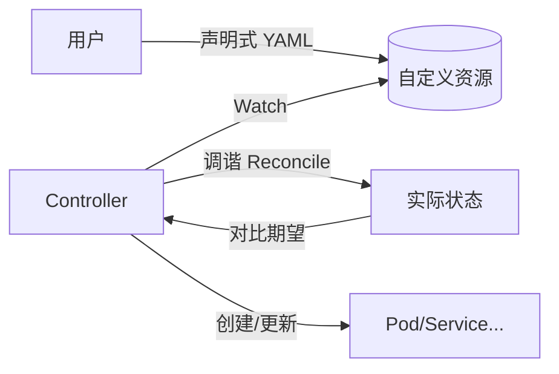

# Operator 与自定义控制器实战

> Kubernetes 的声明式 API 只内置了 Deployment/StatefulSet 等通用资源。当需要管理有状态复杂应用（数据库、消息队列、缓存），通用控制器不够用。Operator 用"自定义控制器 + CRD"把运维知识编码进代码，实现应用的自我管理。本文讲清原理与落地。

## 1. 什么是 Operator

Operator = **自定义资源（CRD）** + **自定义控制器（Controller）**，把"人类运维专家的知识"变成代码：



- 用户只声明"想要什么"（如 `replicas: 3`）。
- 控制器持续调谐，使实际状态逼近期望状态。

## 2. CRD：定义自己的资源

```yaml
apiVersion: apiextensions.k8s.io/v1
kind: CustomResourceDefinition
metadata:
  name: mysqls.db.example.com
spec:
  group: db.example.com
  names:
    kind: MySQL
    plural: mysqls
  scope: Namespaced
  versions:
  - name: v1
    served: true
    storage: true
    schema:
      openAPIV3Schema:
        type: object
        properties:
          spec:
            type: object
            properties:
              replicas: { type: integer }
              storage: { type: string }
```

## 3. 控制器核心：Reconcile 循环

```go
func (r *MySQLReconciler) Reconcile(ctx, req) (Result, error) {
    var m MySQL
    if err := r.Get(ctx, req.NamespacedName, &m); err != nil {
        return Result{}, client.IgnoreNotFound(err)
    }
    // 期望：N 个 Pod
    // 实际：查现有 Pod
    // 调谐：不足则创建，过多则删除
    if err := r.ensurePods(ctx, &m); err != nil {
        return Result{}, err
    }
    return Result{RequeueAfter: 30*time.Second}, nil
}
```

- **Watch**：监听 CR 及关联对象变化。
- **Reconcile**：幂等地把实际状态调谐到期望。
- **Requeue**：定期/事件触发重新调谐。

## 4. 状态机与状态上报

- CR 的 `status` 字段回报实际状态（Ready/Progressing/Failed）。
- 用户 kubectl get 即可见应用健康状况。
- 复杂应用应设计清晰状态机（如 MySQL: Initializing→Replicating→Ready）。

## 5. 运维逻辑编码

Operator 把原本由 SRE 手动执行的步骤自动化：
- 主从搭建、初始化。
- 备份（定时 Job）。
- 故障切换（选主、重建副本）。
- 版本升级（滚动/蓝绿）。
- 扩容（加副本、再均衡）。

## 6. 开发框架

| 框架 | 特点 |
| --- | --- |
| Kubebuilder | 官方推荐，脚手架完善 |
| Operator SDK | 基于 Kubebuilder，多语言支持 |
| KOP（Kubernetes Operator Pattern） | 手写也可 |

## 7. 与 Helm/Argo 的区别

| 工具 | 关注 |
| --- | --- |
| Helm | 模板化部署（无状态逻辑） |
| Argo CD | GitOps 同步（声明同步） |
| Operator | 有状态应用的自治管理 |

Operator 处理"运行时自治"，前两者处理"部署与同步"。

## 8. 高级模式

- **Webhook**： admission 校验/默认值（如限制不合理配置）。
- **Leader Election**：多副本控制器选主，避免冲突。
- **Finalizer**：删除前清理外部资源（如云盘）。
- **Rate Limit**：调谐限流，避免 API 风暴。

## 9. 常见坑

| 坑 | 现象 | 对策 |
| --- | --- | --- |
| Reconcile 非幂等 | 状态错乱 | 保证幂等 |
| 热循环 | CPU 打满 | 合理 Requeue |
| 状态不报 | 不可观测 | 完善 status |
| 删除卡住 | Finalizer 未清 | 正确清理 |
| 权限过大 | 安全风险 | 最小 RBAC |

## 10. 面试题

1. Operator 由哪两部分组成？
2. Reconcile 循环为什么必须幂等？
3. CRD 与内置资源的关系？
4. Operator 与 Helm 的区别？
5. Finalizer 的作用？
6. 如何避免控制器热循环？

## 11. 小结

Operator 把"运维专家知识"固化成代码：用 CRD 定义期望状态，用控制器持续调谐。它是 K8s 管理有状态复杂应用的标配，核心在于幂等的 Reconcile 与清晰的状态上报。
