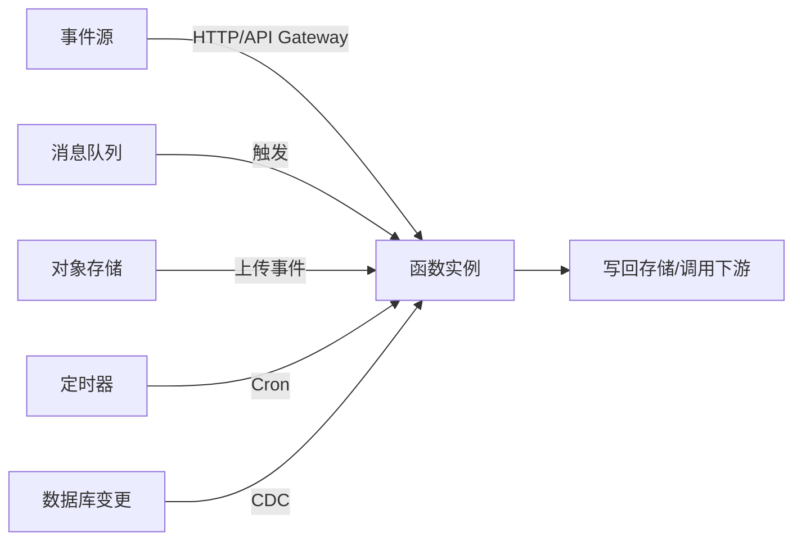

# Serverless 与 FaaS：无服务器架构

> 「你只写业务函数，其余全交给平台」——Serverless 把弹性伸缩、容量规划、服务器运维从开发者手里拿走，是云原生演进的下一站。本篇讲清 FaaS 的**原理（事件驱动 + 冷启动 + 生命周期）**、**主流实现（AWS Lambda / Knative / OpenFaaS）**、**成本模型**与**适用边界**。与「[容器与 Docker](容器与Docker.md)」「[Kubernetes 核心](Kubernetes核心.md)」「[可观测性](可观测性.md)」互链。

---

## 一、什么是 Serverless（无服务器）

**Serverless ≠ 没有服务器**，而是「服务器对你不可见、无需管理」。

| 能力 | 传统 | 容器/K8s | Serverless |
|------|------|----------|------------|
| 容量规划 | 手工评估 | 手动/自动伸缩 | **平台自动**（0→N） |
| 计费 | 按固定资源 | 按运行时长+资源 | **按调用次数×时长** |
| 运维 | 自己管 | 管集群 | **完全托管** |
| 启动时间 | — | 秒级 | 毫秒~秒级（冷启动） |
| 典型形态 | 虚机 | Pod/Deployment | **FaaS 函数 / BaaS 服务** |

> **BaaS**（Backend as a Service）：数据库、对象存储、认证、消息等托管服务（如 DynamoDB、Supabase）。**FaaS**（Function as a Service）：只写函数即部署。Serverless = FaaS + BaaS。

---

## 二、FaaS 核心原理

### 2.1 事件驱动模型



- 函数是**无状态的**：不持有内存状态（状态放外部存储）；
- 一个事件一次调用；平台负责并发实例伸缩；
- 触发源多样性是 FaaS 的杀手锏：网关/消息/定时/存储事件全都统一进函数。

### 2.2 生命周期与冷启动

```
事件到达 → 平台检查有无空闲实例
  ├─ 有 → 复用实例（热调用，毫秒级）
  └─ 无 → 冷启动：拉镜像/初始化运行时 → 执行初始化代码 → 执行处理函数
```

**冷启动优化三板斧**（面试必问）：

| 手段 | 原理 | 代价 |
|------|------|------|
| **预热（Warm Pool）** | 平台常驻 N 个空闲实例待命 | 费用 |
| **预留并发（Provisioned Concurrency）** | 指定函数常保 K 个实例 | 费用 |
| **快照启动** | 运行时快照/CRIU 恢复，跳过初始化 | 兼容性限制 |
| **应用层**：减小包体、延迟初始化（静态全局惰性化）、避免冷启动加载重库 | 免费 | 工程改造 |

> 实测参考：Lambda 冷启动几百 ms~秒级；初始化代码（连 SDK、加载模型）是主要开销，所以「**惰性初始化 + 预留并发**」是生产标配。

### 2.3 平台细节（以 AWS Lambda 为参照）

| 维度 | 说明 |
|------|------|
| 并发模型 | 每并发=1 实例；并发上限=各触发源配额 |
| 超时 | 默认 3s，可调至 15min（同步调用建议短超时） |
| 执行环境 | 沙箱容器 + 微虚机（microVM）隔离 |
| 弹性 | 突发可秒级拉起数百实例（削峰能力极强） |
| 限制 | 包体积、内存上限（如 10GB）、临时盘大小 |
| 幂等 | 平台至少一次投递，函数必须**幂等**处理 |

---

## 三、主流实现与选型

| 方案 | 形态 | 特点 | 适合 |
|------|------|------|------|
| **AWS Lambda** | 云托管 | 生态最全、触发源最多、免运维 | 公有云原生业务 |
| **阿里云函数计算 FC** | 云托管 | 国内生态、集成阿里系 | 国内公有云 |
| **Knative**（Serving/Eventing） | K8s 之上的 Serverless 层 | 自建 K8s 基础上获得自动伸缩（缩到 0） | 已有 K8s 集群、要私有化 |
| **OpenFaaS** | 自托管 | 轻量，Watchdog 把任意二进制变成函数 | 团队自运维 |
| **KEDA**（事件驱动伸缩器） | 不是 FaaS | 给普通 Deployment 加事件驱动 HPA（基于 MQ/HTTP 队列水位） | 不想函数化，只想弹性 |

> **决策**：能接受云厂商绑定 → Lambda/FC；数据主权/已有集群 → Knative（或 KEDA 弹性方案）。

### Knative 原理一句话

```
Knative = 流量打 0 的 Deployment + 按请求伸缩（KPA）+ 事件总线
请求到达 → Activator 唤醒 → 拉起 Pod → 转发；空闲 → 缩到 0
```

与普通 K8s 的差异：HPA 管「CPU 水位」，Knative 管「**请求数水位**」且支持缩到 0。

---

## 四、成本模型与适用边界

### 4.1 计费公式（FaaS 通用）

```
费用 = 请求次数 × 单价 + 执行时长(GB·s) × 单价 + 预留并发费用
```

- **密集流量**：跑满实例时，Serverless 通常**贵于**常驻容器（有单价溢价）；
- **稀疏流量**：按需付费 + 可缩到 0 → 成本碾压常驻；
- **波动巨大**（如秒杀、夜间报表）→ Serverless 削峰价值最大。

### 4.2 适合/不适合清单

| 适合 Serverless | 不适合 Serverless |
|-----------------|-------------------|
| 事件型任务：图片处理、Webhook、ETL 小步、定时任务 | 长连接/WebSocket 高并发 |
| 突发流量 API、胶水/编排层 | 超长运行任务（>15min） |
| 原型/内部工具 | 状态强、延迟极敏感的在线业务 |
| 削峰填谷（如双 11 瞬时波峰） | 强事务/分布式事务核心链路 |
| 成本波动型（低频高波动） | 成本敏感的大稳态流量 |

> **反模式**：把核心在线业务整体函数化（可观测性/延迟/成本全吃亏）；正确姿势是「**BaaS 化可托管件 + 函数做事件粘合 + 稳态服务用容器**」的混合架构。

---

## 五、工程实践与坑

| 坑 | 对策 |
|----|------|
| 冷启动拖慢首屏 | 预留并发 + 惰性初始化 + 热路径函数拆分 |
| 函数无状态被误解为「无依赖」 | 状态/缓存放 Redis/对象存储，连接池复用 |
| 幂等缺失导致重复处理 | 幂等键 + 去重表（与「[幂等设计](../场景设计/幂等设计.md)」联动） |
| 可观测性黑洞 | 结构化日志 + 分布式追踪（traceId 透传）+ 指标埋点 |
| 本地/云端不一致 | Serverless Framework / SAM 本地模拟调试 |
| 依赖打包笨重 | 分层（Layers）/自定义运行时精简依赖，冷启动提速 |

---

## 六、与其他板块的关联

- **云原生主线**：Serverless 是 [容器与 Docker](容器与Docker.md) → [Kubernetes 核心](Kubernetes核心.md) 之后的演进方向；Knative 直接跑在 K8s 上。
- **事件驱动**：FaaS 触发源与 [MQ](../基础知识/MQ.md)、CDC（Canal/Debezium）天然配合。
- **弹性与稳定性**：削峰能力与 [稳定性三板斧：限流-熔断-降级](../场景设计/稳定性三板斧：限流-熔断-降级.md) 互补——函数天然弹性，但下游仍要保护。
- **成本治理**：与 [大数据·成本优化](../基础知识/大数据/README.md) 同属「FinOps」话题。

---

## 七、面试高频追问（12+ 条）

1. Q：Serverless 真的没有服务器吗？ A：不是，是服务器对用户不可见、平台托管。
2. Q：FaaS 和 BaaS 区别？ A：FaaS 只写函数即部署；BaaS 是托管后端服务（DB/存储/认证）。
3. Q：冷启动是什么？ A：新实例从拉镜像/初始化到可处理请求的过程；热实例无此开销。
4. Q：怎么降低冷启动？ A：预留并发、惰性初始化、轻量依赖、快照启动。
5. Q：函数为什么要求无状态？ A：实例随机创建销毁、并发伸缩，本地状态不可靠；状态外置。
6. Q：FaaS 的并发怎么伸缩？ A：平台按事件速率自动扩缩实例，削峰能力远超手动。
7. Q：为什么说稳态流量用 Serverless 贵？ A：单价包含托管溢价，跑满实例时总成本高于容器。
8. Q：什么场景绝对不用 Serverless？ A：长连接、长任务、强事务、延迟极敏感的核心链路。
9. Q：Knative 与 HPA 区别？ A：HPA 按 CPU/内存水位；Knative 按请求数水位且能缩到 0。
10. Q：FaaS 与消息队列的关系？ A：MQ 常作触发源与削峰缓冲，函数消费事件（Kafka 触发/异步）。
11. Q：Serverless 函数怎么调试？ A：本地模拟（SAM/Serverless Framework）+ 结构化日志 + trace。
12. Q：限流在 Serverless 下怎么做？ A：网关限流 + 队列削峰 + 函数并发配额控制。
13. Q：Serverless 如何保证幂等？ A：事件去重（幂等键）+ 处理幂等化，平台只保证至少一次。
14. Q：KEDA 是 Serverless 吗？ A：不是 FaaS，是给现有 Deployment 加事件驱动的自动伸缩。
