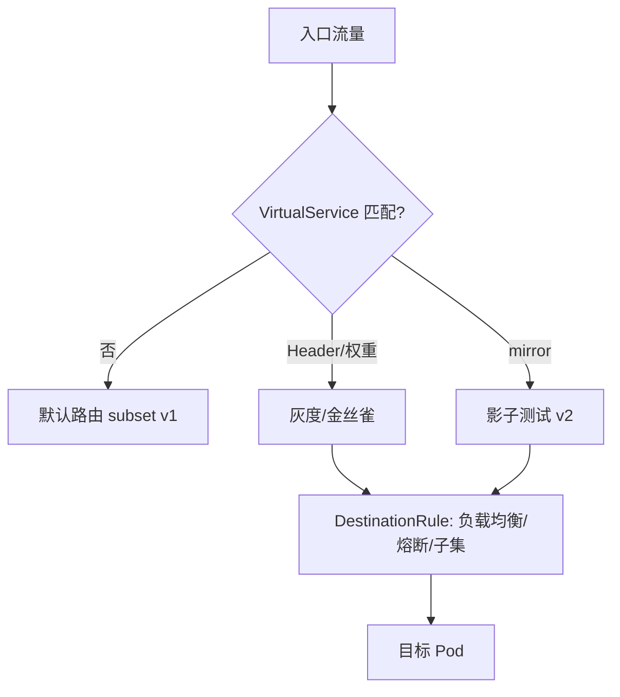
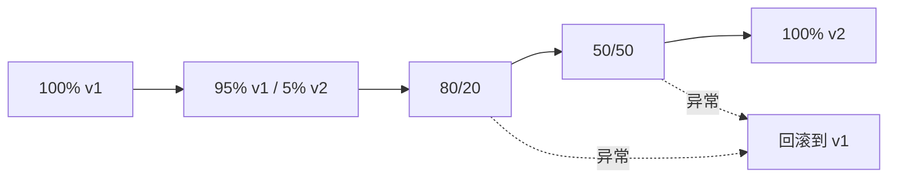
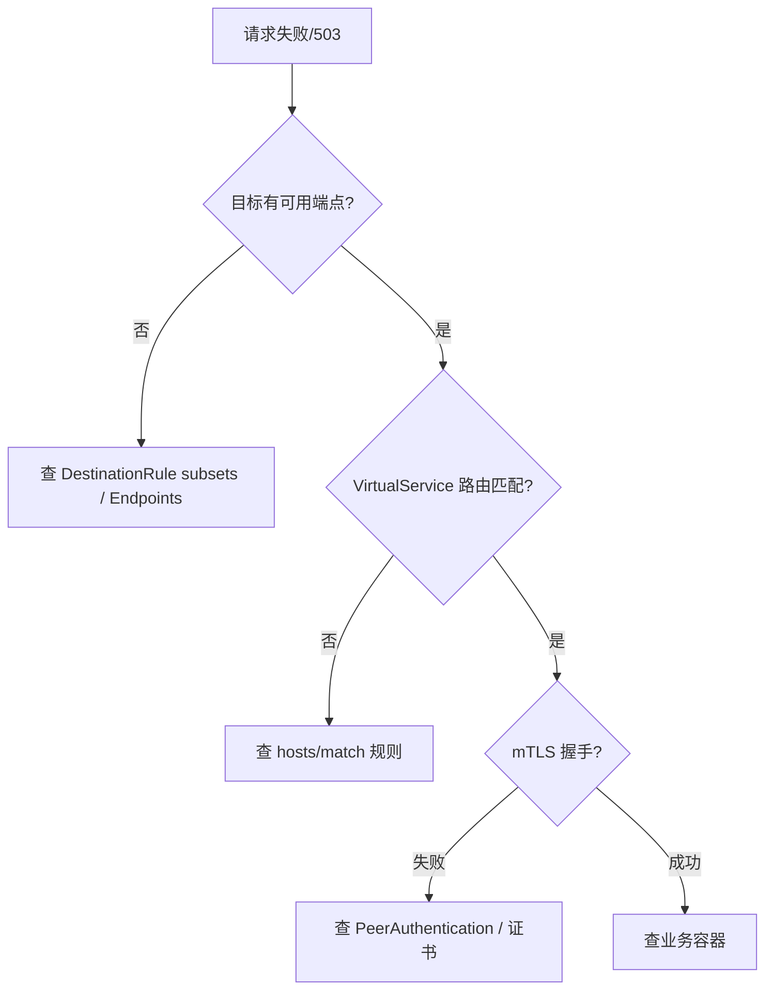

# Service Mesh（服务网格）（深入：Istio/Ambient/Wasm/性能/生产运维）

> 把微服务之间的**通信治理**从业务代码里**抽出来，下沉到独立的 Sidecar 代理网络层**。本篇深入拆解：Istio 详细配置实战、Ambient Mesh（无 Sidecar）、Wasm 扩展、性能 benchmark、生产运维经验。

---

## 一、为什么需要 Mesh

| 方案 | 治理位置 | 优点 | 缺点 |
|------|---------|------|------|
| SDK 框架内 | 业务进程内 | 延迟低、依赖少 | 每语言各写一套、升级改代码 |
| 服务网格（Sidecar） | 独立代理进程 | 语言无关、升级不停业务 | 多一跳延迟、运维复杂 |

> 一句话：**Mesh 用「部署与运维复杂度」换「语言无关的统一治理」**。

---

## 二、数据面与控制面

### 2.1 数据面（Envoy）

```
Envoy = 高性能 L4/L7 代理

核心能力：
  HTTP/1.1/2、gRPC、TCP 代理
  负载均衡（轮询/随机/最少请求/一致性哈希）
  熔断（连接池/请求超时/异常点检测）
  重试（可配置重试次数/条件/退避）
  超时（per-route timeout）
  灰度（按权重/Header/URI 路由）
  mTLS（自动证书签发/轮换）
  可观测（RED 指标 + 分布式 tracing）

性能：
  延迟：每跳 < 1ms（本地回环）
  吞吐：10万+ QPS（单核）
  内存：~50MB 基础 + 连接状态
```

### 2.2 控制面（Istio/istiod）

```
istiod = Pilot + Citadel + Galley（合并为单进程）

Pilot：服务发现 + 路由配置下发
  → 读取 K8s Service/VirtualService/DestinationRule
  → 编译为 Envoy xDS 配置
  → 推送到所有 Envoy Sidecar

Citadel：证书管理
  → 基于 SPIFFE 签发 mTLS 证书
  → 自动轮换（默认 24h）

Galley：配置验证
  → 校验 VirtualService/DestinationRule 语法
  → 防止错误配置破坏网格
```

---

## 三、Sidecar 注入与流量拦截

### 3.1 自动注入

```bash
# 命名空间打标签
kubectl label namespace default istio-injection=enabled

# 验证注入
kubectl get pods -n default -o jsonpath='{.items[*].spec.containers[*].name}'
# 输出：app container + istio-proxy（Sidecar）

# 手动注入（不改命名空间标签）
kubectl apply -f <(istioctl kube-inject -f deployment.yaml)
```

### 3.2 流量拦截原理

```
Init 容器（istio-init）配置 iptables：
  入站流量：PREROUTING → REDIRECT → Envoy 15006 端口
  出站流量：OUTPUT → REDIRECT → Envoy 15001 端口

应用看到的：
  入站：以为自己收到请求（实际是 Envoy 转发）
  出站：以为自己发出请求（实际经过 Envoy）

端口分配：
  15001：Envoy 出站监听
  15006：Envoy 入站监听
  15009：Envoy 管理端口
  15020：Envoy Prometheus 指标
  15021：健康检查
```

---

## 四、Istio 流量治理实战

### 4.1 VirtualService（路由）

```yaml
# 灰度发布：90% 旧版本 / 10% 新版本
apiVersion: networking.istio.io/v1beta1
kind: VirtualService
metadata:
  name: order-service
spec:
  hosts:
  - order-service
  http:
  - route:
    - destination:
        host: order-service
        subset: v1
      weight: 90
    - destination:
        host: order-service
        subset: v2
      weight: 10
    timeout: 5s
    retries:
      attempts: 3
      perTryTimeout: 2s
      retryOn: gateway-error,connect-failure,refused-stream

---
# 基于 Header 路由
apiVersion: networking.istio.io/v1beta1
kind: VirtualService
metadata:
  name: order-service
spec:
  hosts:
  - order-service
  http:
  - match:
    - headers:
        x-user-type:
          exact: "vip"
    route:
    - destination:
        host: order-service
        subset: v2
  - route:
    - destination:
        host: order-service
        subset: v1
```

### 4.2 DestinationRule（负载均衡/熔断）

```yaml
apiVersion: networking.istio.io/v1beta1
kind: DestinationRule
metadata:
  name: order-service
spec:
  host: order-service
  trafficPolicy:
    connectionPool:
      tcp:
        maxConnections: 100
      http:
        h2UpgradePolicy: DEFAULT
        http1MaxPendingRequests: 100
        http2MaxRequests: 1000
        maxRequestsPerConnection: 10
    outlierDetection:
      consecutive5xxErrors: 5
      interval: 30s
      baseEjectionTime: 30s
      maxEjectionPercent: 50
    loadBalancer:
      simple: LEAST_REQUEST  # 轮询/随机/最少请求/一致性哈希
  subsets:
  - name: v1
    labels:
      version: v1
  - name: v2
    labels:
      version: v2
```

### 4.3 Gateway（南北向入口）

```yaml
apiVersion: networking.istio.io/v1beta1
kind: Gateway
metadata:
  name: api-gateway
spec:
  selector:
    istio: ingressgateway
  servers:
  - port:
      number: 443
      name: https
      protocol: HTTPS
    tls:
      mode: SIMPLE
      credentialName: api-tls-secret
    hosts:
    - "api.example.com"
```

### 4.4 AuthorizationPolicy（零信任）

```yaml
# 只允许 order-service 调用 payment-service
apiVersion: security.istio.io/v1beta1
kind: AuthorizationPolicy
metadata:
  name: payment-service
  namespace: default
spec:
  selector:
    matchLabels:
      app: payment-service
  rules:
  - from:
    - source:
        principals: ["cluster.local/ns/default/sa/order-service"]
    to:
    - operation:
        methods: ["POST"]
        paths: ["/api/pay"]
```

---

## 五、Ambient Mesh（无 Sidecar，2024+）

```
Ambient Mesh = 去掉 Sidecar 的 Istio 架构

核心变化：
  - 不再注入 Sidecar 容器
  - 用节点级 ztunnel（L4 代理）替代 Pod 级 Envoy
  - 需要 L7 策略时，按需部署 waypoint proxy

优势：
  - 降低资源开销（不再每 Pod 一个 Envoy）
  - 简化运维（无需管理 Sidecar 注入）
  - 减少 Pod 启动时间（无需等 Sidecar 就绪）

适用：
  - 大规模集群（数千 Pod）
  - 资源敏感场景
  - 渐进式迁移
```

---

## 六、Wasm 扩展

```
Envoy Wasm = 用 WebAssembly 扩展 Envoy 功能

优势：
  - 语言无关（Go/Rust/C++ 编译为 Wasm）
  - 沙箱隔离（安全）
  - 热加载（无需重启 Envoy）

场景：
  - 自定义鉴权逻辑
  - 自定义限流算法
  - 自定义协议解析
  - 请求/响应修改

工具链：
  - Proxy-Wasm SDK（Rust/Go/C++）
  - Envoy Wasm Plugin 示例
  - wasme（Wasm 插件管理工具）
```

---

## 七、性能与 Benchmark

### 7.1 延迟开销

| 场景 | 无 Mesh | 有 Mesh（Sidecar） | 开销 |
|------|---------|-------------------|------|
| HTTP 简单代理 | 1ms | 1.5ms | +0.5ms |
| gRPC 调用 | 0.8ms | 1.2ms | +0.4ms |
| mTLS 全加密 | 1ms | 1.8ms | +0.8ms |
| 复杂路由+重试 | 1ms | 2ms | +1ms |

### 7.2 资源开销

| 资源 | 无 Mesh | 有 Mesh | 开销 |
|------|---------|---------|------|
| CPU（空闲） | 基线 | +0.1 core/Pod | Envoy 空闲 CPU |
| CPU（高流量） | 基线 | +0.3~1 core/Pod | Envoy 处理开销 |
| 内存 | 基线 | +50~80 MB/Pod | Envoy 基础内存 |
| Pod 启动时间 | 5s | 8~12s | Sidecar 启动 |

### 7.3 优化建议

```
1. 资源限制：给 Sidecar 设 requests/limits（防饿死业务容器）
2. 连接池：调 connectionPool 参数（减少连接创建开销）
3. mTLS 精简：非敏感流量用 PERMISSIVE 模式
4. 采样率：trace 采样率调低（如 1%）减少开销
5. 选择性注入：只给需要治理的 Pod 注入 Sidecar
6. Ambient Mesh：大集群考虑无 Sidecar 方案
```

---

## 八、生产运维经验

### 8.1 常见问题

| 问题 | 排查 |
|------|------|
| Pod 启动慢 | Sidecar 未就绪 → 检查 istio-proxy 状态 |
| 503 错误 | 目标服务无可用端点 → 检查 DestinationRule subsets |
| 连接超时 | 路由未配置 → 检查 VirtualService hosts |
| mTLS 握手失败 | 证书过期 → 检查 istiod 证书签发 |
| 内存暴涨 | Envoy 连接数过多 → 检查 connectionPool |

### 8.2 监控告警

```yaml
# 关键 Prometheus 指标
istio_requests_total              # 总请求数
istio_request_duration_milliseconds  # 请求延迟
istio_request_bytes               # 请求大小
istio_tcp_connections_opened_total    # TCP 连接数
envoy_cluster_upstream_cx_active  # Envoy 上游活跃连接

# 告警规则
- alert: High5xxRate
  expr: rate(istio_requests_total{response_code=~"5.*"}[5m]) / rate(istio_requests_total[5m]) > 0.05
  for: 5m
  labels:
    severity: critical
```

---

## 十、流量管理进阶（镜像/故障注入/重试超时）

### 10.1 流量镜像（Shadow / Mirror）

把线上流量**复制一份**发给测试版本，不影响真实用户，用于验证新版本正确性。

```yaml
apiVersion: networking.istio.io/v1beta1
kind: VirtualService
metadata:
  name: order-service
spec:
  hosts: [order-service]
  http:
  - route:
    - destination: { host: order-service, subset: v1 }
      weight: 100
    mirror:
      host: order-service
      subset: v2          # 镜像到 v2，响应被丢弃
    mirrorPercentage:
      value: 100          # 复制 100% 流量做影子测试
```

### 10.2 故障注入（混沌/演练）

```yaml
apiVersion: networking.istio.io/v1beta1
kind: VirtualService
metadata:
  name: order-service
spec:
  hosts: [order-service]
  http:
  - fault:
      delay:
        percentage: { value: 50 }     # 50% 请求注入延迟
        fixedDelay: 3s
      abort:
        percentage: { value: 10 }     # 10% 请求直接返回 500
        httpStatus: 500
    route:
    - destination: { host: order-service, subset: v1 }
```

### 10.3 重试与超时（防御下游抖动）

```yaml
apiVersion: networking.istio.io/v1beta1
kind: VirtualService
metadata:
  name: order-service
spec:
  hosts: [order-service]
  http:
  - timeout: 2s
    retries:
      attempts: 3
      perTryTimeout: 1s
      retryOn: "5xx,reset,connect-failure,refused-stream"
    route:
    - destination: { host: order-service, subset: v1 }
```

> 经验：重试要配合**令牌桶/幂等**，避免重试风暴放大下游压力（与「[稳定性三板斧](../场景设计/稳定性三板斧：限流-熔断-降级.md)」联动）。

### 10.4 路由决策图



---

## 十一、mTLS 深入（SPIFFE/SPIRE 与证书轮换）

Istio 的零信任基于 **SPIFFE** 身份：每个工作负载拿到形如 `spiffe://cluster.local/ns/default/sa/order-service` 的身份，证书由 Citadel/istiod 签发并**自动轮换**（默认 24h）。

| 模式 | 行为 |
|------|------|
| `PERMISSIVE` | 同时接受 mTLS 与明文（迁移期用） |
| `STRICT` | 强制 mTLS（生产最终态） |
| `DISABLE` | 关闭 mTLS |

```yaml
apiVersion: security.istio.io/v1beta1
kind: PeerAuthentication
metadata:
  name: default
  namespace: default
spec:
  mtls:
    mode: STRICT            # 命名空间内强制 mTLS
---
apiVersion: security.istio.io/v1beta1
kind: PeerAuthentication
metadata:
  name: payment
spec:
  selector: { matchLabels: { app: payment } }
  mtls:
    mode: STRICT
```

证书轮换对应用**透明**（Envoy 热加载），无需重启业务容器。排查握手失败看 `istiod` 日志与 `SPIFFE` 身份匹配。

---

## 十二、可观测性集成（指标/追踪联动）

Service Mesh 自动产生 RED 指标与分布式追踪，无需改业务代码。

```yaml
# 开启 Sidecar 访问日志与追踪采样
apiVersion: telemetry.istio.io/v1alpha1
kind: Telemetry
metadata:
  name: mesh-default
  namespace: istio-system
spec:
  tracing:
  - providers:
    - name: otel
    randomSamplingPercentage: 10     # 采样率 10%
  accessLogging:
  - providers: [{ name: envoy }]
```

关键指标（接「[可观测性](./可观测性.md)」的 Prometheus/Grafana）：
- `istio_requests_total`：请求计数（按服务/响应码/版本）。
- `istio_request_duration_milliseconds`：延迟分布。
- `istio_tcp_connections_opened_total`：连接数。
- Envoy 自带的 `envoy_cluster_upstream_cx_active` 等。

---

## 十三、灰度发布策略（渐进式交付）



渐进式要点：
- 先用 `weight` 小流量（5%）观察错误率/延迟。
- 配合 `DestinationRule` 的子集做版本隔离。
- 结合「[Argo Rollouts](../... ) / Flagger」做自动分析与自动推进/回滚（见「[GitOps](./GitOps.md)」）。

---

## 十四、性能调优进阶与排障流程

### 14.1 调优清单

| 项 | 建议 |
|----|------|
| Sidecar 资源 | 给 `istio-proxy` 设 requests/limits（防饿死业务） |
| 连接池 | 调 `connectionPool` 减少握手开销 |
| mTLS | 非敏感链路用 `PERMISSIVE` 过渡 |
| 采样率 | trace 采样 1%~10%（详见可观测性） |
| 注入范围 | 只给需治理的 Pod 注入 |
| Ambient | 大集群考虑去 Sidecar（见 §五） |

### 14.2 排障流程



---

## 十五、迁移策略与生产 Checklist

**迁移到 Mesh 的渐进路线**：
1. 先装控制面，命名空间不打 `istio-injection`，零影响。
2. 选一个非核心服务，开 `PERMISSIVE` 注入 Sidecar，验证流量。
3. 逐步推广，关键服务间开启 `STRICT` mTLS + AuthorizationPolicy。
4. 复杂路由/灰度/熔断迁移到 VirtualService/DestinationRule。
5. 大集群评估 Ambient 降本。

**生产 Checklist**：
- [ ] Sidecar 资源已设限额
- [ ] mTLS 最终态 `STRICT`，迁移期 `PERMISSIVE`
- [ ] 关键服务 AuthorizationPolicy 已配（零信任）
- [ ] 重试/超时已配且幂等
- [ ] 指标/追踪接入 Grafana/可观测
- [ ] 采样率合理（避免开销）
- [ ] 排障 runbook 就绪

**速记口诀**：
> 数据面 Envoy 扛治理，控制面 istiod 下配置；iptables 拦流量，xDS 推规则；mTLS 靠 SPIFFE 自动轮换；灰度靠 VS 权重，隔离靠 AuthorizationPolicy；大集群上 Ambient 降本。

---

## 九、与其他板块的关系

- Kubernetes 核心见「[Kubernetes 核心](./Kubernetes核心.md)」；
- Envoy 代理见「[Envoy 服务代理](../基础知识/中间件/Envoy服务代理.md)」；
- 可观测性见「[OpenTelemetry](../基础知识/中间件/OpenTelemetry.md)」；
- 微服务治理见「[微服务治理全链路](../架构/微服务治理全链路.md)」。

> 一句话：**Service Mesh = Envoy（数据面）+ istiod（控制面）——Sidecar 透明拦截流量做治理（灰度/熔断/mTLS/可观测）；Ambient Mesh 去 Sidecar 降开销；生产核心：资源限制 + 连接池调优 + 选择性注入 + 采样率控制**。
