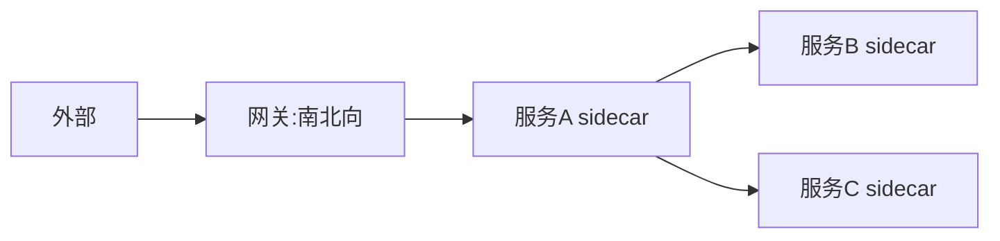

# Service Mesh 与网关协同实战

> 网关管"南北向"（外部↔集群），Service Mesh 管"东西向"（服务↔服务）。两者职责不同但都做流量治理。协同得当：网关做边缘认证限流，Mesh 做内部细粒度路由、mTLS、熔断，避免能力重复或真空。

## 1. 职责划分



| 层 | 负责 | 不做 |
| --- | --- | --- |
| 网关 | 边缘认证、WAF、限流、协议终结 | 服务间细粒度 |
| Mesh | 服务发现、mTLS、重试、熔断、灰度 | 外部暴露 |

## 2. 协同要点

- **认证边界**：网关做外部身份（JWT/OAuth），Mesh 做服务身份（mTLS）。
- **流量染色透传**：网关打标，Mesh 按标路由，全链路一致。
- **限流分层**：网关挡总量，Mesh 挡服务级。
- **可观测统一**：traceId 跨网关与 Mesh 贯穿。

## 3. 灰度协同

```text
网关(按用户%) → 服务A(v2) sidecar
                     → 调用服务B: Mesh按header路由到B(v2)
```
- 网关决定入口比例，Mesh 保证下游同版本链路。
- 配合泳道/环境路由，避免版本错配。

## 4. 常见坑

| 坑 | 现象 | 对策 |
| --- | --- | --- |
| 能力重复 | 双限流冲突 | 边界清晰 |
| 双跳延迟 | 变慢 | 合理分层 |
| trace 断 | 难排查 | 统一 traceId |
| 配置冲突 | 路由错 | 单一事实源 |
| mTLS 误 | 调用失败 | 证书管理 |

## 5. 面试题

1. 网关和 Mesh 如何分工？
2. 灰度如何在两者协同？
3. 认证边界怎么划？
4. 为什么不能都放网关？
5. 全链路 trace 如何打通？

## 6. 小结

网关 + Mesh = 南北向与东西向共治。核心是"边界清晰、染色透传、指标统一"，各管一段不重叠不真空。
