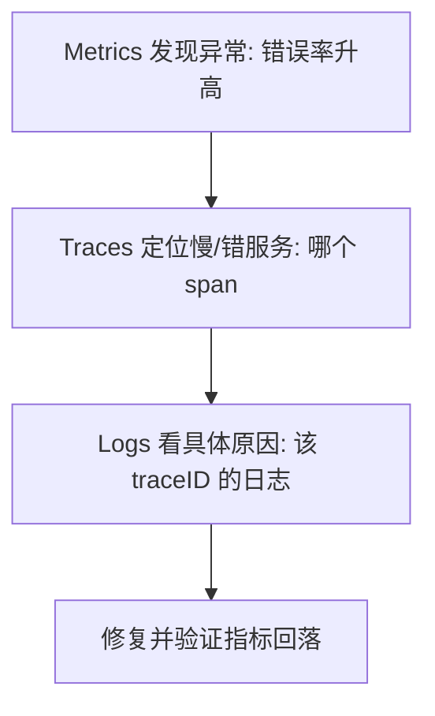

# 可观测性深入（OTel Collector 配置 / eBPF / 告警设计 / Grafana 面板）

> 可观测性 = 通过指标/日志/链路推断系统内部状态。本篇深入拆解：OpenTelemetry Collector 管道配置、eBPF 无侵入可观测、告警规则设计、Grafana 面板最佳实践。

---

## 一、三大支柱

| 支柱 | 回答的问题 | 典型工具 |
|------|-----------|---------|
| Metrics | 系统整体「健康度」 | Prometheus/VictoriaMetrics |
| Logs | 某次请求「发生了什么」 | Loki/ELK/ClickHouse |
| Traces | 一次请求「怎么走的、卡在哪」 | Jaeger/Tempo/OpenTelemetry |

> 三者关系：Metrics 发现异常 → Traces 定位慢/错的服务 → Logs 看具体原因。

---

## 二、方法论

- **RED**（请求类）：Rate（请求速率）、Errors（错误率）、Duration（延迟分布）
- **USE**（资源类）：Utilization（利用率）、Saturation（饱和度）、Errors（错误）
- **Golden Signals**：延迟、流量、错误、饱和度

---

## 三、OpenTelemetry Collector 配置实战

### 3.1 架构

```
应用（OTel SDK）→ OTel Collector → 后端（Prometheus/Jaeger/Loki）

Collector 组件：
  Receiver：接收数据（OTLP/Jaeger/Prometheus/Zipkin）
  Processor：处理数据（批量/过滤/采样/转换）
  Exporter：导出到后端（Prometheus/Jaeger/Tempo/Loki）
```

### 3.2 配置示例

```yaml
# otel-collector-config.yaml
receivers:
  otlp:
    protocols:
      grpc:
        endpoint: 0.0.0.0:4317
      http:
        endpoint: 0.0.0.0:4318
  
  prometheus:
    config:
      scrape_configs:
      - job_name: 'my-app'
        scrape_interval: 15s
        static_configs:
        - targets: ['localhost:8080']

processors:
  batch:
    timeout: 5s
    send_batch_size: 1024
  
  memory_limiter:
    check_interval: 1s
    limit_mib: 512
    spike_limit_mib: 128
  
  tail_sampling:
    decision_wait: 10s
    num_traces: 100000
    policies:
    - name: error-policy
      type: status_code
      status_code: {status_codes: [ERROR]}
    - name: slow-policy
      type: latency
      latency: {threshold_ms: 1000}

exporters:
  prometheus:
    endpoint: "0.0.0.0:8889"
    namespace: "myapp"
  
  otlp/jaeger:
    endpoint: jaeger-collector:4317
    tls:
      insecure: true
  
  loki:
    endpoint: http://loki:3100/loki/api/v1/push

service:
  pipelines:
    traces:
      receivers: [otlp]
      processors: [memory_limiter, tail_sampling, batch]
      exporters: [otlp/jaeger]
    metrics:
      receivers: [otlp, prometheus]
      processors: [memory_limiter, batch]
      exporters: [prometheus]
    logs:
      receivers: [otlp]
      processors: [memory_limiter, batch]
      exporters: [loki]
```

---

## 四、eBPF 无侵入可观测

### 4.1 概念

```
eBPF = 在内核中运行的沙箱程序，无需修改应用代码

可观测性应用：
  网络监控：Cilium Hubble（网络流可视化）
  安全监控：Cilium Tetragon（系统调用追踪）
  性能分析：Parca（连续性能剖析）
  链路追踪：Pixie（自动采集 HTTP/gRPC 链路）
```

### 4.2 优势

| 优势 | 说明 |
|------|------|
| 无侵入 | 不需要改应用代码/重启服务 |
| 低开销 | 内核态执行，用户态开销极小 |
| 全栈 | 覆盖网络/系统调用/文件 IO/进程 |
| 实时 | 毫秒级数据采集 |

### 4.3 工具对比

| 工具 | 能力 | 适用 |
|------|------|------|
| Cilium Hubble | 网络流可视化 + 网络策略 | K8s 网络监控 |
| Cilium Tetragon | 安全事件 + 系统调用追踪 | 安全审计 |
| Pixie | 自动链路追踪 + 应用性能 | 微服务可观测 |
| Parca | 持续性能剖析 | CPU/内存热点 |
| Coroot | 指标+链路+日志关联 | 全栈可观测 |

---

## 五、告警规则设计

### 5.1 告警分级

| 级别 | 响应时间 | 通知方式 | 示例 |
|------|----------|----------|------|
| P0（致命） | 5分钟 | 电话+短信+IM | 服务不可用/数据丢失 |
| P1（严重） | 15分钟 | 短信+IM | 核心功能异常/错误率>5% |
| P2（警告） | 1小时 | IM | 性能下降/磁盘>80% |
| P3（通知） | 下个工作日 | 邮件 | 非紧急异常/容量预警 |

### 5.2 告警最佳实践

```
原则：
  告警必须 actionable（能操作）→ 不能 action 的不是告警
  告警必须有 runbook（处理手册）→ 每条告警关联文档
  告警必须分级 → 避免告警疲劳
  告警必须聚合 → 同类告警合并

反模式：
  告警太多（告警疲劳）→ 合并+降噪+阈值调整
  告警无 runbook → 收到不知道怎么处理
  告警无分级 → 所有告警一样对待
  告警后无跟进 → 告警了但没人处理
```

### 5.3 Prometheus 告警规则示例

```yaml
groups:
- name: app-alerts
  rules:
  - alert: HighErrorRate
    expr: rate(http_requests_total{code=~"5.."}[5m]) / rate(http_requests_total[5m]) > 0.05
    for: 5m
    labels:
      severity: critical
    annotations:
      summary: "错误率超过 5%"
      runbook: "https://wiki/runbook/high-error-rate"
      
  - alert: HighLatency
    expr: histogram_quantile(0.99, rate(http_request_duration_seconds_bucket[5m])) > 1
    for: 5m
    labels:
      severity: warning
    annotations:
      summary: "P99 延迟超过 1s"
      
  - alert: DiskAlmostFull
    expr: (node_filesystem_avail_bytes / node_filesystem_size_bytes) < 0.1
    for: 10m
    labels:
      severity: warning
    annotations:
      summary: "磁盘剩余 < 10%"
```

---

## 六、Grafana 面板最佳实践

### 6.1 核心面板

```
服务概览面板：
  RED 指标（QPS/错误率/P99 延迟）
  资源指标（CPU/内存/连接数）
  业务指标（订单量/支付成功率）

SLO 面板：
  错误预算剩余百分比
  Burn Rate 趋势
  历史 SLO 达成率

告警面板：
  活跃告警列表
  告警趋势
  告警响应时间
```

### 6.2 Dashboard 设计原则

| 原则 | 说明 |
|------|------|
| 层次化 | 总览→服务→实例→具体指标（逐层下钻） |
| 关联化 | Metrics↔Traces↔Logs 可跳转 |
| 实时性 | 自动刷新（30s/1m） |
| 可操作 | 每个面板关联 runbook |
| 少而精 | 每个面板 6~10 个图表，不超过 20 个 |

---

## 七、采样策略

| 策略 | 原理 | 优点 | 缺点 |
|------|------|------|------|
| 头部采样 | 开头决定采样率 | 简单 | 可能丢异常链路 |
| 尾部采样 | 看完整 trace 再决定 | 保异常链路 | 需要缓冲 |
| 自适应采样 | 按服务/流量动态调整 | 智能 | 复杂 |

> 推荐：生产用尾部采样（异常链路 100% 保留），正常链路 1~10% 采样。

---

## 九、Prometheus 深入（TSDB / PromQL / Recording Rules）

### 9.1 数据模型与 TSDB

Prometheus 存储的是 **时间序列**：`指标名{标签...} 时间戳 值`。底层 TSDB 按 2 小时一个 block 落盘，内存中 WAL 保证写入不丢。

- 拉模型（Pull）：Prometheus 周期性 `scrape` 目标 `/metrics`。
- 标签（label）是高基数来源——**避免把 user_id、request_id 等放进标签**，否则内存爆炸。
- `histogram`（分桶测延迟）与 `summary`（客户端算分位）二选一；跨实例聚合用 histogram 的 `_bucket` 配合 `histogram_quantile`。

### 9.2 PromQL 实战

```promql
# QPS
rate(http_requests_total[5m])

# 错误率
rate(http_requests_total{code=~"5.."}[5m]) / rate(http_requests_total[5m])

# P99 延迟（基于 histogram bucket）
histogram_quantile(0.99, rate(http_request_duration_seconds_bucket[5m]))

# 按实例求和 CPU 使用
sum by (pod) (rate(container_cpu_usage_seconds_total{container!="POD"}[5m]))

# 饱和度：节点内存使用率
1 - (node_memory_MemAvailable_bytes / node_memory_MemTotal_bytes)
```

### 9.3 Recording Rules（预计算降负载）

```yaml
groups:
- name: app-recording
  rules:
  - record: job:http_requests:rate5m
    expr: sum by (job) (rate(http_requests_total[5m]))
  - record: job:http_errors:ratio5m
    expr: sum by (job) (rate(http_requests_total{code=~"5.."}[5m]))
          / sum by (job) (rate(http_requests_total[5m]))
```

### 9.4 扩展：联邦 / 远程写 / Thanos

| 方案 | 用途 |
|------|------|
| 联邦（federation） | 层级聚合，中心 Prom 拉边缘 Prom |
| Remote Write | 写入 VictoriaMetrics / Thanos / 云托管 |
| Thanos | 全局视图 + 长期存储（对象存储）+ 降采样 |
| VictoriaMetrics | 高 cardinal 友好、资源省 |

---

## 十、Grafana 深入（变量 / 关联跳转 / Dashboard-as-Code）

### 10.1 模板变量与下钻

```json
{
  "templating": {
    "list": [
      { "name": "namespace", "type": "query",
        "datasource": "Prometheus",
        "query": "label_values(kube_pod_info, namespace)" },
      { "name": "pod", "type": "query",
        "datasource": "Prometheus",
        "query": "label_values(kube_pod_info{namespace=\"$namespace\"}, pod)" }
    ]
  }
}
```

### 10.2 面板间关联（Data Link）

Grafana 的 `Data link` 可让指标面板点击后跳转到 Traces（按 `traceID`）或 Logs（按 `pod`/`labels`），实现 Metrics → Traces → Logs 闭环。

```
面板字段 override:
  - 字段 traceID → link 到 Tempo explore (${__value.raw})
  - 字段 pod    → link 到 Loki 查询 (namespace/pod 过滤)
```

### 10.3 Dashboard-as-Code

用 `grafana/dashboard-linter` + JSON 入库，配合「[GitOps](./GitOps.md)」流水线版本化管理，避免手工改面板丢失。

---

## 十一、日志深入（Loki / 结构化 / 采集架构）

### 11.1 采集架构


- **Loki**：索引仅存标签（低开销），日志原文存对象存储，按 `{app="payment",ns="prod"}` 查。
- **ES/OpenSearch**：全文索引，适合复杂检索但成本高。
- **结构化日志**：务必输出 JSON（`level/timestamp/msg/traceID/service`），便于检索与告警。

### 11.2 结构化日志示例（Go）

```go
log := slog.New(slog.NewJSONHandler(os.Stdout, nil))
log.Info("order created",
    slog.String("traceID", traceID),
    slog.String("orderID", orderID),
    slog.Int("amount", amount))
```

### 11.3 日志最佳实践

| 项 | 建议 |
|----|------|
| 格式 | JSON 结构化，带 `traceID` |
| 级别 | DEBUG/INFO/WARN/ERROR 区分，生产 INFO |
| 体积 | 单行不过大，避免打全量大对象 |
| 留存 | 热 7~30 天（Loki），冷归档对象存储 |
| 关联 | 与 traceID 打通，实现日志↔链路跳转 |

---

## 十二、Tracing 深入（上下文传播 / 埋点代码 / 采样）

### 12.1 上下文传播（W3C traceparent）

跨服务传递靠 HTTP 头 `traceparent: 00-<trace-id>-<span-id>-01`，OpenTelemetry 默认遵循 W3C 标准，保证链路不断。

### 12.2 代码埋点（Go + OTel）

```go
import (
	"go.opentelemetry.io/otel"
	"go.opentelemetry.io/otel/trace"
)

func handleOrder(ctx context.Context) {
	// 从 incoming context 自动继承 trace（HTTP/gRPC 中间件注入）
	tracer := otel.Tracer("payment")
	ctx, span := tracer.Start(ctx, "createOrder")
	defer span.End()

	// 子操作
	_, sub := tracer.Start(ctx, "deductBalance")
	_ = sub
	sub.End()
}
```

### 12.3 采样策略

| 策略 | 原理 | 适用 |
|------|------|------|
| 头部采样 | 入口决定比例 | 简单，可能漏异常链路 |
| 尾部采样 | 看完整 trace 再决定 | 保异常/慢链路，需缓冲（见「[可观测性](./可观测性.md)」§七） |
| 自适应 | 按服务/错误率动态 | 复杂但省成本 |

---

## 十三、SLO / SLI / 错误预算（稳定性契约）

| 概念 | 含义 | 示例 |
|------|------|------|
| SLI | 实际指标 | 请求成功率、P99 延迟 |
| SLO | 目标值 | 99.9% 请求成功 |
| Error Budget | 1 - SLO 的可错误额度 | 0.1% 错误额度/月 |

**多窗口 burn rate 告警**（快速发现预算燃烧）：

```yaml
# 错误预算 1h 内燃烧 >14.4 倍（即 1h 烧完全月预算）才告警，抑制抖动
- alert: HighErrorBudgetBurn
  expr: |
    (rate(http_requests_total{code=~"5.."}[1h]) / rate(http_requests_total[1h])) > (14.4 * 0.001)
    and
    (rate(http_requests_total{code=~"5.."}[5m]) / rate(http_requests_total[5m])) > (14.4 * 0.001)
  for: 2m
```

错误预算耗尽 → 冻结发布、优先稳定性（与「[稳定性三板斧](../场景设计/稳定性三板斧：限流-熔断-降级.md)」一致）。

---

## 十四、三支柱关联（Metrics→Traces→Logs 闭环）



- **Exemplar**：Prometheus histogram 可把单个 traceID 关联到样本，点击指标直接跳 trace。
- **统一标识**：`traceID` 贯穿 metrics 标签、trace span、log 字段，是关联的关键。

---

## 十五、生产排障案例与 Checklist

### 案例：P99 延迟突增
1. Metrics：`histogram_quantile` 看 P99 升高 → 确认异常服务。
2. Traces：按服务过滤慢 trace，定位慢 span（如某 DB 调用）。
3. Logs：取该 traceID 的日志，看到 `context deadline exceeded`。
4. 处置：DB 慢查询治理 / 加缓存 / 限流（见稳定性三板斧）。

### CheckList
- [ ] 三类信号（M/L/T）均采集并接入统一面板
- [ ] traceID 贯穿日志与指标
- [ ] 关键 SLI 有 SLO 与错误预算告警
- [ ] 告警分级 + runbook
- [ ] 采样率合理（尾部采样保异常链路）
- [ ] 长期存储与降采样（Thanos/VM）

**速记口诀**：
> Metrics 发现异常、Traces 定位服务、Logs 看原因——三支柱靠 traceID 关联；RED/USE 选指标，尾部采样保异常，SLO 守稳定性，Grafana 做下钻。

---

## 八、与其他板块的关系

- Prometheus 时序库见「[Prometheus](../基础知识/时序库/Prometheus.md)」；
- Service Mesh 可观测见「[ServiceMesh](./ServiceMesh.md)」；
- SRE 监控见「[02-可观测性与稳定性看护](../SRE与稳定性工程/02-可观测性与稳定性看护.md)」。

> 一句话：**可观测性 = Metrics（发现异常）+ Traces（定位服务）+ Logs（看原因）——OTel Collector 统一采集三类信号，eBPF 无侵入监控，告警按 P0~P3 分级+runbook，Grafana 面板层次化关联**。
