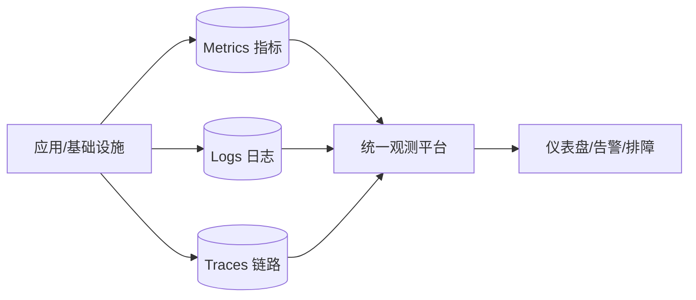
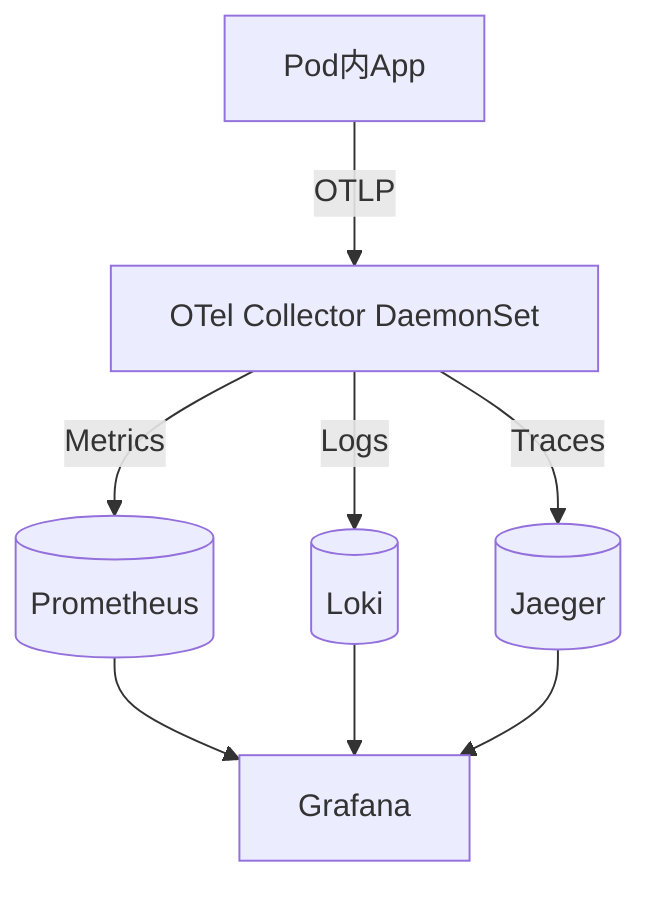
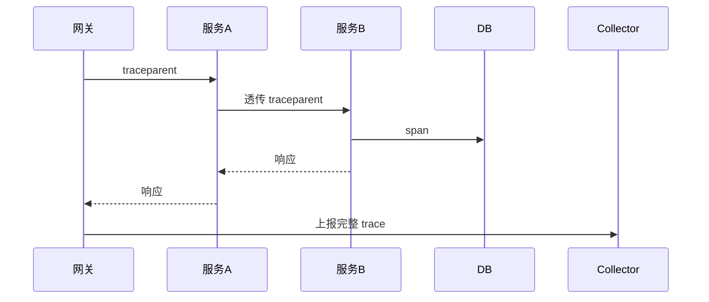

# 云原生可观测性体系与黄金信号实战

> 云原生环境下，服务被拆成数十上百个微服务、运行在动态调度的容器中，传统"登机器看日志"彻底失效。可观测性（Observability）成为运维与研发的生命线。本文系统讲解云原生可观测性的体系架构、三大支柱落地、黄金信号与 SLO 驱动的实践。

## 1. 为什么云原生需要可观测性

| 传统单体 | 云原生微服务 |
| --- | --- |
| 进程少、部署固定 | 实例动态漂移、扩缩频繁 |
| 日志在固定机器 | 日志随 Pod 销毁消失 |
| 调用链短 | 一次请求跨数十服务 |
| 人肉排查可行 | 必须依赖遥测数据 |

核心转变：从"能登录"到"能观测"，从"事后救火"到"事前预警"。

## 2. 可观测性三大支柱



- **Metrics（指标）**：聚合的量化数据，回答"系统整体怎样"。如 QPS、P99 延迟、错误率、CPU。
- **Logs（日志）**：离散事件，回答"某一刻发生了什么"。如异常堆栈、业务关键点。
- **Traces（链路）**：单次请求的完整路径，回答"请求经过了哪些服务、哪里慢"。

三者关系：指标发现异常 → 链路定位范围 → 日志取证细节。

## 3. 云原生采集架构

在 K8s 中，可观测数据通常通过以下方式采集：

1. **应用内 SDK**：OpenTelemetry SDK 自动/手动埋点，导出 OTLP。
2. **Sidecar/Collector**：DaemonSet 部署 OpenTelemetry Collector，统一接收、批处理、转发。
3. **基础设施**：Node Exporter 采集节点指标，kube-state-metrics 采集 K8s 对象状态。
4. **存储后端**：Metrics→Prometheus/TSDB；Logs→Loki/ES；Traces→Jaeger/Tempo。



## 4. 四大黄金信号

Google SRE 提出每个服务都应监控的四大黄金信号：

| 信号 | 含义 | 监控要点 |
| --- | --- | --- |
| Latency 延迟 | 请求耗时 | 区分成功/失败延迟，看 P99 而非均值 |
| Traffic 流量 | 请求量 | QPS、并发、带宽 |
| Errors 错误 | 失败比例 | 4xx/5xx、业务错误码 |
| Saturation 饱和度 | 资源饱和 | CPU、内存、连接池、队列深度 |

> 关键：延迟要看分位数（P95/P99），均值会掩盖长尾；错误要区分"失败请求"与"慢请求"。

## 5. RED 与 USE 方法

- **RED（请求视角）**：Rate（速率）、Errors（错误率）、Duration（时延）。适合面向用户的服务。
- **USE（资源视角）**：Utilization（利用率）、Saturation（饱和度）、Errors（错误）。适合底层资源（CPU、磁盘、网络）。

实践中两者结合：服务层用 RED，资源层用 USE。

## 6. 链路追踪落地

- 入口（Ingress/网关）生成 `traceId`，通过 HTTP header（traceparent）或消息属性透传。
- 每个服务内 SDK 自动创建 span（DB 调用、HTTP 调用、函数）。
- 跨服务调用保持 context 传播，否则链路断裂。
- 采样策略：高流量下全量成本高，用头部采样/自适应采样，保留错误与慢请求。



## 7. 日志结构化

云原生日志必须结构化，便于检索与关联：

```json
{"ts":"2026-08-31T10:00:00Z","level":"ERROR","trace_id":"abc123",
 "service":"order","msg":"create failed","code":"INV_OUT"}
```

- 用 JSON 输出，避免纯文本。
- 每行带 `trace_id`，与链路关联。
- 避免打印敏感信息（PII）。
- 控制日志量，防止成本爆炸。

## 8. SLO 与错误预算

- **SLO（Service Level Objective）**：目标可用性，如"99.9% 请求 P99 < 300ms"。
- **SLI（Indicator）**：实际测量值。
- **错误预算（Error Budget）**：1 - SLO，允许失败的额度。
- 用错误预算驱动发布：预算充足可快速发布，预算耗尽则冻结发布、专注稳定。

## 9. 告警治理

| 问题 | 后果 | 对策 |
| --- | --- | --- |
| 告警太多 | 狼来了效应 | 分层 Page/Ticket/Info |
| 无关联 | 告警风暴 | 依赖抑制、group |
| 无行动 | 没人处理 | 每个告警有 runbook |
| 静态阈值 | 误报/漏报 | 多窗口/异常检测 |

## 10. 成本与性能权衡

- 指标降采样（保留高精度短期、降精度长期）。
- 链路采样（错误/慢请求全采，正常采样）。
- 日志分级存储（热存短、冷存长）。
- 高基数标签（如 user_id）是 Prometheus 性能杀手，谨慎打标。

## 11. 落地路线图

1. **第一步**：部署 Prometheus + Grafana + Node Exporter，拿到基础指标。
2. **第二步**：接入 OpenTelemetry，打通链路追踪。
3. **第三步**：日志结构化 + 集中存储（Loki/ES）。
4. **第四步**：定义 SLO 与错误预算，建立告警与 oncall。
5. **第五步**：用 traceId 串联三者，建设排障工作台。

## 12. 常见坑

| 坑 | 现象 | 对策 |
| --- | --- | --- |
| 只看均值 | 长尾被掩盖 | 看 P99 |
| 链路断层 | 排障难 | 全链路透传 context |
| 日志非结构化 | 无法检索 | JSON 化 |
| 高基数爆炸 | Prometheus OOM | 限制标签 |
| 告警噪音 | 无人响应 | 分层+runbook |

## 13. 面试题

1. 云原生可观测性三大支柱是什么？如何配合？
2. 四大黄金信号有哪些？为什么延迟要看分位数？
3. RED 与 USE 的区别与适用？
4. 链路 traceId 如何跨服务传递？
5. 什么是错误预算？如何驱动发布？
6. 为什么高基数标签会拖垮 Prometheus？

## 14. 小结

云原生可观测性 = 指标看趋势、链路定位置、日志查细节，以 OpenTelemetry 统一采集，用黄金信号与 SLO 驱动告警。它不是"装个 Grafana"那么简单，而是一套从采集、关联、告警到治理的完整体系，是微服务稳定运行的底座。
