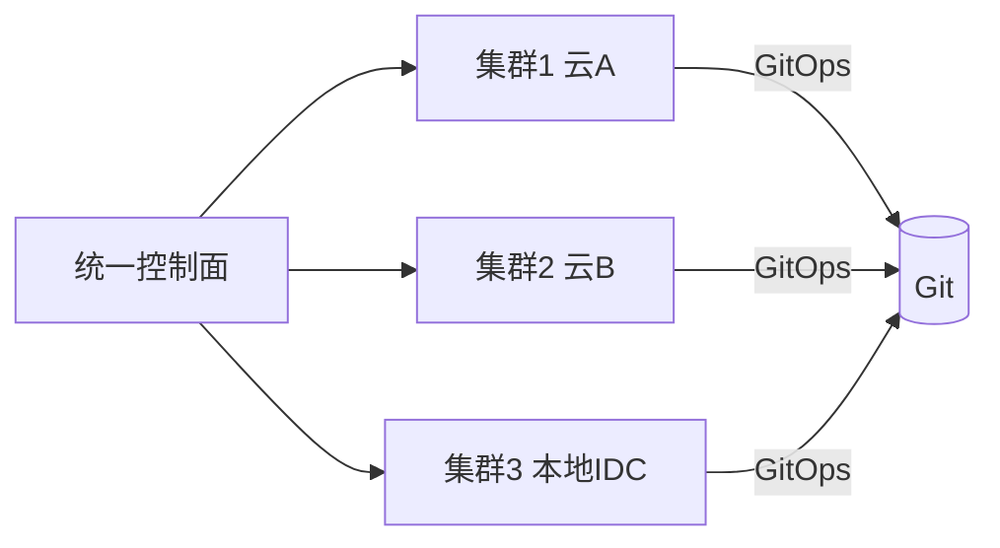

# 多云管理与成本优化实战

> 单云锁定、地域故障、合规要求推动企业走向多云/混合云。但多云带来管理复杂度与成本失控风险。本文讲解多云架构、统一管控与成本优化实战。

## 1. 为什么多云

| 动机 | 说明 |
| --- | --- |
| 避免锁定 | 不依赖单一厂商 |
| 容灾 | 跨云容灾，单云故障可切 |
| 合规 | 数据驻留特定区域/云 |
| 成本 | 利用各云价格差异 |
| 能力 | 某云特定服务更强 |

反方：管理复杂度、网络互联成本、技能分散。

## 2. 多云架构层次

- **统一控制面**：用 GitOps（Argo CD/Flux）或多云管控平台统一下发。
- **网络互联**：VPN/专线/SD-WAN 打通多云。
- **身份统一**：SSO + 统一 RBAC。

## 3. 一致性挑战

| 维度 | 差异 |
| --- | --- |
| K8s 版本 | 各云托管版本不同 |
| 存储类 | CSI 驱动各异 |
| 网络模型 | CNI 实现不同 |
| 托管服务 | 名称/能力不一致 |

对策：用标准化抽象（如 Crossplane/OAM）屏蔽差异；优先使用跨云一致的开源组件。

## 4. 成本优化框架

### 4.1 资源浪费识别
- 闲置资源（CPU 长期 <10%）。
- 过度分配（request 远大于实际使用）。
- 未释放的磁盘/负载均衡。

### 4.2 弹性策略
- 定时伸缩（业务低峰缩容）。
- HPA/VPA 自动调优。
- Spot/抢占实例跑非关键负载。

### 4.3 计费优化
- 预留实例（长期稳定负载）。
- 承诺用量折扣（CUD）。
- 跨云比价，把弹性负载放便宜云。

## 5. 成本可视化

- 标签（tag）体系：按团队/环境/项目打标。
- 成本分摊（showback/chargeback）到团队。
- 异常告警：成本突增即时通知。

## 6. 网络成本

- 跨云流量费往往高于计算费。
- 优化：就近处理、缓存、减少跨云调用。
- 专线成本高，评估是否必要。

## 7. 容灾与流量调度

- 全局流量管理（GTM）：按延迟/健康把用户引到最近云。
- 数据跨云复制（注意延迟与一致性）。
- 故障切换演练，验证跨云可用。

## 8. FinOps 文化

- FinOps = 工程 + 财务 + 业务的协作。
- 成本责任到团队，建立"成本可观测"。
- 定期复盘浪费，持续优化。

## 9. 常见坑

| 坑 | 现象 | 对策 |
| --- | --- | --- |
| 标签混乱 | 成本算不清 | 强制标签规范 |
| 跨云流量费爆 | 账单高 | 就近+缓存 |
| 管理割裂 | 运维难 | 统一控制面 |
| 过度预留 | 浪费 | 按实际使用 |
| 忽视闲置 | 持续花钱 | 定期清理 |

## 10. 面试题

1. 多云的主要动机与代价？
2. 如何统一管控多云 K8s？
3. 成本优化有哪些抓手？
4. 跨云网络成本如何控制？
5. 什么是 FinOps？
6. 多云容灾如何调度流量？

## 11. 小结

多云管理 = 统一控制面 + 网络互联 + 身份统一，代价是复杂度。成本优化是多云的核心收益之一：通过标签分摊、弹性、预留与跨云比价，配合 FinOps 文化，把"云账单"变成"可管理的资产"。
