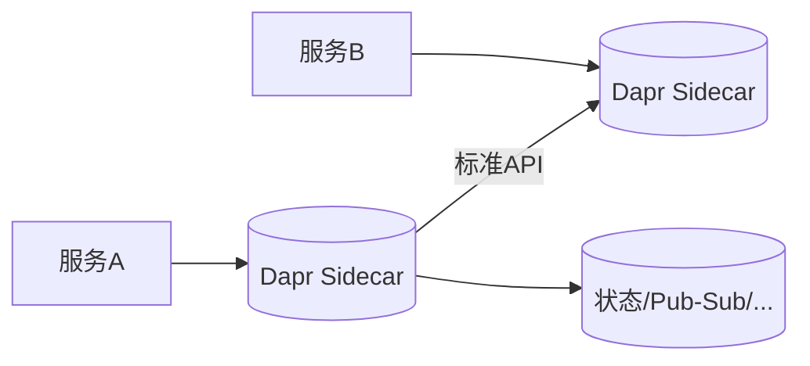

# 多运行时 Dapr 实战

> Dapr（Distributed Application Runtime）把微服务常用的"状态、_pub/sub、服务调用、密钥、绑定"抽象成边车（sidecar）能力，让业务代码只需调标准 API，与具体中间件解耦。它是"多运行时"架构的典型实践。

## 1. 架构



## 2. 核心构建块

| 构建块 | 能力 |
| --- | --- |
| 服务调用 | 服务发现 + 重试 + mTLS |
| 状态管理 | 可插拔 KV 存储 |
| Pub/Sub | 消息发布订阅 |
| 绑定 | 与外部系统输入输出 |
| 密钥 | 安全取密 |
| 可观测 | 自动 trace/log/metric |

## 3. 解耦示例

```python
# 发布事件（与具体 MQ 无关）
import requests
requests.post("http://localhost:3500/v1.0/publish/orders/topic",
              json={"orderId": 1})
# 状态读写（与具体存储无关）
requests.post("http://localhost:3500/v1.0/state/statestore",
              json=[{"key": "k", "value": "v"}])
```

- 业务只依赖 Dapr 的 HTTP/gRPC API。
- 底层 Redis/Kafka/Postgres 可替换，代码不变。

## 4. 适用与取舍

- **优点**：语言无关、中间件解耦、能力开箱即用。
- **代价**：多一跳 sidecar 延迟、运维新增组件。
- **适用**：多语言微服务、想标准化分布式能力的团队。

## 5. 常见坑

| 坑 | 现象 | 对策 |
| --- | --- | --- |
| 多一跳延迟 | 性能降 | 本地 sidecar |
| 组件配置错 | 起不来 | 配置校验 |
| 版本兼容 | 异常 | 对齐版本 |
| 调试难 | 链路长 | 全链路 trace |
| 过度抽象 | 复杂度 | 按需启用 |

## 6. 面试题

1. Dapr 解决了什么问题？
2. 多运行时架构含义？
3. Dapr 与 Service Mesh 区别？
4. sidecar 带来什么代价？
5. 状态管理如何解耦存储？

## 7. 小结

Dapr = 边车标准化分布式能力 + 业务与中间件解耦。核心是"用 API 抽象掉基础设施差异"，让开发者专注业务逻辑。
