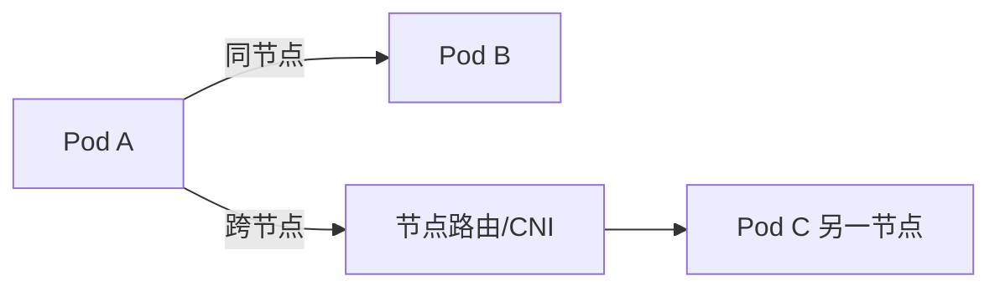
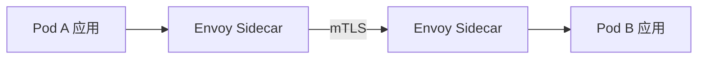

# 容器网络与服务网格进阶

> 容器网络（CNI）与服务网格（Sidecar 数据面）是 K8s 流量治理的两层。本文进阶讲解 CNI 模型、Overlay/Underlay、eBPF 加速、以及服务网格与 CNI 的分工与协同。

## 1. 容器网络模型

K8s 网络的核心约定（CNI 规范）：
- 每个 Pod 有独立 IP。
- 节点内/跨节点 Pod 可直接互通（无需 NAT）。
- Service 提供稳定虚拟 IP（ClusterIP）与负载均衡。



## 2. CNI 主流方案

| 方案 | 模式 | 特点 |
| --- | --- | --- |
| Calico | BGP/Overlay | 性能好、网络策略强 |
| Cilium | eBPF | 高性能、可观测、安全 |
| Flannel | VXLAN Overlay | 简单、性能一般 |
| AWS VPC CNI | Underlay | 直连 VPC IP |

- **Overlay**：在节点网络之上封装（VXLAN），跨节点隧道，易部署但有点开销。
- **Underlay**：Pod IP 即真实网络 IP，性能最佳但依赖底层网络。

## 3. eBPF 革命

Cilium 用 eBPF 替代 kube-proxy 的 iptables：
- 内核态处理负载均衡与网络策略，性能更高。
- 支持 L3-L7 网络策略、可观测（无 Sidecar 拿流量）。
- 减少 iptables 规则膨胀导致的延迟。

## 4. Service 与 kube-proxy

- 传统：kube-proxy 用 iptables/IPVS 做 Service→Pod 转发。
- IPVS 模式性能优于 iptables（大量 Service 时）。
- eBPF 模式绕过 kube-proxy，内核直转。

## 5. 服务网格数据面



- Sidecar（Envoy）劫持 Pod 流量，做路由、重试、熔断、mTLS。
- 与应用解耦，业务无感知。
- 代价：资源开销（每 Pod 一 Sidecar）、延迟增加（一跳）。

## 6. 网格 vs CNI 分工

| 层 | 职责 |
| --- | --- |
| CNI | 网络连通、IP 分配、L3/L4 策略 |
| 服务网格 | L7 路由、熔断、mTLS、可观测 |

两者互补：CNI 管"通不通"，网格管"怎么路由与安全"。

## 7. Sidecar 开销与替代

- Sidecar 每 Pod 占用内存（数十~数百 MB）与 CPU。
- **Ambient Mesh**（Istio）：用 ztunnel 共享代理，去 Sidecar，降低开销。
- eBPF 数据面：部分网格能力下沉内核，减少代理。

## 8. 网络策略（NetworkPolicy）

```yaml
apiVersion: networking.k8s.io/v1
kind: NetworkPolicy
metadata: { name: deny-other-ns, namespace: foo }
spec:
  podSelector: { matchLabels: { app: db } }
  policyTypes: [Ingress]
  ingress:
  - from:
    - podSelector: { matchLabels: { app: api } }
```

- 默认 Pod 间全通，需显式策略隔离。
- 零信任网络的基础。

## 9. 排障工具

- `kubectl exec` + `tcpdump`/`nsenter` 抓包。
- `cilium connectivity test` 验证网络。
- `istioctl proxy-config` 看网格路由。
- 网络可观测（Hubble/Cilium）看流量拓扑。

## 10. 常见坑

| 坑 | 现象 | 对策 |
| --- | --- | --- |
| MTU 不匹配 | 偶发丢包 | 调 Overlay MTU |
| iptables 膨胀 | 延迟高 | 换 IPVS/eBPF |
| 策略过严 | 不通 | 渐进放开 |
| Sidecar 资源 | 节点紧张 | 资源 limit + Ambient |
| DNS 解析慢 | 启动慢 | 优化 CoreDNS |

## 11. 面试题

1. Overlay 与 Underlay 区别？
2. eBPF 给容器网络带来什么？
3. 服务网格与 CNI 如何分工？
4. Sidecar 的代价？如何降低？
5. NetworkPolicy 默认行为？
6. kube-proxy 的 iptables 与 IPVS 区别？

## 12. 小结

容器网络解决"连通"，服务网格解决"治理"。CNI（尤其 eBPF 化）提升性能与可观测，服务网格提供 L7 安全与流量控制。两者分工明确、协同工作；Sidecar 开销可通过 Ambient/eBPF 缓解。
