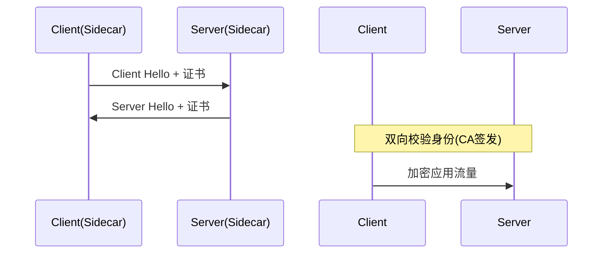
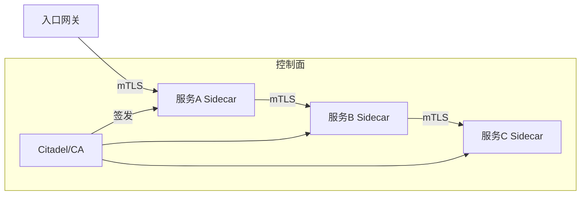

# 服务网格安全与 mTLS 实战

> 在微服务架构中，服务间通信（东西向流量）往往缺乏加密与鉴权，成为攻击面。服务网格（Service Mesh）通过 Sidecar 代理为所有服务注入 mTLS、身份认证与细粒度授权，实现"零信任"内部网络。本文讲解 mTLS 原理、网格内安全模型与落地实战。

## 1. 为什么需要网格安全

| 传统内部网络 | 服务网格安全 |
| --- | --- |
| 内网默认可信 | 零信任，默认不信任 |
| 明文通信 | 自动 mTLS 加密 |
| 靠防火墙边界 | 服务级身份认证 |
| 授权分散 | 统一策略（AuthorizationPolicy） |

当内部某个服务被攻破，明文通信会让横向移动极容易。网格把安全下沉到基础设施层，对业务无侵入。

## 2. mTLS 原理

mTLS（双向 TLS）相比普通 TLS，客户端与服务端**双向验证证书**：



- 每个工作负载由网格 CA 签发身份证书（如 SPIFFE ID）。
- 通信双方校验对方身份，防止冒充。
- 密钥与证书在 Sidecar 内管理，应用无感知。

## 3. 身份模型：SPIFFE/SPIRE

- **SPIFFE**：定义工作负载身份标准（如 `spiffe://cluster/ns/default/sa/order`）。
- **SPIRE**：实现 SPIFFE 的签发与管理，给每个 Pod 签发 SVID（X.509 证书）。
- 身份绑定到服务账户（ServiceAccount），而非 IP（Pod 漂移 IP 变）。

## 4. 网格内认证（PeerAuthentication）

在 Istio 中，配置 mTLS 模式：

```yaml
apiVersion: security.istio.io/v1
kind: PeerAuthentication
metadata:
  name: default
  namespace: foo
spec:
  mtls:
    mode: STRICT   # STRICT=必须mTLS; PERMISSIVE=兼容明文
```

- **PERMISSIVE**：迁移期兼容，新旧服务共存。
- **STRICT**：强制 mTLS，非加密流量被拒。

## 5. 授权策略（AuthorizationPolicy）

细粒度控制"谁可以访问什么"：

```yaml
apiVersion: security.istio.io/v1
kind: AuthorizationPolicy
metadata:
  name: order-only
  namespace: foo
spec:
  selector:
    matchLabels: { app: order }
  rules:
  - from:
    - source:
        principals: ["cluster.local/ns/foo/sa/payment"]
    to:
    - operation:
        methods: ["POST"]
        paths: ["/api/order"]
```

- 基于身份（而非 IP）授权。
- 可按命名空间、服务账户、路径、方法组合。

## 6. 零信任架构落地



- 所有服务间强制 mTLS。
- 默认拒绝（deny-by-default），显式授权。
- 结合外部鉴权（如 OPA）做更复杂的策略。

## 7. 外部授权（External Authorization）

- 网格可将授权决策委托给外部服务（如 OPA/Envoy ext_authz）。
- 适合需要查外部状态（用户角色、设备风险）的场景。
- 延迟敏感，需缓存决策。

## 8. 与入口/出口安全

- **入口网关（Ingress Gateway）**：终止外部 TLS，做 WAF、限流、JWT 校验。
- **出口网关（Egress Gateway）**：管控出网流量，审计对外访问。
- 防止 Pod 直连外网，统一走出口网关便于监控。

## 9. 证书与密钥管理

- 网格 CA 应自建或对接企业 PKI。
- 证书短期有效（如 24h），自动轮转，降低泄露风险。
- 根 CA 私钥严格保护（HSM/KMS）。

## 10. 迁移策略

1. 先 PERMISSIVE，让网格接管流量但不强制加密。
2. 验证所有服务流量已走网格。
3. 切 STRICT，逐步收紧。
4. 加 AuthorizationPolicy，从宽松到默认拒绝。

## 11. 常见坑

| 坑 | 现象 | 对策 |
| --- | --- | --- |
| 直接 STRICT | 旧服务断连 | 先 PERMISSIVE 过渡 |
| 证书过期 | 通信中断 | 自动轮转+监控 |
| 授权过宽 | 无安全增益 | 默认拒绝+最小授权 |
| 依赖 IP | 身份漂移 | 用 SPIFFE 身份 |
| 出口失控 | 数据外泄 | 出口网关管控 |

## 12. 面试题

1. mTLS 与普通 TLS 的区别？
2. 为什么网格用 SPIFFE 身份而非 IP？
3. PeerAuthentication 的 PERMISSIVE 与 STRICT？
4. 如何实现零信任内部网络？
5. 迁移到强制 mTLS 的推荐步骤？
6. AuthorizationPolicy 基于什么授权？

## 13. 小结

服务网格安全把"加密、认证、授权"下沉为基础设施能力，对业务零侵入。核心是 mTLS 双向认证 + 基于工作负载身份（SPIFFE）的授权 + 零信任默认拒绝。落地宜先兼容后收紧，配合外部授权覆盖复杂策略。
