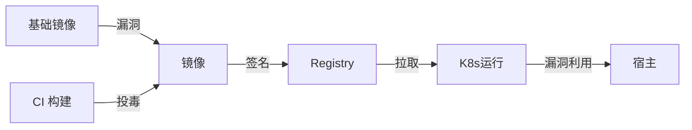

# 镜像供应链安全实战

> 容器镜像从构建到运行，链路长、攻击面大：基础镜像有漏洞、构建过程被注入、镜像被篡改、运行时拉到恶意版本。供应链安全要覆盖"构建可信、传输加密、运行校验"全链路。

## 1. 风险链路



## 2. 关键措施

| 环节 | 措施 |
| --- | --- |
| 基础镜像 | 用官方/精简、固定 digest |
| 构建 | 最小依赖、非 root、多阶段 |
| 扫描 | 镜像漏洞扫描 + 阻断 |
| 签名 | cosign 签名 + 验真 |
| 准入 | 校验签名/来源才准入 |
| 运行 | 只读根、降权、seccomp |

## 3. 镜像签名与验真

```bash
# 签名（概念）
cosign sign --key cosign.key myrepo/app@sha256:...
# 准入校验（概念）
# 用 admission policy 校验镜像必须有有效签名
```

- 镜像用 digest（而非 tag）引用，防被覆盖。
- 部署前校验签名与来源，拒绝未签名镜像。

## 4. 运行时加固

- 非 root 运行，drop 危险能力。
- 只读根文件系统，限制 syscall。
- 网络策略隔离，最小权限。

## 5. 常见坑

| 坑 | 现象 | 对策 |
| --- | --- | --- |
| 基础镜像漏洞 | 被利用 | 扫描 + 精简 |
| 用 latest | 不可控 | digest 固定 |
| 未签名 | 投毒 | 签名准入 |
| root 运行 | 提权风险 | 降权 |
| 依赖过多 | 攻击面大 | 多阶段 |

## 6. 面试题

1. 镜像供应链有哪些风险？
2. 为什么用 digest 而非 tag？
3. 镜像签名如何防篡改？
4. 如何做镜像准入控制？
5. 运行时如何加固容器？

## 7. 小结

镜像供应链安全 = 精简可信基础 + 漏洞扫描 + 签名验真 + 准入 + 运行时降权。核心是"全链路可信、不可篡改、最小权限"。
