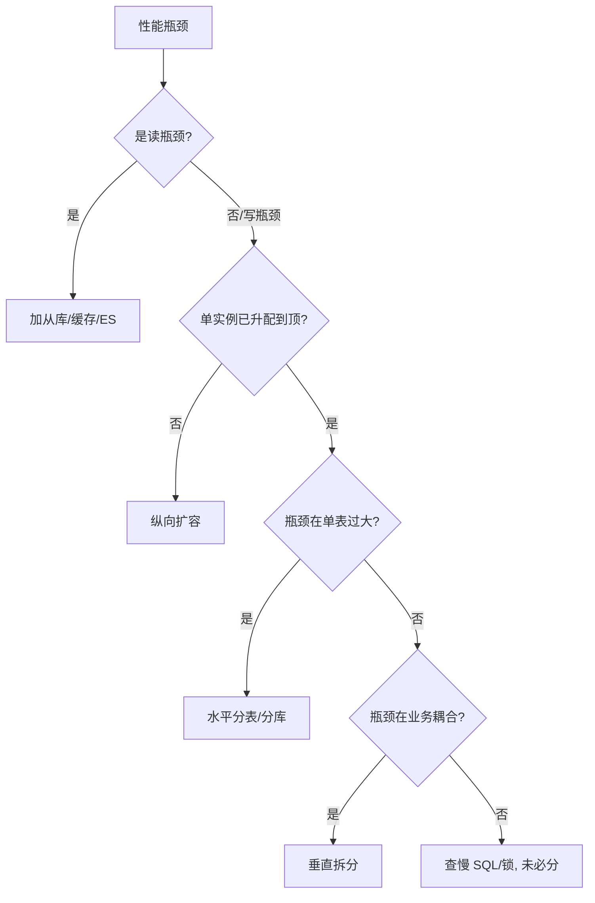
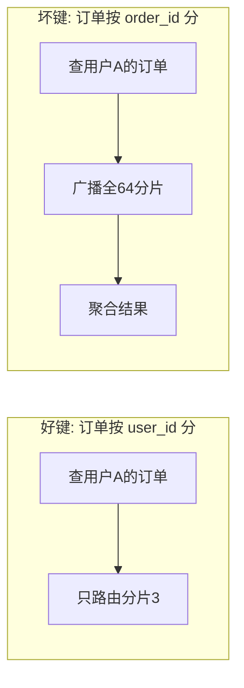
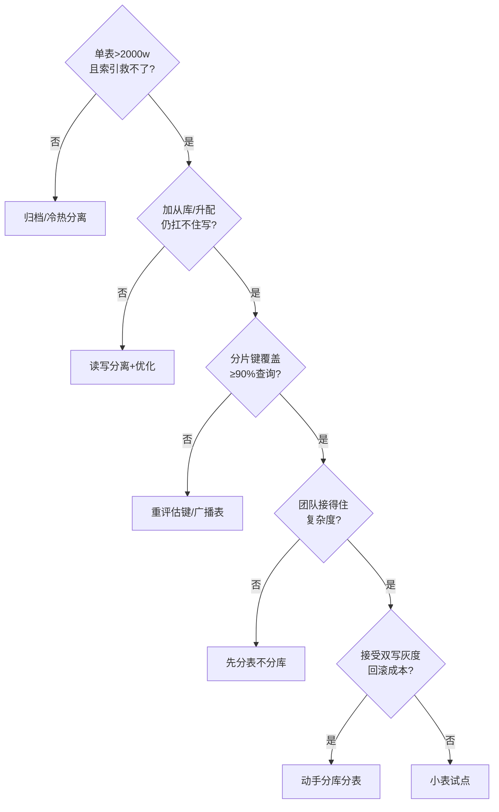
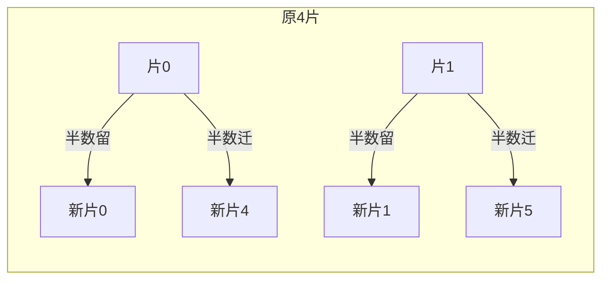
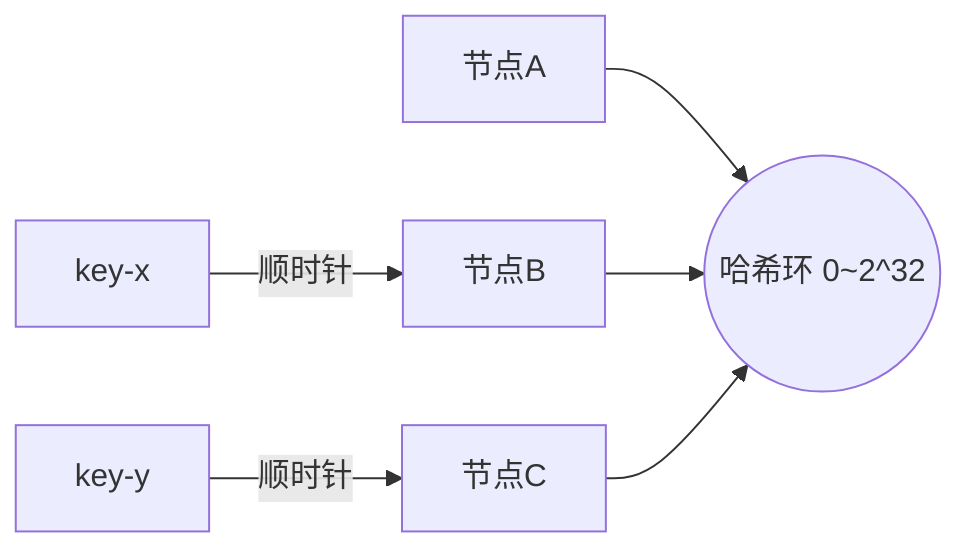

# 01 分库分表决策与路由策略

> 分库分表第一步不是"怎么分"，而是"该不该分、分到什么粒度、用哪个分片键、用什么路由算法"。这一章把决策链路和路由内核讲透。

---

## 一、先判断：到底要不要分？

### 1.1 不要急着分——先做完这些"免费午餐"

| 手段 | 能解决什么 | 上限 |
|------|-----------|------|
| SQL 优化 + 索引治理 | 慢查询、全表扫描 | 单行/小结果集查询 |
| 读写分离（主写从读） | 读多写少，从库分担读 | 写压力无解 |
| 冷热分离 + 历史归档 | 热数据量下降 | 热数据仍增长 |
| 加缓存（Redis） | 读热点 | 写、一致性复杂 |
| 表分区（Partition） | 单表内物理拆分，免改代码 | 仍在同一实例，连接/CPU 共享 |
| 升级硬件（SSD/内存/核数） | 短期缓解 | 成本与单机天花板 |

📌 **经验阈值（非绝对）**：单表行数 > 2000w 且出现明显性能拐点，或单库活跃连接持续打满、写入 TPS 触顶，且上述手段已用尽，才进入分库分表决策。

### 1.2 决策流程图



---

## 二、两种拆分方式：垂直 vs 水平

### 2.1 垂直拆分（按业务/按列）

- **垂直分库**：把耦合度低的业务拆到不同库。如「订单库 / 用户库 / 商品库」。
  - 收益：业务解耦、故障隔离、可按业务独立扩容。
  - 代价：跨库 JOIN 变分布式查询、跨库事务。
- **垂直分表**：把大表的"宽列"拆出去。如 `user` 拆成 `user_base`（频繁访问）+ `user_profile`（大文本/稀疏字段）。
  - 收益：减少 IO、避免大字段拖慢热点查询。
  - 代价：查询要 JOIN 或两次查。

### 2.2 水平拆分（按行，真正的"分片"）

按**分片键（Sharding Key）**把同一张表的数据行，分散到多个库/表。这是本文重点。

| 维度 | 垂直拆分 | 水平拆分 |
|------|---------|---------|
| 切分依据 | 业务/列 | 行（分片键） |
| 数据是否同质 | 否（结构不同） | 是（结构相同） |
| 解决的核心问题 | 耦合、热点字段 | 单表/单库容量与并发上限 |
| 跨片 JOIN | 天然跨库 | 易产生跨分片 JOIN |
| 扩容难度 | 低 | 高（需迁移） |

---

## 三、水平分片的三大路由算法

### 3.1 Hash 取模（最常用）

```
物理分片 = hash(sharding_key) % N
```

- 优点：数据分布均匀，无热点（键分布均匀时）。
- 缺点：**扩容即灾难**——N 变 N' 时，几乎全部数据要重新映射（`hash % N != hash % N'`），需全量迁移。
- 适用：分片数固定、几乎不再扩容的场景；或配合"翻倍扩容"策略（N→2N 时只需迁一半）。

```java
// 简单取模路由
int shard = Math.floorMod(shardingKey.hashCode(), shardCount);
```

### 3.2 Range 范围分片

```
物理分片 = 按 key 所在区间（202601 / 202602 / ...）
```

- 优点：**扩容零迁移**——新区间直接落新分片；范围查询极快（只查对应分片）。
- 缺点：**易热点**——最近的时间区间被集中写入，旧区间冷。如订单按月份分，月初全写当月表。
- 适用：有明显时间维度的数据（日志、账单、流水）；配合"提前建好未来分片"使用。

### 3.3 一致性 Hash（分布式缓存经典，数据库少用但值得懂）

- 把分片节点映射到 0~2^32 的哈希环，key 顺时针找最近节点。
- 优点：节点增减时**只影响环上相邻数据**，迁移量最小。
- 缺点：需引入虚拟节点解决数据倾斜；数据库场景用得少（分片数有限、不如翻倍扩容直观）。
- 适用：分片节点会频繁增减、且能接受最终一致的场景（如 KV 存储、消息分区）。

### 3.4 算法选型速查

| 算法 | 分布均匀 | 扩容迁移量 | 范围查询 | 典型场景 |
|------|---------|-----------|---------|---------|
| Hash 取模 | ✅ | 全量（除非翻倍） | ❌ | 用户/订单通用 |
| Range | ❌（易热点） | 零 | ✅ | 时间序数据 |
| 一致性 Hash | ✅（虚节点） | 局部 | ❌ | 节点易变/缓存 |

📌 **实践建议**：绝大多数业务用 **Hash 取模 + 翻倍扩容预案**（4→8→16→32），少数时间序强场景用 Range 并预设未来分片。

---

## 四、分片键（Sharding Key）怎么选——分库分表的"生死决策"

### 4.1 好分片键的标准

1. **高频查询条件里必然带它**（否则被迫全路由广播）。
2. **区分度高、分布均匀**（避免热点）。
3. **尽量不变**（变更分片键 = 跨分片迁移，极痛苦）。
4. **能让核心事务落在单分片**（避免跨分片事务）。

### 4.2 经典反例

| 反例 | 后果 |
|------|------|
| 订单表按 `order_id` 分片，但 90% 查询是"查某用户的所有订单" | 每次查用户订单都全路由 64 个分片 |
| 按 `status`（状态）分片 | 只有几个值，数据全挤在几个分片，热点 |
| 按 `create_time` 分片且无预设 | 写入全打最新分片，旧分片闲置 |

### 4.3 路由示意图（好键 vs 坏键）



📌 **口诀**：**「查什么就按什么分；查得多又必带的，才是分片键。」**

---

## 五、分片数怎么定（避免分太少不够、分太多运维炸）

- 单分片建议控制在 **500w~2000w 行**（依行宽和访问模式）。
- 先估 2~3 年增长后的总量，除以单分片目标行数，向上取 2 的幂（便于翻倍扩容）。
- 例：订单年增 6 亿，3 年 18 亿，目标单分片 1000w → 需 180 个分片 → 取 256（2^8）。
- **别过度分片**：分片过多 → 跨分片查询笛卡尔爆炸、连接数膨胀、运维复杂。256 已很大，非超大规模无需更多。

---

## 六、常见坑速记

| 坑 | 说明 |
|----|------|
| 分片键选成高频不带的条件 | 全路由，性能比不分还差 |
| 用 enum/低基数字段分片 | 数据倾斜严重 |
| 分片数定死后业务翻数倍 | 只能全量迁移（无翻倍预案时） |
| 跨分片 JOIN | 中间件需笛卡尔乘积，极慢；应冗余/异构（宽表/ES） |
| 分片键可更新 | 行在分片间漂移，一致性灾难 |
| 全局唯一 ID 仍用自增 | 各分片 ID 冲突 |

---

## 七、本章小结

- 分库分表是**最后手段**，先吃透优化/读写分离/缓存/归档。
- 垂直分业务、水平分数据行；本板块主攻水平。
- 路由算法：Hash（均匀、扩容痛）/ Range（扩容易、易热点）/ 一致性 Hash（节点易变）。
- **分片键 > 分片数 > 路由算法**，选键是第一优先级。

👉 下一篇：[02 分布式主键与读写分离](02-分布式主键与读写分离.md)

---

## 八、决策门禁细化（先过这五关再动手）

分库分表是"复杂度税"最重的架构决策之一，动手前先过门禁：

| # | 门禁问题 | 不通过 → 怎么办 |
|---|----------|----------------|
| 1 | 单表数据量 > 2000w 且慢查询靠索引救不了？ | 归档冷数据 / 冷热分离 / 表分区 |
| 2 | 写瓶颈是单库连接/CPU 打满，加从库解决不了？ | 读写分离 + 连接池治理 + SQL 优化 |
| 3 | 分片键能覆盖 ≥90% 的核心查询？ | 重新评估分片键（含广播表/基因法） |
| 4 | 团队能接受复杂度（分布式事务/全局 ID/运维）？ | 先单库分区/分表，推迟分库 |
| 5 | 迁移期可接受双写 + 灰度 + 回滚的成本？ | 先小表试点积累经验 |



> 五关全过才动手——**宁可晚做，不可错做**。门禁不通过的解法都写在了对应关里，多数情况"还不到分的时候"。

---

## 九、路由算法内核：为什么 Hash 均匀、扩容痛

### 9.1 Hash 取模的分布均匀性

`shard = hash(key) % N`。当 key 本身分布均匀（如 user_id 是近似随机的整数），`hash(key)` 也近似均匀，落到 N 个分片的数据量就均衡。

```java
// 分片路由的核心一行（标准策略）
int shard = Math.floorMod(shardingKey.hashCode(), shardCount);
```

- **均匀的前提是 key 高基数且分布散**：用 user_id/device_id 这类天然散的键，分布才均匀；用 status（几个值）必然倾斜。
- **哈希函数要稳定**：同一个 key 在任意节点、任意时间必须算出同一个分片，否则路由错乱。

### 9.2 扩容为什么痛：取模的"全量重映射"

`hash % N` 中 N 一旦变化，**几乎所有 key 的目标分片都改变**：

```
N=4:  hash(k)%4 ∈ {0,1,2,3}
N=8:  hash(k)%8 ∈ {0..7}
对绝大多数 k，hash(k)%4 ≠ hash(k)%8  → 数据要几乎全量迁移
```

这就是为什么"翻倍扩容预案"重要（见 9.3）：它把"全量迁移"降为"半数迁移"。

### 9.3 翻倍扩容的数学（强烈推荐预案）

若初始按 2^k 分片，扩容时翻倍到 2^(k+1)：

```
原: hash % 4 → 0,1,2,3
新: hash % 8 → 0,1,2,3,4,5,6,7
规律: 原分片 i (i∈{0,1,2,3}) 的数据 → 新分片 i 或 i+4
      恰好一半原地不动，一半迁移 → 迁移量 ≈ 50%
```



> 经验：**初始分片数就按 2 的幂取**（16/32/64/128/256），为将来翻倍留好数学通路。中途从 32 改到 100（非 2 的幂）会让迁移计算复杂、几乎全量重分布。

---

## 十、一致性 Hash 环（图示 + 虚拟节点）

节点和 key 都映射到 0~2^32 的环上，key 顺时针找最近节点：



- **优点**：节点增减只影响环上相邻数据，迁移量最小。
- **缺点**：真实节点少时数据倾斜严重 → 引入**虚拟节点**（每个物理节点映射多个环上点），打散后再均衡。
- **适用**：分片节点会频繁增减、且能接受最终一致的场景（KV/消息分区）；数据库分片场景用得少，因为分片数有限、翻倍扩容更直观。

---

## 十一、分片数怎么定（容量估算实战）

分太少不够、分太多运维炸。给出可算的公式：

```
单分片目标行数 R（建议 500w~2000w，依行宽/访问模式）
预估 2~3 年总数据量 T（行）
理论分片数 = ceil(T / R)
取 ≥ 该值的最小 2 的幂（便于翻倍扩容）
```

| 参数 | 示例 |
|------|------|
| 订单年增 | 6 亿行 |
| 3 年总量 T | 18 亿行 |
| 单分片目标 R | 1000w |
| 理论分片 | 180 |
| 取 2 的幂 | **256（2^8）** |

> **别过度分片**：256 已很大，非超大规模无需更多。分片过多 → 跨分片查询笛卡尔爆炸、连接数膨胀、运维复杂、备份恢复慢。

---

## 十二、基因法：让 ID 自带分片信息（进阶）

当查询常带 `order_id` 但不带 `user_id`，又不想全路由，可让 `order_id` 内嵌 `user_id` 的"基因"：

```
order_id = user_id 低 32 位（基因） + 雪花时间戳 + 序列号
查询"某用户的某订单"(只带 order_id):
  → 从 order_id 解出基因 → 直接算 user_id 分片 → 单分片查询，无需全路由
```

| 方案 | 代价 | 收益 |
|------|------|------|
| 直接冗余表（order_id→user_id 映射） | 额外存储 + 双写 | 实现简单 |
| **基因法** | ID 可读性略差 | 零额外存储，天然免路由 |
| 异构 ES 索引 | 同步链路成本 | 任意字段组合查询 |

> 工程建议：查询模式固定且少量 → 冗余表即可；追求极致查询性能 → 基因法；查询多变 → ES 异构索引。三者可叠加。

---

## 十三、热点分片的治理（单分片被打爆）

即便分片键选得好，个别热点 key（大 V、大客户、爆款商品）仍会打爆单分片：

| 场景 | 解法 | 说明 |
|------|------|------|
| 大 V/大客户单键热点 | 键内加 salt 拆子分片 | 写入拆散、读取聚合 |
| 类目/商品热点 | 类目二次分片 + 本地缓存 | 读多写少的先上缓存 |
| 时间戳热点（Range） | 预设未来分片 + 写缓冲 | 避免写集中在最新分片 |
| 全局广播查询 | 先查路由表再查分片 | 避免全路由拖垮集群 |

> 记忆：**热点治理三板斧——拆（salt 分片）、缓（读缓存）、导（异步/队列削峰）**，与高并发架构的解法同源。

---

## 十四、跨分片查询的代价与规避

分片后 `JOIN / COUNT / ORDER BY / 分页` 跨分片很痛苦，因为要在中间件层做"各分片执行 + 内存归并"：

| 需求 | 朴素做法 | 推荐做法 |
|------|----------|----------|
| 跨分片 JOIN | 笛卡尔乘积（极慢） | 绑定表 / 广播表 / 冗余宽表 / 异构 ES |
| 全局 COUNT/SUM | 各分片算再汇总 | 冗余计数表 / 异步物化 |
| 跨分片分页 | 各分片取 Top-N 再归并 | 游标/连续 ID 翻页，避免深分页 |
| 字典/小表 | 每查询跨片 JOIN | **广播表**（每分片存一份） |
| 强关联父子表 | 跨片 JOIN | **绑定表**（同键同片，JOIN 本地化） |

> 中间件（ShardingSphere）对广播表/绑定表有原生支持，详见 [05 章](../分库分表与数据迁移/05-ShardingSphere实战.md) 与 [04 章跨分片查询](../分库分表与数据迁移/04-分布式事务与一致性.md#七跨分片查询怎么办也是一致性的一部分)。

---

## 十五、生产踩坑清单（深度版）

| 坑 | 现象 | 根因 | 修正 |
|----|------|------|------|
| 分片键选成高频不带的条件 | 全路由 64 分片，比不分还慢 | 查询几乎不带分片键 | 按高频必带字段分 |
| 低基数字段分片 | 数据挤在几个分片 | status/type 只有几个值 | 高基数字段 |
| 分片键可更新 | 行在分片间漂移 | 用了可变字段做键 | 键 immutable |
| 分片数定死且非 2 的幂 | 扩容全量迁移 | 没留翻倍通路 | 初始取 2 的幂 |
| 跨分片 JOIN 不治理 | 中间件笛卡尔，RT 爆 | 缺绑定/广播表 | 绑定表+广播表 |
| 自增主键当分片 ID | 各片 ID 冲突 | 没用全局发号 | 雪花/号段（[02 章](../分库分表与数据迁移/02-分布式主键与读写分离.md)） |
| 一次性大爆炸分片 | 连接数/运维炸 | 过度分片 | 按 2~3 年算，取 2 的幂 |

---

## 十六、路由策略速记口诀

```
先优化后分片，分片是最后手段；
垂直解耦水平散，水平才是真分片；
Hash 均匀扩容痛，翻倍预案留通路；
Range 易热扩容易，时间序数据友好；
分片键定生死，高频必带不可变；
基因法免路由，绑定广播解 JOIN；
热点三板拆缓导，过度分片是灾难。
```
