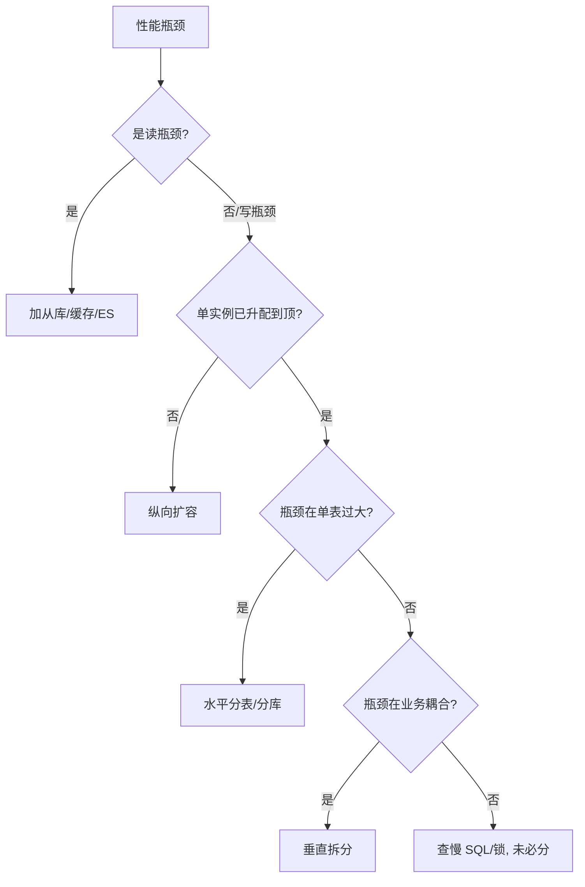
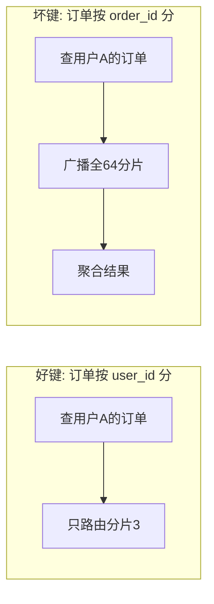

# 01 分库分表决策与路由策略

> 分库分表第一步不是"怎么分"，而是"该不该分、分到什么粒度、用哪个分片键、用什么路由算法"。这一章把决策链路和路由内核讲透。

---

## 一、先判断：到底要不要分？

### 1.1 不要急着分——先做完这些"免费午餐"

| 手段 | 能解决什么 | 上限 |
|------|-----------|------|
| SQL 优化 + 索引治理 | 慢查询、全表扫描 | 单行/小结果集查询 |
| 读写分离（主写从读） | 读多写少，从库分担读 | 写压力无解 |
| 冷热分离 + 历史归档 | 热数据量下降 | 热数据仍增长 |
| 加缓存（Redis） | 读热点 | 写、一致性复杂 |
| 表分区（Partition） | 单表内物理拆分，免改代码 | 仍在同一实例，连接/CPU 共享 |
| 升级硬件（SSD/内存/核数） | 短期缓解 | 成本与单机天花板 |

📌 **经验阈值（非绝对）**：单表行数 > 2000w 且出现明显性能拐点，或单库活跃连接持续打满、写入 TPS 触顶，且上述手段已用尽，才进入分库分表决策。

### 1.2 决策流程图



---

## 二、两种拆分方式：垂直 vs 水平

### 2.1 垂直拆分（按业务/按列）

- **垂直分库**：把耦合度低的业务拆到不同库。如「订单库 / 用户库 / 商品库」。
  - 收益：业务解耦、故障隔离、可按业务独立扩容。
  - 代价：跨库 JOIN 变分布式查询、跨库事务。
- **垂直分表**：把大表的"宽列"拆出去。如 `user` 拆成 `user_base`（频繁访问）+ `user_profile`（大文本/稀疏字段）。
  - 收益：减少 IO、避免大字段拖慢热点查询。
  - 代价：查询要 JOIN 或两次查。

### 2.2 水平拆分（按行，真正的"分片"）

按**分片键（Sharding Key）**把同一张表的数据行，分散到多个库/表。这是本文重点。

| 维度 | 垂直拆分 | 水平拆分 |
|------|---------|---------|
| 切分依据 | 业务/列 | 行（分片键） |
| 数据是否同质 | 否（结构不同） | 是（结构相同） |
| 解决的核心问题 | 耦合、热点字段 | 单表/单库容量与并发上限 |
| 跨片 JOIN | 天然跨库 | 易产生跨分片 JOIN |
| 扩容难度 | 低 | 高（需迁移） |

---

## 三、水平分片的三大路由算法

### 3.1 Hash 取模（最常用）

```
物理分片 = hash(sharding_key) % N
```

- 优点：数据分布均匀，无热点（键分布均匀时）。
- 缺点：**扩容即灾难**——N 变 N' 时，几乎全部数据要重新映射（`hash % N != hash % N'`），需全量迁移。
- 适用：分片数固定、几乎不再扩容的场景；或配合"翻倍扩容"策略（N→2N 时只需迁一半）。

```java
// 简单取模路由
int shard = Math.floorMod(shardingKey.hashCode(), shardCount);
```

### 3.2 Range 范围分片

```
物理分片 = 按 key 所在区间（202601 / 202602 / ...）
```

- 优点：**扩容零迁移**——新区间直接落新分片；范围查询极快（只查对应分片）。
- 缺点：**易热点**——最近的时间区间被集中写入，旧区间冷。如订单按月份分，月初全写当月表。
- 适用：有明显时间维度的数据（日志、账单、流水）；配合"提前建好未来分片"使用。

### 3.3 一致性 Hash（分布式缓存经典，数据库少用但值得懂）

- 把分片节点映射到 0~2^32 的哈希环，key 顺时针找最近节点。
- 优点：节点增减时**只影响环上相邻数据**，迁移量最小。
- 缺点：需引入虚拟节点解决数据倾斜；数据库场景用得少（分片数有限、不如翻倍扩容直观）。
- 适用：分片节点会频繁增减、且能接受最终一致的场景（如 KV 存储、消息分区）。

### 3.4 算法选型速查

| 算法 | 分布均匀 | 扩容迁移量 | 范围查询 | 典型场景 |
|------|---------|-----------|---------|---------|
| Hash 取模 | ✅ | 全量（除非翻倍） | ❌ | 用户/订单通用 |
| Range | ❌（易热点） | 零 | ✅ | 时间序数据 |
| 一致性 Hash | ✅（虚节点） | 局部 | ❌ | 节点易变/缓存 |

📌 **实践建议**：绝大多数业务用 **Hash 取模 + 翻倍扩容预案**（4→8→16→32），少数时间序强场景用 Range 并预设未来分片。

---

## 四、分片键（Sharding Key）怎么选——分库分表的"生死决策"

### 4.1 好分片键的标准

1. **高频查询条件里必然带它**（否则被迫全路由广播）。
2. **区分度高、分布均匀**（避免热点）。
3. **尽量不变**（变更分片键 = 跨分片迁移，极痛苦）。
4. **能让核心事务落在单分片**（避免跨分片事务）。

### 4.2 经典反例

| 反例 | 后果 |
|------|------|
| 订单表按 `order_id` 分片，但 90% 查询是"查某用户的所有订单" | 每次查用户订单都全路由 64 个分片 |
| 按 `status`（状态）分片 | 只有几个值，数据全挤在几个分片，热点 |
| 按 `create_time` 分片且无预设 | 写入全打最新分片，旧分片闲置 |

### 4.3 路由示意图（好键 vs 坏键）



📌 **口诀**：**「查什么就按什么分；查得多又必带的，才是分片键。」**

---

## 五、分片数怎么定（避免分太少不够、分太多运维炸）

- 单分片建议控制在 **500w~2000w 行**（依行宽和访问模式）。
- 先估 2~3 年增长后的总量，除以单分片目标行数，向上取 2 的幂（便于翻倍扩容）。
- 例：订单年增 6 亿，3 年 18 亿，目标单分片 1000w → 需 180 个分片 → 取 256（2^8）。
- **别过度分片**：分片过多 → 跨分片查询笛卡尔爆炸、连接数膨胀、运维复杂。256 已很大，非超大规模无需更多。

---

## 六、常见坑速记

| 坑 | 说明 |
|----|------|
| 分片键选成高频不带的条件 | 全路由，性能比不分还差 |
| 用 enum/低基数字段分片 | 数据倾斜严重 |
| 分片数定死后业务翻数倍 | 只能全量迁移（无翻倍预案时） |
| 跨分片 JOIN | 中间件需笛卡尔乘积，极慢；应冗余/异构（宽表/ES） |
| 分片键可更新 | 行在分片间漂移，一致性灾难 |
| 全局唯一 ID 仍用自增 | 各分片 ID 冲突 |

---

## 七、本章小结

- 分库分表是**最后手段**，先吃透优化/读写分离/缓存/归档。
- 垂直分业务、水平分数据行；本板块主攻水平。
- 路由算法：Hash（均匀、扩容痛）/ Range（扩容易、易热点）/ 一致性 Hash（节点易变）。
- **分片键 > 分片数 > 路由算法**，选键是第一优先级。

👉 下一篇：[02 分布式主键与读写分离](02-分布式主键与读写分离.md)
