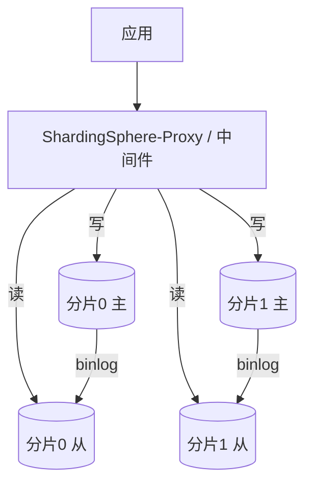
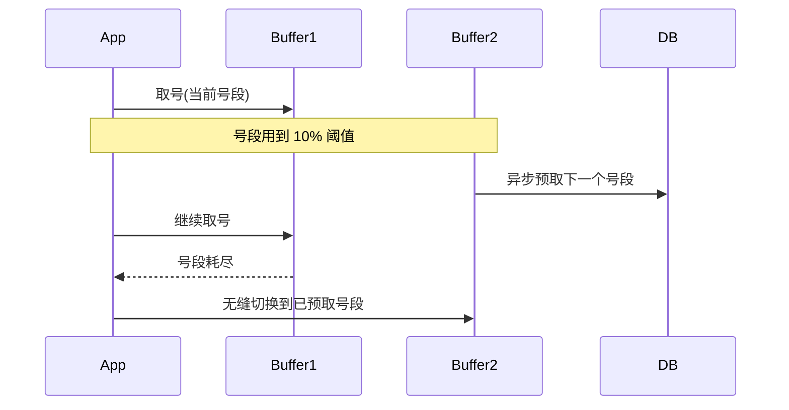
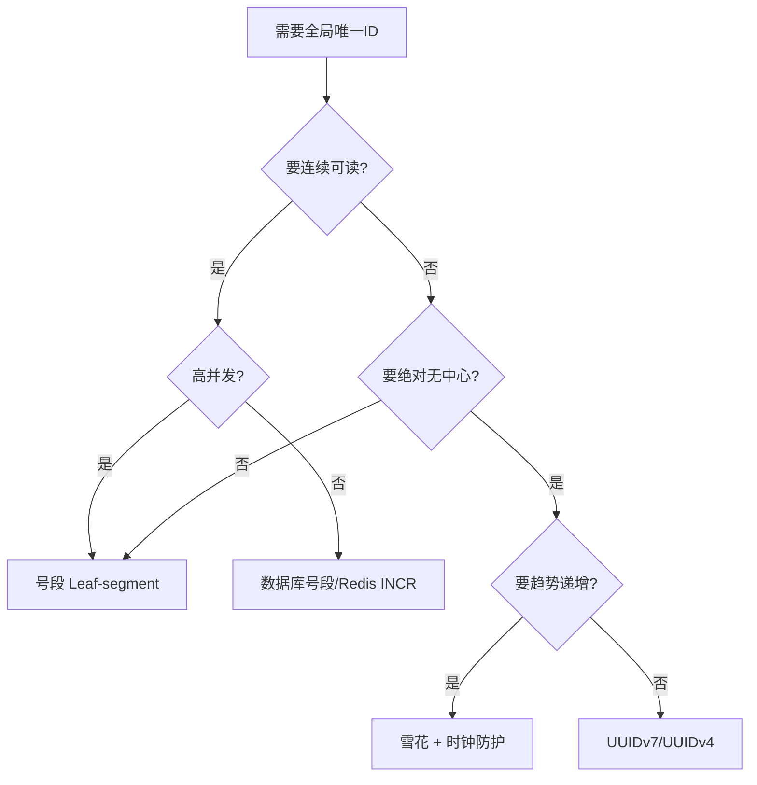
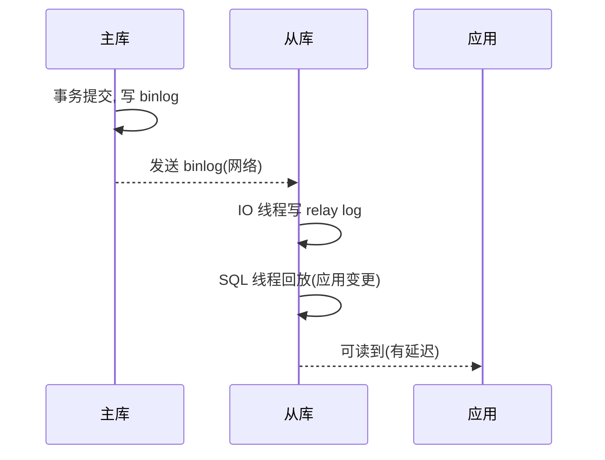
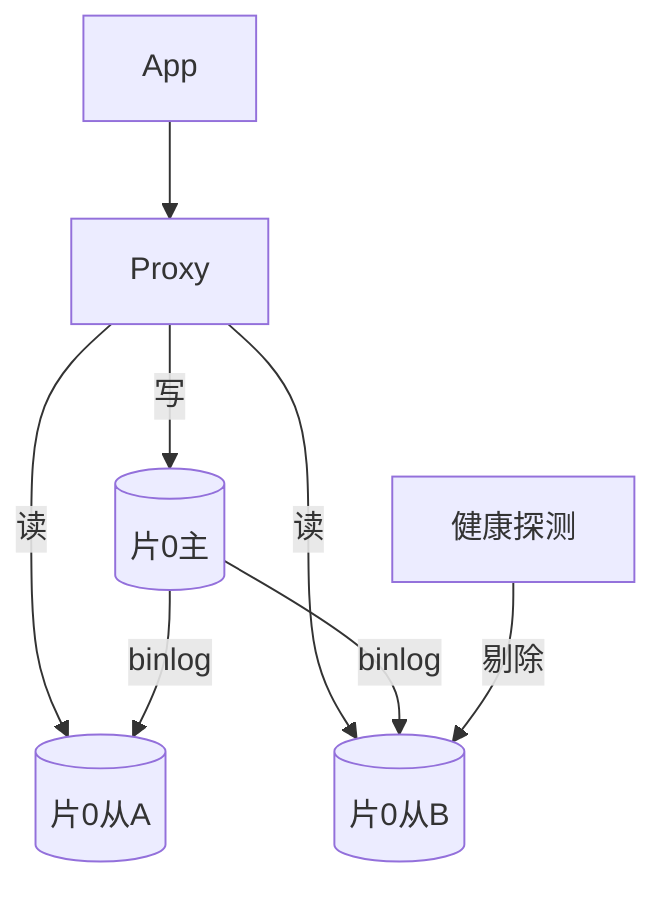

# 02 分布式主键与读写分离

> 分完片之后，两个立刻要解决的问题：**① 全局唯一且最好趋势递增的 ID 怎么生成**（自增主键在分片下直接冲突）；**② 读请求怎么分流到从库**（分片后通常每片仍配主从）。

---

## 一、为什么不能用数据库自增 ID

分片后，每个物理分片是独立实例，`AUTO_INCREMENT` 各自从 1 开始 → **不同分片生成相同 ID，主键冲突**；且自增暴露业务量、易被遍历。

✅ 结论：**分片表的主键必须是应用层/中间件层生成的全局唯一 ID**。

---

## 二、分布式 ID 方案全景

### 2.1 UUID

```java
String id = UUID.randomUUID().toString(); // 32位16进制
```

- 优点：本地生成、无中心、无网络开销、绝对唯一。
- 缺点：**无序**（B+Tree 索引插入随机，页分裂、碎片多）、**太长**（36 字符，索引膨胀）、**无业务含义**。
- 适用：对顺序无要求的内部标识；不作为数据库主键（除非用 UUIDv7 有序版）。
- 📌 UUIDv7（2024 标准化）带 48 位毫秒时间戳前缀，**有序可读**，正在成为新选择。

### 2.2 雪花算法（Snowflake）——最主流

64 位整数：

```
| 1bit符号 | 41bit时间戳(ms) | 10bit机器ID | 12bit序列号 |
  0           (约69年)        (1024台)     (同ms 4096个)
```

- 优点：**趋势递增**（时间戳在前）、**紧凑 64 位长整型**、**高吞吐**（单机百万/秒）、**无中心依赖**（部署即用）。
- 缺点：
  - **时钟回拨**：机器时钟往回走 → 可能生成重复 ID。需回拨检测与等待/备用算法。
  - **机器 ID 分配**：需保证集群内唯一（配置中心/本地配置/ZK 分配）。

```java
// 简化版雪花（生产用成熟实现如 Hutool Snowflake / Leaf / UidGenerator）
public class Snowflake {
    private final long machineId;
    private long sequence = 0L;
    private long lastTs = -1L;
    private static final long EPOCH = 1700000000000L; // 自定义纪元

    public synchronized long nextId() {
        long ts = System.currentTimeMillis();
        if (ts < lastTs) throw new IllegalStateException("clock moved backwards");
        if (ts == lastTs) {
            sequence = (sequence + 1) & 0xFFF;
            if (sequence == 0) ts = waitNextMillis(lastTs); // 本毫秒用尽，等下毫秒
        } else sequence = 0L;
        lastTs = ts;
        return ((ts - EPOCH) << 22) | (machineId << 12) | sequence;
    }
    private long waitNextMillis(long last) {
        long t = System.currentTimeMillis();
        while (t <= last) t = System.currentTimeMillis();
        return t;
    }
}
```

### 2.3 号段模式（Leaf-segment）——高并发首选

- 思路：DB/分布式 KV 里维护 `(biz_tag, max_id, step)`，应用**一次取一段**（如 1000 个），本地自增发号，用完再取。
- 优点：**DB 压力极低**（取号频率 = QPS/step）、**ID 连续递增**、**不依赖时钟**、平滑无尖刺。
- 缺点：号段用尽切换瞬间有轻微延迟；需 DB 做号段表（可双 buffer 预取优化）。

```sql
-- 号段表
CREATE TABLE id_segment (
  biz_tag VARCHAR(32) PRIMARY KEY,
  max_id   BIGINT NOT NULL,
  step     INT    NOT NULL,
  version  BIGINT NOT NULL
);
-- 取号：UPDATE ... SET max_id = max_id + step WHERE biz_tag=? AND version=?
```

### 2.4 方案对比

| 方案 | 唯一性 | 有序 | 性能 | 时钟依赖 | 中心依赖 | 适用 |
|------|-------|------|------|---------|---------|------|
| UUID | ✅ | ❌(v7有序) | 极高 | 否 | 否 | 内部标识 |
| 雪花 | ✅ | ✅趋势 | 极高 | **是(回拨) ** | 否 | 通用主流 |
| 号段 Leaf | ✅ | ✅连续 | 高 | 否 | DB/KV | 高并发业务 |
| Redis INCR | ✅ | ✅ | 高 | 否 | Redis | 简单场景 |
| 数据库号段 | ✅ | ✅ | 中 | 否 | DB | 低吞吐 |

📌 **选型建议**：通用业务用**雪花**（无中心、简单）；高并发且要连续 ID（如订单号前缀）用**号段/Leaf**；内部跟踪用 UUIDv7。

---

## 三、读写分离（每分片仍配主从）

分片解决"容量"，读写分离解决"读扩展"。两者正交，通常**同时采用**：每个分片 = 1 主 N 从。

### 3.1 基本架构



### 3.2 主从延迟——读写分离的头号坑

写主库后立刻读从库，从库可能**还没同步**（延迟几 ms~几 s），读到旧值。

**应对策略**：

| 策略 | 说明 | 代价 |
|------|------|------|
| 强制走主（Hint） | 对一致性要求高的读，显式路由主库 | 主库读压力上升 |
| 写后读走主 | 同一事务/同一用户写后短时间内读走主 | 需会话级标记 |
| 延迟感知路由 | 从库延迟 > 阈值时改路由主库 | 实现复杂 |
| 半同步复制 | 主提交等至少一个从 ACK | 写延迟增加，但减少丢数据 |
| 接受最终一致 | 业务允许短暂不一致（如评论数） | 最简单 |

### 3.3 强制走主的实现（ShardingSphere Hint）

```java
// 通过 Hint 强制本次读走主库（避免主从延迟读到脏旧值）
try (HintManager hint = HintManager.getInstance()) {
    hint.setWriteRouteOnly();           // 后续读强制主库
    Order o = orderMapper.selectById(id);
}
```

### 3.4 负载均衡与故障转移

- 多个从库间做 **Round-Robin / 权重 / 延迟最优** 负载均衡。
- 从库挂了 → 自动剔除，流量转主或其他从（需中间件支持健康探测）。
- 主库挂了 → 需 **MHA / Orchestrator / MGR** 做主从切换（自动提主），应用通过 VIP/Proxy 无感。

---

## 四、本章小结

- 分片表主键必须全局唯一 → 弃用自增，改用雪花/号段/UUIDv7。
- 雪花最常用但有**时钟回拨**风险；号段（Leaf）高并发连续、不依赖时钟。
- 读写分离独立于分片，通常每片 1 主 N 从。
- **主从延迟**是读写分离第一坑：强制走主 / 写后读主 / 半同步 / 接受最终一致。

👉 下一篇：[03 数据迁移双写与平滑扩容](03-数据迁移双写与平滑扩容.md)

---

## 四、雪花算法的"阿喀琉斯之踵"：时钟回拨

雪花算法把 41 位时间戳放在高位，**一旦机器时钟往回走，就可能生成与历史重复、或时间戳更小的 ID**，破坏"趋势递增"甚至导致主键冲突。

### 4.1 时钟回拨的常见来源

| 来源 | 说明 |
|------|------|
| NTP 校时跳变 | 时钟同步服务把时间往回拨几 ms~几 s |
| 虚拟机迁移/休眠恢复 | 物理机时间跳变 |
| 人为改时间 | 运维误操作 |
| 闰秒 | 极端情况 |

### 4.2 防护策略（生产必备）

| 策略 | 做法 | 代价 |
|------|------|------|
| **等待追平** | 检测到 `ts < lastTs`，自旋等待直到追上 | 短暂阻塞，最简单 |
| **备用机器 ID** | 回拨超阈值，临时切到备用 workerId 段 | 需预留 ID 段 |
| **历史时钟缓存** | 定期持久化 `lastTs` 到本地文件/ZK，启动时校验 | 略微复杂 |
| **阿里 Leaf 方案** | 用 ZooKeeper 顺序节点做 workerId 分配 + 时钟监控 | 依赖 ZK |
| **上限拦截** | 回拨超过容忍窗口（如 5s）直接抛异常，快速失败 | 牺牲可用性换正确 |

```java
// 时钟回拨防护（生产版雪花核心片段）
public synchronized long nextId() {
    long ts = System.currentTimeMillis();
    if (ts < lastTs) {
        long offset = lastTs - ts;
        if (offset <= 5_000) {            // 小回拨：等待追平
            ts = waitNextMillis(lastTs);
        } else {
            throw new IllegalStateException("clock moved backwards too much: " + offset + "ms");
        }
    }
    // ... 正常发号
}
```

> 心法：**雪花不是"写完就完"，时钟回拨防护才是生产化的关键**。小回拨等、大回拨拒，比"生成重复 ID"安全得多。

---

## 五、号段模式（Leaf-segment）的工程优化

### 5.1 双 Buffer 预取（消除取号尖刺）

基础号段模式的痛点是"号段用尽瞬间要去 DB 取下一段，出现延迟尖刺"。Leaf 用**双 buffer** 解决：



- 两个号段 buffer 交替：当前用 A，A 用到一定比例就异步加载 B；A 用完切 B，B 再用一定比例加载 A。
- 效果：**取号几乎无 DB 交互尖刺**，DB 压力 = QPS/step。

### 5.2 号段表的并发安全

```sql
-- 取号：CAS 式更新，避免多实例重复取同一段
UPDATE id_segment
SET max_id = max_id + step, version = version + 1
WHERE biz_tag = ? AND version = ?;   -- version 不匹配则重试
```

> 号段模式不依赖时钟、ID 连续递增，适合"订单号前缀/业务单据号"等需要连续可读 ID 的场景。

---

## 六、UUIDv7：有序 UUID 的新选择

传统 UUID（v1~v4）无序，作 DB 主键会引发 B+Tree 页分裂。UUIDv7（2024 标准化）在前缀带 **48 位毫秒时间戳**，天然趋势递增、可读：

```
UUIDv7 = 48bit 毫秒时间戳 + 精度位 + 随机位
```

- 优点：本地生成无中心、全局唯一、**有序**（避免页分裂）、长度固定（128bit）。
- 适用：内部跟踪 ID、对顺序有要求又不想引中央发号器的场景。
- 注意：仍 36 字符，索引比 64 位长整型（雪花）占空间，高并发点查主键场景仍优先雪花/号段。

---

## 七、Redis INCR 发号（简单场景）

```bash
# 利用 Redis 原子自增发号，可加前缀/步长
INCR global:order:id          # 返回 1,2,3... 严格递增
# 多机发号避免单点：步长=机器数，各机错开起点
INCRBY global:order:id 100    # 一次取 100，本地再发
```

- 优点：极简、严格递增、原子。
- 缺点：强依赖 Redis（需高可用）、重启/主从切换可能跳号（不连续但唯一）。
- 适用：简单、吞吐不极端、已有 Redis 的场景。

---

## 八、分布式 ID 方案选型决策树



> 通用业务默认**雪花**（无中心、简单、趋势递增）；高并发且要连续 ID（如订单号前缀）用**号段/Leaf**；内部跟踪用 **UUIDv7**。

---

## 九、读写分离深度：主从复制与延迟来源

### 9.1 主从复制流程



### 9.2 延迟的三大来源

| 来源 | 说明 | 缓解 |
|------|------|------|
| 网络传输 | 主→从 binlog 传输耗时 | 同机房/专用链路 |
| 单线程回放 | 旧版 MySQL SQL 线程串行 | 开并行复制（MTS） |
| 大事务/长 DDL | 一个大事务阻塞后续回放 | 拆小事务、低峰 DDL |

> 主从延迟不是"有没有"的问题，而是"多大"的问题。读写分离的第一要务是**管理延迟带来的不一致窗口**。

---

## 十、主从延迟治理（不止强制走主）

除 [3.2 节](../分库分表与数据迁移/02-分布式主键与读写分离.md#三三读写分离每分片仍配主从) 的策略表外，补充工程细节：

### 10.1 半同步复制（减少丢数据 + 缩小延迟窗口）

```ini
# 主库开启半同步：提交等至少一个从 ACK 才返回客户端
plugin_load = "rpl_semi_sync_master=semisync_master.so"
rpl_semi_sync_master_enabled = 1
rpl_semi_sync_master_timeout = 1000   # 1s 内无 ACK 退化为异步
```

- 代价：写延迟增加（等 ACK），但大幅降低"主挂从没收到"的数据丢失概率。
- 适用：金融/支付等不能丢数据的核心链路。

### 10.2 延迟感知路由（中间件层）

```java
// 伪代码：从库延迟 > 阈值时，本次读改走主库
if (slaveDelayMs(slave) > threshold) {
    routeToMaster();
} else {
    routeToSlave(slave);
}
```

> 复杂但体验最好：正常走从库分压，延迟突增时自动回流主库，避免脏读。

---

## 十一、读写分离架构的负载均衡与故障转移

- **多从库负载均衡**：Round-Robin / 权重 / 延迟最优，把读流量分摊。
- **从库故障**：健康探测（心跳）发现后自动剔除，读流量转主或其他从。
- **主库故障**：需 **MHA / Orchestrator / MGR** 做自动提主；应用通过 VIP/Proxy 无感切换，避免改连接串。
- **读写分离与分片正交**：每个分片 = 1 主 N 从，分片路由在主库侧、读写分离在从库侧，两者叠加不冲突。



---

## 十二、生产踩坑清单（深度版）

| 坑 | 现象 | 根因 | 修正 |
|----|------|------|------|
| 雪花生成重复 ID | 偶发主键冲突 | 时钟回拨未防护 | 加等待/拒绝 + 历史时钟 |
| 号段取号尖刺 | 偶发发号卡顿 | 号段用尽才取 | 双 buffer 预取 |
| 主从脏读 | 刚写就查不到/查旧 | 从库延迟 | 强制走主/写后读主 |
| 读流量打死主库 | 主库 CPU 飙 | 全走主 | 延迟感知回流从库 |
| 从库挂了没剔除 | 读全失败 | 无健康探测 | 加心跳剔除 |
| 用 UUIDv4 作主键 | 插入慢、索引膨胀 | 无序页分裂 | 换 UUIDv7/雪花 |
| Redis 发号重启跳号 | 单据号不连续 | 主从切换丢内存 | 接受跳号（仍唯一） |

---

## 十三、分布式主键与读写分离速记口诀

```
分片表弃自增，全局发号不可少；
雪花无中心简单，时钟回拨要防护；
号段连续高并发，双buffer去尖刺；
UUIDv7 有序新，内部跟踪刚刚好；
读写分离正正交，每片一主带多从；
主从延迟头号坑，强走主/感知路由；
半同步防丢数，健康探测保可用。
```
