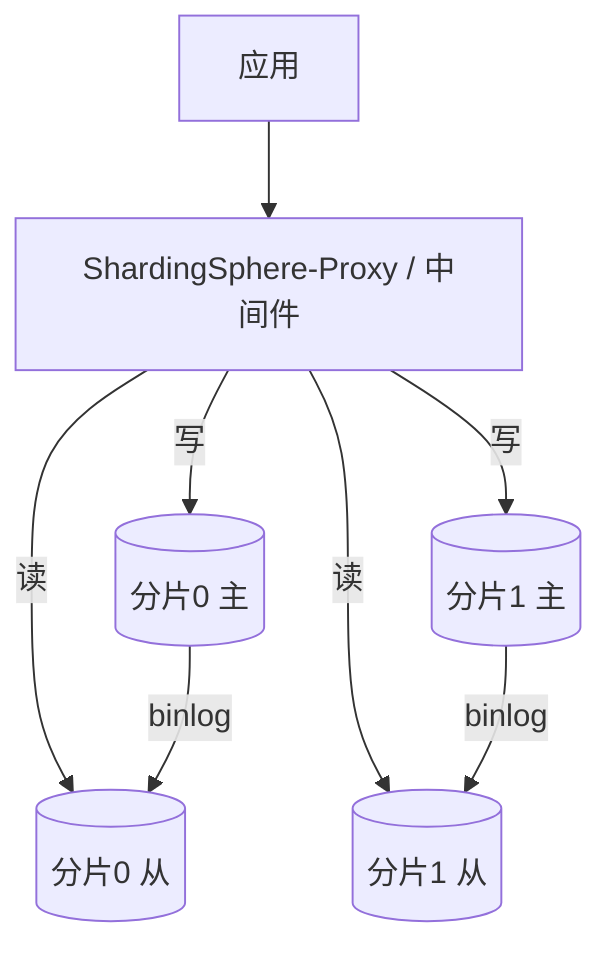

# 02 分布式主键与读写分离

> 分完片之后，两个立刻要解决的问题：**① 全局唯一且最好趋势递增的 ID 怎么生成**（自增主键在分片下直接冲突）；**② 读请求怎么分流到从库**（分片后通常每片仍配主从）。

---

## 一、为什么不能用数据库自增 ID

分片后，每个物理分片是独立实例，`AUTO_INCREMENT` 各自从 1 开始 → **不同分片生成相同 ID，主键冲突**；且自增暴露业务量、易被遍历。

✅ 结论：**分片表的主键必须是应用层/中间件层生成的全局唯一 ID**。

---

## 二、分布式 ID 方案全景

### 2.1 UUID

```java
String id = UUID.randomUUID().toString(); // 32位16进制
```

- 优点：本地生成、无中心、无网络开销、绝对唯一。
- 缺点：**无序**（B+Tree 索引插入随机，页分裂、碎片多）、**太长**（36 字符，索引膨胀）、**无业务含义**。
- 适用：对顺序无要求的内部标识；不作为数据库主键（除非用 UUIDv7 有序版）。
- 📌 UUIDv7（2024 标准化）带 48 位毫秒时间戳前缀，**有序可读**，正在成为新选择。

### 2.2 雪花算法（Snowflake）——最主流

64 位整数：

```
| 1bit符号 | 41bit时间戳(ms) | 10bit机器ID | 12bit序列号 |
  0           (约69年)        (1024台)     (同ms 4096个)
```

- 优点：**趋势递增**（时间戳在前）、**紧凑 64 位长整型**、**高吞吐**（单机百万/秒）、**无中心依赖**（部署即用）。
- 缺点：
  - **时钟回拨**：机器时钟往回走 → 可能生成重复 ID。需回拨检测与等待/备用算法。
  - **机器 ID 分配**：需保证集群内唯一（配置中心/本地配置/ZK 分配）。

```java
// 简化版雪花（生产用成熟实现如 Hutool Snowflake / Leaf / UidGenerator）
public class Snowflake {
    private final long machineId;
    private long sequence = 0L;
    private long lastTs = -1L;
    private static final long EPOCH = 1700000000000L; // 自定义纪元

    public synchronized long nextId() {
        long ts = System.currentTimeMillis();
        if (ts < lastTs) throw new IllegalStateException("clock moved backwards");
        if (ts == lastTs) {
            sequence = (sequence + 1) & 0xFFF;
            if (sequence == 0) ts = waitNextMillis(lastTs); // 本毫秒用尽，等下毫秒
        } else sequence = 0L;
        lastTs = ts;
        return ((ts - EPOCH) << 22) | (machineId << 12) | sequence;
    }
    private long waitNextMillis(long last) {
        long t = System.currentTimeMillis();
        while (t <= last) t = System.currentTimeMillis();
        return t;
    }
}
```

### 2.3 号段模式（Leaf-segment）——高并发首选

- 思路：DB/分布式 KV 里维护 `(biz_tag, max_id, step)`，应用**一次取一段**（如 1000 个），本地自增发号，用完再取。
- 优点：**DB 压力极低**（取号频率 = QPS/step）、**ID 连续递增**、**不依赖时钟**、平滑无尖刺。
- 缺点：号段用尽切换瞬间有轻微延迟；需 DB 做号段表（可双 buffer 预取优化）。

```sql
-- 号段表
CREATE TABLE id_segment (
  biz_tag VARCHAR(32) PRIMARY KEY,
  max_id   BIGINT NOT NULL,
  step     INT    NOT NULL,
  version  BIGINT NOT NULL
);
-- 取号：UPDATE ... SET max_id = max_id + step WHERE biz_tag=? AND version=?
```

### 2.4 方案对比

| 方案 | 唯一性 | 有序 | 性能 | 时钟依赖 | 中心依赖 | 适用 |
|------|-------|------|------|---------|---------|------|
| UUID | ✅ | ❌(v7有序) | 极高 | 否 | 否 | 内部标识 |
| 雪花 | ✅ | ✅趋势 | 极高 | **是(回拨) ** | 否 | 通用主流 |
| 号段 Leaf | ✅ | ✅连续 | 高 | 否 | DB/KV | 高并发业务 |
| Redis INCR | ✅ | ✅ | 高 | 否 | Redis | 简单场景 |
| 数据库号段 | ✅ | ✅ | 中 | 否 | DB | 低吞吐 |

📌 **选型建议**：通用业务用**雪花**（无中心、简单）；高并发且要连续 ID（如订单号前缀）用**号段/Leaf**；内部跟踪用 UUIDv7。

---

## 三、读写分离（每分片仍配主从）

分片解决"容量"，读写分离解决"读扩展"。两者正交，通常**同时采用**：每个分片 = 1 主 N 从。

### 3.1 基本架构



### 3.2 主从延迟——读写分离的头号坑

写主库后立刻读从库，从库可能**还没同步**（延迟几 ms~几 s），读到旧值。

**应对策略**：

| 策略 | 说明 | 代价 |
|------|------|------|
| 强制走主（Hint） | 对一致性要求高的读，显式路由主库 | 主库读压力上升 |
| 写后读走主 | 同一事务/同一用户写后短时间内读走主 | 需会话级标记 |
| 延迟感知路由 | 从库延迟 > 阈值时改路由主库 | 实现复杂 |
| 半同步复制 | 主提交等至少一个从 ACK | 写延迟增加，但减少丢数据 |
| 接受最终一致 | 业务允许短暂不一致（如评论数） | 最简单 |

### 3.3 强制走主的实现（ShardingSphere Hint）

```java
// 通过 Hint 强制本次读走主库（避免主从延迟读到脏旧值）
try (HintManager hint = HintManager.getInstance()) {
    hint.setWriteRouteOnly();           // 后续读强制主库
    Order o = orderMapper.selectById(id);
}
```

### 3.4 负载均衡与故障转移

- 多个从库间做 **Round-Robin / 权重 / 延迟最优** 负载均衡。
- 从库挂了 → 自动剔除，流量转主或其他从（需中间件支持健康探测）。
- 主库挂了 → 需 **MHA / Orchestrator / MGR** 做主从切换（自动提主），应用通过 VIP/Proxy 无感。

---

## 四、本章小结

- 分片表主键必须全局唯一 → 弃用自增，改用雪花/号段/UUIDv7。
- 雪花最常用但有**时钟回拨**风险；号段（Leaf）高并发连续、不依赖时钟。
- 读写分离独立于分片，通常每片 1 主 N 从。
- **主从延迟**是读写分离第一坑：强制走主 / 写后读主 / 半同步 / 接受最终一致。

👉 下一篇：[03 数据迁移双写与平滑扩容](03-数据迁移双写与平滑扩容.md)
