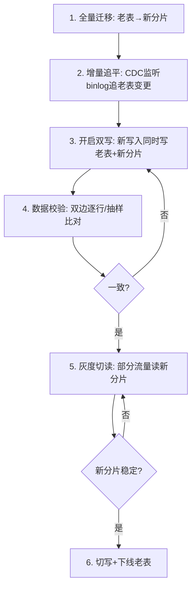
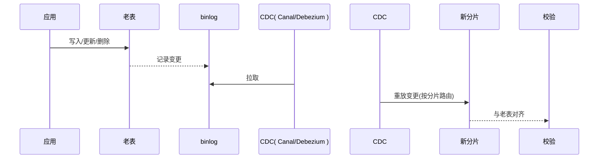
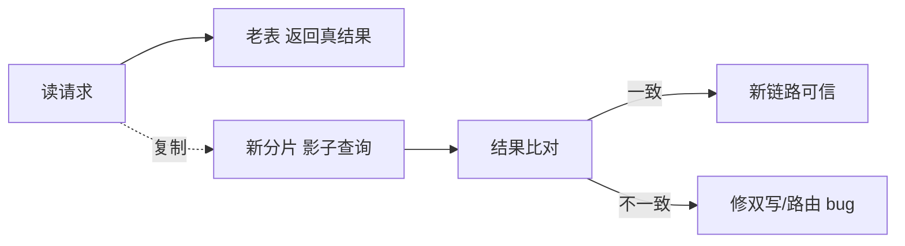
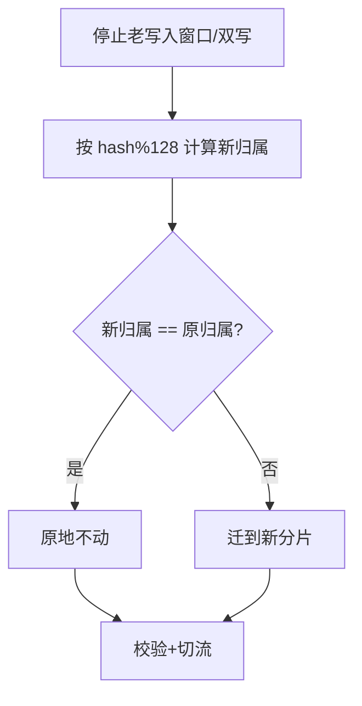

# 03 数据迁移、双写与平滑扩容

> "分"只是设计，"迁"才是工程。把一张几千万行的线上大表，在不停业务、不丢数据、可回滚的前提下，平滑拆成 N 个分片——这是分库分表全流程里**风险最高、最需要纪律**的一环。

---

## 一、迁移方式总览

| 方式 | 停机 | 风险 | 适用 |
|------|------|------|------|
| 停机迁移 | 需停服 | 低（无并发写） | 小表/可容忍停服 |
| 全量+增量（CDC）双写 | 不停 | 中 | 大表主流方案 |
| 双写双读灰度 | 不停 | 中高（需一致切换） | 超大表/强一致 |

---

## 二、主流方案：全量迁移 + 增量同步 + 双写校验

### 2.1 整体流程



### 2.2 全量迁移

- 用 ETL/脚本/数据同步工具（DataX、Canal、Flink CDC）把老表数据按分片路由写入新分片。
- 注意**分批**（每次 LIMIT/between 主键）+ **限速**，避免拖垮源库。
- 大数据量建议多线程分片并行迁移。

### 2.3 增量同步（CDC）

- 全量期间老表仍有写入，全量完成后用 **binlog CDC**（如 Canal/Debezium，见 [数据同步CDC-Canal](../基础知识/中间件/数据同步CDC-Canal.md)）持续把老表变更同步到新分片，直到追平。

```sql
-- 全量分批迁移示例（按主键游标）
INSERT INTO order_shard_03 (id, user_id, amount, ...)
SELECT id, user_id, amount, ...
FROM orders
WHERE id BETWEEN 30000001 AND 30050000
  AND sharding_key(user_id) = 3;  -- 只迁属于该分片的数据
```

### 2.4 双写（关键过渡态）

应用层改造：写入时**同时写老表和新分片**，读仍走老表（老表是单一真相源）。

```java
@Transactional
public void createOrder(Order o) {
    // 1) 写老表（真相源）
    legacyOrderMapper.insert(o);
    // 2) 双写新分片（失败可补偿/告警，初期不阻断主流程）
    try {
        shardOrderMapper.insert(o);
    } catch (Exception e) {
        dualWriteQueue.offer(o); // 进补偿队列，异步重试
        log.error("dual-write shard failed, queued", e);
    }
}
```

### 2.5 数据校验

- **全量校验**：双边按分片逐行比对（主键、关键字段、行数）。大数据用抽样 + 哈希分桶比对降低开销。
- **实时校验**：双写期间对关键订单做读写校验，发现不一致进补偿。

### 2.6 灰度切读与最终切换

1. **灰度切读**：先 1%→10%→50%→100% 流量读新分片，观察 RT/错误率。
2. **切写**：读全量稳定后，写也切到新分片（保留老表一段时间作回滚源）。
3. **下线老表**：观察期（如 1~2 周）无问题后，停双写、归档老表。

---

## 三、扩容（分片数从 N 变 M）

### 3.1 翻倍扩容（推荐预案）

若初始按 2^k 分片，扩容时翻倍到 2^(k+1)，**只迁移约一半数据**（`hash % 2N` 只改变原偶数/奇数分片的归属，一半数据原地不动）。

```
原: hash % 4 → 0,1,2,3
新: hash % 8 → 0,1,2,3,4,5,6,7
规律: 原分片i的数据 → 新分片 i 或 i+4，半数迁移
```

### 3.2 一致性 Hash 扩容

节点增减只迁移环上相邻数据，迁移量最小（参见 01 章 3.3）。

### 3.3 在线扩容工具

- **ShardingSphere-Scaling**：支持存量迁移 + 增量同步 + 一致性校验的自动化扩容，适合用 ShardingSphere 的团队。
- 自建：基于 CDC 的双写灰度（本章第二节），本质相同。

---

## 四、回滚策略（必须有）

| 阶段 | 回滚方式 |
|------|---------|
| 仅全量+增量，未双写 | 丢弃新分片，重来 |
| 双写期间 | 停双写，读仍走老表，老表为真相源 |
| 灰度切读中 | 流量回切老表（开关控制） |
| 已切写未下线老表 | 暂停新写入，按老表恢复，重做增量追平 |
| 已完全切换 | 依赖老表归档 + 备份恢复（极慢，尽量避免到这步） |

📌 **铁律**：**老表在观察期内绝不能删**。删除老表是迁移里最不可回滚的动作。

---

## 五、常见坑

| 坑 | 后果 |
|----|------|
| 全量迁移不限额速 | 拖垮源库，线上抖动 |
| 双写失败未补偿 | 新老数据永久不一致 |
| 未做数据校验就切读 | 悄悄丢/错数据 |
| 切读后立刻删老表 | 出问题无法回滚 |
| 增量 CDC 断点丢失 | 部分变更漏同步 |
| 分片路由逻辑新老不一致 | 双写路由错片 |

---

## 六、本章小结

- 迁移四步曲：**全量 → 增量追平 → 双写 → 校验 → 灰度切读/写 → 下线**。
- 双写期间**老表是真相源**，新分片可补偿重试，保证可回滚。
- 扩容优先**翻倍预案**或一致性 Hash，避免全量重分布。
- **永远保留老表到观察期结束**——回滚能力比速度重要。

👉 下一篇：[04 分布式事务与一致性](04-分布式事务与一致性.md)

---

## 七、迁移工程化：把"迁"做成可复跑的实验

迁移不是一次性脚本，而要可复跑、可归档、可回退。给出一套最小工程骨架：

```
migration/
├── README.md          # 目标/环境/窗口/回滚
├── full/              # 全量迁移（分批游标）
│   └── full_load.py
├── cdc/               # 增量同步（Canal/Debezium/Flink CDC）
│   └── binlog_sync.py
├── dualwrite/         # 应用双写适配（老表+新分片）
│   └── DualWriteAspect.java
├── verify/            # 数据校验（行级+哈希分桶）
│   └── checker.py
├── shadow/            # 影子流量（复制读流量验证新链路）
│   └── shadow_replay.py
└── run.sh             # 一键：全量→增量→校验→报告
```

> 心法：**迁移失败也是成果**——它把"生产事故"前置成了"实验结论"。工程化让每一步都可重来。

---

## 八、全量迁移：分批、限速、断点续传

### 8.1 为什么不能一次性 `INSERT ... SELECT`

几千万行一次性搬迁会：锁源表/打满 IO/拖垮线上、失败要重头。必须**分批游标**：

```sql
-- 按主键游标分批，每批 5000~20000 行
INSERT INTO order_shard_03 (id, user_id, amount, ...)
SELECT id, user_id, amount, ...
FROM orders
WHERE id BETWEEN :start AND :end
  AND sharding_key(user_id) = 3;   -- 只迁属于该分片的数据
```

### 8.2 限速与并发

| 参数 | 建议 | 说明 |
|------|------|------|
| 每批行数 | 5000~20000 | 依行宽与从库承压 |
| 并发线程 | 分片数 / 2~4 | 多分片并行，但别打满源库 |
| 限速 | 监控源库 CPU < 60% | 动态降速 |
| 错峰 | 大表迁移放业务低峰 | 减少影响 |

### 8.3 断点续传

记录每批的最大 `id` 到进度表，失败从断点继续，避免重复迁移：

```sql
CREATE TABLE migrate_progress (
  shard_name VARCHAR(32) PRIMARY KEY,
  last_id     BIGINT,
  status      VARCHAR(16)   -- running/done
);
```

---

## 九、增量同步（CDC）：追平全量期间的变更

全量迁移期间老表仍有写入，全量完成后用 **binlog CDC** 持续把老表变更同步到新分片，直到追平：



- **断点管理**：CDC 记录消费位点（binlog file + position / GTID），重启不丢不重。
- **乱序与幂等**：更新可能乱序到达，新分片写入需幂等（按主键 `REPLACE`/`UPSERT`）。
- 详见 [基础知识/中间件/数据同步CDC-Canal](../基础知识/中间件/数据同步CDC-Canal.md)。

---

## 十、双写顺序与一致性边界（关键决策）

双写期间"先写老表还是先写新分片"直接影响回滚安全性：

| 顺序 | 语义 | 回滚安全性 |
|------|------|------------|
| **先老表（真相源），后新分片（可补偿）** | 老表成功才算成功，新分片失败进补偿队列 | ✅ 高（老表始终为真） |
| 先新分片，后老表 | 新分片成功但老表失败 → 两边都有脏数据 | ❌ 低 |

```java
@Transactional   // 老表写在本事务
public void createOrder(Order o) {
    legacyOrderMapper.insert(o);          // 1) 真相源，失败即整体回滚
    try {
        shardOrderMapper.insert(o);       // 2) 新分片，失败可补偿
    } catch (Exception e) {
        dualWriteQueue.offer(o);          // 进补偿队列，异步重试
        log.error("dual-write shard failed, queued", e);
    }
}
```

> **铁律**：双写期间**老表是单一真相源**，新分片允许短暂不一致 + 补偿重试。这样任何时刻都能"以老表为准"回滚。

---

## 十一、数据校验算法（不校验不切读）

### 11.1 行级 + 关键字段比对

```
对每分片：
  按主键遍历，对比 老表.字段 == 新分片.字段
  重点字段：金额/状态/时间（业务敏感字段）
  计数：行数、字段不一致数
```

### 11.2 哈希分桶（大数据降开销）

```python
# 把每行的关键字段拼成字符串求 hash，按 hash % N 分桶
# 只比较两侧同桶的 hash 集合是否一致，避免逐行拉全量
def bucket(row): 
    s = f"{row.id}|{row.amount}|{row.status}|{row.updated_at}"
    return hashlib.md5(s.encode()).digest()[-1] % 1024
```

- 桶数设大（如 1024），不一致桶再下钻逐行比，快速定位差异。
- 实时校验：双写期间对关键订单做读写校验，发现不一致进补偿。

> 校验不过 = 不允许切读。这是迁移里最不能省的一步。

---

## 十二、影子流量（验证新链路不生效）

切读前，用**影子流量**把一份真实读流量复制到新分片，只比对结果、不影响生产：



- 影子流量在切读前就暴露"路由错片/数据不一致/性能问题"，风险远低于直接灰度切读。
- 适用：读路径复杂、对一致性要求高的场景。

---

## 十三、灰度切读与秒级回滚

1. **灰度切读**：先 1%→10%→50%→100% 流量读新分片，观察 RT/错误率。
2. **回滚开关**：流量比例由配置中心/网关控制，异常秒级回切老表。
3. **切写**：读全量稳定后，写也切到新分片（保留老表一段时间作回滚源）。
4. **下线老表**：观察期（1~2 周）无问题后，停双写、归档老表。

```json
// 网关层按比例切读（示例）
{ "uri": "/api/order", "upstream": { "nodes": [
  { "host": "new-shard", "weight": 10 },
  { "host": "old-db",    "weight": 90 }
]}}
```

---

## 十四、扩容实战：翻倍映射表法

分片数从 64 → 128 的迁移映射（配合 [01 章第九节](../分库分表与数据迁移/01-分库分表决策与路由策略.md#九路由算法内核为什么-hash-均匀扩容痛) 的数学）：



- 翻倍只迁移约一半数据，窗口短、风险低。
- 一致性 Hash 扩容：节点增减只迁环上相邻数据，迁移量最小（见 [01 章第十节](../分库分表与数据迁移/01-分库分表决策与路由策略.md#十一致性-hash-环图示--虚拟节点)）。
- 在线工具：ShardingSphere-Scaling 支持存量迁移 + 增量同步 + 一致性校验的自动化扩容。

---

## 十五、生产踩坑清单（深度版）

| 坑 | 现象 | 根因 | 修正 |
|----|------|------|------|
| 全量不限额速 | 源库被打垮、线上抖动 | 一次性大搬迁 | 分批+限速+错峰 |
| 双写顺序反了 | 回滚出现脏数据 | 先写新分片后老表 | 老表为真相源优先 |
| 双写失败未补偿 | 新老永久不一致 | 失败只打日志 | 进补偿队列+重试+告警 |
| 未做校验就切读 | 静默丢/错数据 | 跳了校验步 | 校验不过禁止切读 |
| CDC 断点丢失 | 部分变更漏同步 | 位点没持久化 | GTID/位点持久化 |
| 切读即删老表 | 出问题无法回滚 | 铁律没守 | 观察期后再删 |
| 路由逻辑新老不一致 | 双写路由错片 | 两套路由代码 | 共用同一路由模块 |

---

## 十六、数据迁移速记口诀

```
迁移四步莫跳步：全量增量双写校验；
全量分批要限速，断点续传防重迁；
CDC 追平靠位点，幂等重放不乱序；
双写老表是真相，新片失败可补偿；
校验不过不切读，影子流量先佐证；
扩容翻倍迁一半，老表留到观察完。
```
