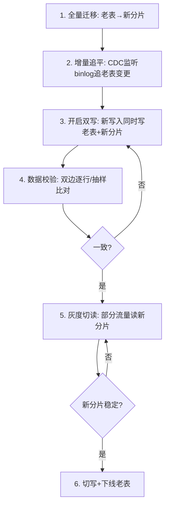

# 03 数据迁移、双写与平滑扩容

> "分"只是设计，"迁"才是工程。把一张几千万行的线上大表，在不停业务、不丢数据、可回滚的前提下，平滑拆成 N 个分片——这是分库分表全流程里**风险最高、最需要纪律**的一环。

---

## 一、迁移方式总览

| 方式 | 停机 | 风险 | 适用 |
|------|------|------|------|
| 停机迁移 | 需停服 | 低（无并发写） | 小表/可容忍停服 |
| 全量+增量（CDC）双写 | 不停 | 中 | 大表主流方案 |
| 双写双读灰度 | 不停 | 中高（需一致切换） | 超大表/强一致 |

---

## 二、主流方案：全量迁移 + 增量同步 + 双写校验

### 2.1 整体流程



### 2.2 全量迁移

- 用 ETL/脚本/数据同步工具（DataX、Canal、Flink CDC）把老表数据按分片路由写入新分片。
- 注意**分批**（每次 LIMIT/between 主键）+ **限速**，避免拖垮源库。
- 大数据量建议多线程分片并行迁移。

### 2.3 增量同步（CDC）

- 全量期间老表仍有写入，全量完成后用 **binlog CDC**（如 Canal/Debezium，见 [数据同步CDC-Canal](../基础知识/中间件/数据同步CDC-Canal.md)）持续把老表变更同步到新分片，直到追平。

```sql
-- 全量分批迁移示例（按主键游标）
INSERT INTO order_shard_03 (id, user_id, amount, ...)
SELECT id, user_id, amount, ...
FROM orders
WHERE id BETWEEN 30000001 AND 30050000
  AND sharding_key(user_id) = 3;  -- 只迁属于该分片的数据
```

### 2.4 双写（关键过渡态）

应用层改造：写入时**同时写老表和新分片**，读仍走老表（老表是单一真相源）。

```java
@Transactional
public void createOrder(Order o) {
    // 1) 写老表（真相源）
    legacyOrderMapper.insert(o);
    // 2) 双写新分片（失败可补偿/告警，初期不阻断主流程）
    try {
        shardOrderMapper.insert(o);
    } catch (Exception e) {
        dualWriteQueue.offer(o); // 进补偿队列，异步重试
        log.error("dual-write shard failed, queued", e);
    }
}
```

### 2.5 数据校验

- **全量校验**：双边按分片逐行比对（主键、关键字段、行数）。大数据用抽样 + 哈希分桶比对降低开销。
- **实时校验**：双写期间对关键订单做读写校验，发现不一致进补偿。

### 2.6 灰度切读与最终切换

1. **灰度切读**：先 1%→10%→50%→100% 流量读新分片，观察 RT/错误率。
2. **切写**：读全量稳定后，写也切到新分片（保留老表一段时间作回滚源）。
3. **下线老表**：观察期（如 1~2 周）无问题后，停双写、归档老表。

---

## 三、扩容（分片数从 N 变 M）

### 3.1 翻倍扩容（推荐预案）

若初始按 2^k 分片，扩容时翻倍到 2^(k+1)，**只迁移约一半数据**（`hash % 2N` 只改变原偶数/奇数分片的归属，一半数据原地不动）。

```
原: hash % 4 → 0,1,2,3
新: hash % 8 → 0,1,2,3,4,5,6,7
规律: 原分片i的数据 → 新分片 i 或 i+4，半数迁移
```

### 3.2 一致性 Hash 扩容

节点增减只迁移环上相邻数据，迁移量最小（参见 01 章 3.3）。

### 3.3 在线扩容工具

- **ShardingSphere-Scaling**：支持存量迁移 + 增量同步 + 一致性校验的自动化扩容，适合用 ShardingSphere 的团队。
- 自建：基于 CDC 的双写灰度（本章第二节），本质相同。

---

## 四、回滚策略（必须有）

| 阶段 | 回滚方式 |
|------|---------|
| 仅全量+增量，未双写 | 丢弃新分片，重来 |
| 双写期间 | 停双写，读仍走老表，老表为真相源 |
| 灰度切读中 | 流量回切老表（开关控制） |
| 已切写未下线老表 | 暂停新写入，按老表恢复，重做增量追平 |
| 已完全切换 | 依赖老表归档 + 备份恢复（极慢，尽量避免到这步） |

📌 **铁律**：**老表在观察期内绝不能删**。删除老表是迁移里最不可回滚的动作。

---

## 五、常见坑

| 坑 | 后果 |
|----|------|
| 全量迁移不限额速 | 拖垮源库，线上抖动 |
| 双写失败未补偿 | 新老数据永久不一致 |
| 未做数据校验就切读 | 悄悄丢/错数据 |
| 切读后立刻删老表 | 出问题无法回滚 |
| 增量 CDC 断点丢失 | 部分变更漏同步 |
| 分片路由逻辑新老不一致 | 双写路由错片 |

---

## 六、本章小结

- 迁移四步曲：**全量 → 增量追平 → 双写 → 校验 → 灰度切读/写 → 下线**。
- 双写期间**老表是真相源**，新分片可补偿重试，保证可回滚。
- 扩容优先**翻倍预案**或一致性 Hash，避免全量重分布。
- **永远保留老表到观察期结束**——回滚能力比速度重要。

👉 下一篇：[04 分布式事务与一致性](04-分布式事务与一致性.md)
