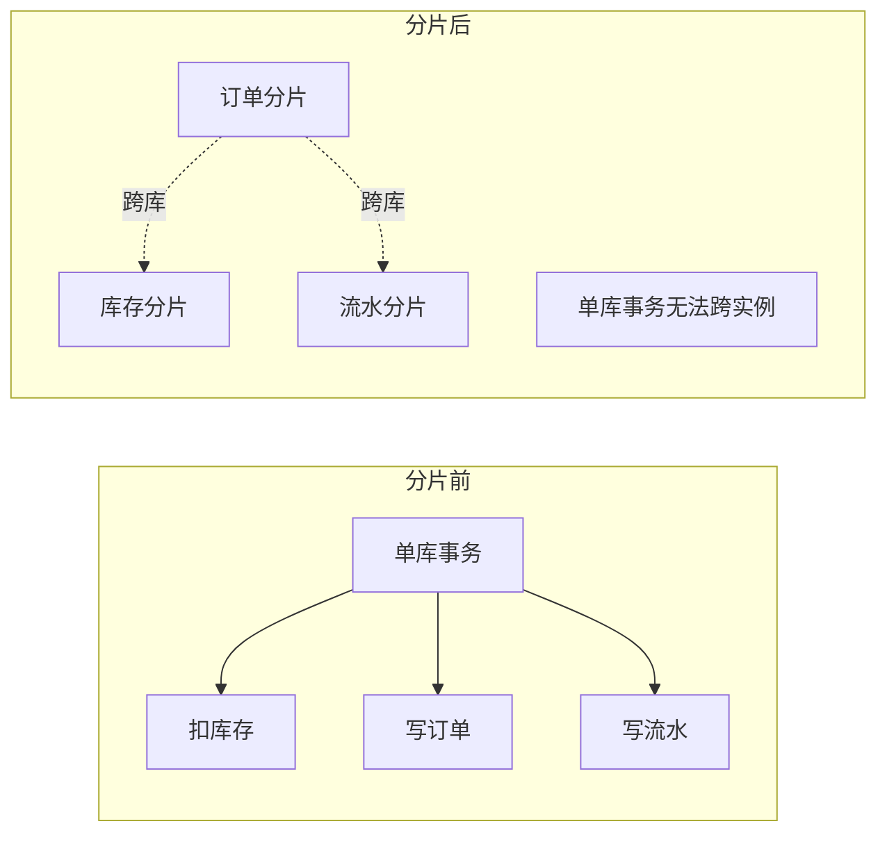

# 04 分布式事务与一致性

> 分片前，一个本地事务 `BEGIN ... COMMIT` 就能保证「扣库存 + 写订单 + 写流水」原子完成。分片后，这些表可能落在不同库、不同实例——**本地事务边界被打破**，必须重新设计一致性方案。
> 本文讲清分片场景下的事务选型；落地实现（Seata、RocketMQ 事务消息）见 [分布式事务Seata](../基础知识/中间件/分布式事务Seata.md)。

---

## 一、为什么分片让事务变难



核心难点：
1. **跨库原子性**：一个分片提交成功、另一个失败 → 数据不一致。
2. **网络/部分失败**：需补偿或回滚远端已提交的操作。
3. **性能**：跨库事务锁范围广、RT 高、吞吐降。

---

## 二、方案全景与选型

| 方案 | 一致性 | 侵入性 | 性能 | 适用 |
|------|-------|-------|------|------|
| 2PC/XA | 强一致 | 低 | 差（长锁） | 短事务、低并发 |
| TCC | 最终/强 | **高**（三接口） | 好 | 核心资金链路 |
| Saga | 最终 | 中（补偿） | 好 | 长流程业务 |
| 本地消息表 | 最终 | 中 | 好 | 异步解耦场景 |
| 事务消息（RocketMQ） | 最终 | 低 | 好 | 发消息+本地操作 |
| 单分片聚合 | 强（本地） | 无 | 最好 | **优先设计** |

📌 **最重要的一条**：**尽量让一个事务涉及的数据落在同一个分片**（选对分片键 + 绑定表），就能用本地事务解决，**根本不需要分布式事务**。这是分片设计的最高境界。

---

## 三、2PC / XA（不推荐高并发）

- 协调者两阶段：Prepare（各库锁定资源）→ Commit/Rollback。
- 缺点：**同步阻塞**（资源锁到第二阶段）、**协调者单点**、**长事务锁竞争**；分片越多越慢。
- 适用：低频、强一致要求、短事务（如日终对账），不适合高并发在线链路。

---

## 四、TCC（Try-Confirm-Cancel）——核心链路首选

业务层把每个操作拆成三个接口：

```
Try:   预留资源（如冻结库存，而非真扣）
Confirm: 确认执行（真正扣减，幂等）
Cancel: 释放预留（回滚预留，幂等）
```

- 优点：无长锁、性能好、可控。
- 缺点：**侵入性强**，每个参与者都要实现三接口；需保证 Confirm/Cancel **幂等**（网络重试）。
- 落地：用 Seata TCC 模式托管事务上下文与重试（见 Seata 单篇）。

```java
// TCC 参与者示例（伪代码）
@TwoPhaseBusinessAction(name = "deductStock", commitMethod = "confirm", rollbackMethod = "cancel")
public boolean tryDeduct(@BusinessActionContextParameter Long skuId, int count) {
    stockMapper.freeze(skuId, count); // 冻结而非扣减
    return true;
}
public boolean confirm(BusinessActionContext ctx) { /* 冻结转实际扣减, 幂等 */ }
public boolean cancel(BusinessActionContext ctx)  { /* 释放冻结, 幂等 */ }
```

---

## 五、Saga —— 长流程业务

- 把大事务拆成一系列**本地事务**，每个步骤有对应的**补偿操作**。
- 失败时用补偿**逆序回滚**已完成的步骤。
- 两种协调：编排（Orchestration，中央控制器）/ 协同（Choreography，事件驱动）。
- 适用：跨多个服务的长链路（下单→支付→履约→发货），**最终一致**可接受。

---

## 六、本地消息表 / 事务消息 —— 异步解耦

### 6.1 本地消息表（最大努力通知）

```
1. 本地事务: 写业务数据 + 写消息表(状态=待发送)  [同库, 原子]
2. 异步任务: 读消息表, 发 MQ, 成功则标已发送
3. 消费方: 处理 + 幂等; 失败重试
```

- 好处：用"本地事务 + 异步投递"规避跨库事务，实现简单可靠。
- 关键点：消费端必须**幂等**（消息可能重投）。

### 6.2 事务消息（RocketMQ）

- 半消息机制：先发半消息 → 本地事务 → 提交/回滚，Broker 保证消息与本地操作最终一致。
- 适合"本地操作成功就必须发消息"的场景（如支付成功后发通知）。

---

## 七、跨分片查询怎么办（也是一致性的一部分）

分片后 `JOIN` / `COUNT` / `ORDER BY` 跨分片很痛苦：

| 需求 | 方案 |
|------|------|
| 跨分片 JOIN | 冗余宽表 / 异构到 ES / 应用层分查后聚合 |
| 全局 COUNT/SUM | 各分片分别算再汇总（或冗余计数表） |
| 跨分片分页 | 各分片取 Top-N 再内存归并（深分页慎用） |
| 字典表/小表 | **广播表**（每个分片都存一份，避免 JOIN 跨片） |
| 关联强一致 | **绑定表**（同分片键的父子表放同片，JOIN 本地化） |

📌 中间件层（ShardingSphere）对广播表、绑定表有原生支持，见 05 章。

---

## 八、本章小结

- 分片打破本地事务边界 → 必须重新设计一致性。
- **首选：让相关数据同分片，用本地事务**（设计优势）。
- 跨分片时：**核心资金用 TCC，长流程用 Saga，异步解耦用消息表/事务消息**。
- 2PC/XA 长锁，高并发慎选。
- 跨分片查询用广播表/绑定表/冗余到 ES，避免跨片 JOIN。

👉 下一篇：[05 ShardingSphere 实战](05-ShardingSphere实战.md)
