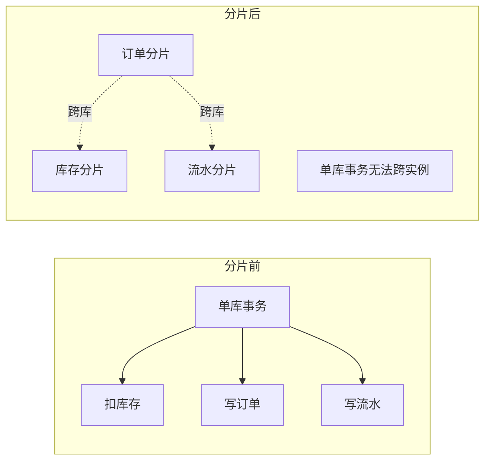
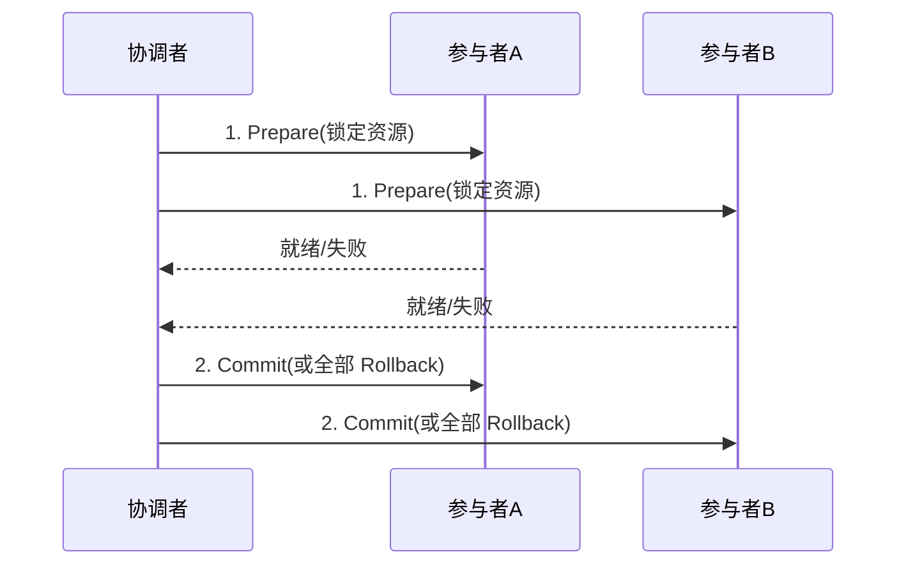
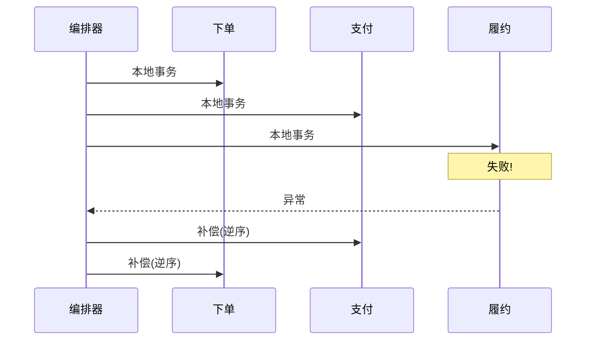
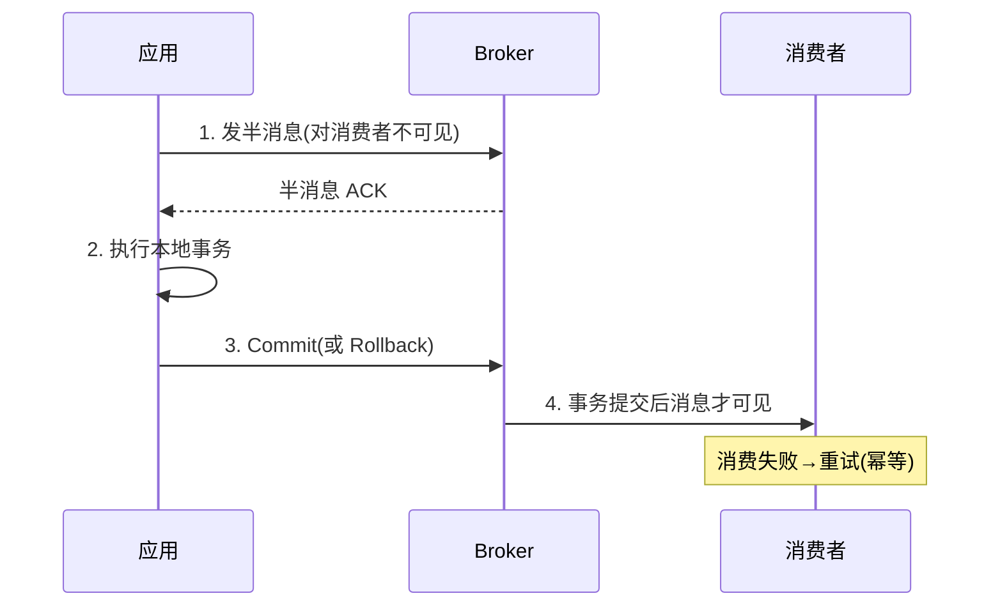

# 04 分布式事务与一致性

> 分片前，一个本地事务 `BEGIN ... COMMIT` 就能保证「扣库存 + 写订单 + 写流水」原子完成。分片后，这些表可能落在不同库、不同实例——**本地事务边界被打破**，必须重新设计一致性方案。
> 本文讲清分片场景下的事务选型；落地实现（Seata、RocketMQ 事务消息）见 [分布式事务Seata](../基础知识/中间件/分布式事务Seata.md)。

---

## 一、为什么分片让事务变难



核心难点：
1. **跨库原子性**：一个分片提交成功、另一个失败 → 数据不一致。
2. **网络/部分失败**：需补偿或回滚远端已提交的操作。
3. **性能**：跨库事务锁范围广、RT 高、吞吐降。

---

## 二、方案全景与选型

| 方案 | 一致性 | 侵入性 | 性能 | 适用 |
|------|-------|-------|------|------|
| 2PC/XA | 强一致 | 低 | 差（长锁） | 短事务、低并发 |
| TCC | 最终/强 | **高**（三接口） | 好 | 核心资金链路 |
| Saga | 最终 | 中（补偿） | 好 | 长流程业务 |
| 本地消息表 | 最终 | 中 | 好 | 异步解耦场景 |
| 事务消息（RocketMQ） | 最终 | 低 | 好 | 发消息+本地操作 |
| 单分片聚合 | 强（本地） | 无 | 最好 | **优先设计** |

📌 **最重要的一条**：**尽量让一个事务涉及的数据落在同一个分片**（选对分片键 + 绑定表），就能用本地事务解决，**根本不需要分布式事务**。这是分片设计的最高境界。

---

## 三、2PC / XA（不推荐高并发）

- 协调者两阶段：Prepare（各库锁定资源）→ Commit/Rollback。
- 缺点：**同步阻塞**（资源锁到第二阶段）、**协调者单点**、**长事务锁竞争**；分片越多越慢。
- 适用：低频、强一致要求、短事务（如日终对账），不适合高并发在线链路。

---

## 四、TCC（Try-Confirm-Cancel）——核心链路首选

业务层把每个操作拆成三个接口：

```
Try:   预留资源（如冻结库存，而非真扣）
Confirm: 确认执行（真正扣减，幂等）
Cancel: 释放预留（回滚预留，幂等）
```

- 优点：无长锁、性能好、可控。
- 缺点：**侵入性强**，每个参与者都要实现三接口；需保证 Confirm/Cancel **幂等**（网络重试）。
- 落地：用 Seata TCC 模式托管事务上下文与重试（见 Seata 单篇）。

```java
// TCC 参与者示例（伪代码）
@TwoPhaseBusinessAction(name = "deductStock", commitMethod = "confirm", rollbackMethod = "cancel")
public boolean tryDeduct(@BusinessActionContextParameter Long skuId, int count) {
    stockMapper.freeze(skuId, count); // 冻结而非扣减
    return true;
}
public boolean confirm(BusinessActionContext ctx) { /* 冻结转实际扣减, 幂等 */ }
public boolean cancel(BusinessActionContext ctx)  { /* 释放冻结, 幂等 */ }
```

---

## 五、Saga —— 长流程业务

- 把大事务拆成一系列**本地事务**，每个步骤有对应的**补偿操作**。
- 失败时用补偿**逆序回滚**已完成的步骤。
- 两种协调：编排（Orchestration，中央控制器）/ 协同（Choreography，事件驱动）。
- 适用：跨多个服务的长链路（下单→支付→履约→发货），**最终一致**可接受。

---

## 六、本地消息表 / 事务消息 —— 异步解耦

### 6.1 本地消息表（最大努力通知）

```
1. 本地事务: 写业务数据 + 写消息表(状态=待发送)  [同库, 原子]
2. 异步任务: 读消息表, 发 MQ, 成功则标已发送
3. 消费方: 处理 + 幂等; 失败重试
```

- 好处：用"本地事务 + 异步投递"规避跨库事务，实现简单可靠。
- 关键点：消费端必须**幂等**（消息可能重投）。

### 6.2 事务消息（RocketMQ）

- 半消息机制：先发半消息 → 本地事务 → 提交/回滚，Broker 保证消息与本地操作最终一致。
- 适合"本地操作成功就必须发消息"的场景（如支付成功后发通知）。

---

## 七、跨分片查询怎么办（也是一致性的一部分）

分片后 `JOIN` / `COUNT` / `ORDER BY` 跨分片很痛苦：

| 需求 | 方案 |
|------|------|
| 跨分片 JOIN | 冗余宽表 / 异构到 ES / 应用层分查后聚合 |
| 全局 COUNT/SUM | 各分片分别算再汇总（或冗余计数表） |
| 跨分片分页 | 各分片取 Top-N 再内存归并（深分页慎用） |
| 字典表/小表 | **广播表**（每个分片都存一份，避免 JOIN 跨片） |
| 关联强一致 | **绑定表**（同分片键的父子表放同片，JOIN 本地化） |

📌 中间件层（ShardingSphere）对广播表、绑定表有原生支持，见 05 章。

---

## 八、本章小结

- 分片打破本地事务边界 → 必须重新设计一致性。
- **首选：让相关数据同分片，用本地事务**（设计优势）。
- 跨分片时：**核心资金用 TCC，长流程用 Saga，异步解耦用消息表/事务消息**。
- 2PC/XA 长锁，高并发慎选。
- 跨分片查询用广播表/绑定表/冗余到 ES，避免跨片 JOIN。

👉 下一篇：[05 ShardingSphere 实战](05-ShardingSphere实战.md)

---

## 九、2PC / XA 深度：为什么高并发慎选

### 9.1 两阶段时序



### 9.2 三个致命缺陷

| 缺陷 | 说明 |
|------|------|
| **同步阻塞** | 从 Prepare 到 Commit，所有参与者持有的资源锁一直不释放，并发骤降 |
| **协调者单点** | 协调者挂了，参与者卡在"未决"状态，需人工介入 |
| **长事务锁竞争** | 分片越多、链路越长，锁持有越久，RT 越高 |

> 适用：低频、强一致、短事务（如日终对账）。**高并发在线链路几乎不用 XA**——它把"可用性"换成了"强一致"，而在线系统通常要的是"最终一致 + 高可用"。

---

## 十、TCC 的三大工程难题（必会）

TCC 不是写完三个方法就完，有三个经典坑：

### 10.1 空回滚（Cancel 先于 Try）

网络抖动导致 Try 没到、Cancel 先到 → 若直接失败，事务永远卡住。需**记录"是否已 Try"**，Cancel 时发现没 Try 过，要"空回滚"（标记已取消，直接返回成功）。

### 10.2 防悬挂（Try 在 Cancel 之后才到）

空回滚后，迟到的 Try 又执行了预留 → 资源被冻结却没后续。需**检查是否已有取消记录**，有则 Try 直接拒绝。

### 10.3 幂等（Confirm/Cancel 被重试）

网络重试导致 Confirm/Cancel 多次调用 → 必须幂等（用事务 ID + 状态机去重）。

```java
// TCC 参与者的状态机防护（伪代码）
public boolean confirm(String txId) {
    if (status.get(txId) == CONFIRMED) return true;   // 幂等
    if (status.get(txId) != TRYED)   return false;     // 未 Try 不应 Confirm
    doConfirm(txId);
    status.put(txId, CONFIRMED);
    return true;
}
```

> 三者关系：**空回滚 + 防悬挂 + 幂等** 是 TCC 落地的"铁三角"，少一个都不稳。Seata TCC 模式托管了这些细节，但自己实现时必须显式处理。

---

## 十一、Saga：长流程的最终一致

把大事务拆成一系列本地事务，每步有对应补偿：



| 协调方式 | 特点 | 适用 |
|----------|------|------|
| 编排（Orchestration） | 中央控制器驱动，流程清晰 | 复杂长流程、要集中监控 |
| 协同（Choreography） | 事件驱动，服务间自洽 | 服务自治、去中心 |

> Saga 是**最终一致**，中间态业务可见（如"已下单待支付"）。不适合"必须原子"的资金扣减——那种用 TCC。

---

## 十二、本地消息表（最大努力通知）实现细节

### 12.1 状态机

```
消息状态: 待发送 → 已发送 → 已消费(ACK)
              ↑ 失败重试    ↑ 消费失败重试
```

```sql
CREATE TABLE local_msg (
  id          BIGINT PRIMARY KEY,
  biz_key     VARCHAR(64),     -- 业务键，用于幂等
  payload     TEXT,
  status      TINYINT,         -- 0待发送 1已发送 2已消费
  retry_cnt   INT,
  next_retry  DATETIME
);
```

### 12.2 发送与消费

```java
@Transactional   // 与业务同库同事务
public void createOrder(Order o) {
    orderMapper.insert(o);
    msgMapper.insert(new LocalMsg(o.getId(), "ORDER_CREATED", payload)); // 同事务写消息
}
// 异步任务：扫 status=0 的消息发 MQ，成功后置 1；消费方幂等处理
```

> 关键：**消费端必须幂等**（消息可能重投）。本地消息表适合"本地操作成功就必须通知下游"的异步解耦场景。

---

## 十三、事务消息（RocketMQ 半消息）时序



- 半消息机制保证"本地事务成功 → 消息必发；失败 → 消息不投"。
- Broker 有**回查**机制：本地事务状态未知时，回调应用确认。
- 适合"支付成功后发通知/发积分"等场景。

---

## 十四、幂等设计（分布式事务的底座）

无论 TCC/Saga/消息表，**消费端幂等**都绕不开。通用方案：

| 方案 | 做法 |
|------|------|
| 唯一键 | 业务键建唯一索引，重复插入直接失败 |
| 状态机 | 已处理状态不重复处理（见 10.3） |
| 去重表 | 记录处理过的 msgId，命中即跳过 |
| 版本号/乐观锁 | `UPDATE ... WHERE version=?` 防并发重复 |

```sql
-- 去重表兜底
INSERT INTO idempotent_log (biz_key, msg_id) VALUES (?, ?)
ON DUPLICATE KEY UPDATE updated_at = NOW();  -- 已存在则跳过业务
```

---

## 十五、跨分片事务实践决策树

```mermaid
flowchart TD
    A[涉及多分片的数据变更] --> B{能同分片?}
    B -->|是| C[本地事务(最优)]
    B -->|否| D{要强一致/资金?}
    D -->|是| E[TCC]
    D -->|否| F{长流程?}
    F -->|是| G[Saga]
    F -->|否| H{异步解耦?}
    H -->|是| I[本地消息表/事务消息]
    H -->|否| J[最大努力通知]
```

> 优先级：**同分片本地事务 > TCC > Saga > 消息表/事务消息**。能用本地事务就用本地事务——这是分片设计的最高境界（见 [01 章分片键选择](../分库分表与数据迁移/01-分库分表决策与路由策略.md#四、分片键sharding-key怎么选分库分表的生死决策)）。

---

## 十六、生产踩坑清单（深度版）

| 坑 | 现象 | 根因 | 修正 |
|----|------|------|------|
| TCC 空回滚未处理 | 事务卡死 | Cancel 先于 Try | 记录 Try 状态 |
| TCC 不幂等 | 重复扣减 | Confirm 被重试 | 状态机去重 |
| Saga 补偿不全 | 回滚后数据仍错 | 漏写某步补偿 | 每步必有补偿 |
| 消息不幂等 | 重复发券/扣款 | 消费端无去重 | 唯一键/去重表 |
| 用 XA 扛高并发 | RT 飙升、锁等待 | 长事务阻塞 | 改最终一致方案 |
| 跨分片 JOIN 不治理 | 查询极慢 | 缺绑定表 | 绑定表/ES |
| 以为中间件保一致 | 数据乱 | 中间件只路由 | 一致性自己设计 |

---

## 十七、分布式事务速记口诀

```
分片打破本地界，事务必须重新设；
首选举片本地事，根本无需分布式；
资金链路用 TCC，空滚防悬幂等齐；
长流程走 Saga，补偿逆序莫漏步；
异步解耦消息表，事务消息半消息；
消费端要幂等，去重表兜底稳。
```

---

## 十八、最终一致性的"兜底"：监控与对账

最终一致方案（Saga/消息表/事务消息）最大风险是"消息丢了/补偿失败导致长期不一致"。必须有兜底：

| 兜底机制 | 说明 |
|----------|------|
| 业务对账 | 定时核对上下游数据（如订单与流水），差异告警 |
| 消息轨迹 | 记录消息状态机（待发/已发/已消费），卡住的任务告警 |
| 死信队列 | 重试 N 次仍失败进死信，人工/定时处理 |
| 补偿看板 | 展示各 Saga 实例状态，失败实例高亮 |

```sql
-- 对账示例：订单表与流水分表按 user_id 比对总额
SELECT o.user_id, SUM(o.amount), SUM(f.amount)
FROM orders o JOIN flow f ON o.user_id = f.user_id
GROUP BY o.user_id
HAVING SUM(o.amount) <> SUM(f.amount);  -- 不一致告警
```

> 心法：**最终一致不是"放任不一致"，而是"用对账 + 补偿把不一致窗口收敛到可接受"**。没有对账的最终一致 = 裸奔。
