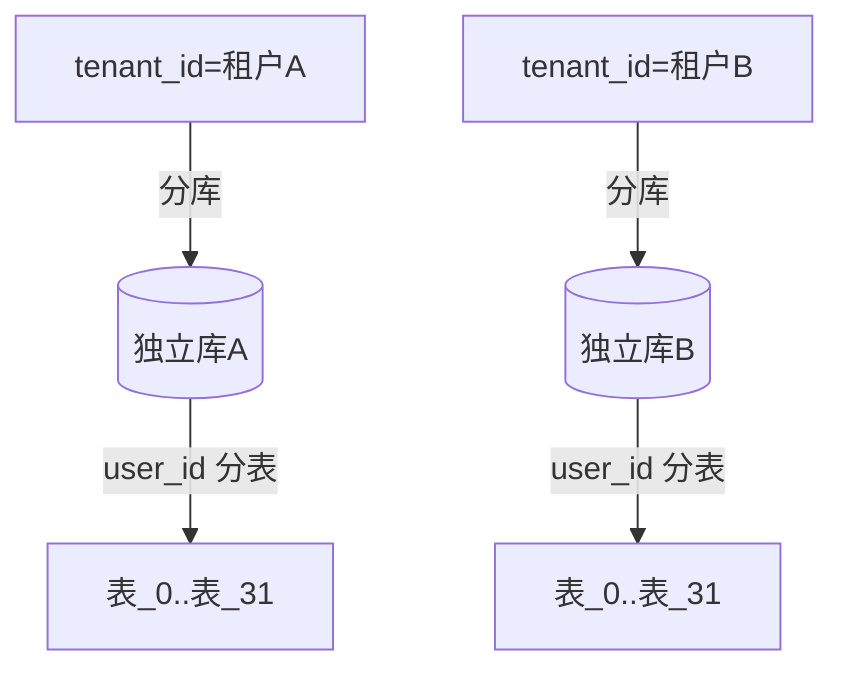
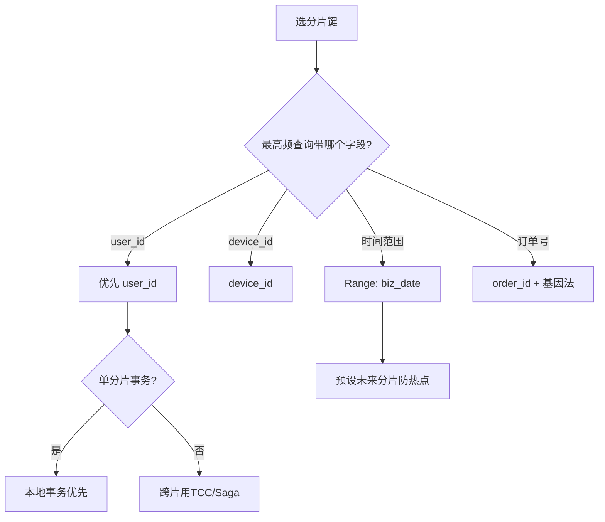

# 06 典型场景与设计反模式

> 前几章讲原理，本章给"照抄模板"：订单、用户、账单、物联网设备该怎么分；以及那些**一定会让你半夜被叫醒**的设计反模式。

---

## 一、典型业务的分片键选择（可直接抄）

### 1.1 电商订单

- **分片键：`user_id`**（用户查"我的订单"是最高频查询，且落在单分片）。
- 订单号 `order_id` 用全局 ID（雪花/号段）；若查询常带 `order_id` 但不带 `user_id`，可让 `order_id` 编码进 `user_id` 高位，或用 `order_id` 做另一维度冗余索引表。
- **订单明细 `order_item` 与 `orders` 绑定表**（同按 `user_id` 分）→ JOIN 本地化。
- 大促：热点用户（刷子/大 V）仍需防单分片热点，可对该用户维度再做 salt。

### 1.2 用户/账户

- **分片键：`user_id`**。登录、查资料都带 user_id。
- 账号安全类（登录态）要求强一致 → 尽量单分片本地事务。
- 多租户 SaaS：可用 `tenant_id` 作一级分库键，再 `user_id` 分表。

### 1.3 账单 / 流水 / 日志（时间序）

- **分片键：`(biz_date 或 month)` Range 分片 + 预设未来分片**（避免热点）。
- 查询常按"某用户某月账单" → 复合：`user_id` 分库 + `month` 分表。
- 归档友好：整月分片可直接冷归档/转对象存储。

### 1.4 物联网 / 设备遥测（呼应 [储能业务模型](../业务模型/储能业务模型.md)）

- **分片键：`device_id`**（按设备查最新遥测）。
- 海量时序写入 → 通常**不进关系型分片**，而进时序库（TDengine/InfluxDB，见 [时序库](../基础知识/时序库/README.md)）；关系型只存设备元数据，按 `device_id` 分。
- 跨设备聚合分析 → 走时序库或离线数仓，别在分片库做。

### 1.5 社交 / feed

- 发推按 `user_id` 分；时间线 feed 用推拉结合（写扩散/读扩散），feed 存储独立于主分片。

---

## 二、分片键决策速查表

| 业务 | 推荐分片键 | 理由 | 注意 |
|------|-----------|------|------|
| 订单 | user_id | 我的订单高频 | order_id 查询需冗余 |
| 用户/账户 | user_id | 登录/查资料高频 | 多租户叠加 tenant_id |
| 账单/流水 | month(+user_id) | 时间范围查询 | Range 预设分片 |
| 设备 | device_id | 按设备查 | 海量时序走 TSDB |
| 商品 | category_id/sku | 按类目查 | 热点类目再 salt |

---

## 三、设计反模式（血泪清单）

### ❌ 反模式 1：分片键选成"查询很少带"的字段

- 现象：订单按 `order_id` 分，但 90% 查询是"查用户订单"。
- 后果：每次查用户订单**全路由 64 分片**，性能比不分还差。
- ✅ 正确：按高频查询必带字段分（user_id）。

### ❌ 反模式 2：用低基数字段分片（status / type / gender）

- 现象：`status`（待付/已付/完成）只有几个值。
- 后果：数据全挤在几个分片，**严重倾斜 + 热点**。
- ✅ 正确：高基数、分布均匀的键（user_id / device_id）。

### ❌ 反模式 3：分片键可被更新

- 现象：用 `phone` 或可变字段做分片键，用户改了phone。
- 后果：行要在分片间迁移，且迁移期间一致性难以保证。
- ✅ 正确：分片键** immutable**（建表时定死，绝不改）。

### ❌ 反模式 4：过度分片

- 现象：为"以防万一"直接分 1024 片。
- 后果：连接数爆炸、跨片查询笛卡尔、运维地狱；单分片才几万行，收益为负。
- ✅ 正确：按 2~3 年增长量算，取 2 的幂（16/32/64/128/256）。

### ❌ 反模式 5：跨分片 JOIN 不治理

- 现象：A、B 表随意 JOIN，未设绑定表/广播表。
- 后果：中间件笛卡尔乘积，**极慢**。
- ✅ 正确：绑定表（同键父子）、广播表（字典）、或冗余宽表/异构到 ES。

### ❌ 反模式 6：自增主键当分片表 ID

- 现象：分片表仍用 `AUTO_INCREMENT`。
- 后果：各分片 ID 冲突、可被遍历、暴露量级。
- ✅ 正确：全局 ID（雪花/号段/UUIDv7），见 [02 章](../分库分表与数据迁移/02-分布式主键与读写分离.md)。

### ❌ 反模式 7：迁移不双写/不校验/早删老表

- 现象：全量迁移完直接切，没双写补偿、没校验、立刻删老表。
- 后果：静默不一致，出问题无法回滚。
- ✅ 正确：双写 + 校验 + 灰度 + 保留老表，见 [03 章](../分库分表与数据迁移/03-数据迁移双写与平滑扩容.md)。

### ❌ 反模式 8：事务边界不重设计

- 现象：分片后还指望一个 `@Transactional` 跨库原子。
- 后果：部分提交、数据乱。
- ✅ 正确：同分片用本地事务、跨分片用 TCC/Saga/消息表，见 [04 章](../分库分表与数据迁移/04-分布式事务与一致性.md)。

---

## 四、面试速记（高频八问）

1. **什么时候该分库分表？** → 优化/读写分离/缓存/归档用尽 + 单表过千万性能拐点。
2. **分片键怎么选？** → 高频查询必带、高基数、不可变、让核心事务单分片。
3. **Hash vs Range？** → Hash 均匀但扩容痛；Range 扩容易但热点；翻倍预案缓解。
4. **分布式 ID 怎么生成？** → 雪花（通用）/号段 Leaf（高并发连续）/UUIDv7（有序）。
5. **主从延迟怎么破？** → 强制走主 / 写后读主 / 半同步 / 接受最终一致。
6. **数据怎么平滑迁移？** → 全量+CDC增量+双写+校验+灰度切读+保留老表。
7. **跨分片事务怎么办？** → 优先同分片本地事务；否则 TCC/Saga/消息表。
8. **跨分片 JOIN 怎么处理？** → 绑定表/广播表/冗余宽表/异构 ES。

---

## 四·五、进阶：分片键的基因法（一次设计，多查询免路由）

```
核心思想: 让 order_id 内嵌 user_id 的部分位，实现"带 order_id 就能推导分片"
order_id = user_id低32位(基因) + 雪花时间戳 + 序列
查询"某用户的某订单"(只带 order_id):
  → 从 order_id 解出基因 → 算出 user_id 分片 → 单分片查询，无需全路由
```

| 方案 | 代价 | 收益 |
|------|------|------|
| 直接冗余表（order_id→user_id 映射） | 额外存储 + 双写 | 实现简单 |
| **基因法** | ID 可读性略差 | 零额外存储，天然免路由 |
| 异构 ES 索引 | 同步链路成本 | 任意字段组合查询 |

> 工程建议：**查询模式固定且少量** → 冗余表即可；**追求极致查询性能** → 基因法；**查询多变** → ES 异构索引。三者可叠加（高频走基因，复杂走 ES）。

---

## 四·六、进阶：热点分片的治理（单分片被打爆）

| 场景 | 解法 | 说明 |
|------|------|------|
| 大 V/大客户单键热点 | 键内加 salt 拆子分片 | 写入拆散、读取聚合（同热点账户拆分思想） |
| 类目/商品热点 | 类目二次分片 + 本地缓存 | 读多写少的先上缓存（[缓存三问](../场景设计/缓存经典三问与一致性.md)） |
| 时间戳热点（Range） | 预设未来分片 + 写缓冲 | 避免写集中在最新分片 |
| 全局广播查询 | 改造查询：先查路由表再查分片 | 避免全路由拖垮集群 |

> 记忆：**热点治理三板斧——拆（salt 分片）、缓（读缓存）、导（异步/队列削峰）**，与高并发架构的解法同源。

---

## 五、章节联动

- 实战配置 → [05 ShardingSphere 实战](05-ShardingSphere实战.md)
- 组件级使用 → [基础知识/中间件/分库分表ShardingSphere](../基础知识/中间件/分库分表ShardingSphere.md)
- 事务落地 → [基础知识/中间件/分布式事务Seata](../基础知识/中间件/分布式事务Seata.md)
- 增量迁移通道 → [基础知识/中间件/数据同步CDC-Canal](../基础知识/中间件/数据同步CDC-Canal.md)
- 海量时序场景 → [基础知识/时序库/README](../基础知识/时序库/README.md)
- 行业落地 → [业务模型总览](../业务模型/业务模型总览.md)

---

> **终章口诀**：「分片键定生死，双写迁移保平安；ID 全局不靠自增，事务能本地不分布；绑定广播解 JOIN，过度分片是灾难。」

---

## 七、更多业务的"照抄"分片键（实战模板）

### 7.1 支付 / 清结算

- **分片键：`user_id` 或 `merchant_id`**（按"某用户/商户的流水"高频查询）。
- 清结算按日/月聚合 → **复合 `merchant_id`（分库）+ `settle_date` Range（分表）**，月底分片可直接归档。
- 强一致 → 同分片本地事务 + 对账（见 [04 章](../分库分表与数据迁移/04-分布式事务与一致性.md)）。

### 7.2 商品 / 库存

- **分片键：`sku_id` 或 `category_id`**。
- 热点类目（如爆款）→ 类目二次分片 + 本地缓存 + Redis 预扣（见 [03 篇 9.1 防超卖](../技术选型/03-结合业务场景的选型决策.md#九典型场景代码级要点不只是选了谁)）。
- 库存扣减用 Redis + Lua 原子，DB 只做最终落账。

### 7.3 物流 / 运单

- **分片键：`order_id` 或 `waybill_no`**（按单查）。
- 轨迹流水（时序）→ 通常进 TSDB 或按 `create_date` Range 分表。
- 跨城查询 → 异构到 ES（运单号/手机号/地址多维检索）。

### 7.4 社交 / 消息 IM

- 发件箱按 `user_id` 分；收件箱用**读扩散/写扩散**策略，feed 存储独立于主分片。
- 消息记录按 `conversation_id` 分，历史消息冷归档。

### 7.5 多租户 SaaS（一级隔离）

- **一级分库键：`tenant_id`**（租户间物理隔离，故障/扩容互不干扰）。
- 二级按 `user_id` / `biz_id` 分表。
- 超大租户（大客户）可单独拆库，避免"大租户拖垮小租户"。



> 多租户 SaaS 用 `tenant_id` 一级分库，是"故障隔离 + 合规（数据按客户隔离）+ 按租户扩容"的最佳实践。

---

## 八、分片键决策树（照着选不踩坑）



---

## 九、热点分片的 salt 实战（大 V / 大客户）

当某个 key 流量远超其他（大 V 用户、大客户商户），单分片被打爆：

```
方案: 在原分片键上叠加 salt，把一个热 key 拆成多个子分片
shard = hash(user_id + salt) % N     # salt ∈ {0..K-1}

写入: 随机选 salt 写入 K 个子分片之一
读取: 需读全部 K 个子分片再聚合（或读时已知 salt）
```

| 维度 | 无 salt | 有 salt |
|------|---------|---------|
| 写入分布 | 单分片打爆 | 拆散到 K 个分片 |
| 读取成本 | 单分片查 | 需聚合 K 个分片 |
| 适用 | 普通 key | 极少数热点 key（大 V） |

> salt 是"用读复杂度换写均衡"的权衡，只对**极少数**热点 key 用，普通 key 不值当。

---

## 十、容量规划回顾（分片数反推）

```
单分片目标行数 R = 500w~2000w（依行宽/访问）
预估 2~3 年总量 T
理论分片 = ceil(T / R)
取 ≥ 理论值的最小 2 的幂（16/32/64/128/256）
```

- 举例：订单 3 年 18 亿行，R=1000w → 理论 180 → 取 **256**。
- 别过度：256 已很大；分片过多连接数/运维/跨片查询全炸。

---

## 十一、更多设计反模式（9~12）

### ❌ 反模式 9：查询模式变了，分片键没跟

- 现象：原按 `user_id`，业务新增"按手机号查订单"成高频。
- 后果：该查询全路由。
- ✅ 正确：冗余 `phone→user_id` 映射表 / 基因法 / ES 异构索引。

### ❌ 反模式 10：把分片当"无限容量"

- 现象：以为分了 64 片就高枕无忧，单分片仍涨到亿级。
- 后果：单分片内部慢查询、备份恢复慢。
- ✅ 正确：单分片仍要容量治理（归档/冷热分离/再拆）。

### ❌ 反模式 11：跨分片事务用本地注解

- 现象：`@Transactional` 跨多个分片数据源。
- 后果：Spring 单数据源事务不生效，部分提交。
- ✅ 正确：用 Seata/TCC/Saga（见 [04 章](../分库分表与数据迁移/04-分布式事务与一致性.md)）。

### ❌ 反模式 12：迁移期不做影子验证

- 现象：直接灰度切读，没先影子流量验证。
- 后果：线上暴露路由/数据不一致。
- ✅ 正确：先影子流量验证新链路（见 [03 章第十二节](../分库分表与数据迁移/03-数据迁移双写与平滑扩容.md#十二影子流量验证新链路不生效)）。

---

## 十二、生产排障速查

| 症状 | 第一怀疑 | 验证动作 |
|------|----------|----------|
| 查询 RT 突然变高 | 全路由（漏分片键） | 看执行计划/SQL 路由分布 |
| 某分片 CPU 飙 | 热点分片 | 查该分片 top key |
| 数据不一致 | 双写失败/校验漏 | 查补偿队列 + 校验报告 |
| 扩容后更慢 | 跨片查询变多 | 查绑定表/广播表配置 |
| 写入偶发冲突 | 自增主键 | 查是否配全局 ID |

---

## 十三、典型场景速记口诀

```
订单用户是王道，订单号走基因法；
支付清结算按月，多租户用 tenant 隔；
商品库存防超卖，Lua 原子 Redis 扣；
物流轨迹进时序，多维检索异构 ES；
热点 salt 拆子片，读聚写散权衡好；
分片键定生死，容量反推取 2 幂。
```

---

## 十四、分片后的"全局查询"工程化

分片让 `COUNT/SUM/GROUP BY` 变难，但业务总要这些能力。工程化做法：

| 查询类型 | 方案 | 说明 |
|----------|------|------|
| 实时聚合 | 各分片算 + 中间件归并 | 慢但准，适合小结果集 |
| 近实时聚合 | 冗余计数表 / 物化视图 | 写时更新计数，读直接取 |
| 复杂分析 | 异构到 ES / ClickHouse | OLAP 引擎算 |
| 模糊检索 | 异构索引（ES） | 任意字段组合查 |
| 字典/小表 | 广播表 | 每分片存一份 |

```sql
-- 冗余计数表：写订单时同步 +1，读时直接查（避免跨片 COUNT）
UPDATE user_order_count SET cnt = cnt + 1 WHERE user_id = ?;
```

> 原则：**分片库的强项是"按键点查"，弱项是"全局聚合"**。把聚合/检索的需求主动异构出去，别硬在分片库上做。

---

## 十五、分片容量治理的"生命周期"

分片不是一劳永逸，要持续治理：

| 阶段 | 动作 |
|------|------|
| 上线初 | 监控单分片行数 / 水位 |
| 增长期 | 预警（行数 > 单分片目标 80%） |
| 临界 | 触发扩容（翻倍预案） |
| 冷数据 | 归档 / 转对象存储 / 转 TSDB |
| 老数据 | 历史分片只读化 |

> 容量治理 = "分片数反推 + 监控预警 + 翻倍扩容 + 归档"的闭环。

---

## 十六、一句收尾

```
分片是手段不是目的，业务平滑才是真；
键选对、ID 全局、迁双写、事本地；
绑定广播解 JOIN，容量治理莫忘却；
过度分片是灾难，演进阶梯留平滑。
```

---

## 十七、分库分表上线前自查清单

```
[ ] 分片键覆盖 ≥90% 核心查询？
[ ] 单分片目标行数合理（500w~2000w）？分片数取 2 的幂？
[ ] 全局 ID 已配（雪花/号段），无自增？
[ ] 读写分离 + 主从延迟策略已定（Hint/半同步）？
[ ] 跨分片事务方案（TCC/Saga/消息表）已选？
[ ] 迁移方案（双写+CDC+校验+灰度+保留老表）已定？
[ ] 绑定表/广播表已配（防跨片 JOIN）？
[ ] 深分页已改游标翻页？
[ ] 监控（路由分布/慢 SQL/主从延迟）已接？
[ ] 逃生通道（特性开关/双写可回退）已就位？
```
