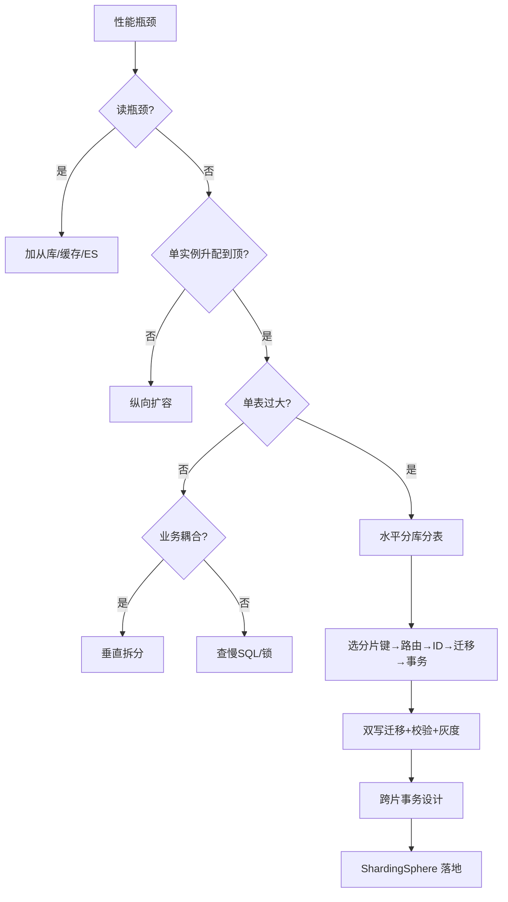
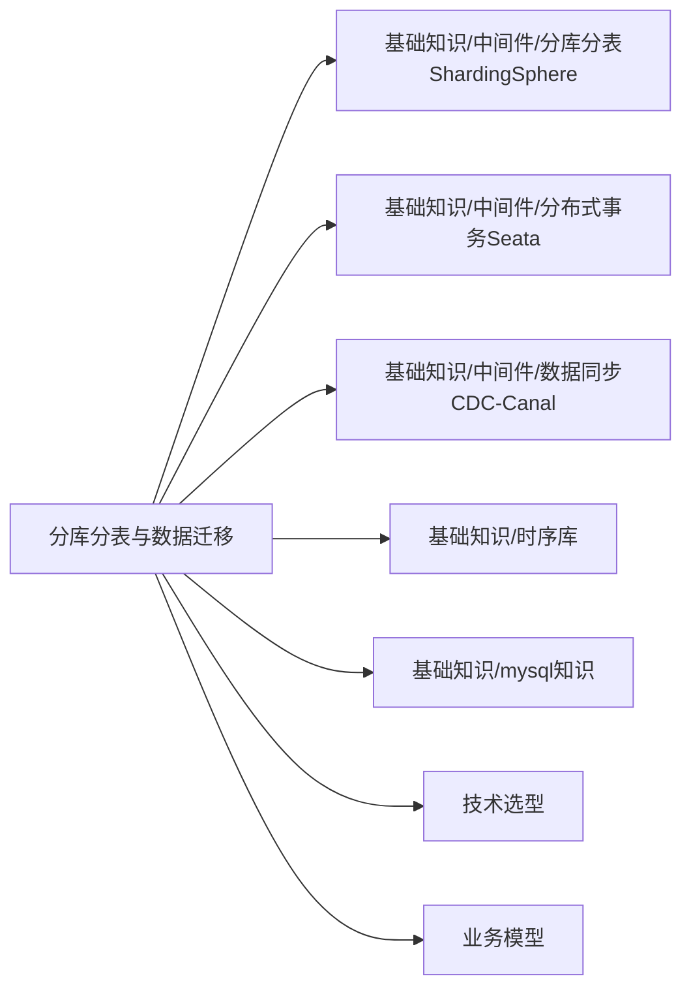

# 分库分表与数据迁移 · 板块导航

> 数据库体量暴涨后的「分片」工程方法论：何时分、怎么路由、分布式主键、读写分离、平滑迁移双写、跨分片事务、ShardingSphere 实战、行业分片键选型与反模式。与「基础知识/中间件/分库分表ShardingSphere」组件单篇互补。

## 文档列表

- 📝 [分库分表与数据迁移 · 总览](分库分表与数据迁移总览.md)
- 📝 [01 分库分表决策与路由策略](01-分库分表决策与路由策略.md)
- 📝 [02 分布式主键与读写分离](02-分布式主键与读写分离.md)
- 📝 [03 数据迁移双写与平滑扩容](03-数据迁移双写与平滑扩容.md)
- 📝 [04 分布式事务与一致性](04-分布式事务与一致性.md)
- 📝 [05 ShardingSphere 实战](05-ShardingSphere实战.md)
- 📝 [06 典型场景与设计反模式](06-典型场景与设计反模式.md)

---

## 各篇深度导读（决定你先翻哪篇）

### 📝 分库分表与数据迁移总览

- **定位**：全板块地图，先读。
- **核心产出**：概念地图、核心认知、决策门禁、容量估算、迁移时序全景、事务决策树、面试连问、成本账。
- **何时翻**：不知道从哪下手、要说服老板"为什么需要分"、做方案评审前过一遍。
- **不可错过**：第十节「容量估算实战」、第十四节「面试连问 8 连击」。

### 📝 01 分库分表决策与路由策略

- **定位**：解决"该不该分、怎么路由"。
- **核心产出**：决策流程图、垂直 vs 水平、Hash/Range/一致性 Hash 三大算法、分片键生死决策、翻倍扩容数学、基因法、热点治理。
- **何时翻**：纠结要不要分、分片键选哪个、路由算法选哪个。
- **不可错过**：第八节「决策门禁」、第九节「翻倍扩容数学」、第十六节「路由口诀」。

### 📝 02 分布式主键与读写分离

- **定位**：分完立刻要的两个能力。
- **核心产出**：为什么弃自增、雪花+时钟防护、号段双 buffer、UUIDv7、读写分离架构、主从延迟治理。
- **何时翻**：要选全局 ID 方案、主从延迟踩坑、半同步配置。
- **不可错过**：第四节「时钟回拨防护」、第十节「主从延迟治理」。

### 📝 03 数据迁移双写与平滑扩容

- **定位**：解决"怎么把老表平滑迁到新分片"。
- **核心产出**：迁移方式总览、全量+CDC+双写+校验流程、双写顺序与一致性边界、哈希分桶校验、影子流量、翻倍扩容。
- **何时翻**：要迁一张大表、设计迁移方案、做扩容。
- **不可错过**：第十节「双写顺序与一致性边界」、第十一节「数据校验算法」、第十六节「迁移口诀」。

### 📝 04 分布式事务与一致性

- **定位**：分完事务边界被打破。
- **核心产出**：2PC 缺陷、TCC 铁三角（空回滚/防悬挂/幂等）、Saga、本地消息表、事务消息、幂等设计、实践决策树。
- **何时翻**：跨分片要扣库存又要写流水、选 TCC 还是 Saga。
- **不可错过**：第十节「TCC 三大难题」、第十五节「实践决策树」。

### 📝 05 ShardingSphere 实战

- **定位**：用主流中间件落地。
- **核心产出**：核心概念、JDBC/Proxy 配置、分布式主键、读写分离、绑定/广播表、Hint、分页坑、加密、弹性伸缩、影子库。
- **何时翻**：写 ShardingSphere 配置、排障、调优、接分布式事务。
- **不可错过**：第十四节「排障」、第十五节「配置陷阱」、第十八节「实战口诀」。

### 📝 06 典型场景与设计反模式

- **定位**：照着业务抄 + 避坑。
- **核心产出**：订单/用户/账单/设备/支付/商品/物流/多租户分片键、salt 热点、容量治理、12 个反模式、上线自查清单。
- **何时翻**：给具体业务选分片键、做上线前自查、复盘踩坑。
- **不可错过**：第七节「更多业务照抄模板」、第十七节「上线前自查清单」。

---

## 完整决策流（mermaid 版，可贴 wiki）



---

## 模块关联图（mermaid）



---

## 决策门禁（动手前先过这五关）

| # | 门禁问题 | 不通过 → 怎么办 |
|---|----------|----------------|
| 1 | 单表 > 2000w 且索引救不了？ | 归档/冷热分离/表分区 |
| 2 | 加从库/升配仍扛不住写？ | 读写分离 + 连接池治理 |
| 3 | 分片键覆盖 ≥90% 核心查询？ | 重评估键/广播表 |
| 4 | 团队接得住复杂度？ | 先分表不分库 |
| 5 | 接受双写+灰度+回滚成本？ | 小表试点 |

> 五关全过才动手——分库分表是"复杂度税"最重的架构决策之一。

---

## 六问通关自检（方案评审必问）

```
1. 分片键选什么？为什么？（带数据特征）
2. 查询不走分片键怎么办？（广播/基因/ES）
3. 全局 ID 用什么？（号段/雪花+防护）
4. 跨分片事务怎么处理？（本地>TCC>Saga>消息）
5. 扩容怎么扩？（翻倍/一致性Hash）
6. 数据一致性怎么校验？（双写校验/对账）
```

---

## 术语表（照文档前扫盲）

| 术语 | 含义 |
|------|------|
| 分片键 Sharding Key | 路由依据的列，决定行落哪个分片 |
| 逻辑表 / 真实表 | 应用看到的表 / 物理分片 |
| 绑定表 | 同分片键的父子表，JOIN 本地化 |
| 广播表 | 每个分片都存的字典/小表 |
| 翻倍扩容 | N→2N，只迁约一半数据 |
| 双写 | 新老同时写，老表为真相源 |
| CDC | 变更数据捕获（binlog） |
| 基因法 | ID 内嵌分片键信息，免路由 |
| 影子流量 | 复制流量验证新链路不生效 |
| 主从延迟 | 主库写后从库同步的时间差 |

---

## 常见技术组合速查

| 需求 | 参考组合 |
|------|----------|
| 订单分片 | user_id 分片 + order_id 基因法 + 绑定表 |
| 金融核心 | 同分片本地事务 + TCC + 对账 |
| 海量时序 | 关系型只存元数据(device_id 分) + TSDB |
| 多租户 SaaS | tenant_id 一级分库 + user_id 分表 |
| 搜索/检索 | 分片库主数据 + ES 异构索引 |

---

## 扩展 FAQ

- **Q：分库分表能根治慢查询吗？** A：不能——它解决容量/并发上限，不解决烂 SQL。先优化 SQL/索引，再考虑分。
- **Q：分了表还要不要索引？** A：要。单分片内索引照样重要，否则片内全表扫描。
- **Q：分片后备份怎么做？** A：每分片独立备份 + 集中调度；实例数多导致备份窗口长，用物理备份+增量。
- **Q：能不能先分表不分库？** A：能，且推荐——分表解决单表过大，分库解决单实例容量，先分表试水复杂度更低。
- **Q：中间件能保一致性吗？** A：不能——中间件只做路由，事务与校验靠自己（04 章）。

---

## 如果只有 10 分钟

1. 读 [总览·决策门禁](#决策门禁动手前先过这五关) 与 [六问通关](#六问通关自检方案评审必问)。
2. 抄 [06 上线前自查清单](06-典型场景与设计反模式.md)。
3. 对着 [决策流 mermaid](#完整决策流mermaid-版可贴-wiki) 走一遍。

---

## 八、迁移方案完整模板（照抄）

```markdown
# 迁移方案：orders 单表 → 64 分片
## 目标
- 不停业务，数据不丢，可回滚
- 窗口：低峰期，预计 2 周（含观察期）
## 方案
1. 全量迁移：分批游标，限速，错峰
2. 增量同步：Canal 监听 binlog，追平老表变更
3. 双写：老表为真相源，新分片失败进补偿队列
4. 校验：哈希分桶 + 行级比对，不过不切读
5. 灰度切读：1%→10%→50%→100%
6. 切写 + 观察期 1 周 + 下线老表
## 回滚
- 任何阶段异常 → 流量回切老表（开关控制）
- 老表观察期内绝不删
## 责任人 / 时间窗 / 监控项
```

---

## 九、分片键选择推演：电商订单

```
高频查询：
  - 查"我的订单"（带 user_id）         → 90%
  - 查"某订单详情"（带 order_id）      → 9%
  - 运营按状态/时间查                   → 1%
结论：
  - 主分片键 = user_id（覆盖 90%）
  - order_id 用基因法内嵌 user_id，免全路由
  - order_item 与 orders 绑定表（同按 user_id）
  - 运营查询异构到 ES
```

---

## 十、分布式事务选型示例

```
场景：下单扣库存 + 写订单 + 写流水（跨分片）
→ 先问能否同分片：user_id 分片，三表同键 → 本地事务
若库存与订单不同分片：
  → 资金相关强一致 → TCC（冻结/确认/取消）
  → 仅通知类 → 本地消息表 / 事务消息
```

---

## 十一、故障演练 checklist

```
[ ] 主库挂：MHA/Orchestrator 自动提主？应用无感？
[ ] 从库挂：健康探测剔除？读流量转移？
[ ] 网络抖动：半同步退化？写入超时处理？
[ ] 双写新分片失败：补偿队列重试？告警？
[ ] CDC 断点丢失：位点/GTID 持久化？
[ ] 切读异常：秒级回切老表开关？
```

---

## 十二、容量估算计算器（伪代码）

```python
def calc_shards(total_rows_3y, row_per_shard=10_000_000):
    import math
    theory = math.ceil(total_rows_3y / row_per_shard)
    # 取 ≥ theory 的最小 2 的幂
    power = math.ceil(math.log2(theory))
    return 2 ** power

print(calc_shards(1_800_000_000))   # 18 亿 → 256
```

---

## 十三、面试连问完整答案

1. **什么时候该分？** → 优化/读写分离/缓存/归档用尽 + 单表过千万性能拐点。
2. **分片键怎么选？** → 高频查询必带、高基数、不可变、让核心事务单分片。
3. **Hash vs Range？** → Hash 均匀但扩容痛；Range 扩容易但热点；翻倍预案缓解。
4. **分布式 ID？** → 雪花（通用）/号段 Leaf（高并发连续）/UUIDv7（有序）。
5. **主从延迟？** → 强制走主/写后读主/半同步/接受最终一致。
6. **平滑迁移？** → 全量+CDC+双写+校验+灰度+保留老表。
7. **跨分片事务？** → 优先同分片本地；否则 TCC/Saga/消息表。
8. **跨分片 JOIN？** → 绑定表/广播表/冗余宽表/异构 ES。

---

## 十四、反模式速查卡

| 反模式 | 修正 |
|--------|------|
| 分片键选低频字段 | 按高频必带字段分 |
| 低基数字段分片 | 高基数字段 |
| 分片键可变 | 键 immutable |
| 过度分片 | 取 2 的幂，别超 256 |
| 跨片 JOIN 不治理 | 绑定表/广播表 |
| 自增当分片 ID | 全局发号 |
| 迁移不双写不校验 | 双写+校验+保留老表 |
| 本地事务跨分片 | Seata/TCC/Saga |

---

## 十五、上线前 final 清单

```
[ ] 分片键覆盖 ≥90% 核心查询？
[ ] 单分片行数合理、分片数取 2 的幂？
[ ] 全局 ID 已配，无自增？
[ ] 读写分离 + 主从延迟策略已定？
[ ] 跨分片事务方案已选？
[ ] 迁移方案（双写+CDC+校验+灰度+保留老表）已定？
[ ] 绑定表/广播表已配？
[ ] 深分页已改游标翻页？
[ ] 监控已接？逃生通道已就位？
```

---

## 十六、生产成本账（说服老板）

```
分库分表隐性成本 =
  开发（路由/ID/事务改造）
+ 运维（N 倍实例/备份/扩容演练）
+ 排障（跨片难定位）
+ 迁移（双写/校验/灰度人日）
只有当"不分导致的业务损失" > 上述成本时才值得分。
```

---

## 十七、术语速记口诀

```
分片键定生死，路由算法次之；
翻倍扩容迁一半，基因法免路由；
全局 ID 不靠增，雪花号段加防护；
双写老表是真相，迁移校验莫跳过；
事务能本不做布，绑定广播解 JOIN；
影子压测上线前，过度分片是灾难。
```

---

## 十八、迁移 / 扩容演练 checklist（运维版）

```
[ ] 源库压力监控：迁移期 CPU < 60%
[ ] 全量分批游标 + 断点续传已就绪
[ ] CDC 位点/GTID 已持久化，重启不丢
[ ] 双写补偿队列有监控 + 告警
[ ] 校验任务跑通（行级 + 哈希分桶）
[ ] 影子流量验证新链路无差异
[ ] 灰度比例由配置中心控制，可秒级回切
[ ] 老表归档计划（观察期后才删）
[ ] 回滚演练已做过（模拟切读异常回切）
```

---

## 十九、一句话定位

> 分库分表板块回答一件事：**数据量涨到单机扛不住时，怎么"分得对、迁得稳、一致得了"**——分片键定生死，双写迁移保平安，事务能本地不分布，中间件只管路由、一致还得自己拿。

---

[← 返回首页](../README.md)
