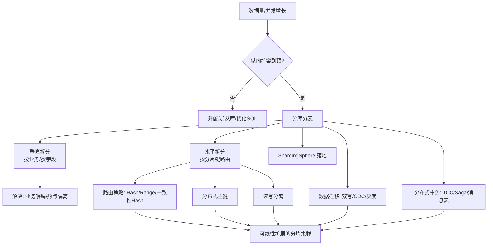
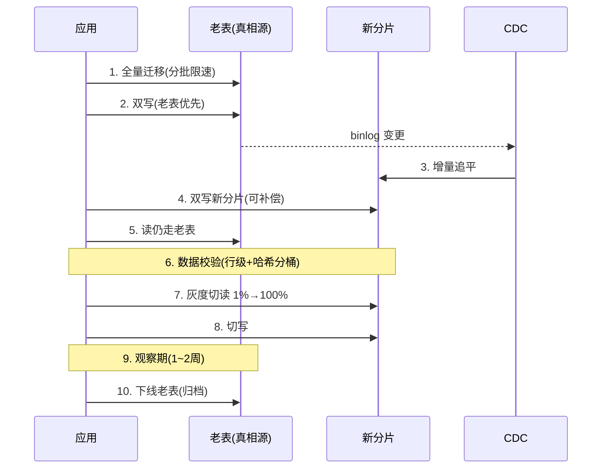
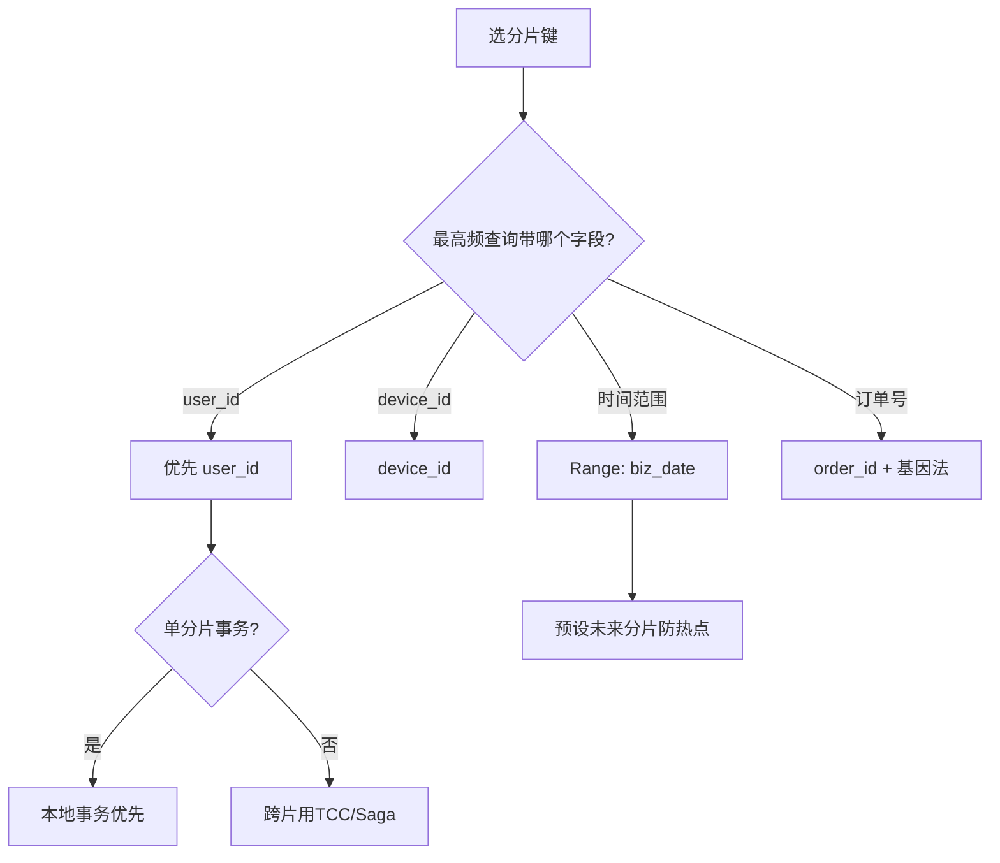
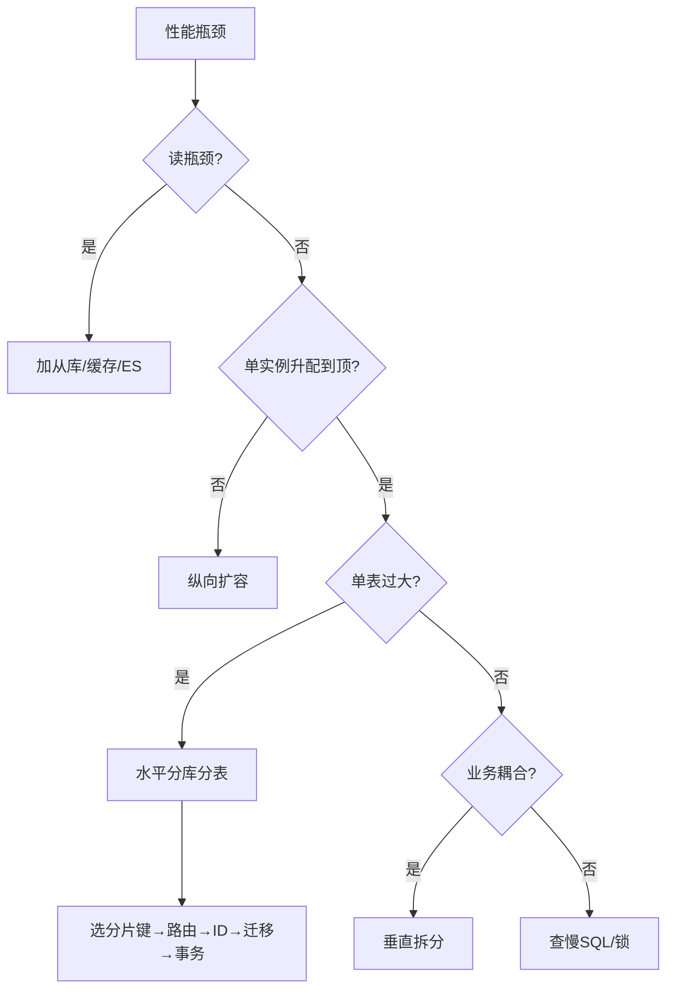

# 分库分表与数据迁移 · 总览

> 当单表涨到几千万行、单库连接被打满、写入 RT 持续劣化，纵向扩容（升配）触到天花板，**分库分表（Sharding）** 就成了绕不开的架构决策。
> 本板块不重复讲某个中间件怎么装（那部分见 [基础知识/中间件/分库分表ShardingSphere](../基础知识/中间件/分库分表ShardingSphere.md)），而是把 **「为什么要分 → 怎么分 → 分完怎么迁 → 分完怎么保证事务和一致 → 怎么用 ShardingSphere 落地 → 不同业务怎么选分片键」** 这条完整链路讲透，形成一套可照做的工程方法论。

## 一、本板块能解决什么

| 你遇到的信号 | 对应篇章 |
|------|------|
| 单表 2000w+ 行，慢查询增多，索引也救不了 | 01 决策与路由 |
| 单库 CPU/连接数打满，加从库也扛不住写 | 01 + 02 读写分离 |
| 需要全局唯一且趋势递增的 ID | 02 分布式主键 |
| 已有大表要平滑拆成 64 分片，不能停业务 | 03 数据迁移与双写 |
| 跨分片要扣库存又要写流水，怎么保证一致 | 04 分布式事务 |
| 用 ShardingSphere 落地，配置怎么写 | 05 ShardingSphere 实战 |
| 订单该按 user_id 还是 order_id 分片 | 06 典型场景与反模式 |

## 二、概念地图



## 三、核心认知（先建立再深入）

1. **分库分表是"最后手段"不是"银弹"**。它用复杂度换容量：跨分片 JOIN、分布式事务、全局唯一 ID、运维难度全面上升。**先确认**已经做过：SQL 优化、索引治理、读写分离、冷热分离、缓存、归档。还不行才分。
2. **分片键（Sharding Key）选错，比不分还可怕**。一旦选错，热点分片被打爆、查询被迫广播全分片（全路由），后期几乎无法低成本的改。📌 **分片键是分库分表里最重要的一个决定**。
3. **"分"只是开始，"迁"才是工程最难的环节**。线上大表不中断地拆成 N 个分片，要双写、增量同步、数据校验、灰度、可回滚——这是本文重点。
4. **分完之后事务边界被打破**。原来一个本地事务能搞定的事，现在跨库了。要重新设计一致性方案（04 章）。

## 四、与知识库其他模块的关联

- **中间件 ShardingSphere 单篇** → 本文 05 章落地时的"工具级细节"锚点
- **[分布式系统理论总纲](../基础知识/分布式系统.md)** → CAP、一致性、共识的底层原理
- **[分布式事务 Seata](../基础知识/中间件/分布式事务Seata.md)** → 04 章 TCC/Saga 的落地实现
- **[数据同步 CDC-Canal](../基础知识/中间件/数据同步CDC-Canal.md)** → 03 章增量迁移的底层通道
- **[MySQL 知识](../基础知识/mysql知识.md)** → 单实例性能边界、索引、主从复制
- **[架构/系统架构](../架构/系统架构.md)** → 数据层在整体架构中的位置
- **[业务模型](../业务模型/业务模型总览.md)** → 不同行业的分片键选择（订单/账户/设备）

## 五、学习路径建议

```
01 决策与路由（先判断该不该分、怎么路由）
  ↓
02 分布式主键 + 读写分离（分完立刻要用的两个能力）
  ↓
03 数据迁移与双写（把老表平滑迁到新分片）
  ↓
04 分布式事务与一致性（分完的事务边界重构）
  ↓
05 ShardingSphere 实战（用主流中间件落地）
  ↓
06 典型场景与反模式（照着业务抄，避开坑）
```

## 六、一句话口诀

> **「先优化后分片，选键胜一半；迁用双写灰度稳，事务靠表或 Saga；中间件只管路由，一致还得自己拿。」**

---

## 七、分库分表的决策门禁（先过这五关）

| # | 门禁问题 | 不通过 → 怎么办 |
|---|----------|----------------|
| 1 | 单表数据量是否 > 2000w 且慢查询靠索引救不了？ | 归档冷数据 / 冷热分离 |
| 2 | 写瓶颈是单库连接/CPU 打满，加从库解决不了？ | 读写分离 + 连接池治理 |
| 3 | 分片键能覆盖 ≥90% 的核心查询？ | 重新评估分片键（含广播表方案） |
| 4 | 团队能接受复杂度（分布式事务/全局 ID/运维）？ | 先单库分区/分表，推迟分库 |
| 5 | 迁移期可接受双写 + 灰度 + 回滚的成本？ | 先小表试点积累经验 |

> 五关全过才动手——**分库分表是「复杂度税」最重的架构决策之一，宁可晚做，不可错做**。门禁不通过的解法都写在了对应关里。

---

## 八、分库分表后必答的六个问题（面试/评审用）

```
1. 分片键选什么？为什么？（带数据特征：量级/分布/查询模式）
2. 查询不走分片键怎么办？（广播表/基因法/ES 索引/二级路由）
3. 全局唯一 ID 用什么？（号段/雪花 + 时钟防护，见 02 章）
4. 跨分片事务怎么处理？（最终一致优先：消息表/Saga/TCC）
5. 扩容怎么扩？（一致性哈希扩容迁移；双倍扩容映射表法）
6. 数据一致性怎么校验？（双写校验/对账/抽样比对，见 03 章）
```

> 能一口气答完这六问，说明对分库分表有完整闭环认知——这是系统设计面试的高频连问，也是方案评审的必问清单。

---

## 九、常见误区速查

| 误区 ❌ | 真相 ✅ |
|---------|---------|
| 数据到量就分片 | 先归档/冷热分离/读写分离，分片是最后手段 |
| 分片键用随机 UUID | 主键必须趋势递增（有序写），或用雪花 |
| 用表内自增 ID 当全局 ID | 跨库会重复，必须独立发号 |
| 分完用 JOIN 到处查 | 跨分片 JOIN 禁止，改宽表/ES/API 聚合 |
| 以为中间件能解决一致性 | 中间件只路由，事务与校验靠自己（04 章） |
| 一次性大爆炸迁移 | 必须双写 + 增量 + 灰度 + 回滚（03 章） |

---

👉 下一篇：[01 分库分表决策与路由策略](01-分库分表决策与路由策略.md)

---

## 十、容量估算实战（分片数反推）

分片数不是拍脑袋，用数据反推：

```
单分片目标行数 R = 500w~2000w（依行宽/访问模式）
预估 2~3 年总数据量 T（行）
理论分片数 = ceil(T / R)
取 ≥ 该值的最小 2 的幂（16/32/64/128/256）
```

| 参数 | 示例 |
|------|------|
| 订单年增 | 6 亿行 |
| 3 年总量 T | 18 亿行 |
| 单分片目标 R | 1000w |
| 理论分片 | 180 |
| 取 2 的幂 | **256（2^8）** |

> 别过度分片：256 已很大，非超大规模无需更多。分片过多 → 连接数爆炸、跨片查询笛卡尔、运维地狱。

---

## 十一、完整迁移时序全景（一图看懂）



> 这张图把 [03 章](../分库分表与数据迁移/03-数据迁移双写与平滑扩容.md) 全流程串成一条可执行的时序。每一步都可回退到上一步——**回退能力比速度重要**。

---

## 十二、事务方案决策树（分片后怎么选）

```mermaid
flowchart TD
    A[跨分片数据变更] --> B{能同分片?}
    B -->|是| C[本地事务(最优)]
    B -->|否| D{强一致/资金?}
    D -->|是| E[TCC]
    D -->|否| F{长流程?}
    F -->|是| G[Saga]
    F -->|否| H{异步解耦?}
    H -->|是| I[消息表/事务消息]
    H -->|否| J[最大努力通知]
```

> 优先级：**同分片本地事务 > TCC > Saga > 消息表/事务消息**。能用本地事务就用本地事务——这是分片设计的最高境界（见 [01 章分片键](../分库分表与数据迁移/01-分库分表决策与路由策略.md#四、分片键sharding-key怎么选分库分表的生死决策)）。

---

## 十三、分片键选择决策树



> "查什么就按什么分；查得多又必带的，才是分片键。"（见 [01 章第四节](../分库分表与数据迁移/01-分库分表决策与路由策略.md#四、分片键sharding-key怎么选分库分表的生死决策)）

---

## 十四、分库分表面试连问（8 连击）

1. **什么时候该分？** → 优化/读写分离/缓存/归档用尽 + 单表过千万性能拐点。
2. **分片键怎么选？** → 高频查询必带、高基数、不可变、让核心事务单分片。
3. **Hash vs Range？** → Hash 均匀但扩容痛；Range 扩容易但热点；翻倍预案缓解。
4. **分布式 ID 怎么生成？** → 雪花（通用）/号段 Leaf（高并发连续）/UUIDv7（有序）。
5. **主从延迟怎么破？** → 强制走主 / 写后读主 / 半同步 / 接受最终一致。
6. **数据怎么平滑迁移？** → 全量+CDC增量+双写+校验+灰度切读+保留老表。
7. **跨分片事务怎么办？** → 优先同分片本地事务；否则 TCC/Saga/消息表。
8. **跨分片 JOIN 怎么处理？** → 绑定表/广播表/冗余宽表/异构 ES。

> 能一口气答完这八问，说明对分库分表有完整闭环认知——这是方案评审和系统设计面试的高频连问。

---

## 十五、常见误区速查（扩展版）

| 误区 ❌ | 真相 ✅ |
|---------|---------|
| 数据到量就分片 | 先归档/冷热分离/读写分离，分片是最后手段 |
| 分片键用随机 UUID | 主键必须趋势递增（有序写），或用雪花 |
| 用表内自增 ID 当全局 ID | 跨库会重复，必须独立发号 |
| 分完用 JOIN 到处查 | 跨分片 JOIN 禁止，改宽表/ES/API 聚合 |
| 以为中间件能解决一致性 | 中间件只路由，事务与校验靠自己 |
| 一次性大爆炸迁移 | 必须双写 + 增量 + 灰度 + 回滚 |
| 分片数越多越好 | 过度分片 = 连接/运维/跨片查询灾难 |
| 分片后高枕无忧 | 单分片仍要容量治理 |
| 用本地事务跨分片 | Spring 单数据源事务不生效，需 Seata |

---

## 十六、分库分表速记终极口诀

```
先优化后分片，分片是最后手段；
垂直解耦水平散，分片键定生死；
Hash 均匀扩容痛，翻倍预案留通路；
基因法免路由，绑定广播解 JOIN；
全局 ID 不靠增，雪花号段加防护；
双写老表是真相，迁移校验莫跳过；
扩容翻倍迁一半，老表留到观察完；
事务能本不做布，同片本地最稳当；
影子压测上线前，过度分片是灾难。
```

---

## 十七、本板块六篇联动导航

| 你在哪一步 | 去读 |
|------------|------|
| 纠结要不要分 | [01 决策与路由](../分库分表与数据迁移/01-分库分表决策与路由策略.md) |
| 分完要发号/读写分离 | [02 分布式主键与读写分离](../分库分表与数据迁移/02-分布式主键与读写分离.md) |
| 要迁老表 | [03 数据迁移双写与平滑扩容](../分库分表与数据迁移/03-数据迁移双写与平滑扩容.md) |
| 跨分片事务 | [04 分布式事务与一致性](../分库分表与数据迁移/04-分布式事务与一致性.md) |
| 用 ShardingSphere 落地 | [05 ShardingSphere 实战](../分库分表与数据迁移/05-ShardingSphere实战.md) |
| 不同业务抄分片键 | [06 典型场景与反模式](../分库分表与数据迁移/06-典型场景与设计反模式.md) |

> 配套组件单篇：[基础知识/中间件/分库分表ShardingSphere](../基础知识/中间件/分库分表ShardingSphere.md)、[分布式事务Seata](../基础知识/中间件/分布式事务Seata.md)、[数据同步CDC-Canal](../基础知识/中间件/数据同步CDC-Canal.md)、[时序库](../基础知识/时序库/README.md)。

---

## 十八、什么时候"绝对不要"分库分表

| 信号 | 为什么不该分 |
|------|--------------|
| 单表 < 500w 且 RT 正常 | 分了反而增加复杂度，无收益 |
| 只是"怕将来量大" | YAGNI，为当前+1 阶设计即可 |
| 团队没碰过分布式 | 运维/排障成本 > 收益，先分表不分库 |
| 没有清晰分片键 | 强分必全路由/热点，比不分还惨 |
| 业务模型未稳定 | 分片键可能随业务变，后期改造成本极高 |

> 反过来说：**有明确分片键 + 单表过千万性能拐点 + 团队能养 + 可接受迁移成本**，才是动手信号。

---

## 十九、分库分表的"成本账"（说服老板）

```
分库分表隐性成本 =
  开发成本（路由/分布式ID/事务改造）
+ 运维成本（N 倍实例、备份恢复、扩容演练）
+ 排障成本（跨片问题更难定位）
+ 迁移成本（双写/校验/灰度的人日）

只有当"不分导致的业务损失(扩容救火/限流丢单/口碑)" > 上述成本时，才值得分。
```

> 对核心、难回滚的决策，这个不等式几乎恒成立；但对边缘、小规模系统，往往"先优化/读写分离"更划算。

---

## 二十、终极自检：六问通关

```
1. 分片键选什么？为什么？（带数据特征：量级/分布/查询模式）
2. 查询不走分片键怎么办？（广播表/基因法/ES 索引/二级路由）
3. 全局唯一 ID 用什么？（号段/雪花 + 时钟防护，见 02 章）
4. 跨分片事务怎么处理？（最终一致优先：消息表/Saga/TCC）
5. 扩容怎么扩？（一致性哈希扩容迁移；双倍扩容映射表法）
6. 数据一致性怎么校验？（双写校验/对账/抽样比对，见 03 章）
```

---

## 二十一、分库分表决策流（mermaid 版）



---

## 二十二、扩展 FAQ

- **Q：分库分表能根治慢查询吗？** A：不能——它解决"容量/并发上限"，不解决"烂 SQL"。先优化 SQL/索引，再考虑分。
- **Q：分了表还要不要索引？** A：要。单分片内索引照样重要，否则片内全表扫描。
- **Q：分片后备份怎么做？** A：每分片独立备份 + 集中调度；实例数多导致备份窗口长，用物理备份+增量。
- **Q：能不能先分表不分库？** A：能，且推荐——分表解决单表过大，分库解决单实例容量，先分表试水复杂度更低。

---

## 二十三、术语表（照文档前扫盲）

| 术语 | 含义 |
|------|------|
| 分片键 Sharding Key | 路由依据的列，决定行落哪个分片 |
| 逻辑表 / 真实表 | 应用看到的表 / 物理分片 |
| 绑定表 | 同分片键的父子表，JOIN 本地化 |
| 广播表 | 每个分片都存的字典/小表 |
| 翻倍扩容 | N→2N，只迁约一半数据 |
| 双写 | 新老同时写，老表为真相源 |
| CDC | 变更数据捕获（binlog） |
| 基因法 | ID 内嵌分片键信息，免路由 |
| 影子流量 | 复制流量验证新链路不生效 |

> 术语通关 = 你已经具备读完全板块的基础词汇。

---

## 二十四、回到起点

> 如果只记一句话：**分库分表 = 用复杂度换容量，分片键 > 分片数 > 路由算法；"分"只是设计，"迁"才是工程，事务与一致性要自己兜底。**
