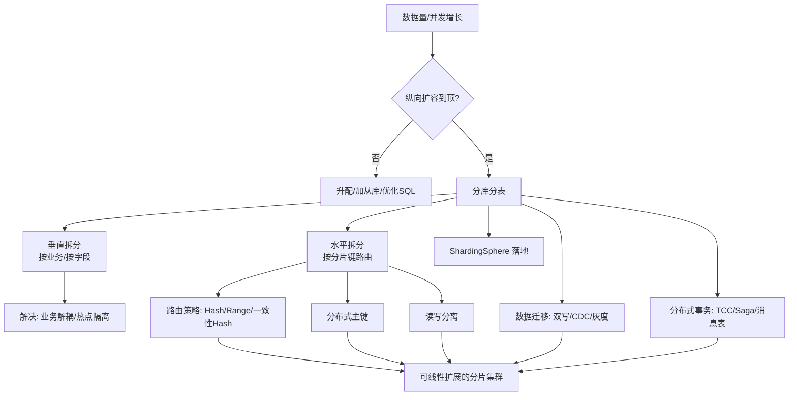

# 分库分表与数据迁移 · 总览

> 当单表涨到几千万行、单库连接被打满、写入 RT 持续劣化，纵向扩容（升配）触到天花板，**分库分表（Sharding）** 就成了绕不开的架构决策。
> 本板块不重复讲某个中间件怎么装（那部分见 [基础知识/中间件/分库分表ShardingSphere](../基础知识/中间件/分库分表ShardingSphere.md)），而是把 **「为什么要分 → 怎么分 → 分完怎么迁 → 分完怎么保证事务和一致 → 怎么用 ShardingSphere 落地 → 不同业务怎么选分片键」** 这条完整链路讲透，形成一套可照做的工程方法论。

## 一、本板块能解决什么

| 你遇到的信号 | 对应篇章 |
|------|------|
| 单表 2000w+ 行，慢查询增多，索引也救不了 | 01 决策与路由 |
| 单库 CPU/连接数打满，加从库也扛不住写 | 01 + 02 读写分离 |
| 需要全局唯一且趋势递增的 ID | 02 分布式主键 |
| 已有大表要平滑拆成 64 分片，不能停业务 | 03 数据迁移与双写 |
| 跨分片要扣库存又要写流水，怎么保证一致 | 04 分布式事务 |
| 用 ShardingSphere 落地，配置怎么写 | 05 ShardingSphere 实战 |
| 订单该按 user_id 还是 order_id 分片 | 06 典型场景与反模式 |

## 二、概念地图



## 三、核心认知（先建立再深入）

1. **分库分表是"最后手段"不是"银弹"**。它用复杂度换容量：跨分片 JOIN、分布式事务、全局唯一 ID、运维难度全面上升。**先确认**已经做过：SQL 优化、索引治理、读写分离、冷热分离、缓存、归档。还不行才分。
2. **分片键（Sharding Key）选错，比不分还可怕**。一旦选错，热点分片被打爆、查询被迫广播全分片（全路由），后期几乎无法低成本的改。📌 **分片键是分库分表里最重要的一个决定**。
3. **"分"只是开始，"迁"才是工程最难的环节**。线上大表不中断地拆成 N 个分片，要双写、增量同步、数据校验、灰度、可回滚——这是本文重点。
4. **分完之后事务边界被打破**。原来一个本地事务能搞定的事，现在跨库了。要重新设计一致性方案（04 章）。

## 四、与知识库其他模块的关联

- **中间件 ShardingSphere 单篇** → 本文 05 章落地时的"工具级细节"锚点
- **[分布式系统理论总纲](../基础知识/分布式系统.md)** → CAP、一致性、共识的底层原理
- **[分布式事务 Seata](../基础知识/中间件/分布式事务Seata.md)** → 04 章 TCC/Saga 的落地实现
- **[数据同步 CDC-Canal](../基础知识/中间件/数据同步CDC-Canal.md)** → 03 章增量迁移的底层通道
- **[MySQL 知识](../基础知识/mysql知识.md)** → 单实例性能边界、索引、主从复制
- **[架构/系统架构](../架构/系统架构.md)** → 数据层在整体架构中的位置
- **[业务模型](../业务模型/业务模型总览.md)** → 不同行业的分片键选择（订单/账户/设备）

## 五、学习路径建议

```
01 决策与路由（先判断该不该分、怎么路由）
  ↓
02 分布式主键 + 读写分离（分完立刻要用的两个能力）
  ↓
03 数据迁移与双写（把老表平滑迁到新分片）
  ↓
04 分布式事务与一致性（分完的事务边界重构）
  ↓
05 ShardingSphere 实战（用主流中间件落地）
  ↓
06 典型场景与反模式（照着业务抄，避开坑）
```

## 六、一句话口诀

> **「先优化后分片，选键胜一半；迁用双写灰度稳，事务靠表或 Saga；中间件只管路由，一致还得自己拿。」**

---

## 七、分库分表的决策门禁（先过这五关）

| # | 门禁问题 | 不通过 → 怎么办 |
|---|----------|----------------|
| 1 | 单表数据量是否 > 2000w 且慢查询靠索引救不了？ | 归档冷数据 / 冷热分离 |
| 2 | 写瓶颈是单库连接/CPU 打满，加从库解决不了？ | 读写分离 + 连接池治理 |
| 3 | 分片键能覆盖 ≥90% 的核心查询？ | 重新评估分片键（含广播表方案） |
| 4 | 团队能接受复杂度（分布式事务/全局 ID/运维）？ | 先单库分区/分表，推迟分库 |
| 5 | 迁移期可接受双写 + 灰度 + 回滚的成本？ | 先小表试点积累经验 |

> 五关全过才动手——**分库分表是「复杂度税」最重的架构决策之一，宁可晚做，不可错做**。门禁不通过的解法都写在了对应关里。

---

## 八、分库分表后必答的六个问题（面试/评审用）

```
1. 分片键选什么？为什么？（带数据特征：量级/分布/查询模式）
2. 查询不走分片键怎么办？（广播表/基因法/ES 索引/二级路由）
3. 全局唯一 ID 用什么？（号段/雪花 + 时钟防护，见 02 章）
4. 跨分片事务怎么处理？（最终一致优先：消息表/Saga/TCC）
5. 扩容怎么扩？（一致性哈希扩容迁移；双倍扩容映射表法）
6. 数据一致性怎么校验？（双写校验/对账/抽样比对，见 03 章）
```

> 能一口气答完这六问，说明对分库分表有完整闭环认知——这是系统设计面试的高频连问，也是方案评审的必问清单。

---

## 九、常见误区速查

| 误区 ❌ | 真相 ✅ |
|---------|---------|
| 数据到量就分片 | 先归档/冷热分离/读写分离，分片是最后手段 |
| 分片键用随机 UUID | 主键必须趋势递增（有序写），或用雪花 |
| 用表内自增 ID 当全局 ID | 跨库会重复，必须独立发号 |
| 分完用 JOIN 到处查 | 跨分片 JOIN 禁止，改宽表/ES/API 聚合 |
| 以为中间件能解决一致性 | 中间件只路由，事务与校验靠自己（04 章） |
| 一次性大爆炸迁移 | 必须双写 + 增量 + 灰度 + 回滚（03 章） |

---

👉 下一篇：[01 分库分表决策与路由策略](01-分库分表决策与路由策略.md)
