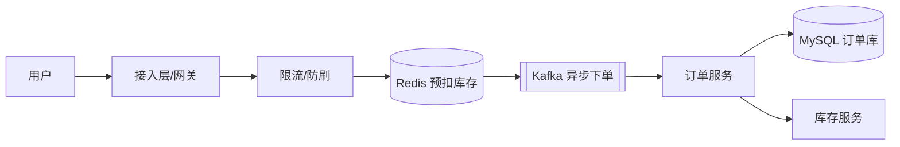

# 4S 设计法

> 以下内容为笔记截图，保留原图便于查阅，未做文字转录。

## 二、4S 的具体含义

> 4S 设计法是一种自顶向下、从问题到落地的系统设计框架，常用于架构评审与技术面试。最常见的解释为 **Scenario（场景）/ Service（服务）/ Storage（存储）/ Scale（伸缩）** 四个维度，逐层把模糊需求收敛为可落地架构。

| 维度 | 英文 | 核心问题 | 典型产出 |
|------|------|----------|----------|
| Scenario 场景 | Scenario | 业务场景、功能边界、约束指标（QPS/RT/数据量/一致性） | 需求澄清、SLA 指标、非功能约束 |
| Service 服务 | Service | 服务如何划分、接口契约、调用流程 | 服务划分、API 设计、时序图 |
| Storage 存储 | Storage | 数据模型、存储选型、分片与索引 | 表结构、存储选型、分库分表方案 |
| Scale 伸缩 | Scale | 容量、水平扩展、高可用与演进 | 扩容方案、缓存/异步、容灾设计 |

> 说明：也有资料把 4S 解读为 Scene / Service / Storage / Security（安全）或 Standard（标准）。本笔记以「场景—服务—存储—伸缩」为主线，它最贴合「从需求到可落地架构」的推导过程。

## 三、逐维度拆解方法

### 1. Scenario（场景）
- **功能需求**：列出核心用例与边界（如"用户下单""库存扣减"）。
- **量级估算**：用「用户数 × 行为频率」估算 QPS、日活、存储增量。
- **约束指标**：明确 RT（如 P99 < 200ms）、可用性（如 99.99%）、一致性要求（强一致/最终一致）。

### 2. Service（服务）
- 按领域驱动（DDD）或业务边界做服务划分，避免"大泥球"。
- 定义清晰的接口契约（入参/出参/错误码），用 Mermaid 时序图描述交互。

### 3. Storage（存储）
- 依据读写比、一致性、延迟选型：MySQL（事务）、Redis（缓存/限流）、ES（检索）、Kafka（异步解耦）。
- 大数据量提前规划分库分表、冷热分离。

### 4. Scale（伸缩）
- 无状态服务通过副本水平扩展；有状态服务用分片 + 路由。
- 引入缓存、异步、读写分离、限流降级扛峰值。

## 四、落地样例：设计一个"秒杀系统"

- **Scenario**：万级 QPS 抢购，RT < 100ms，允许短暂不一致但最终一致。
- **Service**：拆出网关、限购校验、库存预扣、异步下单四个服务。
- **Storage**：Redis 扣减库存（热点），MySQL 落订单，Kafka 削峰。
- **Scale**：Redis 集群分片扛读，Kafka 多分区水平扩展，订单库分库分表。

## 五、踩坑与权衡
- **过早优化**：先满足 Scenario 再谈 Scale，避免一上来就上重架构。
- **一致性误区**：不是所有场景都要强一致，能用最终一致就别强一致。
- **容量拍脑袋**：Scale 阶段必须基于 Scenario 的估算做压测验证，而非凭经验。
- **服务过细**：过度拆分带来分布式事务与网络开销，按业务边界而非技术层级拆分。
