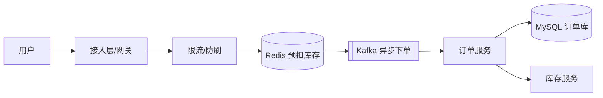
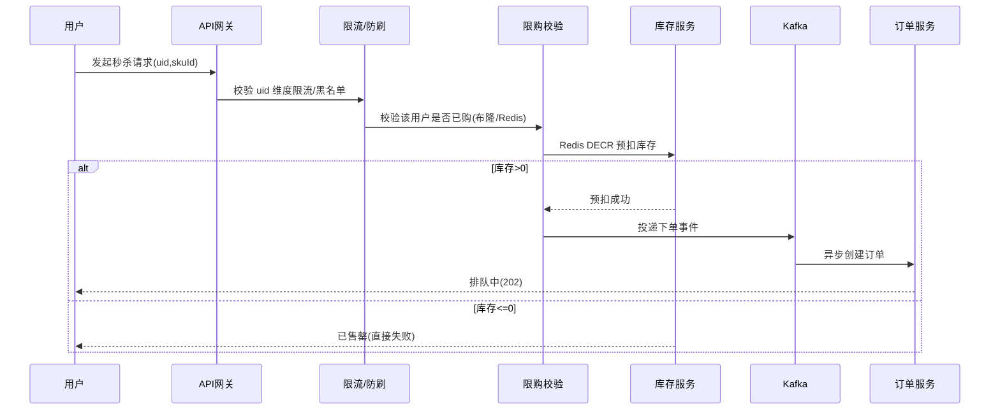

# 4S 设计法

> 以下内容为笔记截图，保留原图便于查阅，未做文字转录。

## 二、4S 的具体含义

> 4S 设计法是一种自顶向下、从问题到落地的系统设计框架，常用于架构评审与技术面试。最常见的解释为 **Scenario（场景）/ Service（服务）/ Storage（存储）/ Scale（伸缩）** 四个维度，逐层把模糊需求收敛为可落地架构。

| 维度 | 英文 | 核心问题 | 典型产出 |
|------|------|----------|----------|
| Scenario 场景 | Scenario | 业务场景、功能边界、约束指标（QPS/RT/数据量/一致性） | 需求澄清、SLA 指标、非功能约束 |
| Service 服务 | Service | 服务如何划分、接口契约、调用流程 | 服务划分、API 设计、时序图 |
| Storage 存储 | Storage | 数据模型、存储选型、分片与索引 | 表结构、存储选型、分库分表方案 |
| Scale 伸缩 | Scale | 容量、水平扩展、高可用与演进 | 扩容方案、缓存/异步、容灾设计 |

> 说明：也有资料把 4S 解读为 Scene / Service / Storage / Security（安全）或 Standard（标准）。本笔记以「场景—服务—存储—伸缩」为主线，它最贴合「从需求到可落地架构」的推导过程。

## 三、逐维度拆解方法

### 1. Scenario（场景）
- **功能需求**：列出核心用例与边界（如"用户下单""库存扣减"）。
- **量级估算**：用「用户数 × 行为频率」估算 QPS、日活、存储增量。
- **约束指标**：明确 RT（如 P99 < 200ms）、可用性（如 99.99%）、一致性要求（强一致/最终一致）。

### 2. Service（服务）
- 按领域驱动（DDD）或业务边界做服务划分，避免"大泥球"。
- 定义清晰的接口契约（入参/出参/错误码），用 Mermaid 时序图描述交互。

### 3. Storage（存储）
- 依据读写比、一致性、延迟选型：MySQL（事务）、Redis（缓存/限流）、ES（检索）、Kafka（异步解耦）。
- 大数据量提前规划分库分表、冷热分离。

### 4. Scale（伸缩）
- 无状态服务通过副本水平扩展；有状态服务用分片 + 路由。
- 引入缓存、异步、读写分离、限流降级扛峰值。

## 四、落地样例：设计一个"秒杀系统"

- **Scenario**：万级 QPS 抢购，RT < 100ms，允许短暂不一致但最终一致。
- **Service**：拆出网关、限购校验、库存预扣、异步下单四个服务。
- **Storage**：Redis 扣减库存（热点），MySQL 落订单，Kafka 削峰。
- **Scale**：Redis 集群分片扛读，Kafka 多分区水平扩展，订单库分库分表。

## 五、踩坑与权衡
- **过早优化**：先满足 Scenario 再谈 Scale，避免一上来就上重架构。
- **一致性误区**：不是所有场景都要强一致，能用最终一致就别强一致。
- **容量拍脑袋**：Scale 阶段必须基于 Scenario 的估算做压测验证，而非凭经验。
- **服务过细**：过度拆分带来分布式事务与网络开销，按业务边界而非技术层级拆分。

## 六、完整落地样例：秒杀系统逐步走查（四步法实战）

下面用一个真实的"秒杀抢购"业务，把 Scenario → Service → Storage → Scale 四步完整走一遍，给出可直接用于方案评审的颗粒度。

### 6.1 Scenario（场景与约束）

| 维度 | 取值 | 推导 |
|------|------|------|
| 预估日活 | 1000 万 | 运营大盘 |
| 参与秒杀用户 | 200 万（峰值并发） | 历史大促 ×1.5 |
| 单场 SKU | 1 个，库存 1 万 | 业务配置 |
| 峰值 QPS | 约 8 万（读）+ 2 万（写） | 200 万用户在 30s 内集中点击 |
| RT 约束 | 下单 P99 < 200ms，查库存 P99 < 50ms | 用户体验 |
| 一致性 | 库存不能超卖（强约束），订单允许最终一致 | 资损红线 |
| 可用性 | 99.95% | SLA |

> 容量估算示范：200 万人 / 30s ≈ 6.7 万 QPS；考虑到"查库存 + 下单"两次请求，读 QPS 约 8 万。即便只有 1% 用户真正抢到，写 QPS 也有 2000，但扣减是单点热点，必须用 Redis 预扣 + 异步落库削峰。

### 6.2 Service（服务划分与时序）

服务边界：
- **接入/限流**：网关层统一做 uid/IP 限流、风控黑名单。
- **限购校验**：幂等 + 防刷，避免同一用户重复下单。
- **库存服务**：唯一写入口，Redis 原子扣减，避免落到 DB 行锁。
- **订单服务**：消费 MQ 落库，与库存解耦。

### 6.3 Storage（存储选型与分片）

| 数据 | 选型 | 理由 |
|------|------|------|
| 库存计数 | Redis（单 key + Lua 原子扣减） | 高并发热点，需原子性 |
| 已购用户集合 | Redis Set / 布隆过滤器 | 防重复购买的快速判断 |
| 订单 | MySQL（分库分表，按 uid 取模） | 需要事务与持久化 |
| 下单事件 | Kafka（多分区） | 削峰、异步解耦 |
| 商品/活动配置 | MySQL + 本地缓存 | 读多写少 |

分库分表：订单表按 `user_id % 64` 分 64 个库，每库再按 `order_id` 哈希分 16 表，单表控制在千万级。

### 6.4 Scale（伸缩与高可用）

- **Redis 热点**：库存 key 是极端热点，做「单 key 分片」（`stock:{0..15}` 各分 1/16 库存），本地缓存兜底库存余量。
- **Kafka 水平扩展**：分区数 ≥ 峰值写 TPS / 单分区吞吐(约 1k/s) ⇒ 至少 32 分区。
- **订单库扩容**：64 库已预留 10× 增长；读写分离，查订单走从库。
- **限流降级**：网关层令牌桶限流；库存售罄后置为「只读降级」，直接返回售罄，保护下游。
- **压测验证**：全链路压测按 1.5× 峰值（约 12 万 QPS 读）验证，发现单 Redis 分片瓶颈后引入本地缓存预扣，最终单机扛 3 万 QPS。

### 6.5 四步法的"评审提问"清单

| 步骤 | 评审常问 | 回答要点 |
|------|----------|----------|
| Scenario | QPS/RT 怎么来的？ | 用户数 × 行为频率，给出推导公式 |
| Service | 为什么这么拆？ | 按业务边界，避免分布式事务 |
| Storage | 为何选 Redis 不落 DB？ | 热点写、原子扣减、避免行锁 |
| Scale | 热点怎么解？ | 分片 + 本地缓存 + 异步 |

## 七、4S 与 4+1 视图的关系

4S 侧重"从需求到架构的推导顺序"，4+1 视图（Kruchten）侧重"架构的呈现维度"，二者互补：

| 4+1 视图 | 对应 4S 落点 | 说明 |
|----------|--------------|------|
| 逻辑视图（Logical） | Service | 类/服务/模块划分、接口契约 |
| 进程视图（Process） | Service + Scale | 运行时进程、线程、并发、容错 |
| 开发视图（Development） | Service | 代码组织、模块依赖、构建 |
| 物理视图（Physical） | Storage + Scale | 节点、部署、网络、容量 |
| 场景视图（+1） | Scenario | 用典型用例串联上述四视图 |

实践建议：用 4S 做"推导"（先想清楚），用 4+1 做"表达"（画清楚）。面试/评审时先亮 4S 主线，再用 4+1 的某几个视图回应细节追问。

## 八、4S 落地 Checklist（可直接贴评审）

- [ ] Scenario：是否给出 QPS/RT/数据量/一致性的量化值及推导？
- [ ] Service：服务边界是否按业务而非技术层级？接口契约是否明确？
- [ ] Storage：读写比、一致性、延迟是否驱动了选型？是否规划分片？
- [ ] Scale：无状态副本 / 有状态分片方案？缓存、异步、限流降级是否具备？
- [ ] 是否做过压测验证而非容量拍脑袋？
- [ ] 是否识别了核心权衡（一致性 vs 性能、成本 vs 可用）？

## 九、4S 常见反模式与面试时间分配

### 9.1 反模式
- **跳过 Scenario 直接画架构**：没量化 QPS/RT 就拍板选型，结果要么过度设计要么扛不住。
- **把 Scale 当装饰**：只做单实例设计，不做分片/缓存/限流，大促即崩。
- **一致性一刀切**：所有数据都强一致，引入大量分布式事务拖垮性能。
- **服务拆分过度**：一个 CRUD 拆成 5 个服务，网络开销 > 业务收益。

### 9.2 面试时间分配（30 分钟为例）
| 阶段 | 时长 | 交付物 |
|------|------|--------|
| Scenario | 8 min | 量化指标 + 约束 |
| Service | 8 min | 服务图 + 接口 |
| Storage | 7 min | 选型 + 分片 |
| Scale | 7 min | 扩容 + 高可用 + 权衡 |

> 原则：先 80% 时间定 Scenario/Service，Scale 点到为止但要体现取舍意识；被追问细节时再用 4+1 视图展开。

### 9.3 一键记忆口诀
"场景定指标，服务划边界，存储看读写，伸缩讲取舍"——四句对应 4S 四步，评审/面试照此顺序展开即可不偏题。
