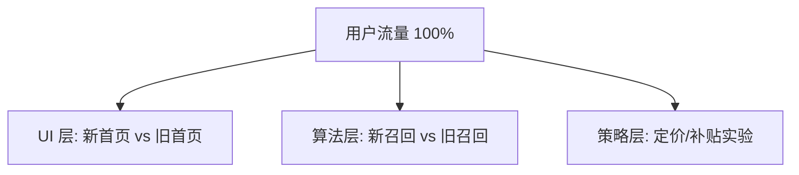

# AB 测试与实验平台设计

> AB 测试是「用数据代替拍脑袋」的工程化手段：把流量分到对照组/实验组，用统计显著性判断改动是否真的有效。本篇讲清**实验分层模型、分流算法、指标体系、平台架构与防污染**，是增长中台与数据平台的核心组件。与「[大促容量规划与备战](大促容量规划与备战.md)」「[排行榜与实时统计](排行榜与实时统计.md)」「[基础知识/大数据](../基础知识/大数据/README.md)」互链。

---

## 一、什么是 AB 测试

```
用户流量 → 随机分组
  ├─ 对照组（A）：现状
  └─ 实验组（B）：改动
比较关键指标（转化率/时长/收益）差异 → 统计检验 → 判断是否显著 → 决策上线/回滚
```

**核心思想**：随机化 + 对照 + 显著性检验，把「业务直觉」变成「可量化的实验」。

| 术语 | 含义 |
|------|------|
| 实验（Experiment） | 一次改动验证 |
| 层（Layer）/域 | 流量划分的维度（UI/算法/推送各一层） |
| 分流键 | 用户 ID / device ID 等，决定用户进哪个组 |
| 指标 | 主指标（决策用）、护栏指标（防副作用）、诊断指标 |
| 显著性 | p 值 / 置信区间，判断差异是否可信 |

---

## 二、实验分层与分流模型（架构核心）

### 2.1 分层模型（Layer 之间互不干扰）



- 每层**独立随机分桶**：同一用户可同时参与 UI 层与算法层实验（互不冲突）；
- 层内保证**正交**（正交表/哈希取模）：两层实验的干扰可控；
- 同一层内**互斥**：同一用户同一时刻只能在一个组（避免同层多实验污染）。

### 2.2 分流算法

| 方案 | 原理 | 优缺点 |
|------|------|--------|
| **哈希取模**（业界主流） | `hash(user_id + layer_id) % 100` | 简单、跨层稳定；需保证哈希均匀 |
| **正交表/正交分区** | 按实验维度分配哈希区间 | 层间正交有理论保证 |
| **在线随机**（Random） | 实时随机分组 | 简单但不稳定（用户组别会跳） |
| **确定性分流** | 按规则（如城市/设备）先分流 | 兼顾定向实验，但引入偏差风险 |

> **核心要求**：分流**确定性**（同一用户多次请求永远同组）+ **均匀性**（组间特征无差异）+ **层间正交**。哈希取模是最实用的方案：`bucket = hash(uid, exp_id) % 1000`，实验在桶区间上划分。

---

## 三、指标体系设计

| 指标类型 | 作用 | 例子 |
|----------|------|------|
| **主指标（决策指标）** | 实验的目标，决定上线与否 | 转化率、GMV、次日留存 |
| **护栏指标（Guardrail）** | 防副作用：主指标涨了但体验崩了 | 崩溃率、投诉率、加载时长 |
| **诊断指标** | 解释「为什么变」 | 点击深度、漏斗各层转化 |

> **一次实验一个主指标**：多主指标会「捡西瓜丢芝麻」；决定上线前**护栏指标必须无恶化**。

---

## 四、平台架构设计


| 模块 | 职责 | 关键技术 |
|------|------|----------|
| **配置中心** | 实验创建/灰度/下线，配置下发 | 长连接推送 + 兜底默认值 |
| **分流层** | 按分流键计算桶、打标 | 哈希取模、本地化缓存、高可用 |
| **埋点/上报** | 行为数据采集 | SDK 埋点、日志采集、Kafka |
| **计算层** | 指标实时/离线计算 | Flink 实时 + 离线数仓（[大数据](../基础知识/大数据/README.md) 呼应） |
| **统计分析** | t 检验/置信区间/样本量 | 科学决策引擎 |
| **报告/决策** | 实验看板、上线建议 | 可视化 + 权限审计 |

**关键设计点**：
1. **分流结果本地缓存**：请求路径零依赖实验平台（挂了不影响业务）；
2. **埋点口径统一**：实验 ID + 分组 ID 必须透传到每个埋点；
3. **实时 + 离线双算**：实时看趋势、离线出结论（口径一致校验）。

---

## 五、统计与防污染（进阶）

### 5.1 显著性判断要点

| 概念 | 说明 |
|------|------|
| **样本量** | 与效应量/显著性水平/统计功效相关；**提前算好**，样本不足结论不可信 |
| **p 值** | <0.05 才可谈「显著」（业务上可先看效应量与业务意义） |
| **置信区间** | 比 p 值更有信息量：看下限是否 > 0 |
| **多重比较** | 一次实验看 20 个指标，纯随机也会有几个「显著」——主指标预注册 |

### 5.2 常见污染源与对策

| 污染 | 描述 | 对策 |
|------|------|------|
| **SUTVA 违反（网络效应）** | 实验组行为影响对照组（社交/双边市场） | 集群级随机（城市/社区为单元） |
| **样本不均衡** | 分流不均匀（哈希缺陷/用户特征偏差） | 校验组间特征分布；分层随机 |
| **流量污染** | 老用户被反复实验干扰 | 实验仅对新用户/限量流量 |
| **时长不足** | 过早下结论 | 按「稳定天数 + 最小样本量」达标再读结论 |
| **观测者效应/新奇效应** | 新功能短暂新鲜感 | 观察新鲜期后回落，长时间窗验证 |

---

## 六、与推荐系统的协同

- AB 是**推荐算法迭代的验收机制**：新召回/排序模型先小流量实验，显著胜出才全量；
- 推荐侧常用**分层实验**：召回层、粗排层、精排层各一层，独立迭代互不干扰；
- 详见 [推荐系统设计](推荐系统设计.md) 的评估章节。

---

## 七、与其他板块的关联

- **统计计算**：显著性检验/指标计算依赖 [基础知识/大数据](../基础知识/大数据/README.md) 的实时与离线链路。
- **埋点与漏斗**：诊断指标设计与 [排行榜与实时统计](排行榜与实时统计.md)、[Feed 信息流设计](Feed信息流设计.md) 呼应。
- **稳定性**：分流服务高可用要求与 [稳定性三板斧](稳定性三板斧：限流-熔断-降级.md) 一致。

---

## 八、面试高频追问（12+ 条）

1. Q：AB 测试解决什么问题？ A：用随机对照实验验证改动效果，替代拍脑袋决策。
2. Q：为什么需要分层？ A：多个团队并行实验互不干扰，同用户可参与多层实验。
3. Q：层内互斥、层间正交什么意思？ A：同层用户只进一个组；不同层随机独立、互不影响。
4. Q：分流为什么用哈希而不是随机数？ A：随机数用户组别不稳定；哈希取模保证确定性。
5. Q：实验多久能看结论？ A：达到最小样本量 + 观察稳定期（覆盖周期效应）后。
6. Q：p 值是什么？<0.05 说明什么？ A：差异由随机造成的概率；<0.05 表示统计显著。
7. Q：一次实验看多个指标有什么问题？ A：多重比较假阳性；应预注册主指标，其余作护栏/诊断。
8. Q：护栏指标是什么？ A：防副作用指标（崩溃率/投诉率），主指标涨但护栏崩 = 不可上线。
9. Q：社交产品的 AB 为什么难做？ A：网络效应违反独立性假设，需集群随机（城市级分组）。
10. Q：样本量不足怎么办？ A：扩大流量/延长实验期；样本量公式：基于效应量、α、power 预估。
11. Q：埋点怎么保证实验口径一致？ A：实验 ID+分组 ID 透传到每个埋点事件，上报/计算统一口径。
12. Q：AB 和灰度发布区别？ A：灰度是流量渐进发布（稳妥上线）；AB 是随机对照实验（科学验证）。
13. Q：实验分流挂了会怎样？ A：应兜底默认对照组，分流不可用不影响业务可用性。
14. Q：新奇效应怎么处理？ A：观察新鲜期回落，长窗期结论；或对新旧用户分群分析。
