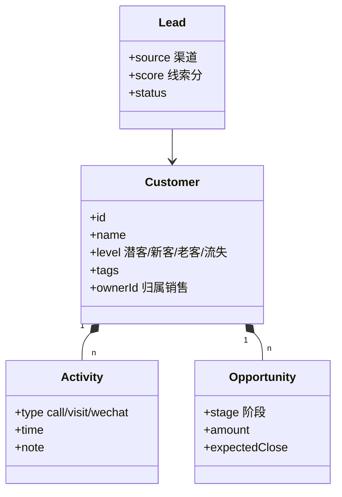

# CRM与客户关系系统设计实战

> CRM 把分散在销售、客服、市场、工单中的客户触点统一起来，形成"一个客户、一个视图、一条链路"。它要支撑线索分配、商机跟进、客户分层与生命周期运营，是业务增长的中枢系统。

## 1. 核心模型



## 2. 线索与分配

- **线索评分**：按来源、行为、画像打分，高分优先分配。
- **分配策略**：轮询、按技能、按负载、按领地（区域/行业）。
- **防撞单**：同一客户只能有一个归属人，冲突进公海。

```python
def assign(lead, reps):
    # 按领地+负载选最优销售
    candidates = [r for r in reps if matches_territory(r, lead)]
    return min(candidates, key=lambda r: r.active_count)
```

## 3. 客户分层与生命周期

| 层级 | 特征 | 运营 |
| --- | --- | --- |
| 潜客 | 未成交 | 培育/培育内容 |
| 新客 | 首单 | 激活/引导复购 |
| 老客 | 复购 | 会员/专属权益 |
| 流失 | 长期无互动 | 召回/挽留 |

## 4. 商机与跟进

- **阶段漏斗**：初步接触 → 需求确认 → 方案 → 报价 → 成交。
- **跟进提醒**：下一次跟进时间驱动待办，逾期升级。
- **协同**：销售+售前+客服在同一客户时间线协作。

## 5. 数据打通

- **统一客户 ID（OneID）**：跨渠道身份合并。
- **事件流**：浏览、咨询、下单、工单统一进客户时间线。
- **权限**：按归属/团队做数据隔离，防越权看单。

## 6. 常见坑

| 坑 | 现象 | 对策 |
| --- | --- | --- |
| 撞单 | 多人抢一客 | 归属锁定 + 公海 |
| 数据孤岛 | 看不全客户 | OneID 打通 |
| 跟进流失 | 商机晾死 | 待办 + 升级 |
| 权限越界 | 泄露客户 | 行级权限 |
| 评分失真 | 错配资源 | 离线校准模型 |

## 7. 面试题

1. 如何防止销售撞单？
2. OneID 如何做身份合并？
3. 线索分配有哪些策略？
4. 客户分层如何驱动运营？
5. CRM 数据权限怎么做？

## 8. 小结

CRM = 线索分配 + 客户视图 + 商机漏斗 + 生命周期运营。核心是"统一客户、清晰归属、可追溯跟进"，让每一次客户触点都沉淀为可运营的资产。
